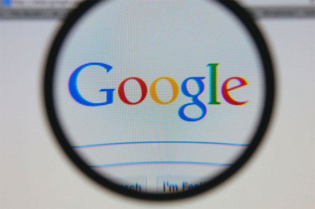
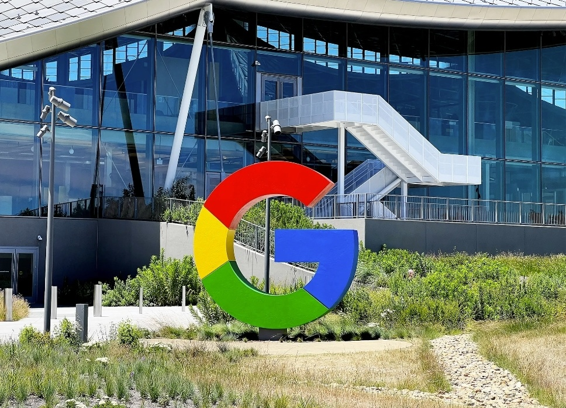

# 揭秘美国反垄断极客：这群人辞掉工作 每天八小时盯着谷歌庭审

**划重点**

  * _1_ 美国司法部针对谷歌的反垄断诉讼已于9月中旬开庭，但相关庭审信息却禁止直播，诉讼程序也不完全向公众开放。
  * _2_ 作为美国20多年来最大规模反垄断诉讼，这场审判会影响到每个人，所以让公众知道发生了什么很重要，反垄断极客为此应运而生。
  * _3_ 这群人辞掉了正式工作，甚至搬到法院附近，每天在法庭上待满八小时，并利用社交媒体记录庭审内容以及自己的观察结果。
  * _4_ 整个庭审预计将持续10周，本案关乎互联网的未来，以及谷歌的搜索引擎是否将能面对有意义的竞争。

从法学院毕业几个月后，约瑟夫·韦茨曼(Yosef
Weitzman)就开始在美国20多年来最大规模反垄断案审判中扮演了重要角色。在上周开始的美国联邦审判中，谷歌被控非法垄断在线搜索和搜索广告。谷歌自我定义的使命是让全世界的信息都能被访问，但该公司却成功地说服法官禁止对此案庭审直播，并使诉讼程序不完全向公众开放。

韦茨曼等人由此开始介入。这位刚从法律专业毕业的学生是为数不多的几位法律或反垄断极客，这个群体试图参加大部分公开庭审部分，因为他们担心问责科技巨头的历史性时刻会逃过公众的注意。有些人甚至辞掉了日常工作，或者直接搬到了华盛顿特区法院附近。他们都痴迷于通过社交媒体和日常电子邮件通讯记录他们的观察结果。

**庭审预计长达10周，多数记者耗不起**

按照计划，谷歌反垄断案将持续10周左右。在11月份，庭审几乎每天都会进行，但很少有新闻媒体能在审判期间安排专门的记者每天在法庭待满八小时。大多数关注谷歌的记者都在旧金山，而法律和监管出版物可能会收取数百美元的内容订阅费用。任何反垄断迷或者沮丧的谷歌搜索用户，想要从这场人数稀少、定义时代的审判中获得负担得起的结果，都必须依靠韦茨曼或其他几个极客的社交媒体帖子。

韦茨曼说：“不管你对这场审判和大型科技公司的看法如何，它将影响到每个人。因此，随着审判的展开，公众意识到发生了什么，并记录下发生了什么，这一点很重要。”

在过去20年里，律师梅根·格雷(Megan
Gray)与谷歌在各种法律诉讼中争执不休，但她没有参与最新的反垄断诉讼。不过，格雷觉得有必要坐30分钟的火车去法院，以捕捉在摘要或笔录中无法体现出来的细节。到目前为止，格雷参加了几乎所有庭审，她把法律工作推到了晚上。她说：“看看我能不能坚持整整10周！”

这场审判会影响到每个人，所以让公众知道发生了什么很重要。哥伦比亚大学法学教授、前拜登总统的科技反垄断政策顾问吴修铭在审判的第一天就来了，他说：“很明显，审判应该更容易让公众了解详情。与对名人的审判不同，这类案件不会有变成马戏的严重危险。”

**住处还未搞定，每天工作长达12小时**

韦茨曼之所以得到这份工作，是因为著名的谷歌权力批评者马修·斯托勒(Matthew
Stoller)决定雇人每天参加庭审，并在他的电子邮件通讯Big上撰写庭审内容。Big专注于科技及其他领域的垄断问题，拥有约10万订阅者。斯托勒说：“如果不认识到此案的重要性，你就无法报道反垄断政治。”

在宾夕法尼亚大学担任校报体育版编辑的经历，加上对反垄断法的迷恋，帮助韦茨曼获得了这份工作。他在费城收拾行装，签了一份为期一个月的转租合同，那里距离法院只有几步之遥，但他还没有想好在剩下的审判时间里住在哪里。有些刚毕业的法律专业毕业生在开始第一份工作前的几个月里会周游世界，而韦茨曼正在闷热的通勤路上，或坐在法庭旁公众席不太舒服的长椅上，每天工作长达12个小时。他说：“我一点也不抱怨！”

韦茨曼的文章不仅会出现在Big上，每天也会在Substack上的临时分支通讯“Big Tech on
Trial”中全文发送。在试验的第一周后，该通讯有大约2700名订阅者。韦茨曼的薪水由斯托勒和无党派反垄断倡导组织“美国经济自由项目” (American
Economic Liberties Project)提供，斯托勒是该组织的研究主管。

上一次有大型科技公司接受重大反垄断审判还是在1998年，当时被针对的目标是微软，这帮助谷歌打开了大门，让它积累了目前在在线搜索和广告方面的无上权力。在目前的庭审中，谷歌的律师辩称，谷歌之所以成为占主导地位的搜索引擎，是因为消费者更喜欢它，而不是像美国司法部指控的那样，谷歌付费成为手机和浏览器的默认设置，迫使人们使用它。除了阿拉巴马州外，美国所有州的司法部长都参与了此案。

检察官和谷歌都选择放弃陪审团，所以法官阿米特·梅塔（Amit
Mehta）将负责做出裁决。由于检察官支持对庭审进行流媒体直播，而谷歌坚决反对，梅塔法官经过权衡后，拒绝了包括美国经济自由项目在内的团体提出的允许公众远程观看庭审的请求。梅塔法官给出的理由是，他对未经授权录制证人证词表示“严重担忧”。他还担心，为了保护谷歌和证人的商业秘密，审判的部分内容将不对公众开放，以防意外泄密。

负责监督联邦地区法院运作规则的司法会议(Judicial
Conference)刚刚发布了一项政策，允许对法庭程序进行“公开直播”，但不包括庭审部分。该机构表示，他们仍在研究是否可以扩大访问范围，前提是不增加证人因远程观众而受到恐吓或改变证词的风险。媒体和民权组织认为，疫情期间大量出现的感染病例，包括证人作证和反垄断审判，并没有造成太大干扰。

由于谷歌反垄断案仅限于现场庭审，韦茨曼主要是在法庭上观看，但那里禁止使用手机和电脑。不过，他可以坐在法院的媒体室里工作，记者们可以在那里观看闭路电视转播。尽管单独的非媒体房间不允许使用笔记本电脑或其他个人设备，但提供了比法庭上更多的福利，包括软垫座椅、充足的空间和更好的空调。

**庭审现场亲历，公正地向民众提供第一手信息**

韦茨曼的每日快讯记录并解释了律师与证人、法官与律师之间每天的交流情况。到目前为止，最引人注目的爆料之一是，在2019年销售额可能低于华尔街预期的情况下，谷歌秘密地试图提高搜索广告定价，而没有通知广告商。谷歌拒绝对此置评。韦茨曼说：“我的主要目标是以一种公平的方式准确报道法庭内部发生的事情，不歪曲实际发生的事情，不偏向任何一方。”

当韦茨曼听不清或听不懂某些对话时，他会在报告中标记出来，并将审判证据穿插其中。他公开了谷歌内部的电子邮件和演示文稿，其中一些是司法部在其网站上发布的，直到谷歌本周早些时候向法官报告了这些链接的存在。检方已经撤回了上传的视频，并在等待梅塔法官采取行动。

独立律师格雷在X账户上发表了关于这些证据的争论。她还追踪了出庭律师的性别、年龄和种族情况。根据她的观察，司法部派出了四名女性和三名45岁以下的律师，而谷歌团队没有出现这两类人，双方都没有少数族裔。格雷说：“这凸显了谷歌是多么古老和顽固。”她所描述的谷歌员工在作证时的傲慢和吵闹行为，在座无虚席的会议室里引发了热烈的笑声。她说：“你无法通过2D文字记录得到这些。”

除了格雷，韦茨曼以及MLex和路透社等媒体的记者都出席了庭审，并在X上发表了自己的看法。但随着人们在埃隆·马斯克(Elon
Musk)执掌X期间纷纷离开该平台，它不再像过去那样提供关于重大科技事件的权威对话。参与庭审的彭博社记者始终在Bluesky上留言，Law360的一名记者则在Threads上分享庭审心得。

这种分散的对话使得像韦茨曼这样的时事通讯更加重要，因为它也汇集了来自其他地方的信息。长期以来，商业评论应用Yelp负责公共政策的高级副总裁卢瑟·洛威(Luther
Lowe)始终在批评谷歌，他将自己对谷歌反垄断新闻的每周评论变成了日常操作。他尽可能地亲自参加庭审，但主要依靠的是即时笔录，每页收费1.20美元，每天的记录超过300页。洛威说：“到审判结束时，仅文书的成本就将达到数万美元，但我想实时知道发生了什么。”但是请10周的假，每天呆坐在法庭椅子上静静观察并不是最好的选择。

即使是谷歌的搜索竞争对手微软和DuckDuckGo，也不会派人每天都去观看庭审。尽管如果检方胜诉，它们将受益最大。技术监督项目(Tech Oversight
Project)或进步商会(Chamber of Progress)等倡导组织也是如此。

距离法院更近但依然不见踪影的，还有美国国会议员及其助手们，他们正在街对面的国会大厦中忙碌，试图避免政府资金崩溃而停摆，这可能会在下个月导致庭审暂停。

当立法者重新考虑如何监管大型科技公司时，谷歌反垄断审判的经验教训可能会被证明是有价值的。科罗拉多州共和党众议员肯·巴克（Ken
Buck）观看了法庭上的开庭陈词，以显示对政府案件的支持。现在，他的发言人维多利亚·马歇尔（Victoria
Marshall）表示，巴克议员正在通过X追踪这一案件，并表示未来将投入更多关注。（文/金鹿）

