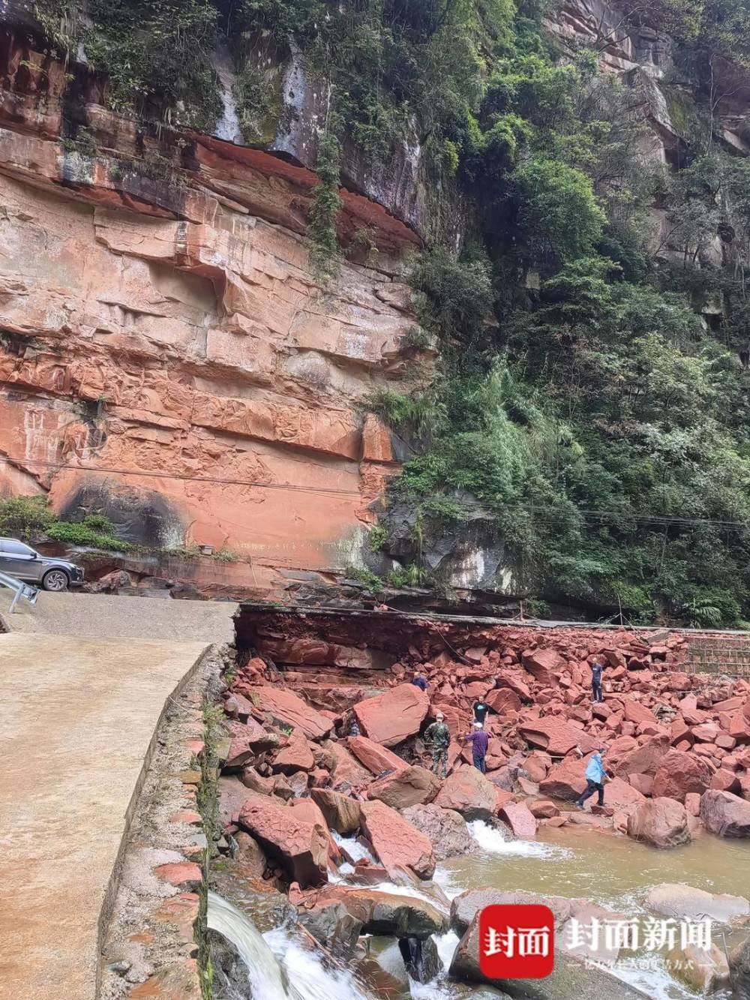
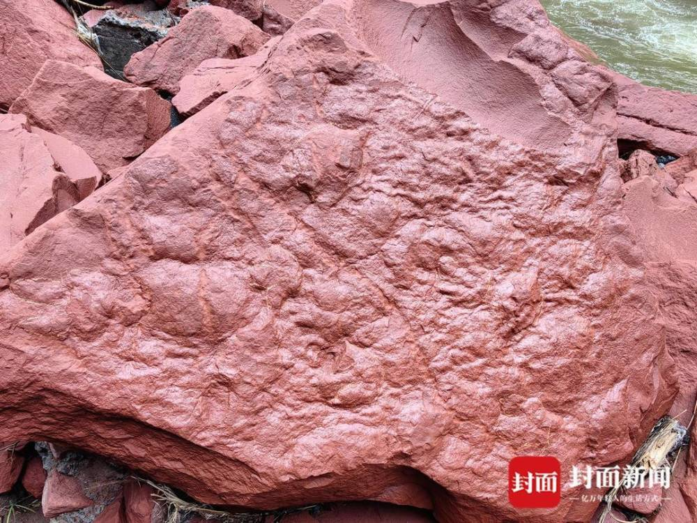

# 男孩河床边玩耍发现恐龙脚印 四川古蔺县现世界罕见蜥脚类恐龙幻迹

_红砂岩石受暴雨冲刷影响滚落河边_

封面新闻记者 李华刚 现场摄影报道

近日，四川省泸州市古蔺县发生强降雨，雨后的山洪冲刷河床，使得许多地里的红砂岩裸露出来，这让从小就非常喜欢恐龙和探险的古蔺县黄荆镇中心小学学生徐铉堃，在河边有了新的发现。徐铉堃今年10岁，就读五年级，他跟随爸妈在河边玩耍时，无意中发现石河床上有一些凸起的类似蜥脚类生物“脚印”。

9月23日、24日，中国地质大学（北京）邢立达副教授联合自贡恐龙博物馆、浙江盘古化石馆的专家学者们一起，前往古蔺县黄荆镇考察、探秘，专家团队在当地文化站的配合下，
**现场甄别了徐铉堃小朋友发现的石河床上凸起“脚印”，确认是恐龙足迹化石。**

_在雨季被冲刷出来的恐龙足迹化石_

**当地村民将恐龙足迹化石唤作“龙马”脚印**

9月23日下午，专家考察团队一行分别从北京、浙江、四川成都和自贡，赶赴古蔺县黄荆镇，此时已临近傍晚。来不及休整，专家团一行又驱车半个多小时直赴原林村，这里有个名叫“龙马杨家厂”的地方，小河沟里的石河床上，有一些不知为何物的巨大“脚印”。当地村民只觉得形状奇特，非常少见。能在石头山上踩出印迹，便把传说中不曾见过的神奇“龙马”用来为它取名。

“我们以前认为这是‘龙马’踩出来的脚印，听说专家要来，就想请专家们给鉴定鉴定，看看究竟是什么动物留下来的印迹。”黄荆镇原林村七组组长看到专家们到来后，赶紧拿来扫帚等物把石河床打扫干净，等专家们揭秘。

天上还在下着小雨，原本干涸的河床也被水流淹没了一些，邢立达没有来得及准备水靴，下到河边以后，便迫不及待地直接脱掉鞋袜，赤脚踏进水里，开始给那些“脚印”描边、测量，且很快得出结论：
**“这些是驰龙留下来的足迹！”**

_邢立达赤脚在水里展开考察_

**男孩河床边玩耍无意中发现恐龙“脚印”**

9月24日早上8时许，专家团队又马不停蹄，继续驱车1个多小时，赶往黄荆镇汉溪村三组，沿途公路边还能看到被洪水冲刷过的痕迹，河沟里东倒西歪地“躺”着大块大块的红砂岩石。

当一行人到达小地名“雷背”的时候，一停下车，徐铉堃小朋友就赶紧指向河边，“那块红色的石头上就有我发现的恐龙脚印。”考察当天，邢立达特意换了一身适合野外作业的迷彩服，他背起背包，朝着徐铉堃手指的方向快速跋涉而去。乱石嶙峋的河床里，根本就没有路，人们只有手脚并用，在大块大块的岩石间攀爬、行进；而河床邻近公路的一侧，笔直陡峭的高山崖壁上红彤彤一片，山崖上有经雨水后垮塌的明显痕迹，这与河床边滚落的大块红砂岩石十分吻合。

_徐铉堃小朋友发现的恐龙足迹化石_

手拿粉笔，熟练地描边，区分“脚印”行进的方向，邢立达顾不上与众人交谈，自顾自地一会儿就把石头上的凸起给描出了形状，小的凸起长10厘米左右，大一些的长15厘米左右；而最大的长40厘米左右，比一个成年人42码的鞋（26厘米）大了近1倍。
**“这是大驰龙和小驰龙一起踩出来的印迹。”** 邢立达对眼前的发现很是兴奋。

现世界罕见蜥脚类恐龙幻迹

“这次我们最重要的一个发现是，有密集的驰龙类动物群足迹化石。它包括了三种不同尺寸的驰龙，还有一种非常特殊的蜥脚类恐龙的幻迹，呈石头开花的石花状形迹，这个不仅在国内，在世界上都是很罕见的。”邢立达说，
**由这两种遗迹组成的这个组合，也将为这个地方的古环境、古生态以及恐龙时代的动物群构成，提供非常重要的线索，**
因为现在是雨季，这个季节对考察不太友好，他们将在后续还会展开更为详细的调查。

_中国地质大学（北京）副教授邢立达正在实地考察_

“这次的发现虽然时间短，但很有意思。因为
**泸州在整个四川盆地，它有一个极具代表性的特征，就是白垩纪的恐龙足迹非常发达。它跟自贡侏罗纪恐龙化石群一样，都非常重要。因为自贡以及周边区域讲的是侏罗纪的恐龙，泸州区域讲的是白垩纪的故事。**
”在此次考察之前，早在2014年，邢立达就开始抵达泸州考察，至今已在整个泸州及古蔺区域做了大约10次考察，发现了上千个恐龙足迹分布在十几处不同的化石点。

合理保护利用开发，将成当地重要的自然名片

既然泸州区域的这些恐龙足迹如此重要，当地应该如何保护利用开发呢？

邢立达认为，正是因为它们的重要性，也为后面的保护和利用开发提出了非常高的要求。“我们当前发现的很多化石，其实是在山体塌方或者在路边偶然被水冲出来的等等，这些足迹如果是可以移动的，那我们建议是，把它放到博物馆或者相关的有资质的单位去，永久的保存；如果是那些巨大的没有办法移动的，那可以用激光扫描的形式，做成数字档案；对于那些原地保存的大面积的足迹点，我们应该开发成徒步旅行的路线，使得泸州及古蔺的恐龙足迹成为当地一张非常重要的自然名片。”

阅读延伸

侏罗纪（大约1.99亿年-1.45亿年前）

白垩纪（大约1.45亿年-0.66亿年前）

幻迹：恐龙行走时，除了在地表踩下足迹外，在下面一层泥土中也会留下印迹，这种印迹叫做“幻迹”。

