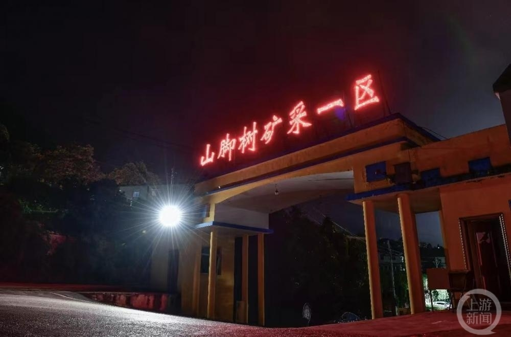
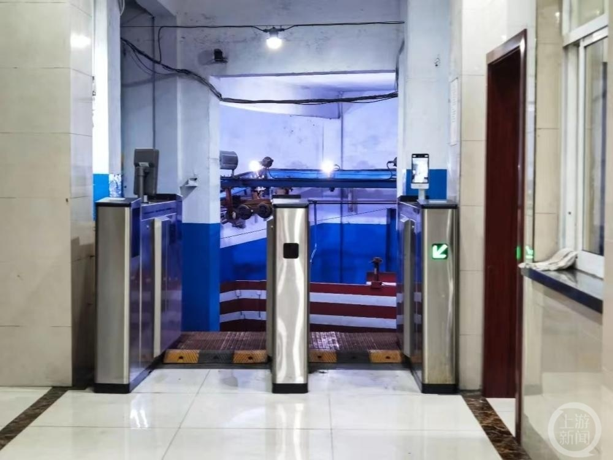

# 贵州山脚树煤矿皮带着火16人遇难，矿工称皮带“烧了40多米”

9月24日上午8时10分左右，贵州省六盘水市盘州市盘关镇山脚树煤矿发生皮带着火事故，造成16人遇难。据官方消息，事故初步判断为运输胶带着火。胶带输送机是矿井煤炭运输的主要设备之一，胶带一旦摩擦着火或者发生断裂，将引发各类事故。

25日下午，山脚树煤矿的一名矿工告诉上游新闻（报料邮箱：cnshangyou@163.com）记者，目前煤矿已停产开展安全检查，“他们去看的人说，是运输的第二部皮带起火，至少烧了40多米。”

_山脚树煤矿矿采一区大门。图片来源/新华社_

该矿工称，出事地点位于山脚树煤矿采一区，出事的是采煤队，“是24日0时进入煤矿的班组，整个班组都出事了。死者有几个本地的，其他都是外地的。”据其介绍，采煤队工作一般是三班倒，“0点一班，8点一班，16时一班。”

一名工作多年的矿工云先生向记者介绍，一般地下煤矿往外运输，需要上百乃至上千根皮带传送运输，从工作面传输至洗煤厂。“运输皮带起火，一般有三个原因，一是皮带质量差，张度比较大，皮带松弛后和转动的滚轴摩擦发生起火；二是煤量过大，导致皮带负荷超载，和转动滚轴摩擦导致起火；三是皮带机滚筒、托辊因机械原因不转动或转速较慢，皮带输送机液压联轴器喷油，也可以引起皮带输送机着火。”

云先生同时表示，按照国家规定，煤矿要使用阻燃皮带，“阻燃皮带非常不易燃，除非是火量非常大，或者周边有其他易燃东西产生热量，才有可能导致皮带起火。”

上游新闻记者注意到，事故发生后，多位曾在矿上工作的网友表达了质疑。“现在的皮带都是阻燃的，怎么能着火？而且井下所有设备包括风筒、电缆钩、皮带，都必须是阻燃的。”“传送带着火，为何没有安装温度控制器？”

 _山脚树煤矿矿采一区入井闸机。图片来源/新华社_

2021年2月，国家矿山安全监察局综合司曾下发通知，要求迅速排查煤矿井下使用非矿用阻燃输送带安全隐患——煤矿井下输送带必须为符合MT668-2008《煤矿用钢丝绳芯阻燃输送带》等行业标准的矿用阻燃输送带。

上游新闻记者就此致电山脚树煤矿以及盘州市能源局，询问是否按要求使用了阻燃皮带，以及皮带为何着火，工作人员均称不了解具体情况。

公开资料显示，出事的山脚树煤矿所属企业是贵州盘江精煤股份有限公司（即盘江股份），成立于1998年，位于贵州省六盘水市，拥有煤炭资源总量和可采储量分别为4.88亿吨和3.04亿吨。

山脚树煤矿矿区面积20.7187平方公里，设计生产能力180万吨/年，为证照齐全的生产矿井。

盘江股份9月25日早间发布公告称，为吸取事故教训，公司立即组织所属煤矿开展安全大检查，切实采取有效措施，确保安全生产。国务院安委会决定，对该起事故查处进行挂牌督办，彻查事故原因，依法依规严肃追责问责。

上游新闻记者 李文滔

