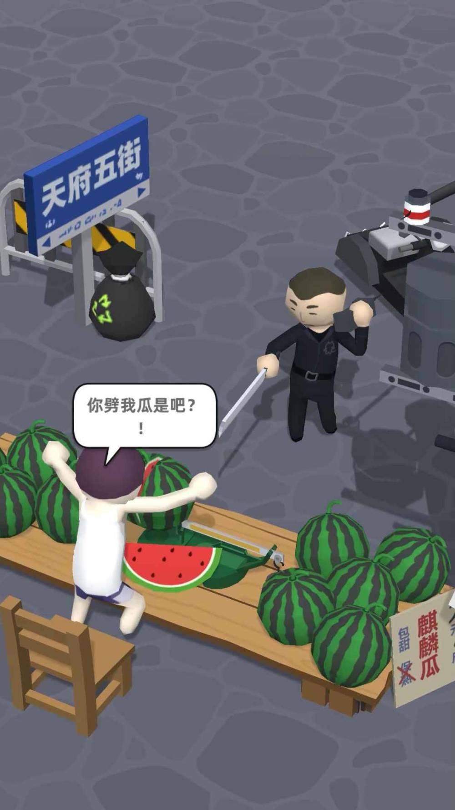
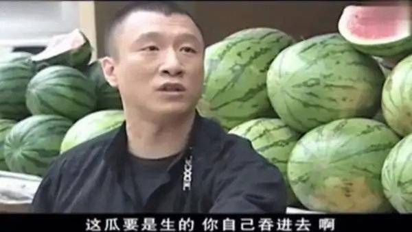

# 这瓜保熟吗？孙红雷起诉一公司“华强买瓜”台词侵犯声音权，索赔50万

封面新闻记者 宋潇

孙红雷可能没想到，有一天“强哥”吃瓜，居然吃到了自己身上。

9月25日，成都互联网法庭开庭审理了一起关于影视剧台词声音权纠纷案：一款名为《西瓜摊主大战买瓜人》的游戏软件中，使用了演员孙红雷参演的影视剧《征服》中的台词声音，游戏开发商和供应商成都睡神飞科技有限公司、北京睡神飞科技有限公司被孙红雷诉至法院。

当天，在庭审现场，关于该案孙红雷所主张的行为是否适用《民法典》中声音权的相关规定？涉案音频是否具有识别性等问题，原、被告双方均发表了代理意见，经过庭审，由于合议庭争议较大，法院最终决定案件改日宣判。

_电视剧《征服》截图_

**在天府五街“刘华强”叫人砍瓜？**

**演员孙红雷起诉小游戏公司侵犯声音权**

“哥们儿，这瓜多少钱一斤呐？”“两块钱一斤。”“这瓜保熟吗？”谁还记得电视剧《征服》里的这个“买瓜”桥段？对剧中孙红雷饰演的角色刘华强，是否记忆犹新？

相关平台上，《西瓜摊主大战买瓜人》的介绍是一款休闲益智类型的游戏。游戏中，玩家将化身一个西瓜摊主，目标是卖掉所有的西瓜，然而，街上总有很多人找玩家麻烦，玩家需要守护好自己的西瓜摊，与街头匪徒战斗到底。

 _小游戏《西瓜摊主大战买瓜人》界面截图_

其中，一个身穿黑色衣服黑色裤子，留着一个寸头、拿着西瓜刀的男子形象颇为典型。这个黑衣男子在游戏中的设定是一个“黑帮”，说着“你这瓜保熟吗？”“等我叫人来砍了你的瓜摊”等台词。

虽然游戏摆放的是“天府五街”等路牌，但细心的玩家会发现，这个场景和某个电视剧中的桥段类似。“这不就是强哥吗？”有玩家提醒，游戏中的黑衣男子造型、台词看起来和《征服》电视剧中的刘华强差不多。

_小游戏《西瓜摊主大战买瓜人》界面截图_

玩家留意到了，演员孙红雷也注意到了。

“强哥”很生气。9月25日，因《西瓜摊主大战买瓜人》游戏软件中使用了演员孙红雷参演的影视剧《征服》经典桥段中的台词声音，成都睡神飞科技有限公司、北京睡神飞科技有限公司被孙红雷诉至法院。

原告孙红雷认为，成都睡神飞科技有限公司、北京睡神飞科技有限公司未经其授权，以营利为目的开发、设计该款游戏，客观上构成对其声音权益的侵犯。另外，该款游戏中自己的人格元素被塑造成了在社会上打架、寻衅滋事的坏人形象，其人格尊严未被尊重，客观上构成对其一般人格权的侵犯。

基于上述理由，原告孙红雷请求判令成都睡神飞科技有限公司、北京睡神飞科技有限公司公开道歉并赔偿经济损失45万元及精神损害抚慰金5万元。

**被告意见：**

**原告主张不能适用《民法典》声音权和一般人格权规定**

关于该案孙红雷所主张的行为是否能适用声音权的规定？涉案音频是否具有识别性等问题，被告方成都睡神飞科技有限公司、北京睡神飞科技有限公司委托诉讼代理人认为，本案孙红雷所主张的行为不能适用《民法典》关于声音权及一般人格权的规定，以及涉案音频不具有识别性。

律师提出，根据《民法典》相关规定，声音权要“参照”肖像权保护的规定，但声音与肖像并不能完全划等号，肖像具有视觉化特点及明显的识别特征、也具有静态化识别属性，可以与表演活动本身相分离。而声音本身不具有静态化的可能，其动态化属性本身就决定了其与表演活动无法分离。

委托诉讼代理人还举了一个例子：在《鹿鼎记》和《甄嬛传》电视剧中，影视角色韦小宝、甄嬛的声音与演员本人的声音几乎没有区别，但实际播出的电视剧中所使用的声音均来自配音演员的声音，基于目前影视行业的现状，观众也不会直接将饰演者与角色声音直接对应，不会通过涉案音频识别到孙红雷，更何况本案孙红雷未提供任何证据证明涉案音频源于其本人且还在本案中主张了他人声音，“即便部分老观众通过涉案音频对应的台词识别了对应的情节来源，识别的也是《征服》本身及刘华强，而非识别孙红雷。”

 _电视剧《征服》截图_

代理人继续指出，该案中，孙红雷所主张的部分音频是基于距今20年前《征服》电视剧中的情节，“即便声音源于孙红雷出演的刘华强角色，但是孙红雷现在的声音是否能保持与其20年前的声音一致？”（如果不完全一致又如何分辨哪部分是识别特征？）孙红雷所主张的涉案音频的权利本质还是基于其20年前的表演行为，而非其当下的人格声音权益。

**延伸：**

**剧中人物角色的声音是否得到法律保护？**

声音和肖像一样，具有人身属性，在某些场合是识别个人身份的重要标志。在这之前，围绕声音权引发的纠纷屡见不鲜，包括李佳琦“oh my
god，买它买它”的口头禅标志商业化，以及一些地图软件中使用的声音，也时常被提及。

生活中，某些导航软件会以明星的声音进行语音播报，可以吸引用户，而当声音具有财产属性表现出相应的经济价值时，模仿、伪造、利用他人声音的行为都可能给声音主体的人身权益、财产权益造成损害。

记者梳理发现，国内对于声音权保护的研究文献并不多，但越来越多的学者，逐渐意识到应该对声音权进行保护。

其中，中国法学会民法典编纂项目继承编召集人、中国人民大学法学院杨立新教授曾呼吁将声音权等新型人格权入编人格权法，他曾撰文指出：《民法典》通过之后，保护声音权的规定生效，任何人未经本人许可，模仿其声音而获取利益的，可以适用人格权请求权或者侵权请求权的规定，以保护自己的声音权，救济自己的损害。声音与姓名和肖像一样，能够指代特定的自然人，具有人格权的对世性和排他性，任何人都有保护其人格利益不受丑化、贬损的权利，如他人通过模仿的方式，或者直接将某个自然人的声音用于违背该自然人意愿或丑化贬损人格的场景，被侵权人要求排除妨害，如造成损害的，被侵权人还可主张赔礼道歉、消除不良影响、恢复名誉、精神损害赔偿等。

而依据《民法典》第1023条的规定，对自然人声音的保护，参照适用肖像权保护的规定，即《民法典》第1018条有关肖像权权能的规定、第1019条有关禁止侵害肖像权行为的规定、第1020
条有关肖像权合理使用的规定、第1021条至第1022条有关肖像权商业利用的规定，对自然人声音均可参照适用。

**专家解读：**

**案件争议点在于是否“合理使用”**

对此，中国政法大学传播法研究中心副主任朱巍告诉封面新闻记者，首先，站在生理学的角度，人在成年之后，声音基本上不会发生太大的变化，而从可识别化到自然人的特征角度来看，由于《民法典》关于声音权的保护是参照肖像权保护的规定，因此，从这个角度来看，只要是可以识别到自然人的身份特征，那么这个声音权就应当得到保护。

朱巍指出，“这瓜保熟吗？”等台词声音，看过电视剧的或者即便是没看过的人，可能一听就会知道是孙红雷的声音，“他的辨识度可以说是非常高。”所以从这个角度上来看，应当归属于《民法典》中关于声音权保护的范围，而它的争议点在于是不是“合理使用”，以及关于损害赔偿的数额和计算方式。

朱巍教授告诉记者，这款小游戏中将《征服》中孙红雷饰演的“刘华强”角色以及相关的人群用声音的方式进行引流，通过这种引流的方式去获取客户，在“获客”之后直接或者间接地有了一定的收益，“这个收益是可以被认定获利侵权的，但具体比例是多少，怎么计算，这个还要看法院怎么来判定。”

声音权都受保护了，那是不是以后都不能随意使用他人的声音了？发视频配音是否算侵权呢？他举例称，在这之前，类似围绕声音权引发的纠纷曾有多起，有些是涉及商标，有的是涉及到著作权争议，“比如我在某平台上发了一段解说，被别人侵权了，隔一段时间后平台发了一个报告，说某某视频和我的视频文案都重合了，平台直接处理了，因为平台是按照版权争议的方式来处理的，其实和类似处理侵权的方式是一样的道理。”

