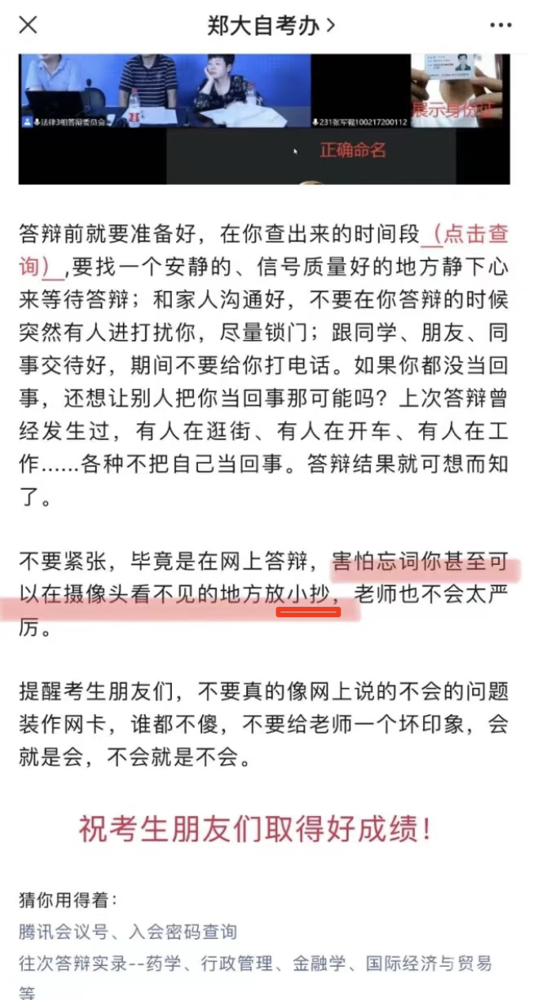

# 郑州大学自考办提醒考生答辩时“放小抄”？官方：用词不当，不是作弊

9月24日，河南郑州市民刘先生在浏览自考信息时，看到郑州大学自考办官微文章，教学生“在网上答辩时害怕忘词，可以在摄像头看不见的地方放小抄”。刘先生说：“作弊难道不是违纪行为吗？”他将截图发在网上，引发关注。

对此，有人觉得很正常，“答辩又不是考试，谁还要求闭卷不准带材料”“自考办用了一种通俗说法而已，别混淆考试小抄跟答辩提示之间的概念”。也有人分析说，“不用太较真，自考办公众号基本是学生在运营，文风可能不严谨”。更有人说，“应该有老师指导，正常答辩，只要用点心，论文都会过。这样公开的作弊风气还考什么？”

_▲高校自考办官微文章提醒放“小抄”引发争议。图片来源/网络截图_

9月25日，郑州大学自考办公室工作人员回应上游新闻（报料邮箱baoliaosy@163.com）记者：“表述用词不当，不能用‘小抄’。本意是指答辩参考材料，跟作弊是两码事，今后会做修改。”

上游新闻记者从“郑大自考办”官微9月18日发布的《答辩前再提醒》文章看到，该文就答辩前准备工作时指出“不要紧张，毕竟是在网上答辩，害怕忘词你甚至可以在摄像头看不见的地方放小抄，老师也不会太严厉。提醒考生朋友们，不要真的像网上说的，把不会的问题装作网卡。谁都不傻，不要给老师一个坏印象，会就是会，不会就是不会。”

对于外界“在看不见的地方放小抄”的质疑，9月25日，郑州大学自考办公室工作人员告诉上游新闻记者：“网络答辩是公开的，考生可以带着论文，在边上拿些参考材料方便答辩。只不过如果被答辩老师看到，可能会认为这个考生对自己的论文或准备的材料不太熟练。”

上述工作人员强调：“我们接触的自考生多，比较理解他们答辩时的心情。所以在文章中用词比较直白了一些，把‘论文和答辩提示笔记’等参考材料比作‘小抄’，用词不当，但与考试作弊是两码事，今后会做修改。”

上游新闻记者 冯盛雍

