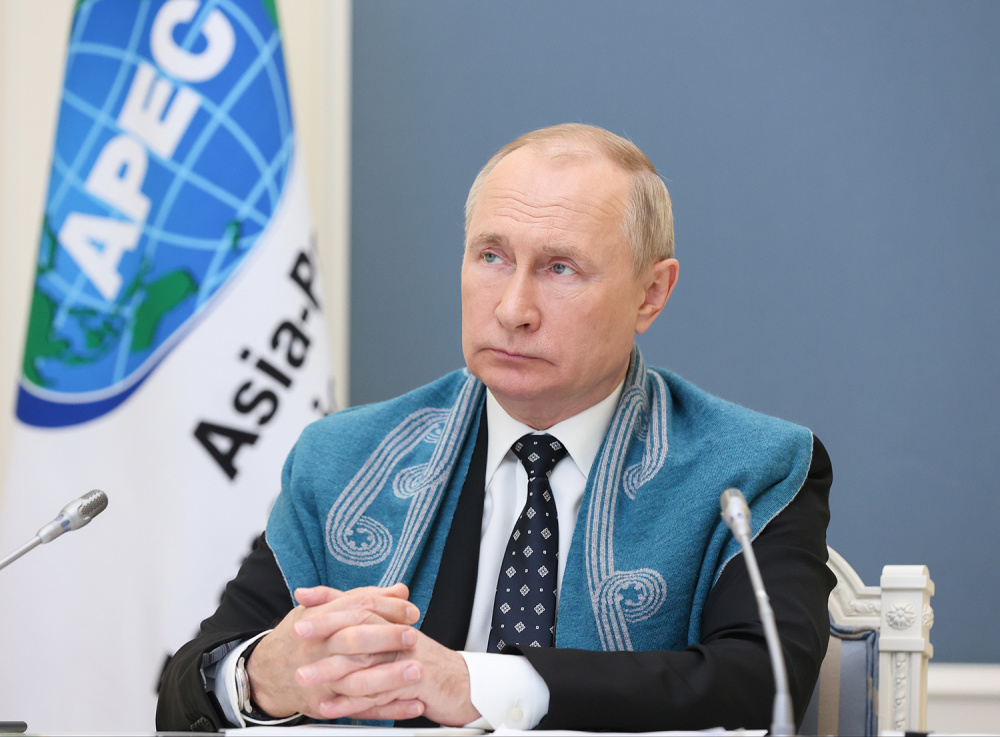

# “美方通知APEC峰会不邀请普京”，俄大使：做法可悲

综合俄新社和卫星通讯社9月26日报道，俄罗斯外交部巡回大使、俄驻亚太经合组织（APEC）高级官员马拉特·别尔德耶夫当天表示，美国已通过双边渠道通知俄罗斯，华盛顿不会邀请包括俄罗斯总统普京在内的一些领导人参加在旧金山举行的APEC峰会。

俄罗斯已向美国发出询问函，呼吁美方履行其作为APEC主席国的义务，向普京发出邀请。

不过，俄罗斯总统新闻秘书佩斯科夫早前表示，克里姆林宫未必会等待普京参加APEC峰会的邀请，俄方尚未就是否参加此次峰会做出任何决定。

别尔德耶夫说：“美国通过双边渠道通知我们，今年他们不会邀请一些领导人，因为对他们实施了制裁限制。”

他补充说：“我们继续与美方合作，促使他们最终履行他们作为会议东道国应该履行的必要行动。我作为俄罗斯高级官员，正与他们积极互动，并再次发出询问函，呼吁对方向俄罗斯领导人发出邀请。”

别尔德耶夫指出，美国决定不邀请俄罗斯总统参加APEC峰会，这表明“美方没有诚信”，并且“对多边经济合作问题持对抗性态度，将纯粹的经济论坛政治化”。

别尔德耶夫说，这种做法“很可悲”。

_2021年11月12日，俄罗斯总统普京以视频方式出席APEC第二十八次领导人非正式会议。 图自IC Photo_

亚太经合组织是亚太地区层级最高、领域最广、最具影响力的经济合作机制，于1989年11月正式成立。APEC现有21个成员，其中包括中国和中国香港。

2023年亚太经合组织（APEC）领导人非正式会议预计于11月在美国旧金山举行。

《外交学者》杂志曾提到，美国近年对于APEC愈发感兴趣，与亚太地区的地缘政治冲突密不可分。《外交学者》认为这次峰会将带给美国塑造全球和地区议程的机会，但是也强调美国与亚太的合作不能只依靠这种一年一度的峰会，而是需要更可持续和深度的合作。

当地时间8月14日，俄罗斯驻美国大使馆曾发布声明，指控美国拒绝给俄代表团参加美国主办的2023年APEC会议签证，抨击其“滥用APEC东道主地位”，表示美方行径“完全不可接受”。

声明中，俄罗斯驻美大使阿纳托利·安东诺夫（Anatoly
Antonov）声称美国“歧视俄罗斯的参与，俄一些部委和部门的代表没有获得入境签证。此外，美方还多次拒绝让俄方代表视频参加重要会议”。

安东诺夫表示，俄驻美使馆此时正在努力应对美方的举措，包括派遣使馆人员参与“最危险的讨论”，坚决拥护俄罗斯立场和利益，弥补俄罗斯国内人士的缺席。

除此以外，美媒《华盛顿邮报》在7月援引知情美国官员称，白宫已决定不邀请香港特区行政长官李家超参会。

7月28日，我外交部发言人毛宁就此事回应称，众所周知，APEC东道主负有让所有成员代表顺利参会的责任和义务。中方要求美方立即纠正错误做法，解除对李家超行政长官等特区官员的制裁，履行APEC东道主应有责任，按惯例邀请李家超行政长官与会。中方将坚定维护中国香港参加APEC的正当合法权利。

另据香港星岛网报道，李家超9月26日出席行政会议前见记者，被问到有没有受到邀请参与APEC峰会，他表示，至今仍在等待相关邀请函，组织者（美国）应给予对应经济体的领袖邀请，重申特区政府会按照标准规则安排出席。

**本文系观察者网独家稿件，未经授权，不得转载。**

