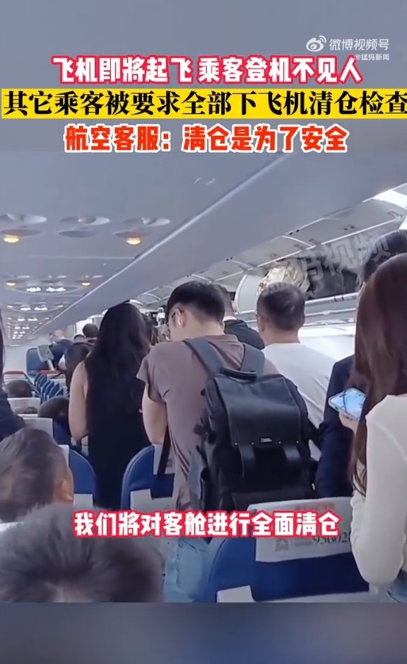
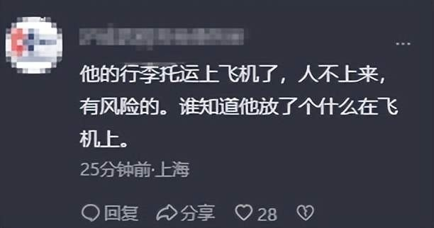

# 乘客登机后不见人，飞机要求所有人下机清仓检查，成都航空回应

9月26日，据猛犸新闻报道，9月25日，四川成都一网友发视频称飞机快要起飞了，因为一位乘客登机不见了，导致其他乘客全面下机，飞机全面清仓。

9月26日，成都航空工作人员回应称，清仓的原则和目的是为了安全，这也是民航局的规定和要求，具体情况会具体评估，为了防止有人上机后放置不明物品后离开飞机。

对此，网友表示“这个规定没错，很有必要。”

“他的行李托运上飞机了，人不上来，有风险的。谁知道他放了个什么在飞机上。”

“安全你我他，必须支持。”

**【来源：九派新闻综合猛犸新闻、网友评论】**

