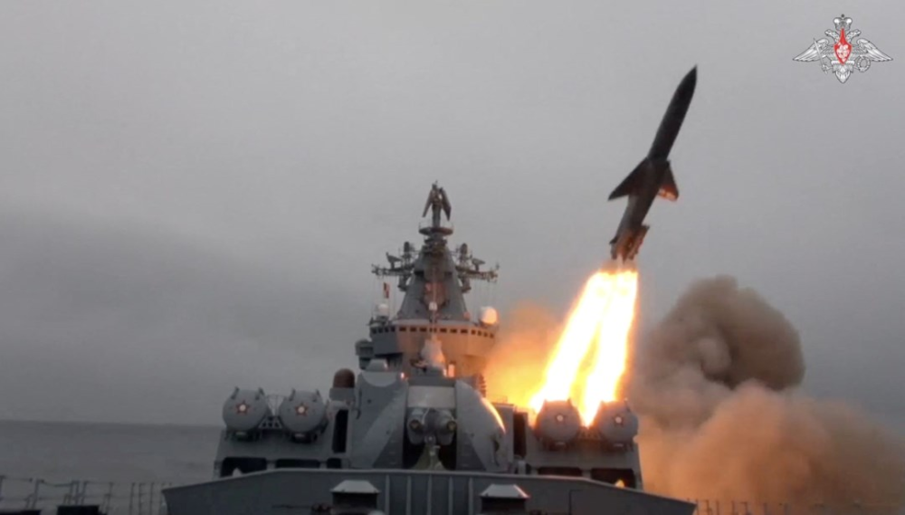
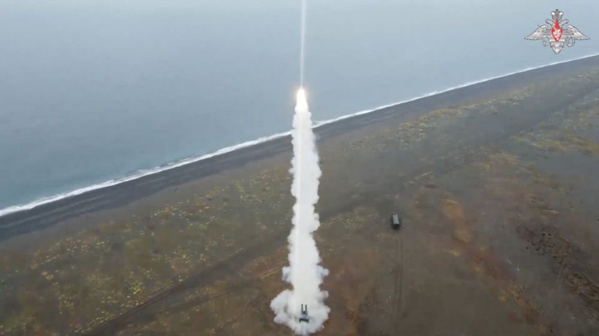
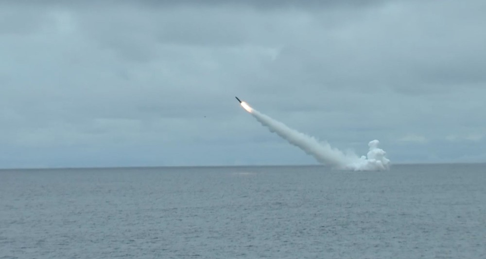
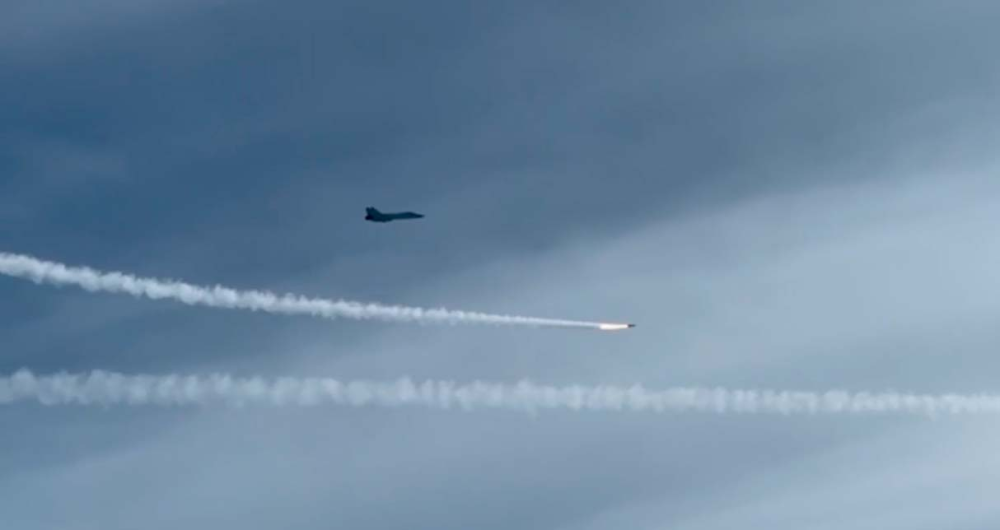
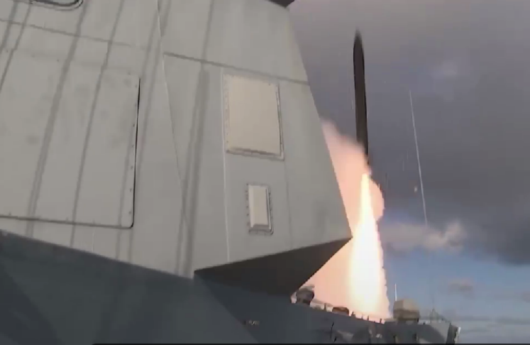

# 俄媒：俄军同时从陆地、空中、水面及水下发射导弹，系苏联解体后首次

【环球网报道 见习记者
黄泽佳】据俄罗斯卫星通讯社当地时间25日报道，在刚刚于当天结束的“长须鲸-2023”演习中，俄军同时进行海基、空基、岸基和潜射导弹试射。报道称，这是苏联解体后，俄军30多年来首次进行此类试射。

_俄军“瓦良格”号巡洋舰发射P-500/1000超音速反舰导弹 图源：俄罗斯国防部_

报道援引俄太平洋信息保障处消息称，“在（俄罗斯）现代历史上，我们首次在海岸、空中、海上和水下这四种不同环境中进行导弹发射演习。”

_俄军“棱堡”岸防系统实弹射击 图源：俄罗斯国防部_

 _俄军“雷鸣”号护卫舰、潜艇以及米格-31战机在演习中发射导弹
图源：外媒_

报道还提到，“长须鲸-2023”演习在楚科奇海、白令海以及楚科奇半岛等地举行，由现任俄罗斯海军总司令、海军上将尼古拉·叶夫梅诺夫指挥。演习的目的是维持北方航道的同行。报道称，俄罗斯国防部已在本周一宣布演习结束。相关部队已开始返回常驻基地。

