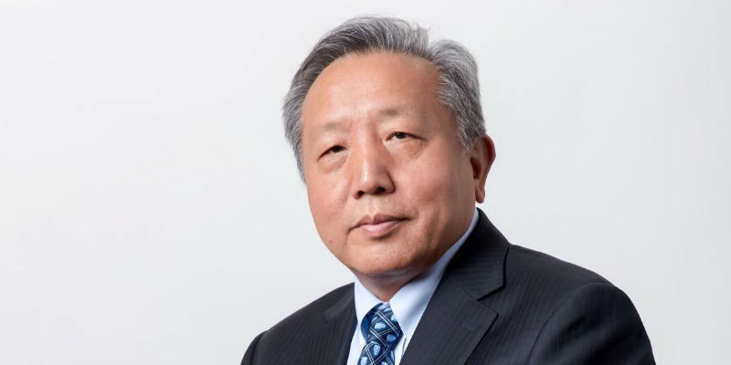

# 国家金融研究院院长吴晓求：补上四个漏洞，中国资本市场一定会有希望

**经济观察网 记者 胡群**
“中国的资本市场有一个巨大的财富漩涡，有一个巨大的财富漏出机制，（资本市场）发展不起来是资产供给端的问题，不是投资需求端的问题。”9月23日，中国人民大学原副校长、国家金融研究院院长吴晓求在首届中国金融学科年会（2023）暨中国金融学科自主知识体系百所高校联盟启动仪式上表示，应重点关注中国资本市场在减持、IPO泛化、融资标的、增发等方面的问题，推动资本市场改革。

9月26日，A股三大指数再次集体收跌。上证综指收于3102点，跌0.43%；深证成指跌0.60%，创业板指跌0.77%，北证50跌0.57%。沪深两市成交额6656亿元。两市近3500只个股下跌。

“今年以来的市场已经将大部分人的耐心消磨殆尽，几乎打破了所有人的信仰。”一位阳光私募基金公司人士称。另有银行人士表示，“今年的市场，或者说这两年的市场都是跌宕起伏、大幅震荡，如果从2021年2月市场见顶后来看，公募基金已经超过2年半没有取得较好的正收益回报了，今年8月末，更是跌破了去年4月底和10月底创的低点，恒生指数已经连续4年阴线，沪深300指数已经连续3年阴线。这确实非常令人沮丧，大家是不是已经被不断下跌的市场熬的受不了了？”

在吴晓求看来，中国资本市场至今没能发展起来，根本原因在于制度上存在四个漏洞，如果监管层能有效堵上漏洞，中国资本市场就有希望。

第一个漏洞是减持规则。吴晓求说，“现在的减持规则是股权分置后的结果，主要关注3年锁定期。企业上市排队是中国资本市场特有现象，这在其他国家不存在。但不可忽视的是，上市排队有巨大的制度诱导，将会产生制度性的溢价。企业排队成本巨大，既需要支付巨额的佣金，还要忍受监管部门的发行审批人员的核实，上市企业股东之所以可以忍受这些成本，在于收益巨大，就是上市的财富创造机制。数据显示，现在85%以上公司大股东在公司上市3年后都会减持，这个需要监管进行约束。”

第二个漏洞是IPO泛化。吴晓求表示，高科技企业不盈利就可以上市，但必须具备可持续经营能力。《上海证券交易所科创板股票上市规则》为尚未盈利但具备盈利潜力的企业设置了第五套上市标准（其余四套均对拟上市企业的年收入有具体规定），打开了尚未盈利企业上市融资的大门。“这是没有正确理解注册制改革意义，把注册制改革泛化，把IPO给VC化。当前企业IPO的收益率很低，一旦VC化，IPO就有可能出现巨大的问题。过去IPO是为国有企业解困融资提供便利，现在是为高科技企业融资提供便利。这虽然不违规，但规则是错误的，有些标准要废除。”

第三个漏洞，融券标的规则要迅速去掉。吴晓求说，“这个规则的出发点在于当时监管部门为约束市场上涨。中国资本市场此前是怕上涨，不怕下跌，现在下跌的太厉害，但约束上涨的机制仍然存在，目前已不合时宜，不能适应新时代发展。”

第四个漏洞是股票增发。增发已经成为上市公司大股东的套利工具和机制。2018年至今的5年时间里，各个层漏出资金大约20万亿，而减持是大头，这些年加起来大约有13万亿。

“现在要进行改革，就要站在市场是财富管理的市场的角度调整资本市场的规则和制度。只要监管层有开放的意识和视野，以及改革的决心，中国资本市场一定会有希望。”吴晓求最后说道。

