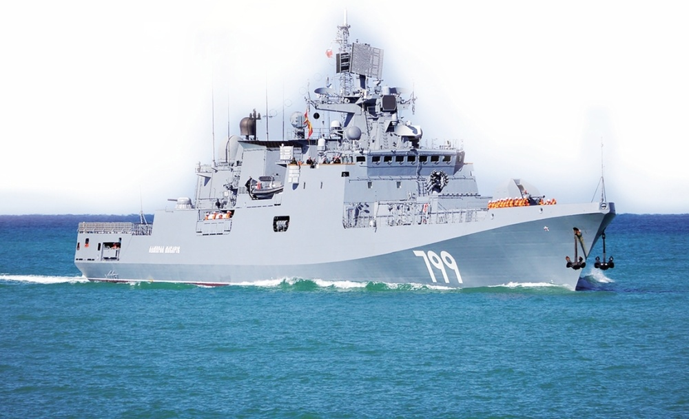

# 接连遇袭后，俄黑海舰队路在何方

【环球时报特约记者
晨阳】俄军24日夜间对乌克兰控制的敖德萨发动大规模空袭。乌军承认，这次袭击对敖德萨港口设施造成了严重破坏，海运码头在空袭后“几乎被摧毁”，一个粮仓也被损坏。美国有线电视新闻网25日称，俄军此举旨在报复乌军对俄黑海舰队司令部的袭击。面对乌军最近频繁发动的联合打击，在俄乌冲突中表现充满争议的俄黑海舰队未来路在何方，成为外界关注的话题。

**黑海舰队损失有多惨**

俄《观点报》25日称，俄军于24日对敖德萨的港口区发动空袭，“显然是为了阻止乌军从那里发动新的海上袭击，当地可能是乌海军舰艇的基地”。同时黑海舰队海军航空兵的苏-24M战斗轰炸机还用FAB-500高爆炸弹对乌克兰控制的一座小岛实施轰炸，因为“乌军将其用作破坏侦察队的后勤基地”。

 _塞瓦斯托波尔是俄黑海舰队主要基地。_

但外界对于俄军此举阻挡乌军对俄黑海舰队发动袭击的效果并不看好。美国“商业内幕”网站分析称，俄黑海舰队至今仍是黑海最强大的海上力量，但它正在乌克兰的频繁进攻中“持续失血”。报道回顾称，俄乌冲突爆发之初，黑海舰队以“莫斯科”号导弹巡洋舰为核心，迅速掌握了几乎整个黑海海域的制海权，并一度占领了距离敖德萨港只有140公里的蛇岛。但在“莫斯科”号意外沉没后，失去防空保护伞的黑海舰队被迫回缩到远离乌克兰控制区的黑海东部海域。更糟糕的是，尽管俄军采用被动“保船”的保守战术，但在北约的情报支持下，乌克兰持续利用无人机、无人艇和巡航导弹对黑海舰队发动频繁攻击。

美国“动力”网站统计了俄黑海舰队遭遇的严重损失，包括“莫斯科”号巡洋舰、多艘登陆舰和巡逻艇以及一艘“基洛”级常规潜艇沉没或严重受损，还有多艘小型导弹舰受损，这意味着该舰队的大部分舰艇可能都失去作战能力。报道还提到，俄黑海舰队司令部所在的塞瓦斯托波尔具备建造和修理军用舰艇的关键能力，该港口多次成为乌克兰的攻击目标，就充分反映了其战略价值。2022年10月29日凌晨，乌军首次出动无人机和无人艇对塞瓦斯托波尔基地发动联合袭击，乌克兰方面宣称已造成俄军数艘舰艇受伤。此后，乌军还多次组织自杀式无人艇对塞瓦斯托波尔发动偷袭，但具体战果俄乌双方各执一词。更让黑海舰队雪上加霜的是，乌军最近针对性地对该舰队发动连续袭击。9月13日，乌克兰对塞瓦斯托波尔发动大规模无人机和巡航导弹袭击，造成在船坞里维修的一艘登陆舰和一艘潜艇严重受损，西方情报机构认为，它们基本没有修复的价值。9月14日，乌军又成功摧毁俄军部署在克里米亚的防空系统，从而严重削弱黑海舰队头顶的保护伞。9月22日，乌军再次发动大规模导弹袭击，利用巡航导弹命中黑海舰队司令部大楼，造成严重的人员伤亡。

**面临的困境来自哪里？**

“商业内幕”网站认为，俄黑海舰队当前面临的最大困境是无法掌握周边情报，面对乌军袭击基本只能被动防御。报道称，北约每天都会出动多个型号的侦察平台，在黑海地区进行全方位的情报搜集，并将这些关键战场数据第一时间转给乌军。因此乌军获得的战场态势感知能力远超俄军，才能提前掌握俄军巡逻船的路线，并精心组织自杀式无人艇发动突袭。

而作为对比，部署在克里米亚的俄空天军部队与黑海舰队相互之间缺乏实时情报交流，甚至遭遇多次袭击后，不同俄军部队之间仍未能建立起统一指挥的防空网络。俄军事专家批评称，乌军想要发动大规模巡航导弹袭击，需要从后方机场出动多架苏-24战斗轰炸机，但对于如此明显的空中目标，俄军却未能有效拦截，暴露出俄军的严重漏洞。

其次，在损失多艘舰艇后，黑海舰队采用被动的“保船”战术，但此举可能更容易遭到袭击。“动力”网站提到，塞瓦斯托波尔于9月13日遇袭后，俄黑海舰队对剩余舰艇进行了疏散，其中3艘大型登陆舰已从黑海转移到相对安全的亚速海，“马卡罗夫海军上将”号导弹护卫舰也离开港口去向不明。但有分析认为，在北约的全面情报支持下，乌军掌握这些舰艇的行踪并非难事，反倒是俄军这些舰艇大都缺乏足够的防空火力，在离开防御相对严密的海军基地后，更容易遭到乌军无人艇或反舰导弹的袭击。

_“马卡罗夫海军上将”号护卫舰是当前俄黑海舰队旗舰。_

“动力”网站还认为，黑海舰队面临的长远困境是失去了舰艇维护能力。报道称，根据卫星照片分析，乌军巡航导弹对塞瓦斯托波尔的袭击不但造成船坞内的两艘俄军舰艇严重受损，更糟糕的是船坞本身也可能被破坏。由于船坞等基础设施在导弹袭击中受损，“在可预见的未来，黑海舰队的能力可能会严重削弱”。据介绍，海军舰艇通常需要定期在船坞进行保养维护才能维持战斗力，但在塞瓦斯托波尔的船坞受损后，包括黑海舰队另一个主要基地新罗西斯克在内，黑海其他地方没有海军舰艇大修设施，这将产生严重的后果——即便黑海舰队不再遭遇袭击，现有受损舰艇也无法修复，其他船只的战斗力则会持续衰减。

**俄军也在想办法**

尽管前景黯淡，但俄军并未放弃。《观点报》介绍称，北约向乌克兰提供了几十艘快艇组成的“蚊子舰队”，隐藏在敖德萨附近的沿海地区，它们的目标是“摧毁黑海和俄罗斯海岸的黑海舰队舰艇、克里米亚大桥和其他重要战略目标”。同时乌克兰对塞瓦斯托波尔等地发动袭击的“风暴之影”导弹需要由苏-24战斗轰炸机携带。俄军退役中将尤里·内特卡切夫认为，俄军最近频繁对敖德萨周边以及部署苏-24的乌军空军基地发动大规模袭击，目标就是试图“先下手为强”，摧毁这些对俄战略要地和黑海舰队构成严重威胁的武器。

“动力”网站也注意到，乌军开始将“风暴之影”巡航导弹投入使用后，驻扎在塞瓦斯托波尔的黑海舰队舰艇更换了战术伪装以改变它们的外部轮廓，目的是欺骗巡航导弹使用图像匹配进行末端制导的导引头。此外，塞瓦斯托波尔等地还专门部署了针对无人艇的拦阻网等设施，在很大程度上降低了乌军自杀式无人艇后期的作战效果。

俄罗斯《独立报》25日称，针对乌军频繁利用无人机、巡航导弹等发动的突袭，俄国家技术集团公司22日已经向空天军交付了经过现代化改进的A-50U远程预警机。此前有分析称，由于“风暴之影”巡航导弹采用雷达隐形设计，而且采用贴地飞行模式，因此俄军S-400等部署在地面的远程防空系统难以提前探测到它的来袭。相比之下，空中预警机探测这类巡航导弹更有优势。《独立报》称，A-50U能跟踪多达300个空中目标，可看到650公里外的敌方战机以及215公里外的巡航导弹，“甚至能探测到小型无人机”。俄罗斯英雄谢尔盖·利波沃伊少将表示，A-50U还将使俄军能掌握乌军战机的部署位置：“我们正对乌空军基地发动导弹袭击。我们知道可以携带巡航导弹的苏-24有多危险，因此正在尽一切可能在这些飞机起飞前就将它们摧毁在地面上。”

