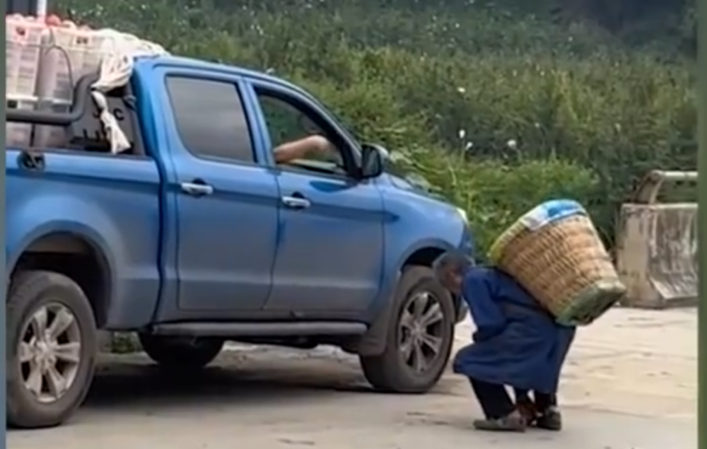
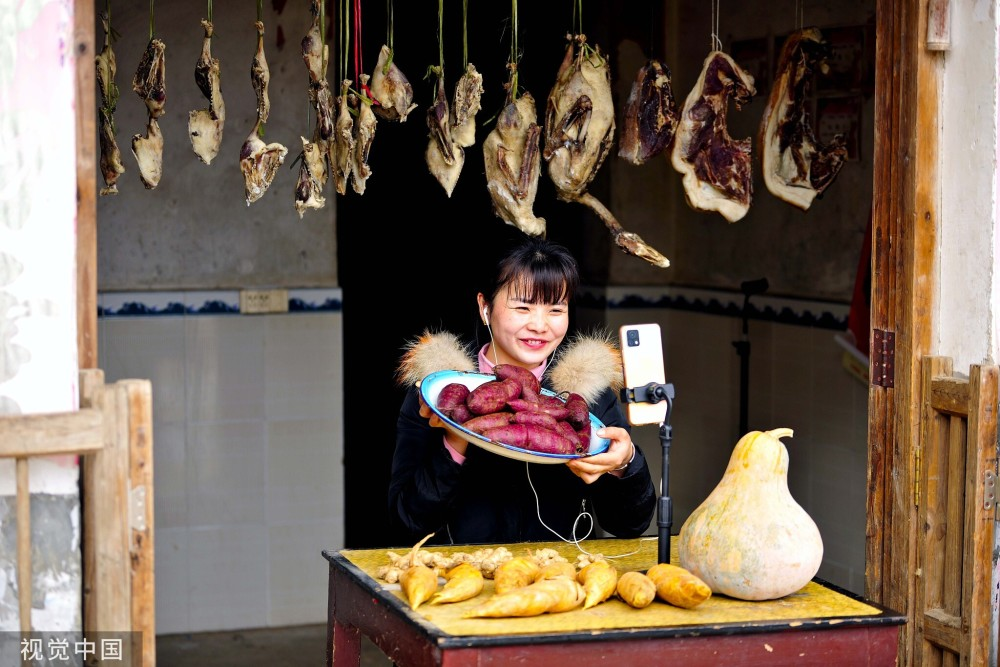
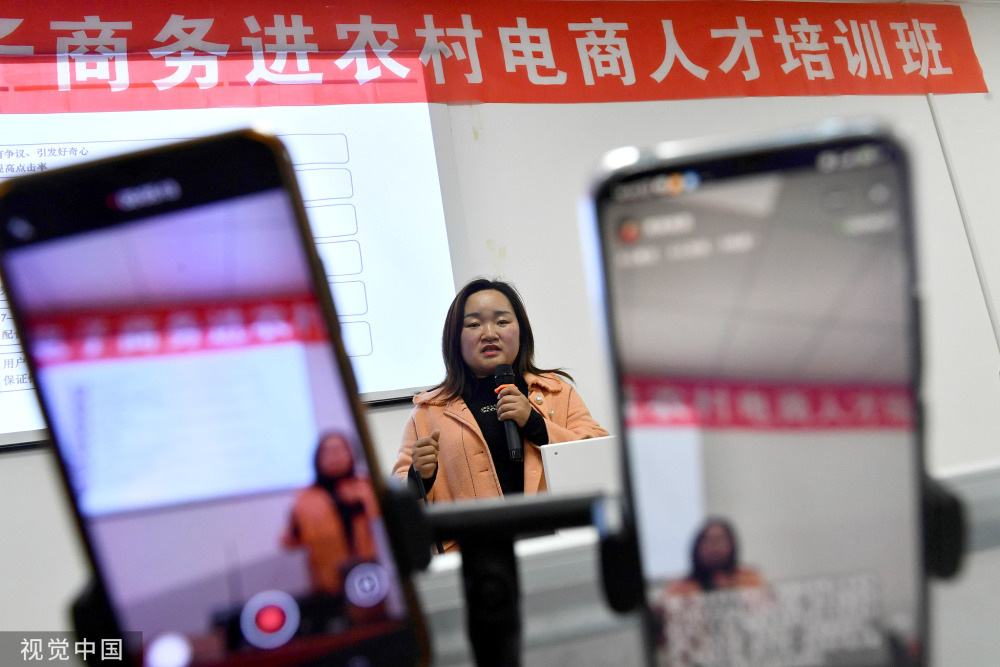
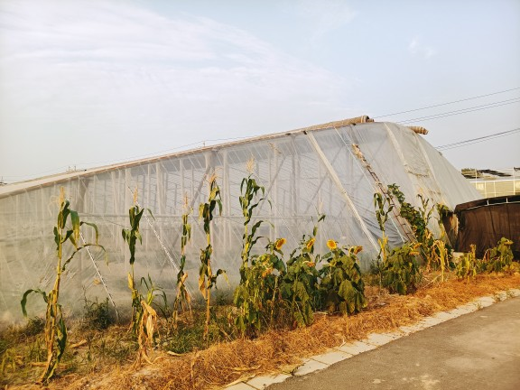

# 村书记请网红直播带货，唱跳一下午赚5000，“会种地不如会演戏”

**核心要点：**

  * _1_ 地方政府之所以有查处“卖惨带货”视频的动力，最重要的原因是这些视频引发了公众对当地脱贫攻坚成效的质疑，对地方政府而言这件事上升成了政治问题。
  * _2_ 在已经退出劳动力市场的老人看来，种地既能够增加家庭收入，也能够“有点儿事做”。这些种几亩地的老人不太会想去做电商营销，也不好学，更不愿意往里投钱。
  * _3_ 在北京平谷，许多农户的子女都在北京上班，在朋友圈里发大桃的照片，买桃者直接把钱和地址发过来，第二天早上采完，农户就用快递邮寄出去，下午就能送到。
  * _4_ 河南兰考县一位书记在电商活动中开了两场直播，还从隔壁市请来过一位100多万粉丝的网红，在他的蜜瓜地里又唱又跳，结果一下午就赚了5000元，乃至于让书记发出了“会种地还不如会演戏，当网红多好，种地太累了”的感叹。

**杨珺中丨武汉大学社会学院博士生、腾讯新闻知识万象特约作者**

最近，大凉山老人向路人卖石榴被扔到车外的视频引发网友关注，有记者走访了凉山州会理市、攀枝花市仁和区的石榴产区，辗转寻找到了流传视频中的多名老人后发现，这些热门视频的背后，实则为“卖惨带货”的营销套路。

在我看来，让农民卖惨带货这个事情和之前“清仓甩卖”“江南皮革厂倒闭了”“XX滞销，帮帮我们”的事情没有本质的区别，都是通过制造人设卖惨来促销。地方政府之所以有查处的动力，最重要的原因是这些视频引发了公众对当地脱贫攻坚成效的质疑，对地方政府而言这件事上升成了政治问题。此外，从外地进货以本地产品名义销售的行为对于地方品牌的塑造也是不利的，这可能也是一个原因。

“卖惨带货”的背后需要关注的一个比较重要的问题是农村电商。

**农村电商的不同形态**

从平台角度来说，广义的电商平台，按照出现时间排序，大致可以分为传统的电商平台（淘宝、拼多多等）、即时通讯软件（微信上的微商）、扶贫采购平台（832平台）、直播平台（抖音、快手）等。

不同类型的平台特点其实差别挺大，使用门槛也不同。

832平台是脱贫攻坚期间产生的，要求最为严格，通常其客户也都是单位，一般只有比较大的采购商或者合作社才能进入。

传统电商平台和直播平台的进入门槛不高，但是想要做得好的门槛不低，有很多技术细节，也涉及商户和平台的关系。只有把技术细节做到位，可能还得给平台交一些推广费，才能在搜索中占据比较靠前的位置，或者增加给客户推送的频率和精准度。因此在电商平台和直播平台上进行销售是需要一定的技术能力和投资的，事实上对小农户不是那么友好。

做这两块经营做得好的还得有一定规模，比如专业的中间商，或者一些合作社，有的还需要聘请专业团队来经营电商平台。当然也会有许多小农户进入，但一般只是作为销售渠道的补充，其主要的产品还是走“通货”，通过代办卖给当地的采购商。

在城市周边，微商也是销售渠道的一个重要的补充。微商主要是通过熟人关系向外拓展，跟村庄当地的代际分工结合起来：子女进城就业，向周围的同事朋友宣传自家的农产品。如果产品好，同事朋友还会再给他们的亲戚朋友宣传。

我们之前在北京平谷调研，当地许多农户的子女都在北京上班，在朋友圈里发大桃的照片，买桃者直接把钱转过来、地址发过来，第二天早上采完，农户就用快递邮寄出去，下午就能送到。据估计当地有大约60％～70％的农户会通过微信进行销售，销售量占这部分农户产量的20％～30％。因为这种微商很依赖信任关系，复购率较高，所以这批桃都是最好的桃。当然这种模式的形成和其在北京周边，子女许多会从事白领工作，有很多有购买力的同事是脱不开关系的。无论是农户还是其子女都不需要花费精力去营销，一般就是发个朋友圈，所以技术门槛很低，但是其它地方并不容易复制。

_图片：北京平谷，寄送桃子的便民快递点（作者供图）_

总体而言，电子商务确实在一定程度上可以通过缩短商业环节来实现利润的增加，并且逐步开始挤压传统中间商的利润空间。

传统的渠道是“代办-
采购商”。代办通常是村里人，知道谁家有多少农货、质量怎么样，给到处跑的采购商带路；采购商来做产品的集中和分类。现在最积极探索电商的其实也是采购商，很多采购商开始与网红合作直播带货，或者请专业团队经营网店，因为他们原本的生意直接受到了冲击。采购商对市场信息比较敏感，也会比较有精力和意愿去探索。

**分散的小农户做不了大电商**

电子商务的主体主要还是专业的群体，对大部分地区的小农户而言，通过电子商务来增加收入的能力往往是比较弱的，原因在于：

1.这些小农户缺乏运营平台所需要的专业技术、专业知识。

2.他们同样缺乏用于购买流量的资本投入，这其实更多是心态层面的问题。许多小农户并非抱着经营的心态去计算投入产出比，而是秉持增加家庭收入的逻辑，不愿意将资金投入到尚不一定能带来产出、甚至可能亏损的平台运营上面。

3.他们没有很多的人脉关系可以拓展生意来源。

4.他们一般种植面积小，很难确保供应的稳定。

这其实是一个经典的“小农户如何对接大市场”的学术问题。

整体来看，小农户做电商有结构性的困难。农业种植环节，特别是经济作物种植，老人农业属性往往比较强，因为劳动力投入大、产出少，如果要计算劳动力机会成本往往不划算。但在已经退出劳动力市场的老人看来，种地既能够增加家庭收入，也能够“有点儿事做”。这些种几亩地的老人不太会想去做电商营销，也不好学，更不愿意往里投钱。

**政府“送技术下乡”的困境**

有些地方政府希望通过举办培训班的方式“送技术下乡”，促进农户、中间商和农产品加工企业搞电商。我们在广西某县调研时参加过一个县供销联社牵头举办的电商培训班，负责人的说法是“效果有限”。

来参加培训班的，一半是供销联社动员的合作社、企业的负责人或中层干部；一半是乡镇派指标下去招的，基本是村里比较年轻的工作人员。

对前者而言，政府的培训班往往人数众多，为了普惠性而过于粗浅，他们来只是“配合政府工作”，自己如果需要的话会去找相关的专业培训，觉得政府想帮助的话不如提供报销——但这是项目资金使用不可能允许的；后者很多都不从事农业生产，来参加培训纯粹是行政任务。而小农户更是没有。

**关键在于组织起来**

现在很多地方政府推动党支部领办合作社。如果是行政任务，一般村里也就走个形式；但是如果村干部有积极性来认真做，这类合作社倒是可以形成一个功能上取代中间商的中介组织，通过发展电商给小农户带来一定的利益。

我们在河南兰考县调研，当地两个村的党支部领办合作社建设得就比较好。两个村都是村书记带头，党支部领办合作社，引导村民种植蜜瓜。在销售环节，合作社实现了统一销售，成功对接了大型批发市场和商超。在传统渠道之外，电商销量也在村书记的开拓下与日俱增。两位村书记花了不少精力学习这些电商技巧，每天在抖音上直播带货，拍摄自己和村民的耕作生活。

_图：兰考县的蜜瓜大棚（作者供图）_

一位村书记还在电商活动中开了两场直播，还从隔壁市请来过一位100多万粉丝的网红，在他的蜜瓜地里又唱又跳，结果一下午就赚了5000元，乃至于让村书记发出了“会种地还不如会演戏，当网红多好，种地太累了”的感叹。

当然要承认，兰考县的政治资源是比较丰富的，这两个村的发展过程中也有乡镇、县乃至更上级政府的支持，但是这里的经验还是有一定可复制性的，电商市场在当下还谈不上饱和，村干部或者村里的能人完全可以起到一个组织的作用，帮助小农户利用电商渠道进入市场。

**版权声明：本文系腾讯新闻知识万象独家稿件，未经授权，禁止媒体转载。欢迎个人转发至朋友圈。**

