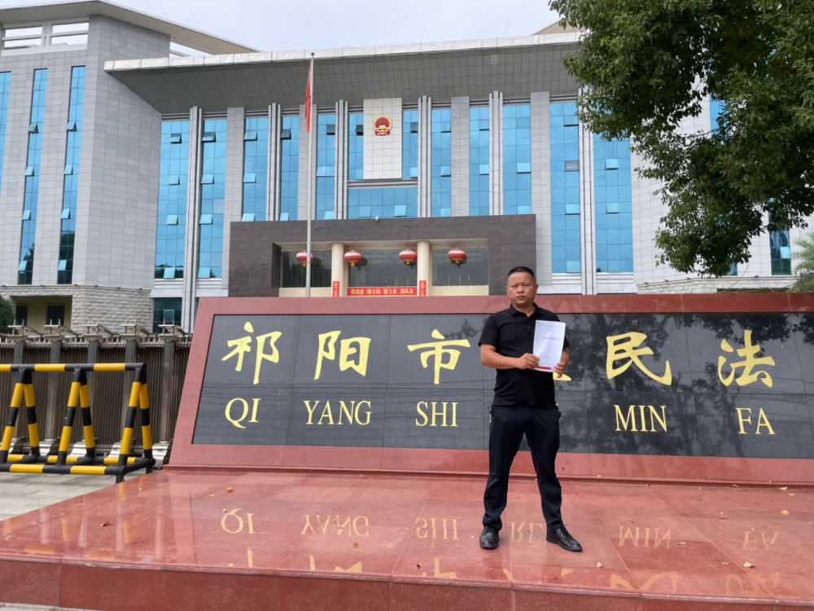

# 村民上访收劝返干部5000块路费被判寻衅滋事，法院再审：改判无罪

“无罪了！我无罪了！”9月26日上午，被当庭宣判无罪的祁阳上访村民刘美志难掩激动心情。

_刘美志在祁阳市人民法院门口。受访者 供图_

去年7月26日，湖南永州市祁阳市村民刘美志和另外两名村民进京上访，被劝返时收取镇干部五千多元路费。随后，刘美志被祁阳市法院以寻衅滋事罪判处有期徒刑七个月。出狱后，刘美志提起申诉。8月7日，永州市中级人民法院决定对刘美志寻衅滋事案提起再审。一个多月后，祁阳市人民法院再审开庭，并当庭宣布：刘美志无罪，且可以申请国家赔偿。

此前，祁阳市梅溪镇大伍村村民刘美志等人多次反映本村党支部书记李占刚违纪违规问题，梅溪镇纪检机关查实李占刚存在部分问题并予以党内警告处分，刘美志等人因对该处理结果不满而上访。

2022年7月26日，刘美志等三人乘坐飞机来到北京信访。当晚，祁阳市梅溪镇政府工作人员邓振华、付建设来到北京对刘美志三人进行劝返。祁阳市法院原判决认定，“劝返过程中，被告人刘美志向邓振华、付建设索要其三人往返路费和开支，否则待在北京信访不回去。邓振华被迫答应刘美志的要求，用手机微信向刘美志转账5342元，刘美志收款后便与邓振华等人返回祁阳。”

7月28日回到湖南后，三位村民没有回家，被一辆车送到了祁阳市公安局。随后，45岁的刘美志被拘留。2022年10月21日，祁阳市法院认定刘美志构成寻衅滋事罪，判处有期徒刑七个月。

2023年8月7日，永州中院指令祁阳市人民法院另组合议庭对该案进行再审。9月26日，祁阳市法院开庭重审该案。

刘美志介绍，法庭上，审判长问他是否越级上访。他答，他是逐级上访，因对纪委的处理不满，才到北京国家信访局和中纪委去上访。审判长又问，为何要拿镇干部的钱，他答，“我们本不要他们管，他们缠着要我们回去，报销路费是协商的结果。”

刘美志的两名辩护人湖南纲维律师事务所律师贺律川、北京市京师律师事务所律师裴仁奎均为其作无罪辩护。

两名辩护人均从犯罪构成方面进行了辩护。裴仁奎说，主观方面，刘美志是去上访反映问题，而不是去寻求刺激、发泄情绪、逞强耍横、无事生非；客观上，其与镇政府工作人员是协商报销实际开支后结束信访，不属于寻衅滋事罪的“强拿硬要”。“刘美志主张的费用是其上访过程中产生的实际开支，没有非法占有的目的，不具有社会危害性。”裴仁奎说。

裴仁奎辩护还指出，公安部《关于公安机关处置信访活动中违法犯罪行为适用法律的指导意见》对信访过程中构成寻衅滋事罪的范围进行了固定，即只在一种情形下才能构成该罪，即该《指导意见》第四部分第10条“任意损毁、占用信访接待场所、国家机关或者他人财物，符合《治安管理处罚法》第二十六条第三项规定的，以寻衅滋事依法予以治安管理处罚；符合《刑法》第二百九十三条规定的，以寻衅滋事罪追究刑事责任”。而刘美志在信访过程中完全不存在上述行为。

此外，两位辩护人均提到，最高院2023年8月16日发布《关于“新时代农村刑事犯罪对乡村振兴战略的影响”暨“寻衅滋事行为的刑事规制”课题在浙江、福建的调研报告》。该报告提到，调研中发现，寻衅滋事罪近年来有被泛化适用的倾向。调研认为该罪认定存在以下问题。一是被告人的主观动机难以把握，容易陷入客观归责；二是对违法信访行为能否以本罪论处认识不一；三是因边界不清导致容易被泛化适用的倾向明显；四是与其他相关罪名的区分较难；五是行刑衔接不畅，容易导致行政违法行为被拔高作为刑事犯罪处理。

对此，报告建议，“要加大对寻衅滋事犯罪案件的审判指导，以司法文件或典型案例的形式，指引地方法院准确适用法律；审慎处理因信访、上访而引发的寻衅滋事案件。”

法庭上，公诉人发表了无罪的公诉意见。公诉人认为，刘美志上访时收取镇干部上访路费和开支的事实存在，但属于《刑事诉讼法》第十六条第一款“情节显著轻微、危害不大，不认为是犯罪的”，遂建议无罪判决。

法庭充分听取控辩双方意见后，宣布休庭。其后法庭当庭宣判，对刘美志宣布无罪，且表示，刘美志可针对此前的错误判决申请国家赔偿。法庭将在五个工作日后下达判决书。

“真的太高兴了，我在这个案件感受到法治的公平和正义。”刘美志说。

