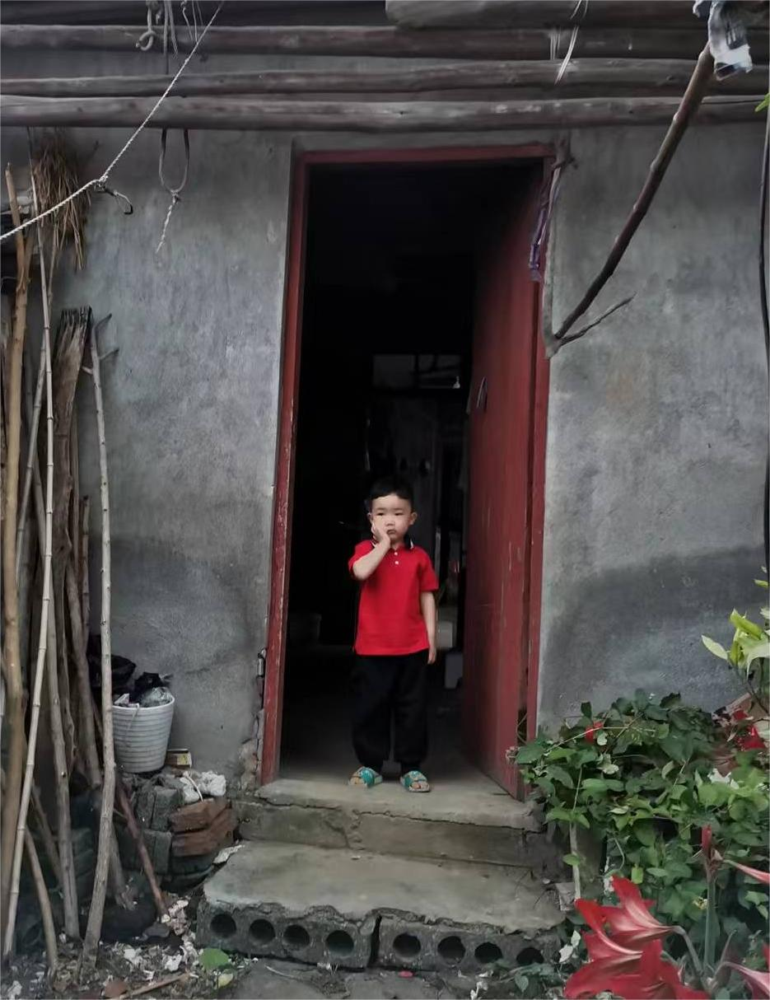
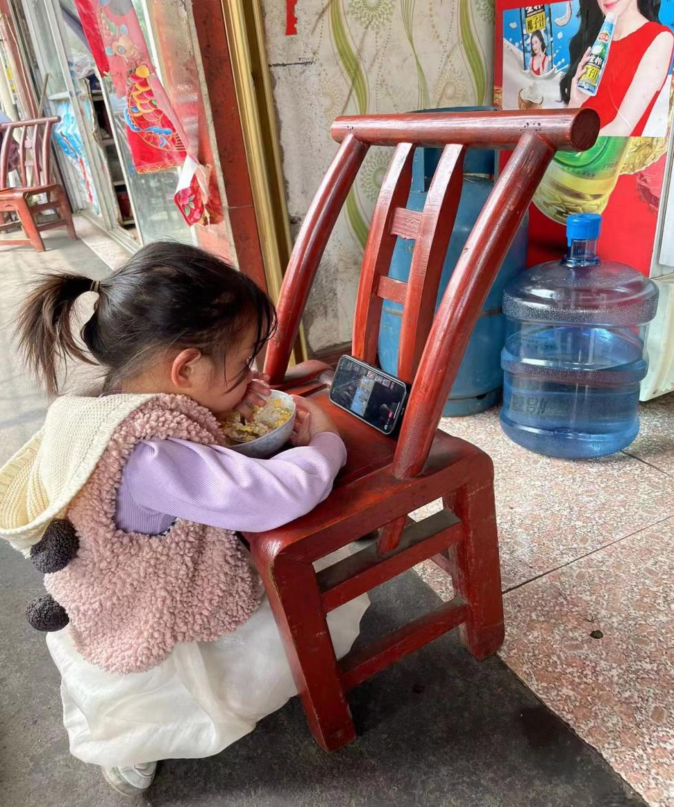
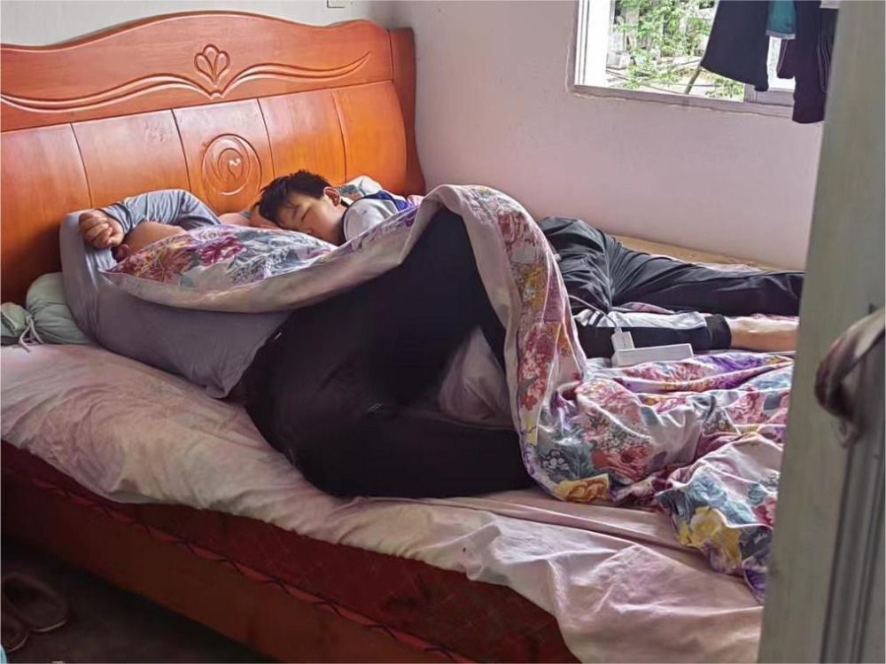

# 第一代留守儿童长大后，他们的孩子还在留守，“班上一半学生不及格”

**核心要点：**

  * _1_ 当下中西部村庄中，有这样一群留守儿童，他们年纪尚幼，往往在记事之前就离开父母的怀抱，或是在常年分离中不会认自己的父母，或是干脆不知父母为何物，有甚者还会说出“父母不重要，不如手机对我有意义”这类令人心惊的话语。
  * _2_ 乡村学校持续性生源流失，在校学生越来越少，许多村小退化成教学点，全校加起来才几十个学生，平均一个班才十来个人，更极端的情况是一个班才一两个学生。对于就读这些小规模教学点的留守儿童而言，学校集体生活是及其不完整的。
  * _3_ 村庄中越来越难以见到成群结队嬉戏的儿童，他们也呈现出越来越个体化的倾向。既没有父母陪伴，也没有玩伴同游，只能长期困在室内而又缺乏监管的留守儿童们，面对眼花缭乱的数字电视、手机游戏，他们自然而然会选择抛弃无趣的村庄沉浸于电子屏幕。
  * _4_ 调研中，一个乡镇小学老师向我们感慨道：“我当老师也有20多年了，感觉学生确实越来越难教，成绩也越来越差，早些年班里5、6个数学不及格的就算多了，现在直接翻了几倍。”在这些学差生中，留守儿童占比很高。

**童楠楠（武汉大学社会学院博士生）**

伴随着上世纪80、90年代逐渐兴起的务工经济，在劳动力城乡流动之下所出现的农村留守儿童群体备受社会关注。作为80、90后的一代留守儿童虽然在成长过程中面临着诸如家庭教养缺位、亲代照料不足等问题，并存在一定的行为越轨或心理健康风险，但在他们成长为成人的今天，回顾望去，大多数一代留守儿童社会化能够正常完成，“寒门贵子”的案例也时有发生。

根据《2023年乡村教育发展报告》报告显示，2022年我国留守儿童数量已降至902万人。数量上的持续减少和多数留守儿童正常成人的事实似乎在宣告，十数年以来学界和社会的担忧太过杞人忧天了。

然而，在笔者团队近几年对中部农村调研发现，情况并不那么乐观。

当前，村庄中留守儿童占比持续上升，大部分地区占比过半，其中很大一部分是父母均在外，由祖辈抚育的双留守儿童。这些留守儿童中，
**手机沉迷、学业荒废、早恋，乃至成为无发展性个体**
的不在少数，留守问题在他们身上格外凸显。相较于80、90后的第一代留守儿童，在低龄化、长期化留守，乡村社会解体以及乡村教育垫底化的趋势下，当前新一代留守儿童显然面临着更加严峻的成长挑战。

一、留守的低龄化与长期化趋势

与总是想念着外出务工的父母，期盼团圆的一代留守儿童不同的是，当下中西部村庄中，有这样一群留守儿童，他们年纪尚幼，往往在记事之前就离开父母的怀抱，或是在常年分离中不会认自己的父母，或是干脆不知父母为何物，有甚者还会说出
**“父母不重要，不如手机对我有意义”** 这类令人心惊的话语，之所以会产生如此大的差异，与留守形式的变化有关。

相较过去，当前留守儿童 **低龄化**
现象显著，他们往往在0-3岁的幼儿期便开始了留守。而80、90后的一代留守儿童，在其幼年阶段通常还有完整的家庭生活，这是因为，第一代农民工大规模务工在2000年以后，他们的子女大多从小学甚至初中才开始留守生活。此时，即将步入青春期的孩子逐渐将其依恋对象转向同伴，对父母的情感依赖是逐渐减弱的，而早期在完整家庭和父母陪伴下形成的亲子依恋关系，亦能够为调节分离带来的心理和情绪问题提供正向支持。而对于在婴幼儿阶段，对父母具有很强的情感依恋却被迫分离的当代留守儿童，则丧失了和父母形成良好依恋关系的基础。

此外，当前农村留守儿童还呈现留守 **长期化**
特征。一方面，在第一代留守儿童留守期间，农民家庭生计依旧与农业息息相关，“农闲外出务工，农忙回乡务农”在当时较为普遍，虽然一年内也有大半年在外，但也还是有较长的在家时间。然而，当前留守儿童的父母作为二代农民工甚至三代农民工，基本脱离农业生产，他们常年在外务工，与孩子一年到头相处不了几天。即便现在有智能手机可以进行视频通信，有限的语言和短暂的画面，却难以传递真实的情感，替代现实的陪伴，父子两代间的生疏却很难通过冰冷的电子屏幕化解。因此，在低龄化、长期化的留守中，当前留守儿童缺乏对家庭完整的基本感知，甚至出现了“没有父母概念”这样的极端案例。

 _一名4岁的留守儿童孤独的望着家门口_

二、村庄社会解体与弱缘社会诞生

对80、90后的一代留守儿童来说，虽然父母长期不在身边，但彼时的村庄社会能够给予其一定的替代性支持。在他们的成长过程中，乡村学校尚未衰弱，熟人社会尚未解体，他们的童年里有庞大的亲属支持体系，有大量的一起游戏的同辈群体，他们在粗旷却富有趣味的田野山林里嬉戏，在邻里亲朋的教导下将村庄社会的规则内化，家庭生活的不完整被在村庄生活所覆盖，虽然无法避免其中也有社会化失败的案例，但多数情况下，他们被塑造成一个符合社会基本预期的人。

然而，在他们这样的一代留守儿童成人成家之后，当下留守在村的孩子们却面临着村庄社会的逐渐解体的结构性困境。与一代留守儿童相比，当代留守儿童所生活的村庄是一个“弱缘社会”，难以从其中得到弥补家庭缺位的社会支持。

之所以将其称弱缘社会，是因为当下留守儿童村庄社会生活呈现出血缘、社缘的双重弱化。

**首先是血缘弱化，涉及小家庭内外两个方面。**

一是在小家庭内部，低龄化、长期化留守之下的长期父母教养缺位，淡化了父子两代的血缘联系，也增加了留守儿童家庭教育难度。一方面，父母长期缺位使得仅由祖辈执行的家庭管教难以有效，祖辈很难胜任儿童的行为规范培养和学业辅导，“管不住”是祖辈在管教失败最常见话语；另一方面，祖辈往往只能提供基础照料，身心在场的亲辈关爱是难以被替代的，长期的父母缺位使得儿童对父母认知模糊化，缺少亲子间的亲密和信任，相互之间缺乏理解的基础，在留守儿童的认知和感受中，父母不再是能够包容与理解的“最爱我的人”，由此产生的孤独感只能向外界需求排遣。

二是在在城镇化大背景下，从小家庭外部来看，传统村庄中以血缘维系的亲族关联也发生弱化，家族内部互助抚育在当下很难实现，难以弥补儿童父母缺位父母影响。在80、90后一代留守儿童的村庄记忆中，叔伯姑婶等诸多亲戚大多家在附近，能够时常串门照拂一二，假期被接去哪个亲戚家住上或长或短的时间，和堂亲表亲家的同辈嬉戏玩耍的场景，在当下留守儿童的生活里已经很难出现了。

总之，对于当前的村庄留守儿童来说，在不完整的家庭生活中，伴随着网络传媒对代沟的强化拉大，其先赋性的血缘联结所带来的情感基础很容易受到侵蚀，而由于教育能力不足和教育方式不当所导致的家庭教育冲突，则进一步扩大这种代沟，从而导致家庭关系的恶化和家庭教育的失能。

**其次是社缘弱化，核心表现为留守儿童坍缩的集体生活，包括三个方面。**

**一是同辈群体的减少。**

同辈群体是青少年儿童在家庭之外实现社会化的最重要的社会交往对象，然而，城镇化背景下的人口迁移与流动、生育数量减少，再加上城市教育对乡村生源的吸纳，使得在村儿童数量持续减少。一个凸出现象就是乡村学校持续性生源流失，在校学生越来越少，许多村小退化成教学点，全校加起来才几十个学生，平均一个班才十来个人，更极端的情况是一个班才一两个学生。对于就读这些小规模教学点的留守儿童而言，学校集体生活是及其不完整的。

此外，在同一村民小组内找不到同龄人一块玩耍情况越来越常见，若要跨组找人，则往往面临距离阻碍，尤其在山区农村，各个村小组间从数公里到十数公里的距离足以劝退大部分缺乏交通工具的孩童。

 _只有5个学生的小学四年级教室_

**二是群体游戏的受限。**

除去伙伴难寻的问题之外，当下留守儿童的与同伴的游戏交往还受到重重限制。这是因为，伴随村庄社会解体和现代化入侵，村庄内部社会安全风险在逐渐增加，譬如村道上疾驰的汽车、陌生的来访人群等等，家门之外的世界早已不是孩子们安全玩耍的游乐场，再叠加家庭少子化的影响，保证孩子的安全便成为家长们重中之重。

为了规避不可控的风险，家长通常通过限制儿童外出、控制其出门时长的方式，在家庭内部对儿童进行保护性区隔，使得儿童之间的群体游戏和活动受到阻碍。只要孩子离开自己视线，家长们便会循着痕迹找出来，将好不容易找到同伴的孩子喊回家，若是家长自己有空，则会在一旁看着孩子玩耍，但时间总归不会很长，而忙于生计的家长通常是没空的。夜晚总是被认为是有危险的，但需要上学的孩子们，真正大块的玩耍和休息时间就是在不被允许外出的夜晚。

**三是儿童学生化。**

当前一个普遍趋势就是，在少子化和儿童中心主义影响下，出于儿童保护目的以及生产方式变化，儿童不再参与家庭生产和劳动，儿童仅仅需要作为学生上课和完成学业任务，无论是家务劳动还是家计生产，都将儿童排除在外。这意味着，儿童失去了以家庭为核心的集体劳动参与机会，如同80、90后一代农村留守儿童在农业生产过程中的劳动合作和家务分担的生活场景再难重现。

一方面，伴随着农业生产的机械化和对劳动力需求的不断减小，在一个60、70岁老人能独立耕种十数亩地的当下，家庭农业对家庭未成年劳动的需求并不强烈；另一方面，工业化和农民非农化就业使得劳动生产逐渐与家庭场域分离，儿童被自然区隔于生产车间等劳动场所之外，失去了直接参与生产的可能。而对儿童保护和对其学生角色的认可，家庭也自觉将其排除在生产之外，甚至为了让儿童更好的集中时间完成学业，家务劳动也逐渐淡出儿童的视线。

再加上手机、网络电视对儿童的吸引，在室内对电子产品的沉迷挤占了其与同伴玩耍的时间。村庄中越来越难以见到成群结队嬉戏的儿童，他们也呈现出越来越个体化的倾向。既没有父母陪伴，也没有玩伴同游，只能长期困在室内而又缺乏监管的留守儿童们，面对眼花缭乱的数字电视、手机游戏，他们自然而然会选择抛弃无趣的村庄沉浸于电子屏幕。

儿童的意义世界不再是其生长的村庄，而是丰富多彩的网络世界，他们不是生活在“附近”的现实中，贫乏的村庄社会越来越难以承载儿童对于童年需求，他们只能在日复一日的“无聊”中被手机所俘获。

 _村口被家长用手机哄着吃饭的小女孩_

三、垫底化的乡村教育

“这是我带的最差的一届”，曾几何时，这句兼具调侃和夸张的训斥居然成为了事实。

“小学6年级，一个班50多个人，有近半学生数学不及格，考个位数的也大有人在，甚至小学毕业，还有一部分学生连拼音都认不全。”调研中，一个乡镇小学老师向我们感慨道：“我当老师也有20多年了，感觉学生确实越来越难教，成绩也越来越差，早些年班里5、6个数学不及格的就算多了，现在直接翻了几倍。”在这些学差生中，留守儿童占比很高。

初中情况也差不多，在中部农村，许多乡镇中学连中考指标生资格都用不完，因为学生成绩实在不够理想，即便降分录取，也凑不齐十几个上线名额。这种情况在乡村学校越来越普遍，但成绩的大幅度下滑还不算最严重的问题。小学阶段早恋、夜不归宿、通宵沉迷手机网络……在义务教育尚未完成之际就辍学的学生也越来越多，而即便是还呆在学校里的孩子，也有不少陷入隐性辍学中，仅仅只是在学校混日子，这些现象在留守儿童群体中表现尤为突出。即便乡村老师再怎么呼吁要家校合作，再如何强调“教育不只是学校的事”，也改变不了一个事实，现在还留在村里上学的孩子，不管从其家庭主观教育意愿还是客观教育能力来看，都是非常不足的，因此，乡村教育的主体还在于学校。

_鏖战一夜手机游戏后昏睡在家的两名学差生_

然而，当下的乡村义务教育，却再难以支撑起农民家庭教育需求。乡村义务教育本该满足农民家庭子女的教育需求，为乡村孩子提供基础的成人与成才教育，使其能够在学校习得基本的行为规范和道德准则，掌握基础知识并获得一定的升学可能，在培养合格社会成员的同时赋予家庭发展的希望。从这个意义上说，乡村教育具有重要的兜底功能。问题在于，随着乡村学校的衰弱，在垫底化的乡村教育供给下，乡村义务教育兜底功能逐渐丧失了。

乡村义务教育垫底化是一个长期积累的过程。一方面，伴随城镇化的发展，生源和师资的流失成为一个难以逆转的现实，由此产生的城乡教育水平差距持续扩大加速了这一恶性循环；另一方面，学校教育自主权的削弱、教育行政化以及教学权威弱化促使乡村学校教育责任的收缩，“不敢管”、“管不了”、“没精力管”成为乡村教师常用推脱话语，作为乡村教育主体的学校再难承载当下农民家庭的教育期待，最终呈现出来的就是逐渐垫底化的乡村义务教育现状。
**（文中图片由作者提供，首发腾讯新闻）**

