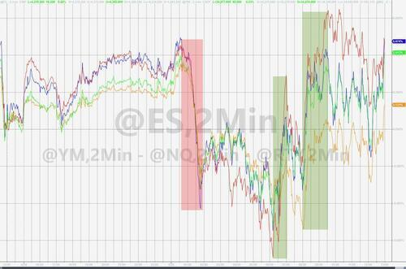
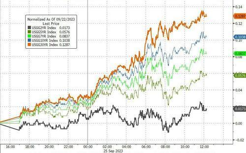
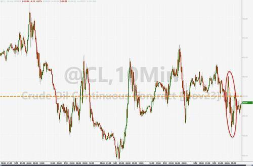
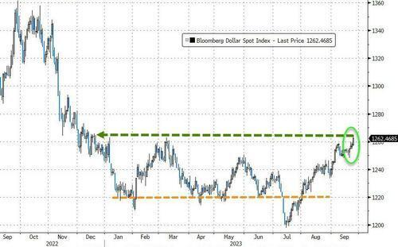
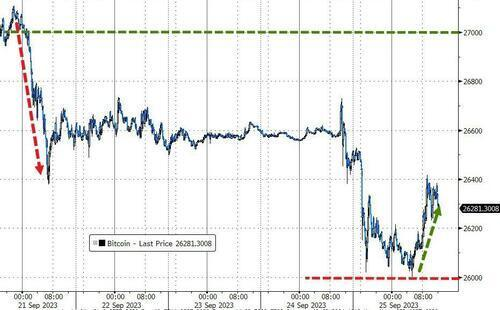

# 美股止步四连跌，美国长债收益率刷新十多年最高，美元突破十个月高位

市场关注美国国会能否及时在10月1日零点之前解决预算谈判分歧，否则美国联邦政府将临时停摆。仍对美国持有3A评级的穆迪警告，联邦政府若关门，对美国信用评级构成负面影响。

美联储最青睐的通胀指标——PCE个人消费支出物价指数将于周五公布，预计核心PCE环比增0.2%持平前值，同比增4%较前值4.2%继续降温，但仍较美联储通胀目标翻倍。

担任今年FOMC票委的芝加哥联储主席古尔斯比称，利率正在接近维持高位的水平，“讨论将很快转向维持高利率多长时间”，经济软着陆仍面临很多风险。标普仍预计美联储本轮周期还将加息一次，货币市场对明年降息预期调整为与点阵图一致的“两次降息共50个基点”。

欧洲央行行长拉加德称，欧元区价格压力依旧强劲，重申没有讨论过降息，且不排除进一步加息。法国央行行长也称押注降息为时过早，政策重点已变为在足够长的时间内维持高利率，用资产负债表来控制价格将获更多关注。经济学家此前预测今年不再加息且明年下半年降息。

欧元区8月通胀数据也将于周五公布，衍生品市场定价显示，交易员认为欧洲央行再次加息的可能性仅为
20%。Ifo德国9月商业信心连续第五个月下滑，该国经济的整体情绪“依然不佳”。

美股止步四连跌脱离数月低位，科技和芯片股领跑，中概指数跌1%，蔚来跌幅显著收窄

9月25日周一开启了9月份以及今年第三季度的最后一个交易周。由于美国10年期和30年期国债收益率升至多年新高，美股集体低开。

开盘近一小时，标普500指数大盘和科技股居多的纳指尝试转涨但未果，不过主要股指跌幅均显著收窄。午盘后，标普大盘和纳指转涨，道指也一度抹去逾180点的跌幅转涨。

**最终美股集体收涨，均止步四日连跌**
。道指重上3.4万点整数位，脱离7月10日以来的两个半月最低。标普和纳指均脱离6月初以来的近四个月最低，小盘股止步六日连跌脱离近四个月最低：

标普500指数收涨17.38点，涨幅0.40%，报4337.44点。道数收涨43.04点，涨幅0.13%，报34006.88点。纳指收涨59.51点，涨幅0.45%，报13271.32点。纳指100涨0.5%，罗素2000小盘股指数涨0.4%。

 _美股止步四连跌脱离数月低位，道指一度下测200日均线_

标普11个板块多数收涨。能源板块涨1.3%领跑，原材料、可选消费至多涨0.8%，信息技术/科技涨0.5%，电信服务涨0.4%，房地产和公用事业板块则至多跌0.2%，日用消费品跌0.4%。

有分析指出，9月份美国10年期基债收益率累涨超30个基点，屡次刷新2007年以来的十六年最高，除了季节性疲软的交易规律之外，美股还面临着油价升至十个月最高和美元连涨十周的挑战。

这令9月迄今标普500指数累跌超4%，迈向连跌第二个月，纳指累跌6%，均将创下去年12月以来的最差单月表现。蓝筹股居多的道指累跌2%，美联储鹰派利率前景令风险情绪持续承压。

**明星科技股午盘悉数转涨**
。元宇宙Meta转涨0.6%，特斯拉转涨近1%，谷歌A转涨0.7%，均脱离一个月低位；苹果转涨0.7%收复上周三以来跌幅，亚马逊涨1.7%脱离七周新低，奈飞涨1.3%脱离四个月低位；微软转涨0.2%，止步六日连跌，仍徘徊四个月低位。

**芯片股领涨科技类股，**
费城半导体指数转涨0.7%，收复上周三以来大部分跌幅。英特尔转涨0.3%，止步四日连跌，但仍徘徊月内最低；AMD涨超1%进一步脱离近五个月低位；英伟达涨1.5%，从六周最低连涨两日；Arm转涨6%，止步六日连跌，站上54美元并脱离上市以来最低位。

**AI概念股回调** 。C3.ai跌近3%后收跌0.6再创四个多月最低，Palantir
Technologies转涨0.6%，从三个月最低反弹两日，SoundHound.ai跌近4%至六个月最低，BigBear.ai跌4.5%至一个月最低。

消息面上，亚马逊向AI初创公司Anthropic最多投资40亿美元，对垒ChatGPT，Anthropic将用AWS作为主要云提供商，并用AWS的定制芯片训练AI模型，也直接对标英伟达GPU。摩根士丹利仍看好iPhone
15系列早期需求的强劲，称未来两周销量更重要。微软正在招聘一名核能专家，为其人工智能和云数据中心提供动力，券商古根海姆基于生成式AI变现潜力将微软评级上调至“中性”。OpenAI将在ChatGPT推出新的语音和图像功能。

**热门中概跌幅显著收窄。** ETF
KWEB跌近3%后收跌0.7%，CQQQ跌1.7%，纳斯达克金龙中国指数（HXC）跌2.7%后收跌1.1%，仍不足6600点，脱离一周高位，重新迈向两个半月低位。

纳斯达克100成份股中，京东跌2%，百度跌幅收窄至0.2%，拼多多跌3.5%后转涨0.8%。其他个股中，阿里巴巴跌幅收窄至超1%，B站跌1.6%，腾讯ADR跌超2%，蔚来汽车跌7%后收跌超2%，创近四个月低位，理想汽车跌约10%至三个月最低，小鹏汽车涨1.5%。

消息面上，蔚来称30亿美元融资传言不实。理想汽车历时47个月实现第50万辆量产车下线。华为进军电动车令新能源车类股普跌。双11前夕阿里腾讯合作深化，微信广告可直跳淘宝天猫。9月游戏版号发放，89款游戏获批，腾讯投资厂商在列。

**银行股指均止步六日连跌并脱离三个月最低，地区银行涨幅更大。**
行业基准费城证交所KBW银行指数（BKX）跌0.8%后转涨0.5%，5月4日曾创2020年10月以来最低。KBW纳斯达克地区银行指数（KRX）涨1.5%，5月11日创2020年11月来最低；SPDR标普地区银行ETF（KRE）涨1.4%，5月4日创2020年10月来最低。

**其他变动较大的个股包括：**

美国媒体股高开后转跌。迪士尼跌0.3%，派拉蒙跌超3%后小幅转涨，华纳兄弟探索公司跌4%。美国编剧工会与电影公司达成结束近150天罢工的临时协议，但罢工尚未彻底结束。

券商 Jefferies将Urban Outfitters、Foot
Locker和耐克等服装零售商评级从“买入”下调至“持有”，担心消费者支出缩减，Urban Outfitters和Foot
Locker盘初跌6%，耐克最深跌超1%。

电脑制造商惠普低开2.5%后收跌1.8%，创去年10月下旬以来的11个月最低，巴菲特旗下的伯克希尔哈撒韦公司出售480万股惠普股票、约合1.3亿美元。

英国和瑞典合资生物科技公司阿斯利康的欧股和美股齐涨超1%，券商Jefferies将评级上调至“买入”，看好与日本第一三共制药联合开发的一种乳腺癌疗法在后期实验中取得积极结果。

“越南特斯拉”VinFast Auto收跌10.43%至14美元，逼近8月15日美国借壳上市以来、于8月18日所创的盘中历史新低9.11美元。

投资者关注利率在更高水平维持更长时间的前景，欧股普跌。泛欧Stoxx
600指数盘中曾跌1%，最终收跌0.62%，连跌三日至一个月低位，旅游和休闲类股跌3%，家居用品跌2%。

LVMH和开云集团等奢侈品类股分别跌2.6%和4.5%。德法和英国股指盘中齐跌1%。德股是三季度表现最差的国家股指，累跌4.6%，同期泛欧Stoxx
600大盘指数累跌2.5%。

10年期美债收益率创2007年10月来最高，30年期收益率创2011年4月来最高

对货币政策更敏感的两年期美债收益率在美股盘初微跌，随后转涨并最高升超1个基点，重返5.13%，接近上周所创的2006年来最高水平。

10年期基债收益率日内最高涨11个基点至4.55%，刷新2007年10月18日以来最高。30年期长债收益率涨14个基点至4.66%，创2011年4月来最高。

20年期美债收益率涨14个基点至4.85%，创2020年8月6日有数据记录以来最高；七年期收益率涨8.64个基点至4.61%，创1993年6月30日以来新高。

_美国基债、七年期和30年期收益率分创2007年、1993年和2011年来最高_

欧洲也是长债收益率升幅明显更大。欧元区基准的10年期德债收益率最高涨6个基点徘徊2.80%，创2011年下旬以来的十二年最高。两年期收益率尾盘转跌，脱离上周四触及3.36%所创的3月9日以来半年高位，30年期收益率迈向3%心理整数位，逼近2011年10月来最高。

欧元区负债较深外围国家基准的10年期意债收益率一度升11个基点并上逼4.70%，创去年12月来最高。衡量风险情绪的意/德基债息差徘徊5月份以来最高位185个基点，代表持有外围国家债券要求更高收益率溢价。长端英债收益率涨超10个基点，两年期收益率一度创逾三个月新低。

美油失守90美元接近两周低位，布油站稳93美元上方，欧洲天然气涨超8%

油价在美股午盘时转跌，美油失守90美元心理整数位，布伦特11月期货仍站稳93美元上方。

WTI 11月原油期货收跌0.35美元，跌幅0.39%，报89.68美元/桶。布伦特11月原油期货收涨0.02美元，涨幅0.02%，报93.29美元/桶。

美油WTI一度尝试上逼91美元，随后最深跌1美元或跌超1%，下逼89美元整数位，基本抹去上周四以来涨幅，接近两周低位。交投更活跃的布伦特12月期货原本尝试上逼93美元，转跌后失守92美元，也徘徊近两周低位。

_美油失守90美元接近两周低位，布油站稳93美元上方_

有分析称，俄罗斯周一放宽对一些船舶用燃料和高硫含量柴油的出口限制，有助于油价保持稳定，但上周四宣布对所有类型汽油和优质柴油的禁令仍然有效。

投资者还对欧美央行可能抑制拥有需求的利率政策前景保持谨慎，这导致上周油价转跌，此前曾因OPEC+供应大幅收紧而连涨三周、且期间累涨超10%。

欧洲基准的TTF荷兰天然气尾盘涨超8%，盘中最高涨13%至并升破40欧元/兆瓦时整数位。ICE英国天然气尾盘涨超9%，升破110便士/千卡关口，欧洲冬季供暖季之前市场担忧燃料供应。

美元一度升破106至十个月最高，离岸人民币失守7.31元，日元11个月最低

衡量兑六种主要货币的一篮子美元指数DXY最高涨0.5%并一度升破106关口，刷新去年11月底以来的十个月最高，此前已连涨十周。9月累涨2%，将创5月份以来单月表现。三季度目前累涨2.7%，迈向去年以来最大的季度涨幅。

_美元连涨四日并创三周最大涨幅_

欧元兑美元最深跌0.7%并失守1.06关口，刷新今年3月中旬以来的半年多最低。分析称，这主要反映出欧洲央行不太可能进一步加息的市场观点，而美联储上周制定了鹰派的利率前景。英镑下逼1.22，同样徘徊半年最低。

日元兑美元下逼149，创去年10月下旬以来的11个月最低，日本央行领导人重申专注于维持宽松政策。离岸人民币跌穿7.31元，较上日收盘最深跌180点，基本抹去上周四以来涨幅，徘徊两周低位。在岸人民币收报7.3115元，较上周五夜盘收盘跌135点。

**主流加密货币涨跌不一。**
市值最大的龙头比特币跌1%至2.63万美元，接近两周来最低，第三季度已累跌14%。第二大的以太坊跌超1%后小幅转涨、徘徊1590美元，稍早曾下逼1560美元创两周低位，9月累跌5%，三季度累跌18%。

_比特币触及2.6万美元支撑位后反弹_

现货黄金失守1920美元至一周低位，伦铜近四个月最低，锌铝镍锡齐跌超1%

美元和美债收益率携手走强打压金价，COMEX 12月黄金期货收跌0.46%，报1945.60美元/盎司，期银跌近2%。

现货黄金跌0.5%并失守1920美元整数位，至一周低位。全球最大黄金ETF
GLD的持有量跌至2020年1月来最低，均反映出美联储长期较高利率前景之下的投资者情绪低迷。

 _现货黄金失守1920美元至一周低位_

**美元走强也令伦敦工业基本金属普跌。**
经济风向标“铜博士”跌0.9%并失守8200美元，至近四个月最低。有分析称，库存增加，以及对全球利率长期走高最终抑制强需求的担忧令价格走软。

伦铝微跌，伦锌跌超1%，均脱离一个半月高位。伦铅跌1.5%并失守2200美元，至月内以来的三周最低。伦镍跌1.5%至去年7月来的一年多最低。伦锡跌1.4%，失守2.6万美元至一周最低。

同时，内盘期货夜盘普遍收跌，焦煤、烧碱、焦炭跌约3%，铁矿石跌超2%。芝加哥小麦期货涨约1.7%，原糖期货和棉花跌约2.6%。

