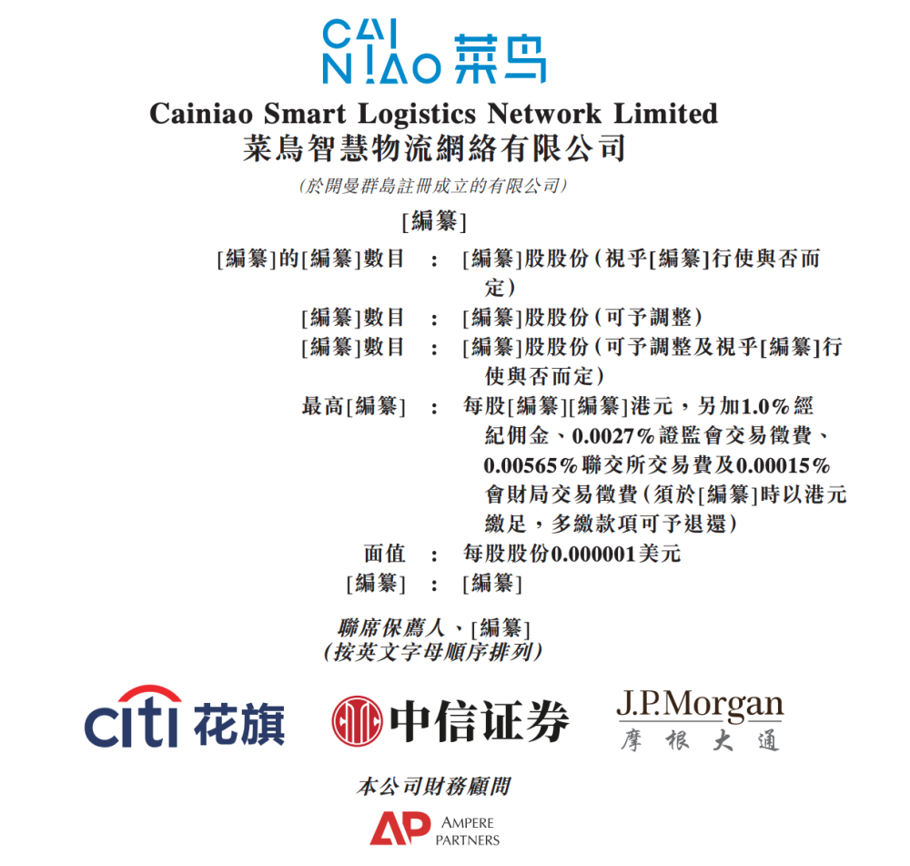
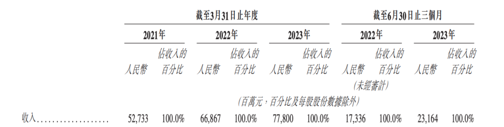
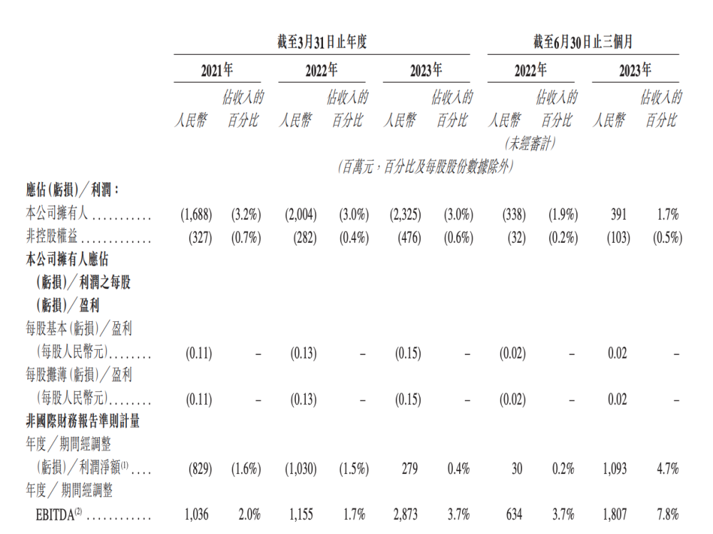
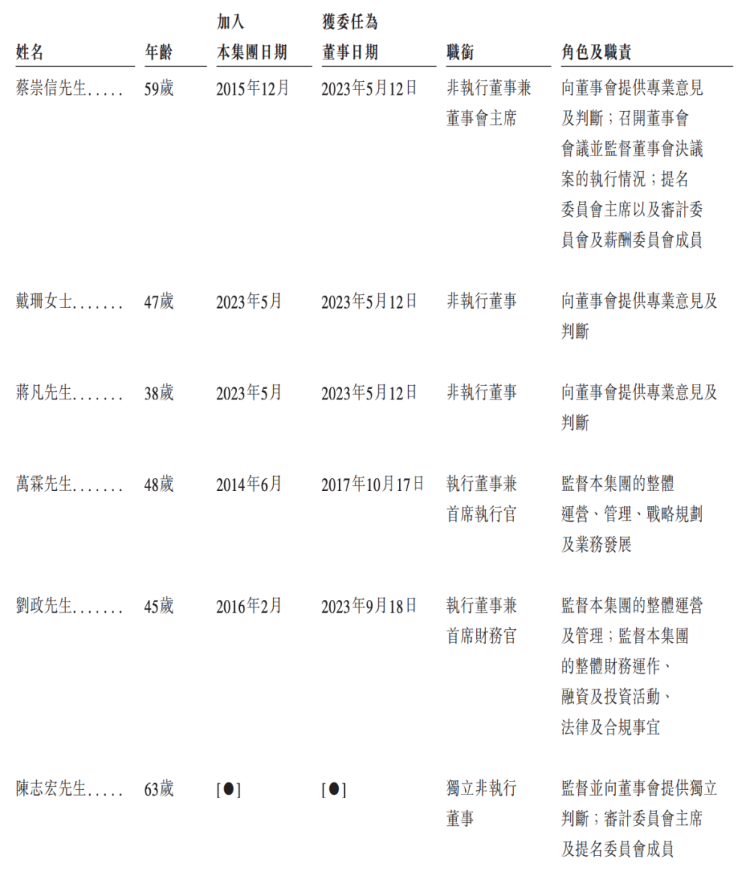
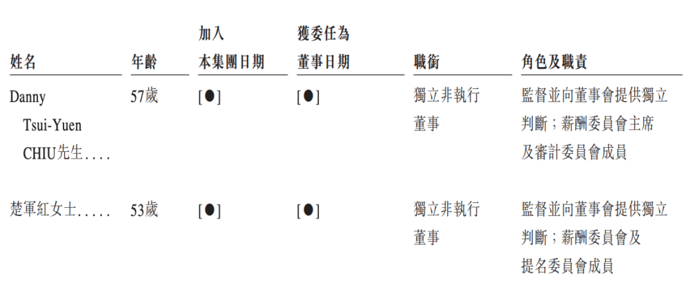
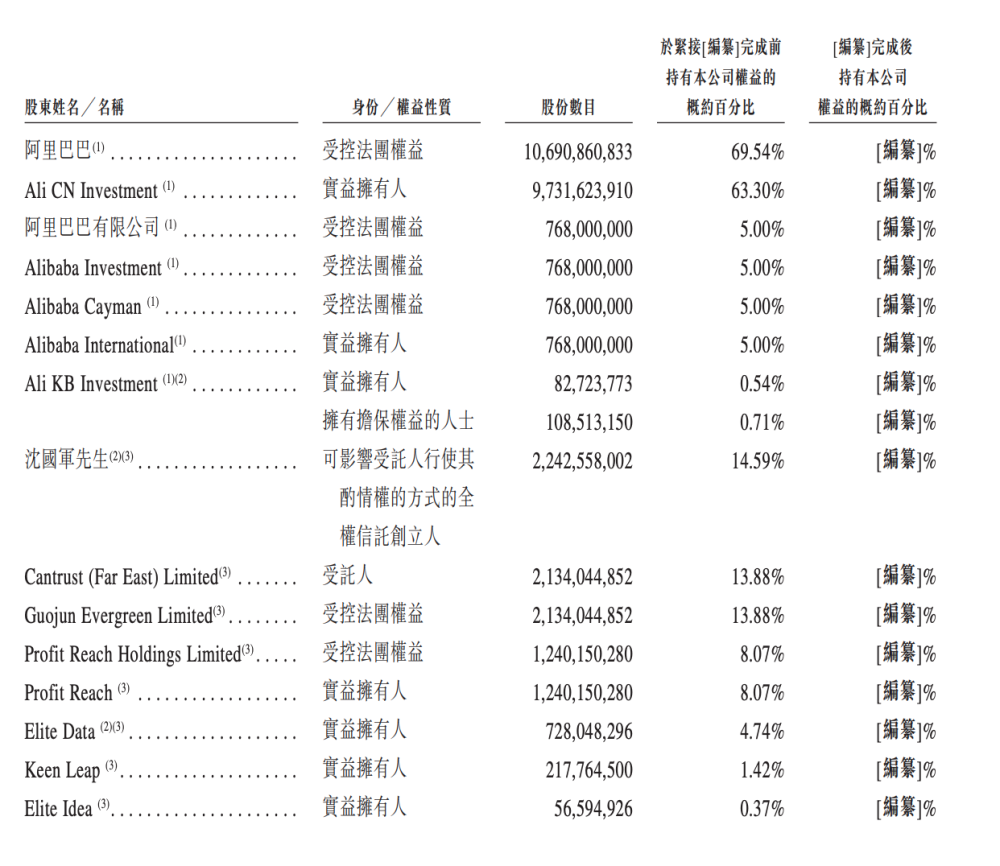
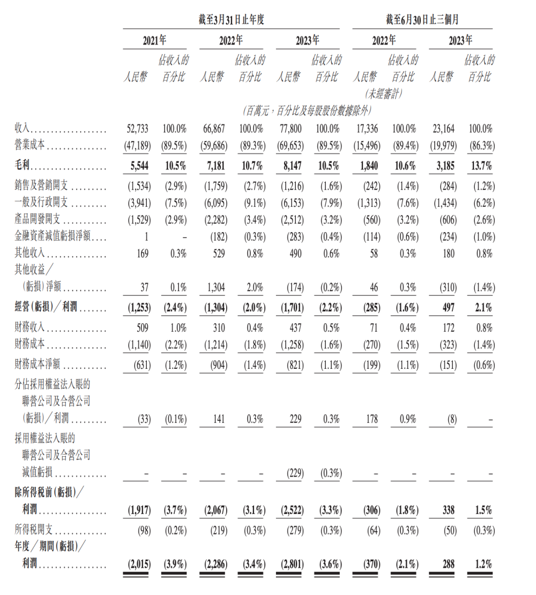

# 菜鸟向港交所递交招股书：3年亏损60亿元，蔡崇信任董事会主席

腾讯科技讯
9月26日消息，继阿里巴巴公告拟分拆菜鸟上市当晚，香港联交所网站信息显示，菜鸟已正式向港交所提交上市申请，成为阿里巴巴“1+6+N”之后首个正式进入IPO进程的业务集团，联席保荐人为花旗、中信证券、摩根大通。

招股书披露，菜鸟在 **2021年、2022年及2023年财政年度** ，以及 **截至2023年6月30日止的3个月**
，分别实现营收527.33亿元，668.67亿元、778亿元和231.64亿元。

同期公司拥有人应占净利润分别是-16.88亿元、-20.04亿元、-23.25亿元和3.91亿元。在2021年、2022年和2023年财政年度，菜鸟累计亏损60.17亿元。

菜鸟的经调整净利润分别是-8.29亿元、-10.3亿元、2.79亿元、10.93亿元。年度经调整EBITDA分别是10.36亿元、11.55亿元、28.73亿元和18.07亿元。

菜鸟的前五大客户的收入分别占其各期间总营收的34.4%、34.8%、32.3%及34.4%，而来自最大客户阿里巴巴集团的收入分别占其各期总营收的29.2%、30.8%、28.2%及29.7%。

董事及高级管理层

菜鸟董事会由八名董事组成，包括两名执行董事、三名非执行董事及三名独立非执行董事。其中，蔡崇信担任菜鸟非执行董事兼董事会主席；另外两名非执行董事分别是戴珊和蒋凡。菜鸟首席执行官万霖和首席财务官刘政担任公司执行董事；独立非执行董事分别是陈志宏、Danny
Tsui-Yuen CHIU和楚红军。

主要股东

菜鸟的招股说明书显示，在首次公开募股之前，阿里巴巴集团通过受控法团权益持有菜鸟10,690,860,833股普通股，占该公司总股本的69.54%。

其中，通过Ali CN Investment持有9,731,623,910股普通股，占总股本的63.30%；通过阿里国际（Alibaba
Internationa）持有768,000,000股普通股，占总股本的5%；通过Ali KB
Investment持有82,723,773股普通股，占总股本的0.54%。

Ali CN Investment、Alibaba Treasury及Ali KB
Investment由阿里巴巴直接全资拥有。阿里巴巴有限公司由阿里巴巴及Alibaba
Treasury分别直接拥有80.02%及19.98%权益。Alibaba Investment由阿里巴巴有限公司直接全资拥有。Alibaba
Cayman由Alibaba Investment直接全资拥有。阿里国际由阿里开曼直接全资拥有。根据证券及期货条例，阿里巴巴被视为拥有及控制Ali CN
Investment、阿里国际及Ali KB Investment分别持有的股份。

沈国军持有菜鸟2,242,558,002股普通股，占总股本的14.59%。

财务状况

**2023财年**

\--在截至2023年3月31日的2023财年，菜鸟总营收为778亿元，相比之下2022财年为668.7亿元，2021财年为527.3亿元。

\--在截至2023年3月31日的2023财年，菜鸟营业成本为686.5亿元，占营收的比例为89.5%；相比之下2022财年为596.9亿元，占营收的比例为89.3%；2021财年为471.9亿元，占营收的比例为89.5%。

\--在截至2023年3月31日的2023财年，菜鸟总毛利润为81.5亿元，毛利率为10.5%；相比之下2022财年为71.8亿元，毛利率为10.7%；2021财年为55.4亿元。毛利率为10.5%。

\--在截至2023年3月31日的2023财年，菜鸟销售及营销支出为12.2亿元，相比之下2022财年为17.6亿元，2021财年为15.3亿元。

\--在截至2023年3月31日的2023财年，菜鸟一般及行政支出为61.5亿元，相比之下2022财年为61.0亿元，2021财年为39.4亿元。

\--在截至2023年3月31日的2023财年，菜鸟产品开发支出为25.1亿元，相比之下2022财年为22.8亿元，2021财年为15.3亿元。

\--在截至2023年3月31日的2023财年，菜鸟运营亏损为17.0亿元，相比之下2022财年为13.0亿元，2021财年为12.5亿元。

\--在截至2023年3月31日的2023财年，菜鸟净亏损为28.0亿元，相比之下2022财年为22.9亿元，2021财年为20.2亿元。

**2024财年第一财季**

\--菜鸟第一财季营收为231.6亿元，高于去年同期的173.4亿元。

\--菜鸟第一财季营业成本为199.8亿元，高于去年同期的155.0亿元。

\--菜鸟第一财季毛利润为31.85亿元，毛利率为13.7%；去年同期毛利润为18.4亿元，毛利率为10.6%。

\--菜鸟第一财季销售及营销支出为2.8亿元，相比之下去年同期2.42亿元。

\--菜鸟第一财季一般及行政支出为14.34亿元，相比之下去年同期13.13亿元。

\--菜鸟第一财季产品开发支出为6.06亿元，相比之下去年同期5.60亿元。

\--菜鸟第一财季运营利润为4.97亿元，相比之下去年同期运营亏损为2.85亿元。

\--菜鸟第一财季净利润为2.88亿元，相比之下去年同期净亏损为3.70亿元。

今日稍早，阿里巴巴在港交所发布公告称，公司拟通过以菜鸟股份于香港联交所主板独立上市的方式分拆菜鸟。

公告称，现建议，拟议分拆将以菜鸟股份全球发售的方式进行（包括香港公开发售及国际发售）。拟议分拆完成后，阿里巴巴将继续持有菜鸟50%以上的股份，菜鸟将仍为阿里巴巴的子公司。

