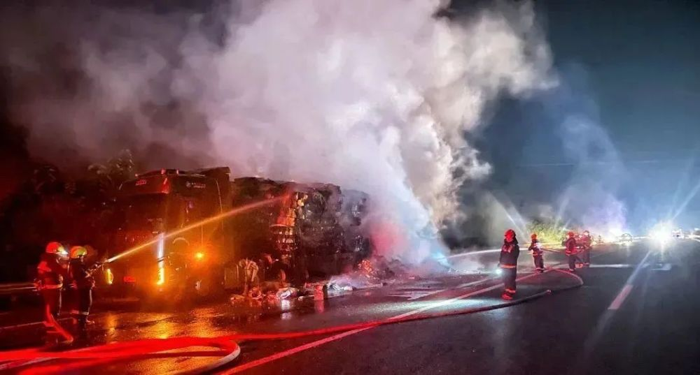
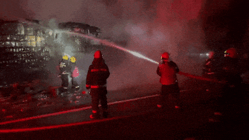
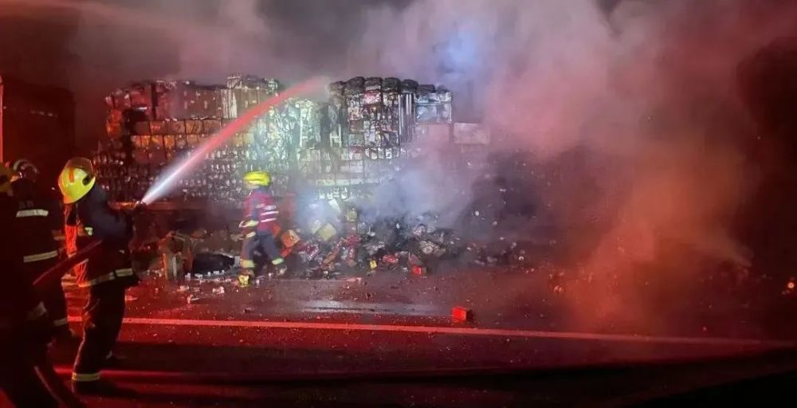
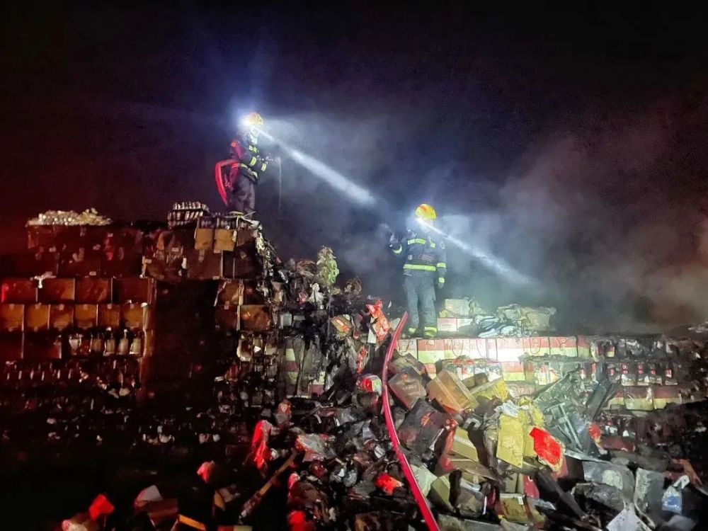

# 陕西一货车起火，车上拉了2000箱白酒，价值约300万元

9月23日20时， **陕西华阴市连霍高速西安往河南方向938公里处有一货车着火。**
接警后，消防救援人员立即出动，同时联系高速交警配合疏散周围群众，并且进行警戒封锁道路。

**消防员到达现场后了解得知起火货车载运了2000箱白酒，** 现场浓烟较大并伴有明显的白酒气味。

经过对现场环境分析研判后，消防员立即分为两组，警戒组队员对周围进行警戒封锁，灭火组队员穿戴个人防护装备，出两支水枪在货车左右两侧对火势展开处置。

9月24日0时29分，现场大火已被控制。0时30分，消防员对残留余火进行处置，并对车辆降温，防止发生复燃。经过4个小时紧张的救援，1时36分，现场处置完毕。

据了解，此次事故烧毁了价值约300万元的白酒，所幸未造成人员伤亡。

