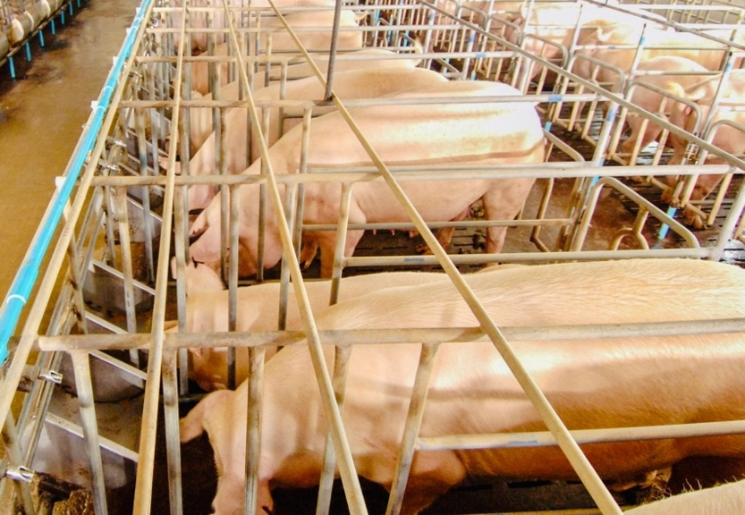
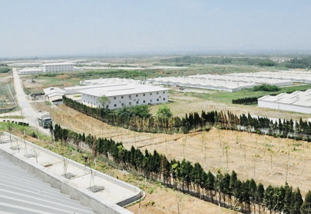
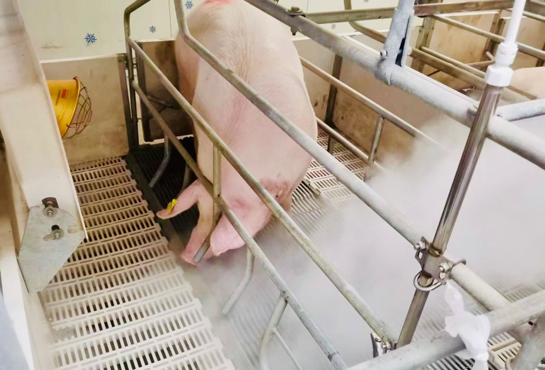
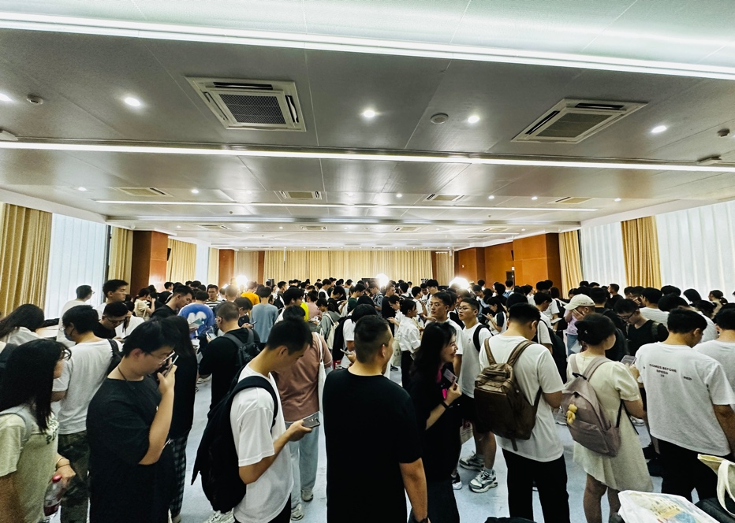

# 985女大学生毕业后走进猪场：铲粪配种打疫苗，照料怀孕母猪和它的崽

**核心要点：**

  * _1_ 猪场养殖是属于该公司主营业务的特色培训，新入职员工们都要根据自己岗位的差异进行不同时间长度的养殖培训。晓虹所在的人力资源岗位是需要进行两周的生猪养殖培训，公司法务、财务部门是最少要一周，而智能化养猪技术人员等则要在猪场待够两个月。
  * _2_ 虽然刚进入猪场的晓虹非常劳累，但她慢慢注意到带她一起工作的养殖师傅们却更加辛苦。以为母猪准备怀孕的后备段来说，这30天时间里，一个养殖工人需要通过给母猪做抗体免疫、加大母猪食量、延缓母猪发情时间、确保母猪一起发情后的7天配种等多个阶段完成后备段这2400多头母猪的工作。
  * _3_ 晓虹和同部门一起来养猪的7位同事都结下了深厚的友谊关系。她们每日一起下车间铲粪养猪，一起吃饭学习，共同交流工作内容，对彼此既熟悉又亲切。除了同届入职的同事，养猪培训的新入职员工们也都会参加和部门高管一对一的“结对拜师”工作，晓虹就是向部门内其非常尊敬、能力超强的部门经理拜师。
  * _4_ “目前我们企业猪场母猪怀孕一窝一般能生13只小猪，已经是国内最高水平了，但世界最厉害的养猪强国丹麦，能够通过基因培养等选育方式一窝生21头小猪”“我现在就希望通过自己在企业努力地工作，帮助一线员工们提高生产养殖的效率，为我国养猪事业的发展贡献力量”。没跟任何人商量，晓虹自发地把自己在猪场培训的时间延长到一个月。

**徐亮亮 | 武汉大学社会学院**

“人们都说在大城市混不下去，要回家养猪”。但让某知名985大学应届本科毕业生晓虹震惊的是，自己不用回家，在城市干着白领的工作也养起了猪。

这里所说的猪场养猪，是晓虹入职某大型私企人力资源岗位后的新员工培训，该企业所有新员工的暑期培训中都包含了企业猪场养殖这一培训内容。

刚进企业猪场的晓虹，在穿过一堆120天+的大猪里来回挤蹭寻找最优种猪，各种屎尿臭气混杂在她厂区工服上的时候，回想起自己一个多月前还在大学里的快乐时光，顿时感到人生的一阵幻灭。

_“人们都说在大城市混不下去，要回家养猪”。_

一、都市丽人的“入职养猪记”

晓虹是今年上半年通过校招进入的这家国内生猪养殖等的龙头企业，据她自己介绍，当时核心的选择依据就是这家公司给的薪资最高。不错的薪资加上对口体面的人力资源岗位工作，让晓虹对之后成为都市丽人、高级白领的工作生活充满着向往。当然确定入职前，她也知道企业在暑期的员工培训中会有公司猪场养殖的培训，她当时的想法还是有侥幸心理，认为自己的岗位和生产端的工作完全没关系，到时候自己可能不用参加培训这样。

企业的新员工培训是7月初开始，两个月的时间包含有新员工军训、企业文化、岗位内容、个人愿景、工作方法与猪场养殖实操等。因为公司的大力重视，所有入职的新企业员工都要经过严格的培训过程，并且在各培训环节中都会再被评级打分筛选等。其中猪场养殖是属于该公司主营业务的特色培训，新入职员工们都要根据自己岗位的差异进行不同时间长度的养殖培训。晓虹所在的人力资源岗位是需要进行两周的生猪养殖培训，公司法务、财务部门是最少要一周，而智能化养猪技术人员等则要在猪场待够两个月。

晓虹在进入猪场的养殖培训前，在企业总部进行了一个半月的工作培训。因为是来自名牌大学的高材生，晓虹对于公司培训知识的学习掌握驾轻就熟，从企业文化、专业知识到个人愿景、工作方法，晓虹的考试成绩都是数一数二。但主管培训的大经理却对晓虹亮起了“红灯”，在工作培训的最后一周，她直接找到晓虹，开门见山地就提出“你还没有真正融入企业，哪怕考试总是第一，但你的心还不在这里，如果继续这样下去的话，没过多久你就会离职”之类的话语。听到这样评价的晓虹顿时面如死灰，不只是培训考核的压力，更多的是她不理解大经理为什么会做出这样的判断。直到晓虹进入猪场生产培训一段时间之后，她才渐渐领悟这个问题的答案，领悟到自身对于工作职业意义的答案。

_企业的养殖猪场在城市远郊_

企业的养殖猪场在城市远郊，离总部约两个小时车程，周围就是乡下了，来培训的新员工们也就住在猪场里，宿舍与食堂环境等都较为落后。尽管猪场养殖已经做到了智能饲喂、无菌注射等技术，但养猪场里总是弥漫着一股恶臭的气味，这让晓虹及其他培训的新员工们在一开始非常不适应。

养殖猪场会根据猪的生长状态分为不同工段的工作，有为母猪准备怀孕约30天时间的后备段，母猪受精怀孕约114天时间的怀孕段，到生产小猪后约21天时间的哺乳段，再到小猪成长约49天时间的保育段，再然后到小猪约100天时间的育肥段等。不同工作段的母猪和小猪都需要进行非常细分的不同程序的养护照料，这些参与培训的新员工们也就被分到不同分段跟各分段一线的养殖员工们学习养猪的具体工作内容。

跟着分段的师傅后，晓虹在猪场的作息也就和一线工人师傅们的作息保持一致了。每天早上6点起床，7点进入厂区洗澡换工服后进入养殖猪圈，上午10点出猪圈，下午的工作时间是3点到7点，晚上一般都是养殖技术的学习时间。晓虹在猪圈内的工作，基本就是根据养殖师傅们的要求做事，最早是猪圈清粪，后面慢慢地也会学习疫苗注射、打消炎针等技术性工作。

因为来之前就带有较大的、“已经被约谈了”的工作压力，来之后劳累的工作、又脏又臭的环境，以及学了几乎和岗位工作不相关的养猪技术，晓虹和周围培训的朋友们在最开始都表示不能接受。这期间也有一些隔壁部门的培训员工受不了后辞职，而晓虹则是渐渐随着时间的推移，在周围忙碌的工作生活中慢慢适应了这个环境，并在这一系列养猪培训的生产实践中渐渐悟出了自己之前就业认知中的问题与工作的意义。

晓虹能够产生这样心态的转变，首先是来自养猪生产实践中一线工人师傅们生产劳动的感染。

虽然刚进入猪场的晓虹非常劳累，但她慢慢注意到带她一起工作的养殖师傅们却更加辛苦。这些一线的养殖工人，都是文化素质不高的农民工，虽然已经有了智能饲喂，但他们每天的工作量仍然是被计算安排得满满当当。一个一线的养殖工人，往往要带4个段的生猪，而一个段就有600头猪，每个段的生猪每天都有非常繁琐的工作程序。以为母猪准备怀孕的后备段来说，这30天时间里，一个养殖工人需要通过给母猪做抗体免疫、加大母猪食量、延缓母猪发情时间、确保母猪一起发情后的7天配种等多个阶段完成后备段这2400多头母猪的工作。

当亲眼目睹一线工人们如此高强度的工作后，晓虹才真正理解了上个月企业文化培训中公司创始人所说的大学生必须“一帮三”工作的责任感，即整个企业中只占1/3作为天之骄子的大学生们，必须要有责任意识去帮助企业另外的一线工人们。晓虹之前还以为这样的企业文化只是公司的倡导方向，真的是在生产实践的第一线，真实看到与成为这些忙碌的身影，她才感悟到企业精神的真正含义，感受到自己的工作责任与动力。

_虽然已经有了智能饲喂，但他们每天的工作量仍然是被计算安排得满满当当。_

其次，在猪场养殖培训的生产实践也大大加深了晓虹对自身人力资源管理岗位及专业上的认识，她开始越来越主动地思考企业当前对一线生产工人们薪资管理的模式与问题。

能够产生这样的理解深入，得益于猪场实践培训中全身心进入生产车间，和一线工人同吃同住同工作的最真实体验。在某种情况下来看，晓虹的猪场生产实习不亚于一场深刻的工厂车间调研。在这样的猪场培训中，晓虹充分了解到自己所在人力资源部门对公司生产端一线工人们的薪酬结算机制。其具体是将员工的绩效与养猪利润强关联起来，将生产工人所在分段的生猪投入成本与收益精准计算后算出各分段生猪养殖获得的利润，再按这个利润的系数计算员工具体奖金。

虽然这套一线员工工资激励的计算方案非常精准，但晓虹却在和生产端工人们的深入接触中发现了问题。这些一线员工往往只能了解到自身每月工资的差异，却并不能很好理解工资差异背后具体是受自己哪方面养猪行为的影响。即当前工资绩效影响背后的个体养猪行为很难让一线员工深刻认知，这也就不能让这些一线员工更加明确地在生产端调整自己的养猪行为，工资绩效的意义没有得到充分发挥。基于此，如何利用这样精准的绩效计算模式，将更准确的养殖差异信息反馈到一线员工手中，切实提高公司生产端的养猪效率，逐渐成为晓虹在专业岗位工作中所想思考解决的一个重要问题。

然后，在猪场生产实践的培训中晓虹更是深刻感受了“共患难”般的同事友谊。

区别于“办公室政治”般内卷式的同事关系，晓虹和同部门一起来养猪的7位同事都结下了深厚的友谊关系。她们每日一起下车间铲粪养猪，一起吃饭学习，共同交流工作内容，对彼此既熟悉又亲切。除了同届入职的同事，养猪培训的新入职员工们也都会参加和部门高管一对一的“结对拜师”工作，晓虹就是向部门内其非常尊敬、能力超强的部门经理拜师。这位师傅自晓虹培训起就经常指导她的工作内容与认知思考，这种“老带新”的模式也更深层次地帮助晓虹融入了企业、认知了自我。晓虹也是在猪场培训的众多情感支持下，反思出自我在工作认知与工作培训中的问题，理解了培训大经理对其“约谈”判定的原因。

“之前的培训我基本都是靠脑子在工作，很多东西我学了，但没有走心”，“回想自己整个学生生涯都是这样过来的，我总是会很深入地计算自己的利益关系，而并不会真正地把自己投入到工作与关系之中”，“这样的自己是缺少了感情的投入的，只用脑子工作，而不是身体工作，就会在个人情感上陷入冷漠，对这个企业没有感情，我自然很快就会离职”，晓虹如是说。

最后，经过在猪场生产实践的培训，晓虹也重新描绘了自己的职业规划。

她之前认为自己应该只会在这家公司工作两三年，等到职业瓶颈，大概率要再出去换工作，有这样的想法也主要是之前晓虹一直没有找寻到自己最终所要寻找的工作方向。但或许是在猪场后备段给母猪打完一针针“蓝耳”疫苗，或许是在猪场怀孕端努力照料后看到一窝窝新出生的小猪，或许是在生猪育肥段看着大猪一头头健康出栏，晓虹无比坚定了要在企业努力工作、长远发展的目标。

“目前我们企业猪场母猪怀孕一窝一般能生13只小猪，已经是国内最高水平了，但世界最厉害的养猪强国丹麦，能够通过基因培养等选育方式一窝生21头小猪”。“我现在就希望通过自己在企业努力地工作，帮助一线员工们提高生产养殖的效率，为我国养猪事业的发展贡献力量”，晓虹还坚定地表示以后正式入职了自己也要常回猪场切实应对相关工作里的问题。没跟任何人商量，晓虹自发地把自己在猪场培训的时间延长到一个月，她的部门领导对此也非常认同，这位都市丽人就这样在城市远郊的猪场继续又脏又累又快乐地养猪了。

二、青年人的就业困境

从晓虹刚刚入职培训时的迷茫困厄与问题暴露，到参与培训后的自我反思及方向坚定，我们可以看到一位优秀青年就业者在就业实践中的认知转化与自我蜕变。晓虹初次面对工作及培训时的震惊与不适应、参加培训过程中体现的学生考试思维、投身工作的计算与非情感投入及晓虹部分同事们面对猪场环境直接离职等工作现象充分展现着当代青年在面对就业工作中的种种困境与问题。这些青年人的就业困境并不仅仅来自于青年个体的认知与发展不足，其与所处企业环境及社会结构等的影响都息息相关。这个暑期，笔者从祖国中部山西、河南一路访谈到东部苏南、上海，访谈了数十位青年的就业与生活，发现青年人的就业困境比比皆是，以下将具体表述这些处于时代发展与变化中的青年就业困境。

_青年人的就业困境比比皆是_

**第一，青年人“就业难”，难以进入让自己满意的就业企业和工作的困境。**

青年人的就业本质上是一个个体劳动要素与劳动力市场选择匹配的过程，在以学历、年龄、资源及个人能力等符号的劳动要素去匹配薪资、岗位、企业、行业等劳动力岗位中，不少青年人很容易出现“高不成低不就”的就业困境。和晓虹这样高学历起点的名牌大学生不同，大量一二本毕业的青年大学毕业生们往往很难找到与自己专业对口、薪资待遇还满意的工作。再加上人尽可言的“当前经济环境不景气”、“史上最差就业年”等紧张性氛围及日趋饱和的就业市场结构影响，越来越多的青年在没有对自己个人劳动要素进行很好评估或较高职业期待的想象中碰壁时，常常会陷入不想选择、逃避就业的困境。

为了更好的就业预期，考研、考公、考编等考试成为这些青年逃避就业的主要方式。来自武汉某大学已研三的小秦同学再一次陷入了自己的就业困境，当年本科毕业的她就是为了更好的工作选择而去上了研究生，现在再一次选择来临，她只能通过不断地海投简历，在焦虑的等待中期望找到一个她满意的工作。而在南京某大学毕业已三年的阿飞正在准备自己的第三次考研，其报考的目标也一降再降，三年考研光报班就已经花费了十余万元，考研、考上研的观念已经成为他就业选择前的先决条件。

**第二，青年人就业“竞争风险大”，受时代与经济发展影响，越来越多的激励、考核出现在年轻人工作的内容中，竞争、绩效、晋升、裁员等的风险始终萦绕在就业青年们的大脑里。**

就如晓虹参加企业培训全过程评比一样，在前期工作培训的环节里，很多员工不惜耍赖都要加上那一分两分。同样，培训文化考试总是考第一的晓虹在面对领导负面评价后会很长时间都陷入低迷的情绪中，害怕自己的培训结果会处于末流。

为了应对就业风险，年轻人的选择变得越来越单一，活出自我几乎不可能，每个人都要在内卷的环境里参与竞争。苏州某国企管理部门工作的大林表示，每个月的绩效竞争非常激烈，同部门评比处于末流的工资就是最低，其工资悬殊的差额超过三千元，且总是处于末流的员工还有被辞退的风险。

这些就业工作的风险也会进一步倒逼青年的就业选择，越来越多的年轻人倾向于选择稳定性的工作，考公、考编进体制内的工作热度越来越高。殊不知体制内工作青年们的压力一样巨大，入职中部地区乡镇近两年的青年小张表示，“每天要做的工作和材料非常多，和自己一样进来的二十多个年轻的事业编干部最终竞争三个事业编副科，晋升机会渺茫，卷又卷不动，躺又躺不平，强撑而已”。

**第三，青年人就业“意义感薄弱”，很多青年受工作内容及自我心态的影响很难找到自己工作的兴趣与意义，进而影响工作的积极性与获得感，常常感觉工作得身心俱疲。**

进入猪场生产培训之前的晓虹，还仅仅是用“脑子”计算式地工作，并没有深刻感受到工作的意义，这也是其被培训领导约谈的原因。若就业工作缺少意义，青年也就不会在工作中身心投入，晓虹也是后续在生产培训的实践中深刻体会到自己工作的意义后才非常有主体性地开展与规划自己的工作的。而若一直找寻不到自己工作意义的反馈，青年的就业工作就会始终缺乏主体性，工作真的就只变成了一项只为工资的无意义重复劳动。

这种情况下青年的工作与生活是高度割裂的，他们往往以工作“摸鱼”为荣，着迷在工作之外的生活与兴趣中找寻自己的意义。某小型国企党建专员阿伟就是这样，他一个人负责了整个公司的党建工作，每个月都要上交大量的活动台帐与材料，伏案写作是他工作的常态。甚至上交材料前他还要再上交一份材料审查的自查报告，这使得他极少能从工作中感受意义。于是阿伟只能在工作之后发展自己的兴趣，他痴迷于美食和调酒，每天都在打卡下班后才真正享受属于自己的生活意义。

青年就业的意义获得感薄弱还会影响青年个体整个的发展规划，使得青年就业完全以一种利益驱动、功利计算的方式进行，获取工资逐渐成为青年就业唯一的目的来源，个体长远性的工作和成长易于陷入发展的困境。晓虹那些进入猪场培训没多久就辞职的同事们，他们本身也都属于个体劳动条件优越的青年，不少都是该公司技术部门招聘的员工。他们之所以离职，就是在就业意义感获得缺失的情况下，单纯比较自我收益与付出的失衡。

这些善于比较、利益计算的青年可能会在后续不断变动的职业中找寻到自己工作的意义或兴趣，但不断的就业选择也会成为他们思想行为中的一种惯性。每当面临困境，他们往往都会下意识地进行工作付出与收益的再选择，进而不断地进行工作调整，他们个体的成长心态也会在这种变动中愈加趋向于浮躁，甚至陷入恶性循环。

本科毕业后在上海做码农的军军工作三年已经换了五家公司，他现在的工作优势就是非常善于参加公司招聘，而现在能打动他工作的核心要素就是工资与工作时间的具体比较。在这五家公司的职业变动中，军军基本都是做前端工程师的工作，工作待遇和时间是越来越让其满意的，但公司的档次却越来越低。自称为“数字民工”的军军并不期望之后的就业会有多长远的发展，他满不在乎地表示，“能升职就升，不能升职就想着再跳槽，就业就是贩卖自己的劳动时间”。

三、实践意义下的青年成长

晓虹能够在猪场深刻感悟自己就业工作的问题与意义，离不开其猪场生产实践里各类即时性的意义反馈。这些生产实践的意义反馈和晓虹前期工作培训中的企业文化与认知思考相辅相成，形成了其理论与实践的统一，进而帮助晓虹更加坚信自己的就业选择与工作意义。青年人的就业是需要不断在实践与认知中感受意义反馈的，只有不断获得这样的意义反馈，才能让青年人在就业的各种现实问题与困境中更加坚实自己的步伐，坚定自己的成长。

而晓虹能在实践就业与工作中产生这样强烈的意义反馈，和其在生产实践端全身心的工作投入不无关系。正是在这样具有主体性的工作投入里，晓虹才真正感悟了最真实的生产实践，获得了最真实的实践意义。这样的实践意义，不仅有工作习得忙碌踏实的快乐，也包含着对个体成长与工作价值意义的认同。在这样实践意义的激励下，青年个体也将真正感悟就业工作的意义，以一种更加积极主动的主体性投入到自己的工作与就业中。这样的意义认同也将不再是任何简单的功利主义的金钱计算，而会是一种更加附带个体情感与主体性价值的生命深刻。青年们也会在这样就业的实践意义中深刻反思与认识自我，不断进行更加具有深刻意义性的职业规划与发展选择，进而真正实现劳动就业对个体与社会发展的长远意义。

青年时期是个体发展中最向往真实与成长的阶段，青年们会觉得一生最糟糕的事情是重复别人的人生，最绝望的时刻是说出连自己都不愿意相信的话语。对此，我们青年在就业与发展的认知中要更加坚定实践意义的重要性，这是一种体悟最真实、成长最深刻的意义感受。对于就业选择，要在充分认知与衡量自我的前提下大胆选择工作与就业，不要畏惧与逃避任何的就业选择，要在观念上明确，只要是能产生价值意义的工作就是值得投入与实践的好工作。而对个体寻找最合适工作的目标，往往也要在实践中去真实探寻，大胆尝试、不断转变、勇于超越才是个体职业选择及规划的可行之路。

对于就业竞争，青年们要在飞速变动的时代洪流中锚定自我，深刻认知自己与职业的价值意义，在就业实践意义的不断获取与坚定中真正成长与发展自我，这才是真正有效率与真实的竞争式发展。对于就业意义，全身心的工作投入是获取实践意义的必要条件，唯有个体最真实与深刻的投入方能获得工作意义与价值最真实的体悟。在经过全身心投入感受到某项工作就业最真实意义之后的青年，其所做的任何就业选择都应该是值得被肯定与认同的，这同样也是就业实践意义对青年成长发展最好的助力。

面对青年实践意义下的个体成长，众多企业公司也要深刻认知就业实践意义的重要性，在工作选择与就业安排的内容中要充分推进青年人进行最真实的工作实践。晓虹所在的公司并不是企业大力推进青年实践成长发展的特例，无锡某新能源汽车公司也有推进新企业员工下电池生产车间培训的惯例，甚至企业或部门内部“老带新一帮一”的机制也非常普遍。但青年就业的困境不只是企业有相应工作培训的内容就能得到解决的，如何让企业青年真正能在就业的实践工作中获得成长与意义才是问题的关键，这值得所有企业公司在提供青年就业选择与工作内容时认真思考。

纯粹依靠激励的方式要求青年工作只能达到最基础的收益，年轻的人才都不是被选拔出来的，选拔的背后代表着强烈的竞争，易于造成群体内卷与个体内耗，缺少集体与个体之间的良性互动与成长。真正的人才应该是在企业集体与生活实践中被培养与成长出来的，企业有让青年人获得成长的培养渠道，每个青年也都能在实践工作中感悟工作的意义性与自我的主体性，这样的公司企业和部门才是真正有活力与前景的。

就业是民生之本，青年人的就业深刻关系着一个国家社会未来发展的稳定与繁荣。对于青年人的就业困境，不能单纯依靠国家社会出台一系列鼓励就业、就业优惠的政策法规等，国家和社会更要从青年就业困境产生的深层结构中找到企业与个体问题的根源。从就业劳动的本质来看，就业所能带来的实践意义是个体认知发展最高级与最深刻的感受，而个人的主体性是能感受这样意义的最重要来源。正确认识青年人的就业困境，大力促进企业部门人才培养模式的变革与推进青年人就业工作中的意义感获得，让每一个个体和企业都能真正有主体性地在劳动就业意义的生产获得与发展成长中壮大繁盛，这才是青年就业困境问题最高效与可行的解法。

_青年人的就业深刻关系着一个国家社会未来发展的稳定与繁荣。_

**（文中图片由作者提供，文章人物皆是化名，感谢所有访谈对象！）**

