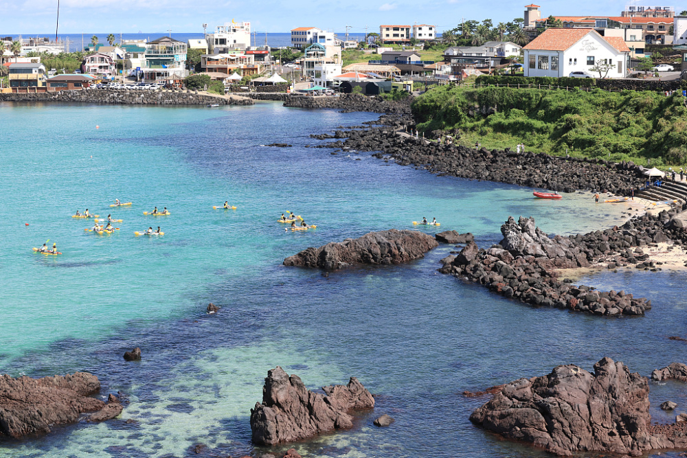

# “济州岛=宰客”？韩国担心坏名声劝退中国游客，专家呼吁济州“自省”

【环球时报驻韩国特约记者 张静 环球时报特约记者
韩闻】“济州岛=宰客，韩国人回避……这样下去中国游客也会离开。”韩国《朝鲜日报》26日以此为题报道称，由于定价过高争议和旅行体验欠缺，在疫情期间被韩国人作为替代海外旅行的济州岛游如今正被当地人抛弃，而中国游客的满意度也在下降。有韩国专家认为，“济州旅游业应该自省”。

_9月，韩国济州岛，涯月邑汉潭海边，游客们正在划皮划艇。（视觉中国）_

在疫情期间，济州岛由于韩国国内游客猛增而吃了一波红利。据报道，去年到访济州的韩国游客超过1381万人，创下自1962年当地旅游正式发展以来的最高纪录，然而住宿、租车、餐厅、高尔夫球场等价格暴涨也让济州岛陷入宰客争议。济州观光公社一项针对游客的民调显示，对高物价感到不满的受访者从2014年的29%增至2021年的57%。

《朝鲜日报》称，在“济州岛等于宰客”的认知基础上，随着海外旅行变得自由，今年7月至8月到济州岛的韩国游客人数为230.8万人次，比去年同期减少约9%。当地旅游业的营业额随之受到打击，比如济州岛的高级酒店今年7月的客房入住率同比降低了20%，同期的大巴包车和租车数量分别下降20%和25%。值得注意的是，今年7月的赴日韩国人为62.68万，比一年前增加了30倍。

《京乡新闻》描述说，在首尔工作的金某今年夏天原本打算和家人前往济州岛旅行，但他算了一笔账后发现，去海外旅行更加划算，最终他选择去日本福冈。“一家五口人去济州岛，每天光住宿费就要花费60万至80万韩元（约合3240元至4320元人民币），在餐厅吃个带鱼人均都要花费超过3万韩元。”韩国《中央日报》举例说，韩国上班族李某原本打算今夏与丈夫去济州岛旅游，但想起两人去年在那里3天2夜的花销超过150万韩元，最后选择去泰国曼谷。济州岛一些旅游景点的娱乐项目价格也让不少游客望而却步。《朝鲜日报》举例称，在济州某海水浴场体验类似香蕉船等水上项目的费用，最低为13万韩元，贵的高达19万韩元。

据报道，济州岛受游客冷落的原因还在于旅游内容薄弱，除了秀丽的自然景观，没有什么可看或者可体验的，当地也缺乏大型购物中心以及文化和艺术相关设施。

韩国《首尔新闻》称，济州去年以7.6055万亿韩元的旅游收入创下历史最高纪录，但今年的情况已经完全不同，随着韩国人“报复性”地进行海外旅行，前往济州岛的游客如退潮般离去，因此，“哭丧着脸”的济州岛旅游业寄希望于中国游客的到来。不过《朝鲜日报》说，济州岛旅游对海外游客的吸引力也正在下降。团体游客现在不喜欢按套餐路线走，而是更愿意三三两两分散乘坐出租车旅行，这样必定会对当地物价作出更敏感的反应。一名韩国旅游业人士称，自己听说最近中国团客会单独前往深受韩国游客喜爱的热门景点，并且同样被高昂的价格“吓到”。

不过《韩国经济》近日一篇文章说，济州岛商家“也感到委屈”。如今当地旅游业人员仍然缺乏，加上原材料价格和物流费上涨、劳动力成本增加，不少济州岛商家辩解称“上调价格并不是宰客”。报道提及，对于酒店和度假村来说，食材采购成本是最大的问题。虽然海产品主要使用济州当地捕捞的，但除胡萝卜和柑橘外的农产品和畜产品大多从首都圈批发购买并通过空运运输到济州岛。

“济州岛被本国人认为是宰客旅游地，不能认为这是毫无根据的指责，而是应该自省。”《朝鲜日报》引述汉阳大学旅游系教授李勋的话说，中国团客此前到济州岛旅行时存在低价低质量旅游和治安等问题，“应该对这些问题进行分析和研究，找出什么方式会有助于吸引中国游客来济州旅游”。

据韩国媒体“newsnjeju”报道，济州特别自治道议会议员韩东洙（音）提出的一项旨在杜绝旅游不合理现象和确立公平旅游秩序的条例修正案上周在道议会通过。当地业界认为，如果高物价的争议在中秋连休假期和秋季庆典季持续，可能进一步导致游客抵制济州岛游。

