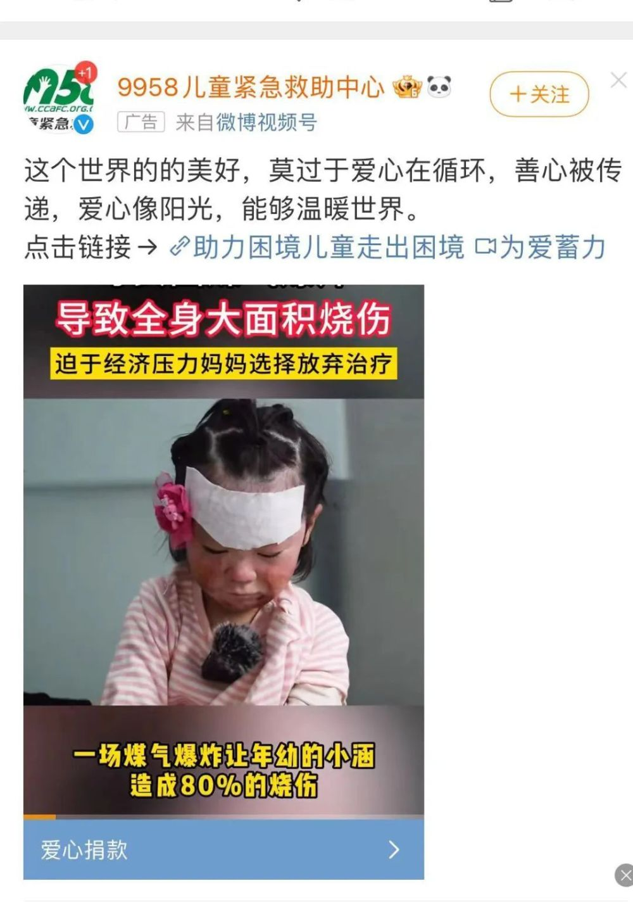
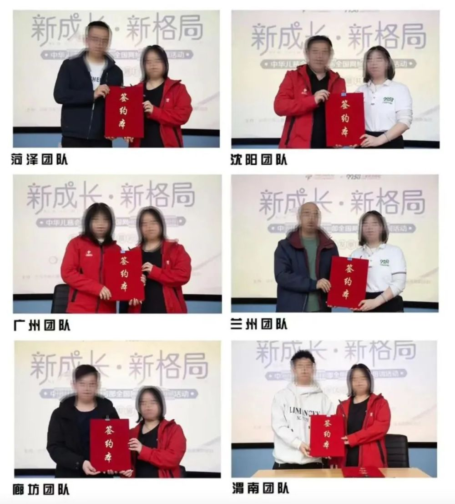

# 中华儿慈会：“互联网筹款第一把交椅”的失控

抓住了患者和医院两端的资源，儿慈会开始了野蛮生长。

_9月25日，北京，中华少年儿童慈善救助基金会。摄影/本刊记者 张旭_

“一份帮助，一份希望，可能只是一顿外卖钱，却能托起大病儿童的新生”

“日行一善，救助这个白血病孩子帮她重获新生”

“捐出99元，让大病儿童能够重获新生”

……

这样的广告文案，配上一张张被病痛折磨的稚嫩面容，出现在朋友圈中，相信很多人看到都会伸出援助之手。

而这一条条被刷屏的筹款广告文案，出自中华少年儿童慈善救助基金会（以下简称“儿慈会”），该机构因超强的筹款能力被业界所熟知，单个项目累计筹款高达16亿元，在中国公益界首屈一指。与此同时，又因善款使用及管理问题而屡受质疑，最近备受关注的“大病患儿千万元救命钱被卷走”事件，所涉及的正是儿慈会旗下明星公益项目9958。

儿慈会到底是一家什么样的公益机构？

**高歌猛进**

儿慈会成立于2010年，彼时，中国人口达到13.2亿，其中18岁以下的未成年人有3.2亿。由于当时经济和社会发展不平衡，一部分少年儿童处于困境之中。

在此背景下，儿慈会成为了继中国青少年发展基金会和中国儿童少年基金会之后，中国诞生的又一家以少年儿童为救助对象的全国性公募基金会，社会各界对其寄予厚望。

成立之初，儿慈会将“民间性、资助型、合作办、全透明”视为机构发展战略，它立足“童缘”项目，资助了近300家儿童慈善组织，并形成儿童慈善领域的合作联盟。

对于一家以儿童大病救助为主要方向的慈善基金会而言，三方面的工作缺一不可：一是对接患儿家庭，二是对接医院，三是筹款能力。

“儿慈会成立之初，正是北京各大医院挂号难的时候，很多患儿找到我们时，已经花掉了家里所有的积蓄，很多钱实际上是浪费掉了。我们拼命地为患儿对接北京的医院和专家，为患儿开通绿色生命通道，和大病患儿家庭群体建立了很好的关系，越来越多的患儿家长找到我们求助。”一位参与儿慈会9958项目创建的工作人员告诉《中国慈善家》。

抓住了患者和医院两端的资源，儿慈会开始了野蛮生长。有媒体统计，善款从0元到1亿元，中华儿慈会用了908天。从1亿元到2亿元，仅仅用了372天。

儿慈会理事长王林将儿慈会的筹款成就归功于互联网：“因为我们真正地去拥抱互联网是在2012年，当时我们的互联网筹款额168万元，占全部筹款额的8%；2013年达到21%，2014年是35%。直到2015年，互联网筹款占比首次突破50%，超过其他筹款渠道，达到62%，这标志着我们的善款来源结构发生了变化。”

《中国慈善家》梳理发现，自有互联网筹款概念以来，儿慈会就不会放弃任何一次机会，其筹款信息遍布各大平台，“多数筹款平台，都能看到儿慈会的身影。”在民政部指定的29家互联网筹款平台中，儿慈会大都有项目入驻。

疯狂打广告也是儿慈会筹款秘籍之一。儿慈会2022年财务审计报告显示，仅“筹资宣传费”一项，2021年和2022年就分别为854万元、695万元。它的广告内容，在微博、微信朋友圈、视频号等流量聚集地随处可见，无一例外是以患病儿童为主人公筹集善款，被指催泪诱捐新手段。

对于“资助型”基金会而言，筹款和执行项目缺一不可，如果不能成功地筹集到款项，项目的执行就是空谈。对于刚刚兴起的互联网筹款而言，具体的个案显然更容易获得流量，从而获得定向的捐助。

_9958儿童紧急救助中心在互联网平台投放的广告。_

“以9958为例，当项目被媒体推送后，我们会对患儿家庭进行后续跟进反馈。”儿慈会的一位负责人曾对媒体坦言，当家庭接受社会关注及帮助后，抓取家庭情感、生活细节，进行案例后续跟踪报道，对捐赠人进行维护的同时也可以保持案例的活跃度。

不过，有媒体发现，存在着短视频公益募捐广告内容与实际募捐的公益项目不匹配的情况。以9958项目账号于9月13日发布的公益短视频为例，该短视频讲述的是先天性阿尔木干心脏病儿童的治疗故事，但在视频中附加的募捐善款链接却是用于关爱乡村儿童心理健康相关的乡村儿童守护计划。该视频目前已被删除。

**“老牌劲旅”**

2015年，腾讯公益联合数百家公益组织、知名企业、明星名人、顶级创意传播机构共同发起99公益日，当年儿慈会上线项目超过300个，支持了40多家NGO伙伴，获得20万人次支持，筹得善款约3344万元，成为首届99公益日的筹款冠军。

作为
“99公益日”的“老牌劲旅”，儿慈会连续5年蝉联第一，2016年99公益日期间，儿慈会共上线197个项目，支持了60多家NGO伙伴，获得132万人次支持，筹得善款约8970万元。

2017年，中华儿慈会携北京、天津、上海等31个省、自治区、直辖市的132家机构、409个公益项目，获得了来自全球各地150万余次捐赠，共计2.1亿余元(包括项目自筹、腾讯配捐、基金会配捐、惊喜时刻、朋友圈配捐)，是2016年筹款额的两倍多。

在当年99公益日开始前，王林表现得胸有成竹：“99公益日筹款高，不单单依靠认领项目的数量，还要依靠项目的质量。2017年99公益日是竞争激烈的一年，各家公益组织各种培训提前布局，但是我坚信我们依然是第一，高手对决比的不是谁功力更深，而是比谁的漏洞更少，所以要仔细仔细再仔细，把自己做好。”

2018年，收获1.17亿元（不含企业配捐）以及361万多人次的捐赠，募捐额和捐款人数均在所有参与99公益日募款的机构中位列首位。

2020年虽然让出榜首（第一为重庆市慈善总会），但其3.29亿的筹资额在去年的基础上暴增了80%。

也是在这一年，腾讯近1亿元的配捐在36分钟内被瓜分殆尽，引发质疑。坊间流传，有一家挺有名的大病儿童救助机构，动员患儿家长通过借钱，或将自家治病的钱在99公益日期间捐给机构，套取腾讯配捐，再通过相对“宽松”的报销方式，把一部分钱返还给家长，这很有可能涉及到财务造假。

尽管并未提及机构的名称，但多位大病患儿家长表示，每年“99公益日”，都会通过亲戚朋友、甚至花呗、借呗借钱投入到儿慈会的项目里，希望能拿到“配捐”，让孩子能多一点希望。

《中国慈善家》也发现，在今年“99公益日”期间，多个儿慈会的筹款项目中，出现多次从数千元到1万元不等的大额捐款。以“困境女童保障计划”项目为例，截至9月26日，共筹得408.36万元。点击查看“网友”捐赠情况，1000元以上的“捐款”随处可见。记者联系到一位捐出5000元的网友，对方承认是“帮朋友忙”，这5000元本金最终会还给自己，却能因此为朋友获得约150元的“配捐”，当问及一些细节，这位网友显得十分谨慎，“我只是献爱心，其他的无可奉告。”随即挂断记者电话。

 _儿慈会2023年99公益日“困境女童保障计划”项目中“爱心网友”的捐款记录。_

更令人不解的是，有些捐赠者将给同一个项目的捐款，分成多次捐赠。比如，一网名为“强”的“爱心人士”，捐款13次，每次金额为50元，
650元“善款”共计获得99.97元“配捐”。

“‘99公益日’倡导积小善、成大爱，在这样的项目里，频繁出现几千甚至上万的捐款极不正常，有明显的套‘配捐’嫌疑，不过，这种现象每年都存在，很难杜绝。”一位公益人士告诉记者。

这种套捐行为也引起业内警惕。为此，腾讯多次修改规则，限制网友单笔捐款金额。

**失控的“救助站”**

在此次引发舆情的事件中，卷走患儿家长上千万元救命钱的柯某孝，被指是儿慈会9958项目廊坊救助站负责人，尽管儿慈会对此予以否认，称柯某孝只是短暂当过志愿者。双方各执一词，但公益组织和地方执行机构的合作模式也因此进入人们的视野。

_2023年2月，中华儿慈会举行项目四部网络团队2023筹款任务签约仪式，其中包括廊坊团队柯某孝。_

现行《基金会管理条例》明确，基金会拟设立分支机构、代表机构的，应当向原登记管理机关提出登记申请，并提交拟设机构的名称、住所和负责人等情况的文件。基金会分支机构、基金会代表机构依据基金会的授权开展活动，不具有法人资格。2016年发布的《基金会管理条例（修订草案征求意见稿）》拟规定，基金会不得设立地域性分支机构。

实践中，很多地方政府取消基金会分支机构行政审批项目，比如早在2016年，北京市民政局就下发通知，决定取消基金会分支机构和代表机构设立、变更、注销登记的行政审批项目。

但这并不妨碍儿慈会在地方上设立“救助站”。9月14日，中华儿慈会平台传播部主任孙丹丹在接受媒体采访时透露，儿慈会下的9958项目在全国约有20个救助站。“因为我们不能下设机构，所以都是以这种合作的模式开展的。”

“各地方团队（救助站）是一种‘加盟’模式，只要有病友资源，就能申请‘加盟’，和销售搞业务是一个道理。”患儿家长刘长（化名）告诉记者，他的孩子2018年得了白血病，在陆道培医院治疗。

刘长微信上有各种配捐群，每次“配捐”会提交病例、诊断证明、发票等材料，儿慈会的工作人员甚至没有一个人打电话过问，更没有人来实地探访。在刘长看来，救助站就是一个独立的商业团体，利用自己的资源和筹款渠道，搞到钱后分给哪些患儿家长，分多少，都是团队自己说了算。“只要不出事，儿慈会对这一模式基本也持默认的态度。”

实际上，在全国大病患儿家庭群体中，大家以老乡、病友为基础建立起关系网络，相互鼓励，互通筹款信息、共享筹款渠道，成为中国底层社会特殊的一个群体。

家长反映，救助站并不是只和儿慈会合作，他们还会和其他基金会合作，有多重身份，普通患儿家长很难搞清楚，管理人员也大部分都是患儿家长“久病成医”。

柯某孝也是一名大病患儿家长，其子然然两岁时确诊白血病，后在武汉儿童医院接受治疗。

_柯某孝的儿子两岁时确诊白血病。_

《中国慈善家》调查发现，柯某孝和爱人为然然在多个平台上发起募捐，其中水滴公益筹款近30万元，两次在轻松公益筹款10万余元，通过不同的执行机构在腾讯公益平台分别筹款4万余元。通过筹款链接中的简介，柯某孝是“90后”，来自湖北黄石市阳新县一个农村家庭，平时非常节俭，“打工挣钱悉数交给家里为然然治病”，期间为了给然然治病，柯某孝被骗刷7万元信用卡。

在这一过程中，柯某孝逐渐接触到其他病友家庭，为了自救，开始参与到一些“配捐”有关的公益项目，逐渐成为儿慈会9958廊坊救助站管理人员。

“为人老实、对病友都很热心。”这是大部分和柯某孝接触过的人对他的印象。“柯某孝事件”的受害者主要集中在北京首都儿童医院、河北廊坊燕达陆道培医院和山东省肿瘤医院，但患儿来自全国各地。前两者是私立医院，多为移植患儿，很多是难治的白血病，后者多为神经母细胞瘤患儿。

“我们的家庭情况他都知道，他肯定也知道这些钱都是大家东借西凑的，但这次钱到底去哪里了谁也不知道，有人说拿去赌博输了，有人说他也被别人坑了，还有人说放高利贷追不回来了。”一患儿家长告诉记者。

在事件发生后，孙丹丹坦言，儿慈会管理确有不足，将对地方合作机构成立、合作机构实际运营管理的地方救助站加强管理和约束。

**“杀猪盘”**

郑鹤红是一位从事救助患病儿童公益事业21年的公益人，2010年，她曾帮助儿慈会创立和运营大病救助项目，即9958的前身。

志愿者发给郑鹤红的信息显示了来自9958泰安团队组织的2023年99公益日非配时段的配捐活动，泰安团队的工作人员，向患儿家长宣传配捐激励政策。一个291人的微信群里，“泰安团队沐沐”发消息称，非配时段（非99公益日期间配捐），5万元以上开始计算，以万为单位，自筹50000激励3500元，暂定激励自筹金额的7%。

渭南团队里，一名叫“葫芦娃”的人表示：“基金会收取配捐部分的20%用作执行费”。郑鹤红告诉记者，“葫芦娃”是9958渭南团队负责人。

多位公益圈人士告诉《中国慈善家》，患儿家庭自筹“善款”，“捐”给相应的平台，然后获得平台的“配捐”，最后一起“定向”返给家长，这种公益行业的“套捐”或“套配捐”的形式常年存在，有些是走“正规”途径，有些是将钱打给“中间人”，由其走“正规”途径，不过获得的“配捐”部分要给“中间人”一定比例的分成。

“上述这两种情况，都不存在风险，不会出现‘资金问题’，更不会出现发生柯某孝事件。”刘长笃定地认为，柯某孝肯定是将患儿治病的钱拿做他用，才会爆雷。

在刘长看来，自己之前参与的多次“配捐”都是可靠的：9958团队负责人在群里发布“配捐”项目信息，家长自愿报名，然后还要上传患儿的诊断证明、家庭住址、身份证等信息。提交成功之后，家长就可以往发布的账号里“捐款”，等“回款”下来后，家长还要准备同等金额的发票。

多位家长证实，自己根据群里管理人员提供的信息，扫码付款的链接显示为“中华儿慈会”，回款账户也是“中华儿慈会”。也有家长曾收到来自柯某孝私人账户的回款，柯解释说，这笔回款从大病救治改为助困项目。

刘长也拉了很多病友进群，不少人通过扫码、转账等方式参与过群里的“配捐”项目，有给私人账号的，也有直接对接“中华儿慈会”的，但基本都能收到“回款”，直到柯某孝失踪。

《中国慈善家》获得的多大量微信聊天记录显示，9958多个地方团队鼓励病友去“套配捐”。在一个222人的“2023年99配捐动员群”里，一位昵称为“北疆记录者”的管理人员经常诱导家长：“经过咱们团队协调北京总部，北京总部协调儿慈会，有助困费一说，每个月一万，一次可申请一个季度，也就是三万。所谓助困费，就是不用你们家的发票，但是你们家投的钱，包括奖励金，如果家长没有发票，可百分百通过助困费打款到个人。”

“整个配捐的过程，不可能由某一人完成，以前收到的回款大多来自儿慈会的对公账户。试问一下，没有儿慈会官方的参与，凭一个在儿慈会廊坊救助站做过短暂志愿者的人能够准确知道儿慈会拨救助款的金额与时间吗？这次是出事了，如果不出事，这种模式没有人会觉得有问题。”刘长说。

根据《慈善法》规定，捐赠人与慈善组织约定捐赠财产的用途和受益人时，不得指定捐赠人的利害关系人作为受益人。也就是说，患者家属向基金会捐款，其家人不能成为受益人。因此，套捐本身属违法行为。

儿慈会慈善组织公开募捐资格证书。

“大多数患儿家长也知道这样的行为是法律不允许的，但为了获得更多的医疗费，不得不配合中间人进行操作，而这种心理很容易被一些心怀鬼胎的人利用，最后演变成‘杀猪盘’。”一位公益人士说。

**闲置的专项基金**

《中国慈善家》梳理“慈善中国”上的信息发现，儿慈会旗下专项基金多达112个，其中59个已“终止”运营，其余均为存续状态，但不少专项基金属于“僵尸基金”。

乡村教师专项基金成立于2017年10月，旨在为乡村教师和学生提供与外界交流学习与培训的机会、支持乡村教师提高文化素质和教学能力以及改善生活的相关工作等，目前是存续状态，但至今无任何支出。以儿童健康、心理援助、困境儿童助学等为宗旨的“点亮平凡世界专项基金”也已成立近3年，也无任何支出。

足脊防护专项基金、美丽天使专项基金等已终止的专项基金，也没有任何支出拨款记录。

而美丽天使专项基金2020年7月7日成立，2022年11月29日终止，目标是给予留守儿童和特殊困境少年儿童教育救助。

另外，还有一些目前正在运营的专项基金进展缓慢，如“关爱青少年脊柱健康专项基金”用于青少年脊柱健康关爱计划，于2019年12月31日成立，除了成立当天支出5万元外，几乎停滞。

实际上，关于专项基金的问题之前就出现过，如早在2015年，儿慈会对救助脑瘫儿的“星光专项基金”运行不到两年即终止、运行成本超善款半数等问题受到媒体关注。更早些时候，还有媒体报道称，儿慈会旗下13个专项基金成立后无捐助支出。

据了解，目前，中国没有专门针对专项基金管理的文件，在实际执行当中虽然有条条框框的规定，但是很可能流于形式。

“有的基金会追求专项基金数量的增长和筹款规模的扩大，在没有理顺自身与专项基金关系的情况下就贸然设立专项基金，偏离了公益宗旨，有的甚至背离了捐赠人和受助人的意愿，这样的专项基金肯定只有死路一条。”一位资深人益人士告诉《中国慈善家》。

**财务风险**

多年来，儿慈会账目不清的问题一直饱受诟病。早在2012年，有网友发现其有一笔48亿元的巨额现金不翼而飞。

原来，中华儿慈会2011年报财务报表《现金流量表》中，当年“收到的其他与业务活动有关的现金”数高达47.6亿元，而支付48.4亿元，这48亿元支付何处没有任何说明。有民众怀疑，如此大的现金流动，儿慈会是否参与“洗钱”？

对此，儿慈会解释，是将4.7亿误写为47亿导致，“这是基金会工作人员和领导审核的严重失误，基金会绝无洗钱行为”。尽管过去了12年，今天看来，这样的解释也很难服众：4.7亿变47亿，儿慈会居然堂而皇之地通过了审计。

而在资金的使用上，儿慈会曾因频繁开展团建而被质疑。知情人士向记者提供的9958微信工作群聊天记录显示，从2016年5月至10月，5个月的时间里，开展了4次团建，最短的一次1天，最长的11天，在此期间暂停转款，日常公益救助项目陷于停滞。对此，有媒体追问时任儿慈会9958项目主管王昱“是否使用捐助款开展团建活动”，她反问，“我们那么大个平台救助那么多小孩，不允许有团建是吧？”

《中国慈善家》翻阅儿慈会近3年的年度工作报告发现，2020年，儿慈会的现金流出小计超过7亿元，2021年这一数据接近8亿元，2022年也高达7亿元。另一组数据显示，儿慈会“支付其他与经营活动有关的现金”每年高达数千万元，其中2021年的这项数额高达2.5亿元。

有知情人士告诉记者，一般情况下，“支付其他与经营活动有关的现金”包含与经营活动有关的其他现金流出，如罚款支出、支付的差旅费、业务招待费现金支出等，除此之外，还包括给“志愿者”的分成。在“支付给员工以及为员工支付的现金”近两年均达2000余万，这部分开支包括支付给管理人员的奖金、支付给销售人员的津贴、支付给生产工人的工资。

儿慈会2022年审计报告显示，本年平均职工人数为79人，年末总人数为74人。本年度工资1379万余元，全年人均工资额约为17.4万元。理事长王林的年报酬额为607880元，秘书长姜莹的年报酬额为516668元。记者从上述审计报告中的“工作人员工资薪酬发放情况”一栏注意到，“工作人员工资福利小计”（管理费用+业务活动成本）为1462万元，这在去年基础上有所下降，2021年的“工作人员工资福利小计”约为1572万元。

财务风险甚至影响到儿慈会入驻国际筹款平台GlobalGiving (中文名称:全球赠与基金会)。

作为全球最大的连接公益机构、企业和个人捐赠人的众筹平台，GlobalGiving自2002年成立以来，因对筹款项目及机构的严格审查流程，每一笔捐赠的可追踪性和有效性，赢得了企业和个人捐赠者的一致认可，也为入驻的公益机构提供了享誉全球的信誉背书。

目前，Global Giving平台上展示的公益项目来自世界170多个国家或地区，中国境内也有多家公益组织入驻该平台进行筹款，儿慈会并不在其中。

“GlobalGiving平台要对所有平台入驻机构要做尽职调查，他们有4家专门做尽职调查的合作伙伴。”一位知情人士告诉《中国慈善家》，儿慈会没有通过该平台的财务审查，原因是“对方认为其财务问题太大、风险太高”。

**争议连连**

2020年年初，贵州“43斤女大学生”吴花燕去世后，有人发现9958救助中心仅将为其募捐到的100万元中的2万元交给了吴花燕的家属，儿慈会受到舆论的谴责。对此，9958在情况说明中称，之所以没有转交全部捐款，是因为吴花燕及家属提出了“余下款项希望预留至手术和康复治疗再使用”的要求，而吴花燕一直未能达到手术条件。

吴花燕去世后，郑鹤红开始实名举报，称时任儿慈会9958项目主管王昱将“43斤女大学生”吴花燕当成敛财工具，不告知患者真实情况，超额募捐并且不及时拨付，以达到囤积捐款的目的。郑鹤红还称，从2018年6月开始，她发现9958项目存在很多违规行为，选择临近不治、危重且家庭条件差的患者是他们的一贯手法。

甚至有网友爆料，儿慈会官网上还曾出现为已去世的人募捐的情况。

此次舆论风波过去后不久，2020年年底，儿慈会又因“国奶扶贫”引发质疑，彼时，地方政府和儿慈会联合推出“关爱新生命-
儿童营养改善”公益项目，资助“卓赋”品牌奶粉，早在2015年5月，生产企业就被原国家食药监总局指出其产品不符合食品安全国家标准。

有家长爆料称：“一罐卓赋奶粉，网上电商平台售价是106.5元一罐。中华少年儿童慈善救助基金会以做慈善的名义，按原价298元一罐算，慈善机构补贴199元，家长出99元，还要说是被资助对象，打着政府扶贫幌子，实则是商业操作行为。”

让人匪夷所思的是，这样一家从事紧急救助的庞大公益组织，在不断的争议声中，一路高歌猛进，连年坐上互联网筹款的第一把交椅。

作者：温如军

图片来源：受访者提供、中华少年儿童慈善救助基金会

图片编辑：张旭

值班编辑：杨永洁

