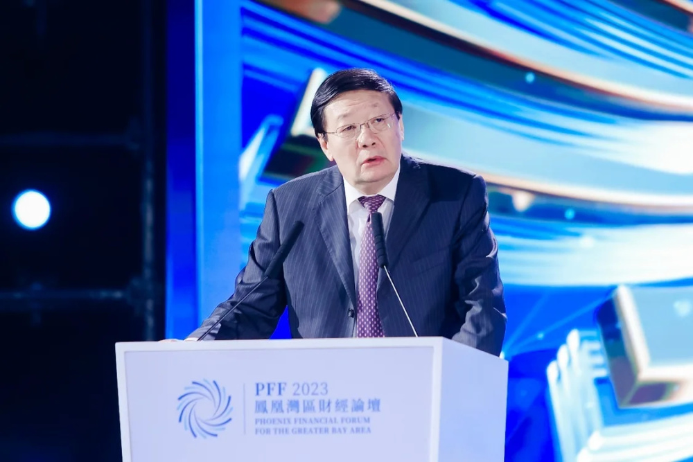

# 中国财政部原部长楼继伟：银行的“高息刚兑”产品为推高房价推波助澜

9月27-28日，“新空间·新动能——凤凰湾区财经论坛2023”于香港、深圳两地同步举行。本次论坛由凤凰卫视、凤凰网联合主办，围绕“新空间、新动能”主题，深入探讨“多重考验下的全球经济：复苏还是衰退”、“全球经济风险与中国应对之策”、“香港经济新动力”、“全球危机与地方政府债务”、“大湾区资本市场建设”等关键议题，为全球经济及湾区发展贡献新智慧。

 _中国财政部原部长楼继伟_

中国财政部原部长楼继伟出席论坛，并在“多重考验下的全球经济：复苏还是衰退”环节发表主旨演讲。楼继伟表示，当前中国房地产价格高企和地方债隐性债务扩大有更为深刻的原因，“2013年以来，银行为了获得高利润，通过各种办法将资产和风险出表，催生出各种类型的‘影子银行’，实为‘银行的影子’，推出的金融产品主要是‘高息刚兑’产品。这些‘高息刚兑’产品起到了推波助澜的作用。”

监管很快意识到了“高息刚兑”产品的风险。2015年底，中央提出经济去杠杆、防范和化解金融风险，金融回归本源，为实体经济服务，要守住不发生金融危机的底线。在此之后，2018年资产管理新规正式实施。

楼继伟表示，“资管新规是多个监管部门共同的监管框架，解决了以往监管不协调，出现监管套利的问题。资管新规要求银行的资产必须撤出理财资产，银行设立的资产管理部门必须子公司化，同商业银行机构隔离、风险隔离。理财资产必须净值化，不得发行‘高息刚兑’产品，还规定了三年的过渡期，防止在化解风险的时候产生系统性风险。”

楼继伟认为，“国家金融监督管理总局的成立让监管框架统一性和监管能力都得到了增强。在完善金融监管框架的同时，还扩大了金融业的改革开放，已经解除了对商业银行利率的管制，注册制全面落地，可以说中国相对稳定的金融监管框架已经建立。”

