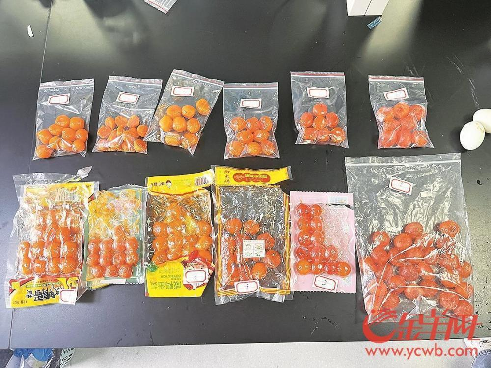
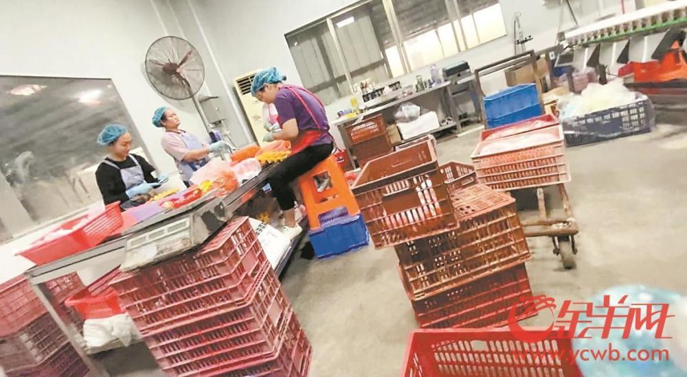

# 咸蛋黄还能人造？机器1个小时可生产10万粒，20粒才9.9元

**配料只有蛋黄和盐，每粒1元，一般为真；包装上标了“咸蛋黄制品”、一二十粒才卖几元的，可能就是人造品**

文/图 羊城晚报全媒体记者 罗清峣 陈亮

中秋将至，莲蓉蛋黄月饼可谓是少不了的应节美食。不过，最近网上有视频博主称，市面上存在“人造咸蛋黄”，里面含有各种添加剂，“机器1个小时可以生产10万粒蛋黄！你还敢吃吗？”

视频里说的是真的吗？一些在售的咸蛋黄会不会是人造的？记者展开走访调查，并采购了6款咸蛋黄产品送检。检测结果显示，标明自己是“咸蛋黄”的5款产品均无添加剂，可判断为真的咸蛋黄；而标识有“咸蛋黄制品”字样的1款产品，淀粉含量近40%——这便是“人造咸蛋黄”。相关发明专利显示，以一定比例的新鲜蛋、蛋黄粉、淀粉及添加剂等混合，即可制成咸蛋黄制品。

那么，如何分辨“真假”咸蛋黄？专家介绍，真咸蛋黄结构不均匀，外部松软内部紧密，质地较硬；而咸蛋黄制品结构均匀、有弹性，咬开后不会有分层和硬心。此外，消费者可通过检查标签内容、水煮搅拌等方法判断是否为真的咸蛋黄。

**【调查】**

**博主怀疑买到人造咸蛋黄，无生产日期，但基本判断是真蛋黄**

近日，有一类视频在网上流传甚广。视频里，黄色、长条的固态产品经机器切割，最终变成了“咸蛋黄”。一些网友不禁担心咸蛋黄质量，纷纷评论：“今年不吃咸蛋黄月饼了。”

社交平台上，还有博主吐槽称，她购买咸蛋黄制作月饼，可咸蛋黄太难吃了，甚至怀疑为人造，打算扔掉。截至目前，该帖子点赞评论量已超过4000。

该博主称其购买咸蛋黄的商家为江门新会“是蛋”蛋品店，“人造咸蛋黄”的怀疑属实吗？记者以烘焙店店主身份前往该蛋品店进行挑选，店主表示自己售卖的咸蛋黄都是真的。而当记者进一步询问生产日期，店主只说“都是最近5天生产的，非常新鲜”，却无法提供确凿证据来证明。咸蛋黄产品标签显示，该产品成分为咸蛋黄和食用盐，保质期12个月，生产单位为江门市彤辉食品有限公司，还标明了工厂地址，但并无生产日期。

广东中检达元检测技术有限公司检测主管秦应昌介绍，根据食品安全法规定，食品经营者销售散装食品，应当在散装食品的容器、外包装上标明食品的名称、生产日期或者生产批号、保质期以及生产经营者名称、地址、联系方式等内容。上述咸蛋黄产品未标明生产日期，不符合法律要求。

华南理工大学食品科学教授郑建仙也表示，无生产日期、无完整标签内容的散装冷冻食品，或存在食品安全隐患，最好别吃。

为一探究竟，记者又以求职者身份进入江门市彤辉食品有限公司厂址调查。在其厂区内，有大量盛满腌制禽蛋的塑料桶，多名员工正将鸭蛋放入料泥中腌制。工作人员介绍，鸭蛋腌制完成后，敲开咸鸭蛋，只留下蛋黄，把蛋壳挑干净再装袋，就是完整的咸蛋黄制作工艺。不过，当天工厂中并没有人在进行这一工作步骤，“要根据咸蛋的腌制情况，分时段进行打蛋，并不是随时都有这个环节的。”基本可以判断，此工厂售卖的是真蛋黄。

**【走访】**

**想看看线上热销的商家线下如何，意外发现经营地址查无此店**

咸蛋黄到底是怎么生产的？是否真的能以添加剂人造咸蛋黄？记者前往全国首个“中国食品工业示范基地”中山黄圃镇实地走访，咸蛋黄是黄圃腊味中的一大预制单品。

“黄圃镇腊妹商贸商行”在多个电商平台销售咸蛋黄产品，其中“真咸鸭蛋”产品月销量300+。记者根据导航软件的指示前往该工厂地址，欲了解情况。不料，当导航显示到达目的地时，却发现该地址在一个居民楼内，完全没有商店或者工厂的迹象。

随后，记者又在导航软件上搜索到另一家蛋黄制品厂——中山市东升镇鸿峰蛋类加工厂。然而，到达目的地后，记者发现厂房已经废弃，大门生锈，门口贴着“厂房招租”的字样。

**【检测】**

**没有添加剂的5款是真蛋黄，有添加剂的人造品淀粉含量近40%**

由于无法亲睹咸蛋黄制作环节，记者分别在电商平台以及广州荔湾区、佛山南海区的菜市场，随机购买了6种不同产地、厂家的“咸蛋黄”，并送到专业的检验机构进行检测。

在某电商平台搜索“咸蛋黄”，销量第一的产品名为“正宗红心咸蛋黄”，销量5万+。点击该产品详情页才显示产品为“咸蛋黄制品”，25粒价格约8元，配料包括蛋黄、淀粉、食用香精、食品添加剂。记者购买了此产品，标为2号样品。

其余5个样品的包装上都声称自己是咸蛋黄，配料均为水、食用盐和咸蛋黄，售价为20粒20-25元不等。

针对6个样品，实验室进行了防腐剂、食品色素、苏丹红以及淀粉等指标的检测。结果显示，2号样品检出每100克中山梨酸钾含量为0.0724克、淀粉含量为39.8克。其余5个样品则均未检测出添加剂，每100克样品中淀粉含量为0.08克-0.46克。

实验室用生鲜咸鸭蛋取蛋黄检测对照，发现生鲜咸蛋黄中每100克样品中淀粉含量为0.2克。秦应昌介绍，除了2号外的其他5个样品没有检测出添加剂，“经过对比实验判断应该是真的蛋黄。”而2号样品不是真正的蛋黄，是改变了物理性状的蛋制品。

华南农业大学食品学院副教授黄卫娟介绍，2号样品中添加的山梨酸钾是防腐剂，作用主要是防止咸蛋黄腐败变质，延长货架期。根据相关规定，月饼和焙烤食品馅料中山梨酸及其钾盐的最大使用量均为1.0g/kg（以山梨酸计），2号样品中检测出0.724g/kg山梨酸钾，在标准之内。

**【分辨】**

**真咸蛋黄颜色偏黄外松里紧，人造咸蛋黄色泽红润结构均匀**

那么，消费者要如何识别真咸蛋黄和合成蛋黄呢？秦应昌介绍，首先是通过标签标示内容进行识别，一般真的咸蛋黄，配料表中配料只会标蛋黄、食用盐。其次，人造咸蛋黄的标签，一般会在产品名称附近标示真实属性“咸蛋黄制品”等字样。再次，通过水煮搅拌也可以区分，真蛋黄水煮搅拌后水较澄清，蛋黄呈浅黄色块状，且表面会有一层油脂漂浮；而咸蛋黄制品因加有大量淀粉，水煮搅拌后会呈均匀的黏稠状。

黄卫娟介绍，真咸鸭蛋颜色偏黄，结构不均匀，外松里紧，个别中间会有小硬心，口感柔软细腻；而咸蛋黄制品色泽红润，结构均匀，咬开后不会有分层，不会有硬心，口感较硬，有弹性。

此外，真咸蛋黄价格一般为每粒1元，而合成咸蛋黄价格较低，甚至20粒才9.9元。黄卫娟也提醒消费者，在选购食品时，要看准带有QS标志的，这是企业获得食品生产许可的标识。

