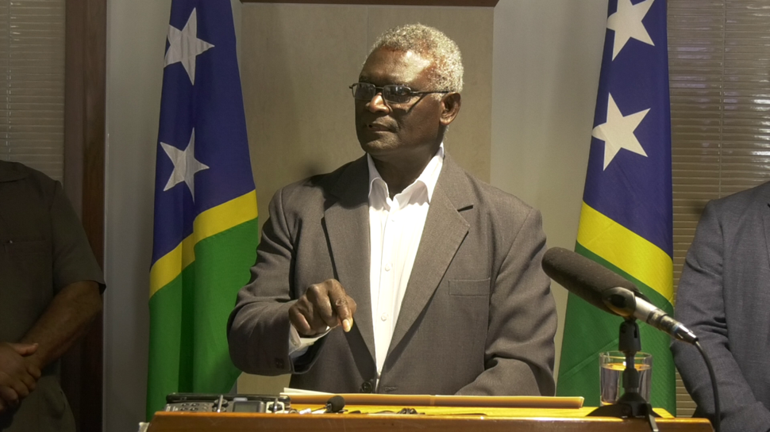

# 所罗门群岛总理回应缺席美国—太平洋岛国峰会：我不会坐在那里听别人说教

【环球网报道】据澳大利亚广播公司（ABC）报道，所罗门群岛总理索加瓦雷27日在首都霍尼亚拉召开的记者会上抨击美国，称美方需要“更加尊重太平洋地区的领导人”。

报道提到，美国—太平洋岛国峰会于25日至26日在美国举行，索加瓦雷派所罗门群岛外长马内莱代替自己参会，美方对索加瓦雷缺席感到“失望”。报道称，索加瓦雷27日在记者会上对此回应说，他缺席峰会是因“国内问题”，不得不“提前回来”。当被问及“国内问题”具体指什么时，他说，返回霍尼亚拉为下周的国民议会会议做准备比此次峰会更重要。

_所罗门群岛广播公司27日称，这是索加瓦雷在霍尼亚拉召开记者会的画面_

报道还称，索加瓦雷批评美国“对别人说教”的同时称“自己有多么好”。“我去年参加过一次（峰会），会议没有任何结果，”他说，“我不会再坐在那里听别人对我说教，绝对不行。”

报道称，索加瓦雷还说，“他们向我们承诺提供 8000 亿美元或类似帮助，当时这让我印象深刻。但直到今天，什么也没发生”。

报道还提到，索加瓦雷上周在联合国发表演讲时称赞中国在所罗门群岛发挥的作用及“一带一路”倡议。报道称，除签署安全合作框架协议外，中国还向索加瓦雷投入大量资金，并在所罗门群岛援建用于举办太平洋运动会的体育场和基础设施。

报道称，索加瓦雷还在记者会上概述了中国如何通过“更少限制以及更负责任地与可持续发展目标保持一致”的措施让所罗门群岛发生“变革性变化”。“这些举措对我们有帮助，”他说，“我（在联合国）这么说并不是为了冒犯我们任何一个开发合作伙伴，而是想说明我们与中国伙伴关系框架内的项目落实速度多么快。如果我冒犯了我们任何一个开发合作伙伴，那不是我的本意。我认为我的评论会被视为‘积极反馈’，有助于他们改善工作并更有效地开展合作”。

当地时间25日至26日，第二届美国—太平洋岛国峰会在美国举行，美方寻求加强在南太地区的影响力。值得注意的是，美国总统拜登去年9月在首届美国—太平洋岛国峰会上，就已经使出“金援”一招，承诺经济上协助太平洋岛国，今年则强调要向太平洋岛国援助基础设施建设。俄罗斯《莫斯科共青团员报》认为，这次峰会已经被称为拜登的失败，所罗门群岛总理索加瓦雷和瓦努阿图总理基尔曼决定不出席峰会，这给了华盛顿一记“耳光”。有分析认为，美国对太平洋地区的突然热络，更多是利用其作为地缘对抗的棋子，此次举办峰会便是其中一环。美国和平研究所称，太平洋岛国领导人希望华盛顿作出始终如一的承诺，而不是出于地缘政治竞争的角度争取地区支持。对这些国家来说，气候变化对太平洋岛民的生计、安全和保障乃至低洼环礁国家的生存构成威胁，才是其首要的安全问题。有中国专家表示，美国对太平洋岛国的实际重视程度依旧有限，“口惠而实不至”的态度是美方经常上演的戏码，与美国相比，中国同这些岛国交往时的最大不同是给予充分尊重，展开互惠互利的合作。

