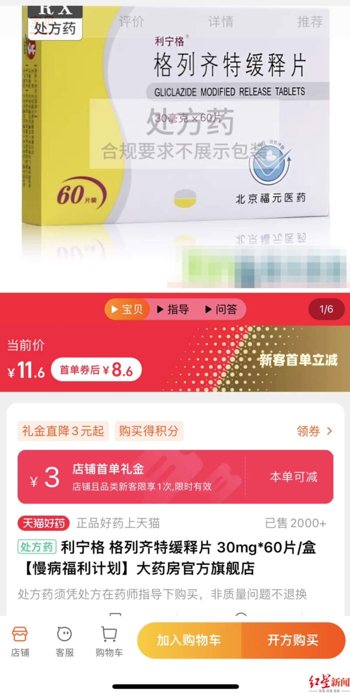
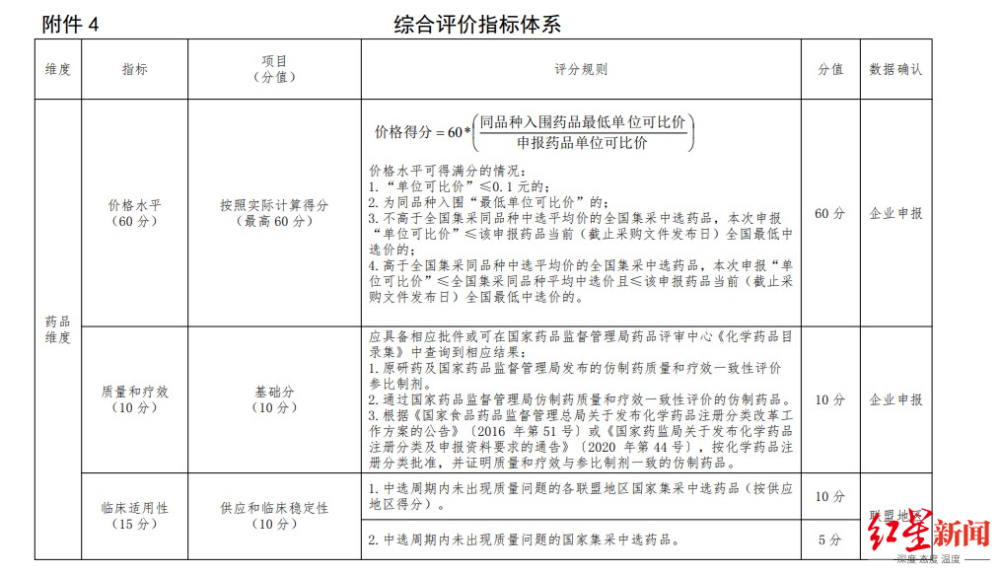
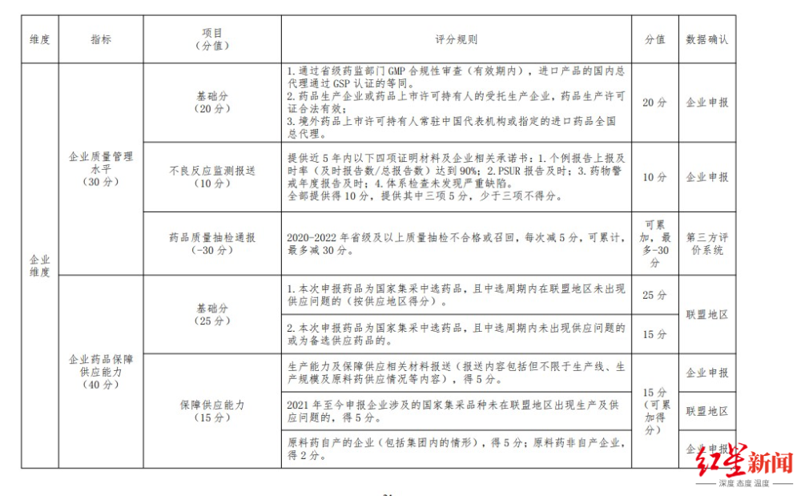

# 抗糖尿病药网店卖10元，集采价36元？集采药价被质疑偏高，多方回应

9月15日，职业打假人王海爆料称，国家药品集采接续上海联盟办公室8月发布的《十五省（区、市）联盟地区药品集中采购（SHLM-
YD2023-1）拟中选药品公示》（以下简称《公示》）中，拟中选企业北京福元医药的格列齐特缓释片30mg*60片的集采价格为36元，他发现同厂同规格的药品在网上零售价才10元，而且此次拟中选49个产品共125个品规，有48个产品拟中选厂家均为原国采中选厂家。此事引发网友对集采药价的关注。

对于同厂同规格药品网上售价与集采价格差异较大的问题，9月26日，上海市医药集中招标采购事务管理所工作人员回复称，网上低价的药店不是药企授权的，“企业表示他们从来都没有授权到网络销售过他们的产品，他们现在也发现网上药店比他们卖的价格低，也打算起诉这些网络药店，可能会以法律渠道进行解决。”此外，该工作人员建议市民选择正规的渠道购药。

那么药价是集采的唯一标准吗？原国采中选厂家的优势在哪里呢？就这些问题，红星新闻记者采访了多位医疗医保专家。

**网上查询：**

**该药品最低售价10元左右，3日后上涨**

职业打假人王海称，在8月份发布的《公示》中，拟中选企业北京福元医药的格列齐特缓释片30mg*60片的集采价格为36元，而同厂同规格的药品在网上零售价才10元。

据《十五省（区、市）联盟地区药品集中采购文件》显示，北京、天津、上海、浙江、安徽、福建、江西、山东、湖北、湖南、重庆、四川、云南、西藏、甘肃组成地区联盟，成立国家集采药品接续上海联盟采购办公室，开展十五省（区、市）联盟地区药品集中带量采购。具体经办工作由上海市医药集中招标采购事务管理所负责实施。

_▲拟中选结果表截图_

《公示》中，以格列齐特缓释片为例，拟中选企业北京福元生产的30mg*60片是36.16元/盒，而未中选的江西制药有限责任公司同规格的申报价格是7.35元/盒，另一个拟中标的宜昌人福30mg*30片为20.64元/盒，相当于41.28元60片，也就是说，拟中标药企的价格比落选药企贵了五倍左右。

红星新闻记者了解到，格列齐特缓释片，是一种磺酰脲类口服抗糖尿病药。在降糖药品中，格列齐特缓释片为大品种。据媒体报道，该药原研厂家为法国的Les
Laboratoires
Servier，商品名为Diamicron，最早上市时间为2000年3月。目前，国内已有多家企业的格列齐特缓释片通过仿制药一致性评价，米内网数据显示，2022年国内医疗市场格列齐特缓释片销售总额（终端价）为3.53亿元，其中排名前5名的企业及其市场份额分别为施维雅（29.77%）、宜昌人福药业（25.96%）、北京福元药业（25.10%）、天津君安生物制药（18.20%）、江西制药（0.27%）。

9月15日，红星新闻记者在各大平台检索由北京福元医药生产的格列齐特缓释片，发现30mg*60片一盒的价格区间在10元至40元不等。记者在一家自称经营24年的连锁药房里发现首单优惠价格仅要8.6元，已售2000多件，评价上百条。

_▲9月15日，某网店格列齐特缓释片一盒首单优惠价8.6元_

红星新闻记者向客服询问为何价格低于同行价，对方表示，“由于受进货渠道、供货商等不同因素影响，每家药店同种药品在定价会略有差别，随着我们的供货商、渠道的不断完善，我们的价格也会有调整。”

随后，红星新闻记者采访北京福元医药股份有限公司多个部门，均未获得有效回复，该公司一营销工作人员也表示并不清楚此事。

9月18日，红星新闻记者再次在淘宝上检索由北京福元医药生产的格列齐特缓释片，发现此前浏览过的多个药品价格已上涨到30元以上。记者日前网上咨询过的某连锁药房已下架该药品，客服称“下架代表当前已经售罄”，而另一家药房的价格则从21.4元涨到35.1元，客服解释称。“活动期间价格涨幅是正常情况。”

_▲9月18日，某网店的该药已下架_

**专家说法：**

**①**

**网络售价低或是“市场营销”思路**

**药价并非采集唯一标准**

为什么相同厂家、规格的药物在网上的交易价格便宜，集采价格却更贵呢？红星新闻记者就此事采访上海药事所办公室相关工作人员，其表示对外发声释疑必须经由上级医保部门的批准。随后，记者以市民身份通过上海一网通办平台向上海医疗保障局就“格列齐特缓释片”相关疑问进行询问。9月19日，显示转为上海市医药集中招标采购事务管理所办理。9月26日，上海市医药集中招标采购事务管理所工作人员回复称，网上低价的药店不是药企授权的，“企业表示他们从来都没有授权到网络销售过他们的产品，他们现在也发现网上药店比他们卖的价格低，也打算起诉这些网络药店，可能会以法律渠道进行解决。”此外，该工作人员建议市民选择正规的渠道购药，网店购药的用药安全不太能够得到保证。

biotech创新药医学顾问曹博在接受红星新闻采访时表示，药品的零售价格通常是根据市场竞争和供求关系形成，而药品集采是由政府或相关机构进行集中采购，采购规模大，市场竞争较少。其次，药品集采价格还包括了其他相关费用，例如配送费、管理费等，这些额外费用也会增加药品的价格。最后，政府或相关机构在药品集采过程中可能还会考虑其他因素，如药品质量、供货可靠性等，这也可能导致价格上升。

对于网络售价偏低，一位资深医改专家认为，这或许是“市场营销”的思路。“挂网的大药房，可能会按照药品进价销售，甚至是赔本销售。他们可能通过签订协议来赚取流量，例如今年要销售一个亿的量，通过降价来获得更多的市场占有量。”

上述拟中标药企的价格比落选药企贵了五倍多，那药物价格是集采的唯一标准吗？曹博表示，这显然不是，在药品和企业的评判过程中，采购单位通常会考虑多个维度。除了价格外，评判标准可能还包括药品的质量、疗效、生产工艺、生产能力、供应能力以及企业的信誉度等。价格是其中一个维度，但并不是唯一的评判标准。评判的目的是选择质量好、价格合理、供货可靠的药品和企业，以保证医疗机构和患者的用药安全和效果。因此，并不意味着贵的药品或企业就一定是好的，评判时需要综合考虑多个因素。

前述医改专家也认为，药品价格并非采购单位评判的唯一标准，还需要从药品的药效、生产成本、企业运输成本等多个维度对供货能力、资质等方面进行比较。

**②**

**原国采中选厂家优势在哪？**

**保质保供成集采新趋势**

此外，王海向红星新闻表示，本轮采购品种目录共49个，参加综合评审企业296家，3900个品规参与了十五省综合评审得分，拟中选49个产品共125个品规，有48个产品拟中选厂家均为原国采中选厂家。

红星新闻记者注意到，据《十五省（区、市）联盟地区药品集中采购文件》可知，入围药品按照“综合评价指标体系”计算各联盟地区的综合得分，综合得分最高的药品获得该地区拟中选资格，而该指标体系由药品维度和企业维度两个板块构成。其中药品维度的指标是由价格水平（60分）、质量和疗效（10分）、临床适用性（15分）、生产与市场占有情况（15分）组成，而企业维度的指标是由企业质量管理水平（30分）、企业药品保障供应能力（40分）、企业创新能力（10分）、企业信用评价（-40~20分）组成。

_▲综合评价指标体系_

王海认为该综合评价指标体系赋分指标对原国采中选企业多次重复加分，显失公平。

原国采中选企业的优势在哪里？从评价体系里，前述资深医改专家表示，可以看出招标方对药企选择的趋势，即国家越来越担忧质量和供应问题。“根据企业各个方面的能力进行评价，对于实力较强的大企业，信誉良好的企业，他们给予的得分会较高。这是国家集采的趋势，要求实力较强的企业尽量占据更多优势地位。”

该资深医改专家坦言，这背后的原因在于若中标之后供应不上，或出了质量问题，对集采将是致命打击，“通过前几年国家集采各方面的经验总结，现在的集采发展趋势不是像过去灵魂砍价特别注重价格，而是在保质保供。”

一位医保行业资深人士向红星新闻表示，这实际上是为了保护最早一批有能力制造仿制药的大企业，让这些企业有一定的利润去继续研发新的产品。“通过一致性评价后，如果许多研发较晚的小企业都以较低价格中标，一味压低价格，那么整个行业利润率将进一步下降，导致恶性竞争。”

红星新闻记者 罗丹妮 朱必胜 实习生 邓雨

编辑 张莉 责编 冯玲玲

