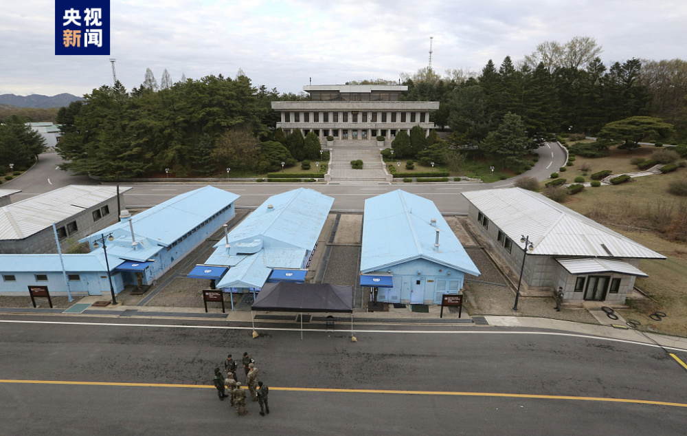

# 朝鲜决定驱逐非法入境朝鲜的美国士兵

来源：央视新闻客户端

朝中社27日报道，针对7月18日在板门店共同警备区发生的驻韩美军所属二等兵特拉维斯·金非法侵入朝鲜境内的事件已经调查结束。

_△板门店共同警备区_

报道称，经朝鲜有关部门调查，特拉维斯·金坦白，他对美军内部非人的虐待和种族歧视抱有反感，对不平等的美国社会感到极大失望。

报道称，朝鲜有关部门根据朝鲜法律，决定驱逐非法进入朝鲜的美国士兵特拉维斯·金。（总台记者 董海涛）

