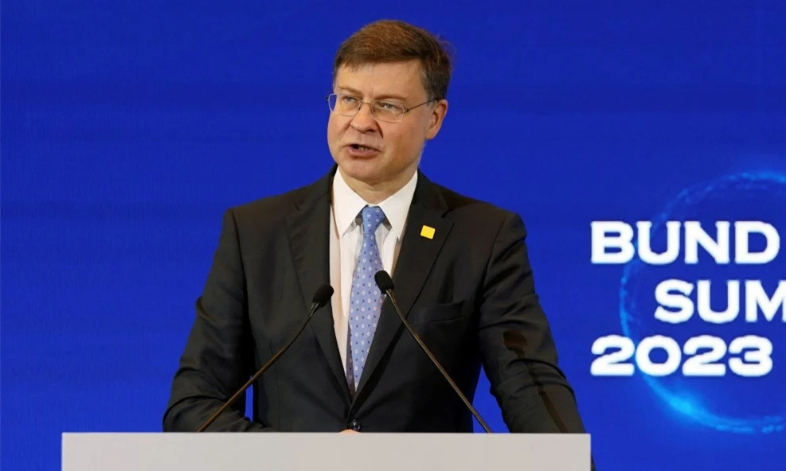

# 欧盟贸易专员辩称：有足够初步证据证明对中国电动车展开调查是合理的

（观察者网讯）在中国商务部长当面表达强烈不满后，刚刚结束访华行程的欧盟委员会执行副主席、欧盟贸易专员东布罗夫斯基斯（Valdis
Dombrovskis）26日在接受英媒《金融时报》采访时辩解称，有“足够初步证据”证明欧盟对从中国进口的电动汽车展开调查是“合理”的。但其并未提及这个所谓的“证据”究竟是什么。

东布罗夫斯基斯还表示，除了中国车企，包括美国企业特斯拉和从中国向欧盟出口电动汽车的欧洲汽车制造商也可能将受到相应审查。

当地时间24日，欧盟贸易专员东布罗夫斯基斯在华发表讲话 图自《南华早报》

《金融时报》报道称，在总结此次访华之行时，尽管对于欧盟无理展开反补贴调查，中方已经明确多次表达不满，但欧盟贸易专员东布罗夫斯基斯仍为此举苍白辩解称，欧盟对电动汽车行业的竞争“持开放态度”，但“竞争需要公平”。

他还宣称，与其他已经对中国电动汽车征收关税的大型经济体相比，“欧盟现在可能是对中国生产商开放的最大市场”。

被问及美国品牌特斯拉或中国车企吉利控股的瑞典品牌沃尔沃是否可能也受到调查时，东布罗夫斯基斯声称，“严格来说，调查不仅限于中国品牌的电动汽车，如果其他（国家）生产商的汽车也获得了生产方面的补贴，也可能（被调查）。”

报道称，目前在欧洲销售的特斯拉电动汽车中，约有五分之一是在中国生产的。另据彭博社报道，德国专业汽车机构施密特汽车研究公司的数据显示，今年前七个月，特斯拉在西欧共售出约9.37万辆在中国制造的电动汽车，约占其总交付量的47%。中国向欧洲出口电动汽车的第二大厂商是上汽集团旗下的名爵，注册数量约为5.75万辆。

《金融时报》援引美国智库国际战略研究中心（CSIS）本月发布的一份简报称，今年上半年，中国制造的汽车占德国电动汽车销量的11.2%。其中约91%的汽车来自中国拥有的欧洲品牌，如上汽集团旗下的英国名爵、沃尔沃的极星；还有一些来自欧洲和中国公司的合资企业，如达契亚Spring、吉利和奔驰的Smart，以及华晨宝马的iX3等。

此外，东布罗夫斯基斯在采访中还抱怨称，中国近期推出的数据安全相关法律规定成为了在华外企面临的所谓“系统性问题”。他声称，一些欧洲企业认为这些要求在本地存储数据的法律“含糊又繁琐”，难以遵守。

“如果公司……需要获得重要数据的数据传输许可，但没有人定义什么是重要数据，这就很困难”“提供更清晰的（定义）会是一个很好的起点”，他说。

自访华第一天起，东布罗夫斯基斯嘴上说着欧盟不想与中国“脱欧”，但实则一直为欧盟的贸易保护主义政策辩护，其老调重弹宣称欧盟寻求对华“去风险”，更煞有其事道中国给在华欧企提供的是不公平的竞争环境，因此欧盟必须采取措施“保护自己”。

9月25日，我外交部发言人汪文斌在例行记者会上对此回应表示，“关于欧盟对中国电动汽车启动反补贴调查，中国商务部已经作出了回应。我愿强调，中方一贯反对各种形式的贸易保护主义，欧盟方面采取的有关措施不利于全球汽车产业链、供应链稳定，不符合任何一方的利益。”

另据商务部官网消息，9月25日，中欧双方举行了第十次中欧经贸高层对话。双方就欧盟近期推出的国际采购工具、外国补贴审查、碳边境调节机制等贸易政策深入坦诚交换了看法，中方希望欧方审慎使用贸易救济措施，鼓励以电动汽车为代表的新能源行业深化合作，为中欧正常贸易往来和绿色可持续发展创造良好环境。

9月24日，商务部部长王文涛在京与东布罗夫斯基斯举行会谈， **重点就欧盟将对中国电动汽车发起反补贴调查表达严正关切和强烈不满。**
王文涛表示，中国电动汽车快速发展，依靠的是研发创新、自由竞争和完备的产业体系。欧方拟进行的反补贴调查是贸易保护主义行为，将影响中欧绿色合作和全球汽车产业链供应链稳定。希望欧方与中方开展对话磋商，严格遵守世贸组织相关规则，以非政治化、非歧视性方式妥善解决贸易摩擦。

此前，商务部新闻发言人（14日）曾回应称，中方对冯德莱恩宣布将对中国电动汽车启动反补贴调查一事表示高度关切和强烈不满。中方认为，欧盟拟采取的调查措施是以“公平竞争”为名行保护自身产业之实，是赤裸裸的保护主义行为，将严重扰乱和扭曲包括欧盟在内的全球汽车产业链供应链，并将对中欧经贸关系产生负面影响。

与此同时，对于欧盟准备向中国电动汽车挥动“贸易大棒”，来自欧洲的反对之声只增不减。德国《明镜》周刊当地时间25日报道，德国数字化和交通部部长维辛接受采访时明确反对欧盟可能对中国电动汽车征收惩罚性关税，并警告德国经济将因此受到损害。

位于北京的奔驰汽车厂 图自《华尔街日报》

维辛警告称，封锁政策会导致连锁反应，进一步影响中国和德国在其他领域的经济合作。“我们需要关心的是，我们为德国和全球市场生产具有竞争力的电动汽车。今天汽车将被封锁，明天化学产品将被封锁，每一步都会让世界变得更加贫穷。”

《明镜》周刊提到，德国汽车制造商此前也对欧盟可能采取的保护性措施表示怀疑，德国汽车工业协会（VDA）对冯德莱恩的主张也反应冷淡。全球最大汽车零部件供应商之一的博世集团董事会主席史蒂凡·哈通直言：“惩罚性关税比赛只会产生失败者。”

**本文系观察者网独家稿件，未经授权，不得转载。**

