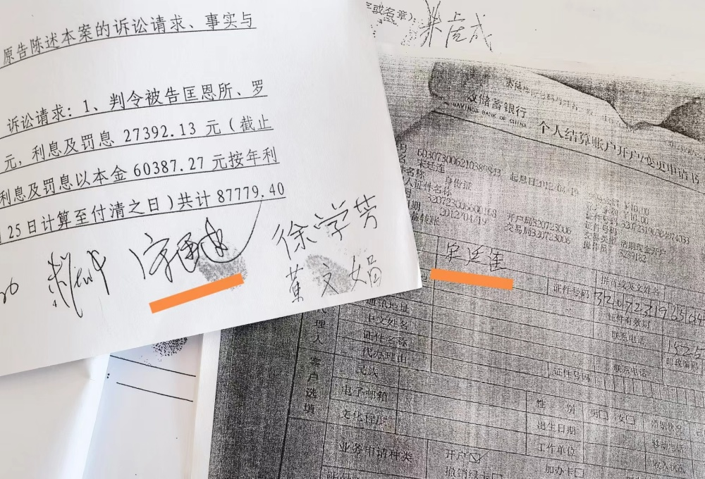
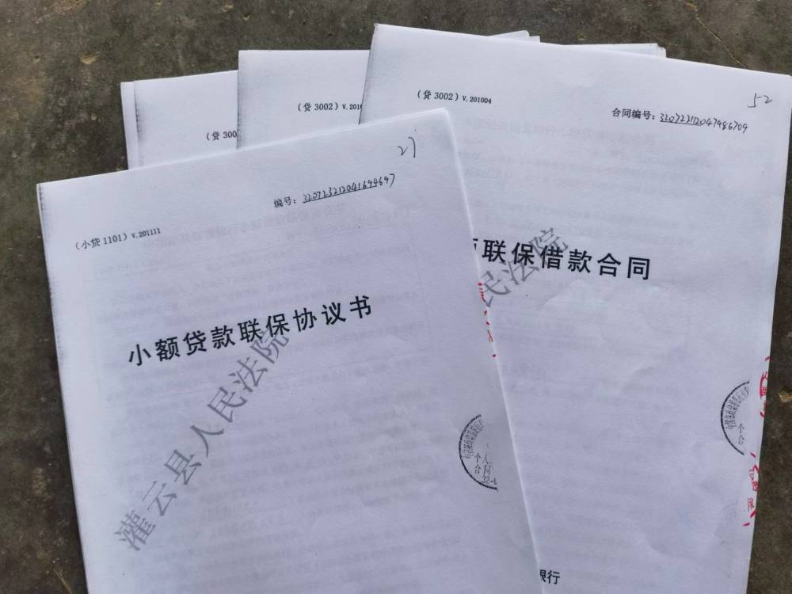
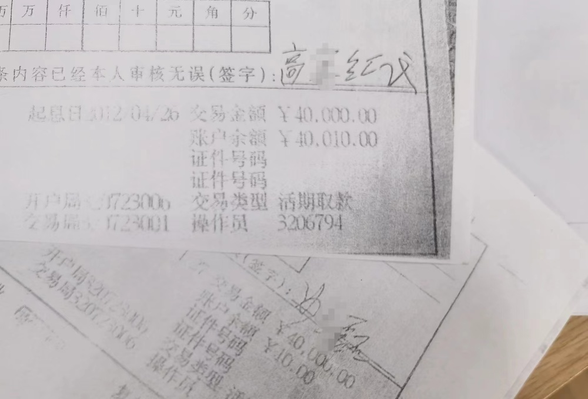

# 江苏40余名农户称贷款“未通过审批”，被银行起诉后才发现钱被人冒领

“银行贷款被他人冒领，自己却要承担还款责任。”近日，江苏省灌云县40余名农户向新京报记者反映称，2012年他们被人找上门填写贷款申请，之后被告知“贷款没批下来”，可几年后收到法院传票方得知，银行发放的贷款被人冒名开设银行账户取走了。

9月26日，中国邮政储蓄银行灌云县支行（以下简称：邮政银行灌云县支行）相关负责人回应称，贷款申请人收取贷款的账户，是否为贷款人自行开设，需要调取档案材料查证。此前银行已起诉了未偿还贷款的农户，申请人可通过法律途径解决问题。

_左侧为宋先生在法院庭审记录中的签字，右侧为他人冒用宋先生身份在邮政银行灌云县支行开户时签字（受访者供图）_

**农户贷款“未通过审批”，被起诉后发现钱被人冒领**

9月26日，江苏省灌云县白蚬乡的戴先生反映称，2017年，他的银行卡突然被法院分两次划走30万元，事后了解才得知，邮政银行灌云县支行，曾于2012年向其发放了8万元的贷款，而该笔贷款被他人冒领了。

戴先生与银行签署的联保协议书显示：2012年4月26日，戴先生和另外3位农户做为乙方，与邮政银行灌云县支行签订了“小额贷款联保协议书”和“借款合同”，4人分别向银行贷款8万元，期限一年。4人相互承担连带责任。

戴先生称，当时自己有贷款需求，办理贷款时，是由邻居高某红带着银行的工作人员上门，当时他在相关协议上签了名字，但事后邻居告知他贷款没有办下来。直到事发后，他到银行调取了相关材料才得知，贷款发到了别人以他名字开设的账户内，8万元被邻居高某红和另外一名不认识的男子，分2次取走。

“我们从未到邮政银行开设户头，也不知道发放了贷款。”4户联保贷款申请人中的宋先生和匡先生称，他们甚至不知道，当时签的是贷款协议，带着银行工作人员上门的高某红，告诉他们是开设银行账户用的，为的是以后贷款方便，“我们便在空白合同上签上了名字。”

宋先生向新京报记者提供的他从银行调取的开户申请书和取款单显示，发放在他户头上的8万元贷款，于放款当天和次日，分2次被高某红取走，取款单上签字为“高某红代”。而用于接收该笔贷款的存折，开户申请上的签名，宋先生称并非他本人所签，此前也没开设此账户。

2015年3月，戴先生、宋先生、匡先生和另一位贷款申请人徐女士被邮政银行灌云县支行起诉至法院。判决书显示：宋先生和徐女士当庭表示，当时由邻居高某红带领邮政银行灌云县支行工作人员上门，以今后贷款方便为由骗取签名，事后才知道是以他们的名义贷款。

两人认为，因为他们没有收到贷款，不承担清偿责任。但这一诉求，因没有证据证实，未得到法院的支持。

戴先生称，他因未收到传票，未能到庭。因联保协议约定，4人相互承担连带、保证责任，导致他名下30万元被法院执行。

“我们4名贷款申请人，3人相互都不认识。怎么可能会相互为对方担保？”戴先生称，他事后从银行调取了开户申请书和取款单，想要证明不是自己在银行开设的收款账户，账户内的钱，也不是自己领取的，但拿到证据后申请再审，被法院驳回。

9月26日，4位贷款申请人均表示，他们在得知“被贷款”后曾询问高某红，对方承认，钱被她和该笔贷款的担保人朱某所使用，他们会偿还，但之后再联系高某红，电话均无人接听。

_邮政银行灌云县支行的贷款联保协议和借款合同，贷款申请人称，合同中填写的银行账户，非他们本人开设（受访者供图）_

**40余户称贷款被冒领，担保人：钱是他一人使用**

与戴先生有着类似遭遇的，还有灌云县白蚬乡的40余户村民。他们称，当时都是通过中间人介绍，填写了贷款申请，但并未到银行开户，也不知道贷款已下放，直到被起诉才得知有人使用了他们的名字开户，并冒领了贷款。

白蚬乡吴女士称，一审开庭时，她未接到通知，事后通过法院调取案卷得知，她和丈夫与另外2户不相识的同乡，共同签订了3户联保贷款协议，相互担保每户贷款的8万元，银行早已发放。

相关判决书显示，截至2014年10月，吴女士等3户贷款申请人被邮政银行灌云县支行起诉时，每户所贷的8万元，逾期一年，无一人偿还本金。开庭时，贷款人均未到庭。担保人朱某在庭审中表示，3人的贷款均由他一人使用，愿意个人偿还。但这一

诉求因无证据且原告不认可，未被法院采纳。

曾被邮政银行灌云县支行起诉的王先生称，他收到法院传票后，曾联系介绍人询问当初联保贷款的事儿，中间人询问后，他才得知贷款的钱被担保人朱某使用。当时中间人称，朱某会出庭承担还款责任，他们不用管了。

“谁想到，实际使用人朱某并未偿还贷款，也没有出庭，导致他们成了失信执行人。”王先生称，因为联保贷款是以夫妻双方为一户，他们夫妻双方至今还是失信执行人，既无法开设公司、不能申请其他贷款，也无法乘坐高铁带病重的父亲到上海就医。

新京报记者梳理裁判文书网相关判决发现，朱某曾在16组农户联保贷款申请中做担保人，被起诉后，其4次出庭均承认，银行下放的贷款是他一人使用，愿意个人偿还，但目前没有偿还能力。

对于庭审中，部分贷款申请人所提出的，未到银行开户，对发放的贷款不知情一事，邮政银行灌云县支行、朱某等人均未作出解释。

_戴先生从邮政银行灌云县支行调取的取款单显示，8万元一天内被两人分两次取走。（受访者供图）_

**灌云县发生多次同类骗贷事件，银行负责人：通过法律途径解决**

9月26日，新京报记者分别联系了贷款的实际使用人朱某、高某红，两人均未接听电话。

多位投诉人称，他们至今不清楚，他们名下接收贷款的账户是怎么办理的。发放了贷款，为何无一人告知贷款申请人？

9月26日，邮政银行灌云县支行相关负责人向新京报记者回应，贷款申请人收取贷款的账户，是否为贷款人自行开设需要调取档案材料查证。此前银行已起诉了未偿还贷款的农户，申请人可通过法律途径解决问题。

另有邮政银行灌云县支行工作人员向新京报记者透露称，2012年时，在邮政银行开设户头，并不需要本人到场，可由他人代为开设。可能是有人利用了这个规则，骗取农户在贷款协议中签字，并代农户办理接收贷款的户头，盗用了贷款。

新京报记者获取的一份“江苏省东海县6位农户与邮政银行灌云县支行”的二审判决书显示：徐某全曾借用42户农户的户头，以联保贷款的形式，从邮政银行灌云县支行贷款300余万元。操作时，徐某全使用农户身份证开设户头，贷款发放时，邮政银行灌云县支行的信贷员，会打电话询问农户的存折是否在徐某全手上，确认后才放款。

该判决书中，上诉的6人均表示，他们从未委托任何人，在银行开设户头，徐某全冒用了他们的身份开设账户，接收银行放款。

2019年11月，连云港中院将上述判决作为金融类典型案例发布。中院认为，联保贷款农户在签订的贷款合同时，收款账户等重要信息并未填写，邮政银行灌云县支行后期对合同进行了完善，而且该行允许他人代开设账户，又将贷款实际发放到了代开的账户内，当贷款申请人否认收到贷款资金时，邮政银行灌云县支行负有举证收款账户为贷款申请人实际掌控的证明义务。因邮政银行灌云县支行不能举证，二审法院认定该行未实际履行向贷款人发放贷款的合同义务，贷款申请人不承担还款责任。

新京报记者 程亚龙

编辑 杨海 校对 陈荻雁

