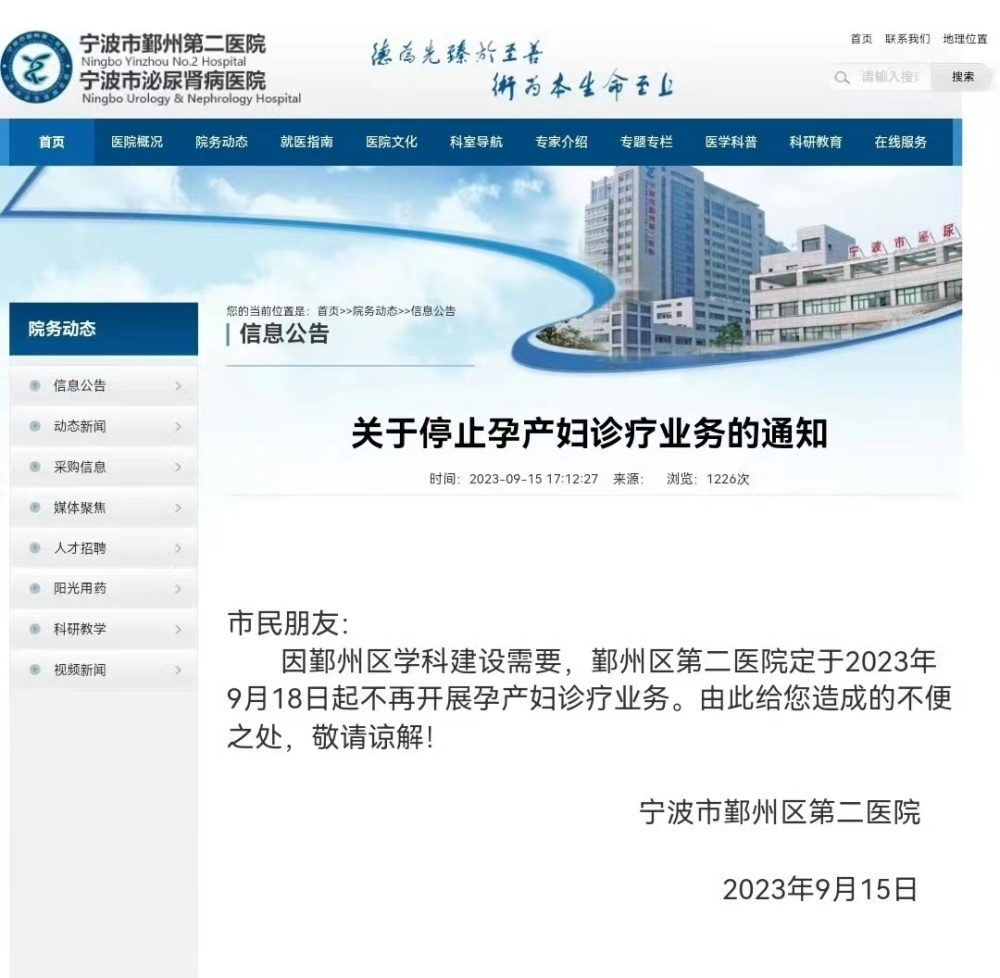
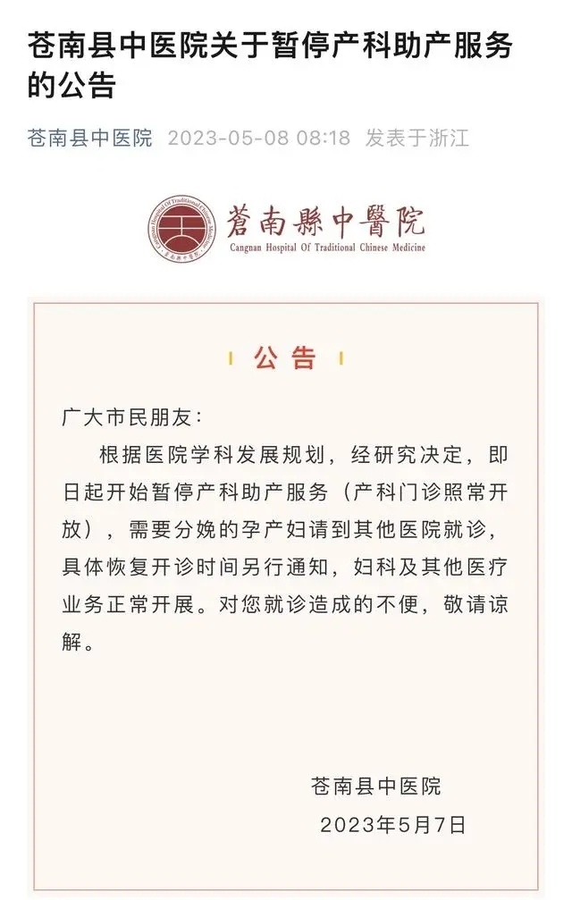

# 浙江宁波一医院产科关闭，医生分流到妇科，产科困境如何化解

每经编辑：毕陆名

据浙江宁波鄞州二院官网15日消息，因郭州区学科建设需要，勤州区第二医院定于2023年9月18日起不再开展孕产妇诊疗业务。据百姓关注报道，一位鄞州二院产科工作人员在网络发布告别视频，表示产科虽然关了仍会在其他科室为患者服务。9月26日，
**鄞州二院工作人员表示，产科9月18日已经关闭了不开了，是根据上级部门要求关闭的，科室医生部分分流到妇科，其余分配到其他医院。**

据鄞州区人民政府官网显示，鄞州区下辖10个镇、15个街道办事处，203个行政村、189个社区、7个城镇居委会，区域总面积为814.2平方公里(以上数据包含高新区)。2022年末，鄞州区总户数39.5万户，户籍总人口98.8万人，其中城镇人口80.6万人，乡村人口18.2万人。据地区生产总值统一核算结果，2022年，鄞州全区（含高新区，下同）生产总值2734.8亿元，按不变价格计算，同比增长3.0%。

 _图片来源：宁波市人民政府_

据宁波市人民政府官网显示，截至2022年底，宁波全市拥有户籍人口621.1万人，其中市区314.2万人。按性别分，男性305.2万人，占49.1%，女性315.8万人，占50.9%。2022年全市出生34556人。人口出生率为5.58‰，死亡率为6.83‰，自然增长率为-1.25‰。2022年全市人口净迁入35157人，净迁移率为5.67‰。

国家统计局的数据显示，2022年末，全国人口为141175万人，比上一年末减少85万人，人口自然增长率为-0.6‰，这是我国人口自1962年以来首次出现负增长。

这些年来，各地医院的产科医护都在科室里感受到了生育率的下降。

2023年5月7日，浙江省苍南县中医院的微信公众号发布一则公告。公告称，根据医院学科发展规划，经研究决定，即日起开始暂停产科助产服务（产科门诊照常开放）。

据红星资本局5月报道，记者从全国多地妇幼保健院产科了解到，比起具体的产妇建档数据，更直观的感受是，今年以来分娩量下降了。对于不少产房里的医生而言，新生儿的哭啼声变少，病床不再紧张，大家的工作也不像从前忙碌了。

贵州省某县妇幼保健院一名妇产科医生介绍，今年该院的分娩量较同期下降了近30%，县城内三家公立医院的新生儿出生率都在降低，医护的薪资也受到影响。湖南省某三甲妇幼保健院的一名医护人员介绍，产科是该院的品牌，分娩量一直排名全省前列，但最近，产妇多到加床的情况已经较为少见。

“过去（分娩量）可能一天七八个、十来个，现在几天一个，能一天一个就不错了。”黑龙江省哈尔滨市妇幼保健院的一名产科医生告诉红星资本局，医院今年的分娩量减少了一半以上，除生育观念和经济水平等因素，当地私立医院的分流也有影响。

不过，也有广东某大型三甲医院产科医生表示，分娩量与同期比没有太大变化。

据新京报6月14日报道，中国人口学学会会长、中国人民大学人口与发展研究中心主任翟振武指出，当前生育的机会成本大幅提升。随着经济社会的快速发展，职场女性数量不断增多。女性面临着兼顾平衡工作、家庭的巨大挑战，生育意味着女性需要花费更多的时间和精力在孩子身上，会对女性的职业发展、个人提升造成一定的阻碍，这对女性的生育意愿具有很大的抑制作用。

人口学者黄文政认为，
**产科由热到冷背后原因主要有两个方面，一是适婚适育年龄段的女性数量在减少，潜在妈妈的数量变少了。二是平均每个女性生育孩子的数量在减少。**

2021年，我国开始开放三孩政策，允许一对夫妻生育三个子女。
**然而上述产科医护人员均认为，未来生育率并不乐观，下降的趋势可能要持续一段时间。要化解产科当前的困境，关键还在于提升生育率。**

每日经济新闻综合浙江宁波鄞州二院官网、百姓关注、红星资本局、新京报

每日经济新闻

