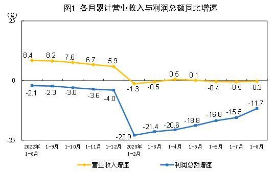
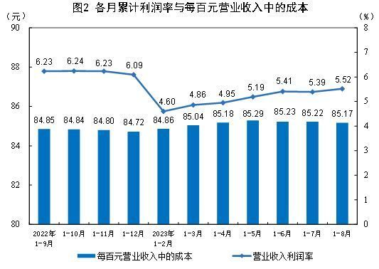
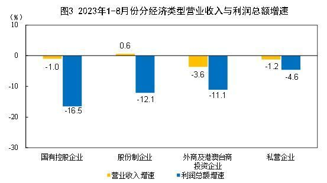
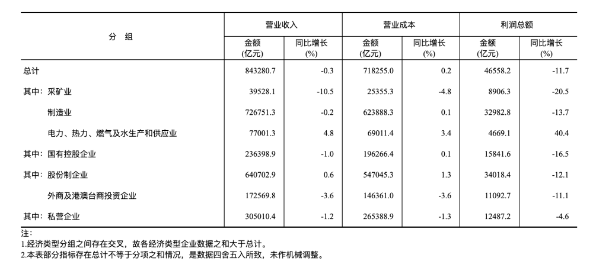
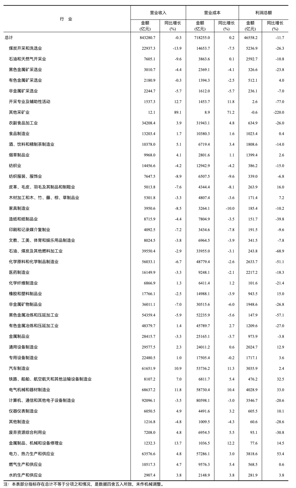

# 统计局：1-8月份全国规模以上工业企业利润下降11.7%

1—8月份，全国规模以上工业企业实现利润总额46558.2亿元，同比下降11.7%，降幅比1—7月份收窄3.8个百分点。

1—8月份，规模以上工业企业中，国有控股企业实现利润总额15841.6亿元，同比下降16.5%；股份制企业实现利润总额34018.4亿元，下降12.1%；外商及港澳台商投资企业实现利润总额11092.7亿元，下降11.1%；私营企业实现利润总额12487.2亿元，下降4.6%。

1—8月份，采矿业实现利润总额8906.3亿元，同比下降20.5%；制造业实现利润总额32982.8亿元，下降13.7%；电力、热力、燃气及水生产和供应业实现利润总额4669.1亿元，增长40.4%。

1—8月份，主要行业利润情况如下：电力、热力生产和供应业利润总额同比增长53.4%，电气机械和器材制造业增长33.0%，通用设备制造业增长12.9%，专用设备制造业增长3.6%，汽车制造业增长2.4%，石油和天然气开采业下降10.8%，纺织业下降15.0%，计算机、通信和其他电子设备制造业下降20.6%，农副食品加工业下降26.0%，煤炭开采和洗选业下降26.3%，非金属矿物制品业下降26.8%，有色金属冶炼和压延加工业下降27.0%，化学原料和化学制品制造业下降51.1%，黑色金属冶炼和压延加工业下降57.1%，石油、煤炭及其他燃料加工业下降68.9%。

1—8月份，规模以上工业企业实现营业收入84.33万亿元，同比下降0.3%；发生营业成本71.83万亿元，增长0.2%；营业收入利润率为5.52%，同比下降0.71个百分点。

8月末，规模以上工业企业资产总计163.01万亿元，同比增长6.6%；负债合计93.87万亿元，增长7.0%；所有者权益合计69.14万亿元，增长6.1%；资产负债率为57.6%，同比上升0.2个百分点。

8月末，规模以上工业企业应收账款23.41万亿元，同比增长9.5%；产成品存货6.15万亿元，增长2.4%。

1—8月份，规模以上工业企业每百元营业收入中的成本为85.17元，同比增加0.42元；每百元营业收入中的费用为8.33元，同比增加0.28元。

8月末，规模以上工业企业每百元资产实现的营业收入为79.2元，同比减少6.1元；人均营业收入为175.0万元，同比增加5.2万元；产成品存货周转天数为20.3天，同比增加1.2天；应收账款平均回收期为63.5天，同比增加6.0天。

8月份，规模以上工业企业利润实现由降转增，同比增长17.2%。

**表1 2023年1-8月份规模以上工业企业主要财务指标**

**表2 2023年1-8月份规模以上工业企业经济效益指标**

**表3 2023年1-8月份规模以上工业企业主要财务指标（分行业）**

**附注**

一、指标解释及相关说明

1、利润总额：指企业在生产经营过程中各种收入扣除各种耗费后的盈余，反映企业在报告期内实现的盈亏总额。

2、营业收入：指企业从事销售商品、提供劳务和让渡资产使用权等生产经营活动形成的经济利益流入。包括主营业务收入和其他业务收入。

3、营业成本：指企业从事销售商品、提供劳务和让渡资产使用权等生产经营活动发生的实际成本。包括主营业务成本和其他业务成本。营业成本应当与营业收入进行配比。

4、资产总计：指企业过去的交易或者事项形成的、由企业拥有或者控制的、预期会给企业带来经济利益的资源。

5、负债合计：指企业过去的交易或者事项形成的、预期会导致经济利益流出企业的现时义务。

6、所有者权益合计：指企业资产扣除负债后由所有者享有的剩余权益。

7、应收账款：指资产负债表日以摊余成本计量的，企业因销售商品、提供服务等经营活动应收取的款项。

8、产成品存货：指企业报告期末已经加工生产并完成全部生产过程、可以对外销售的制成产品。

9、营业收入利润率=利润总额÷营业收入×100%，单位：%。

10、每百元营业收入中的成本=营业成本÷营业收入×100，单位：元。

11、每百元营业收入中的费用=（销售费用+管理费用+研发费用+财务费用）÷营业收入×100，单位：元。

12、每百元资产实现的营业收入=营业收入÷平均资产÷累计月数×12×100，单位：元。

13、人均营业收入=营业收入÷平均用工人数÷累计月数×12，单位：万元/人。

14、资产负债率=负债合计÷资产总计×100%，单位：%。

15、产成品存货周转天数=360×平均产成品存货÷营业成本×累计月数÷12，单位：天。

16、应收账款平均回收期=360×平均应收账款÷营业收入×累计月数÷12，单位：天。

17、在各表的利润总额同比增长栏中，标“注”的表示上年同期利润总额为负数，即亏损；数值为正数的表明利润同比增长；数值在至-100%之间（不含）的表明利润同比下降；下降幅度超过100%的表明由上年同期盈利转为本期亏损；数值为的表明利润同比持平。

18、在主要分组中，国有控股企业包括国有绝对控股企业和国有相对控股（含协议控股）企业等。外商及港澳台商投资企业包括中外（或与港澳台资）合资经营企业、合作经营企业及外资（或港澳台资）的股东占公司注册资本比例达25%以上的股份有限公司等。私营企业包括私营有限责任公司、私营股份有限公司、私营合伙企业和私营独资企业等。

二、规模以上工业企业利润总额、营业收入等指标的增速均按可比口径计算。报告期数据与上年所公布的同指标数据之间有不可比因素，不能直接相比计算增速。其主要原因是：（一）根据统计制度，每年定期对规模以上工业企业调查范围进行调整。每年有部分企业达到规模标准纳入调查范围，也有部分企业因规模变小而退出调查范围，还有新建投产企业、破产、注（吊）销企业等变化。（二）加强统计执法，对统计执法检查中发现的不符合规模以上工业统计要求的企业进行了清理，对相关基数依规进行了修正。（三）加强数据质量管理，剔除跨地区、跨行业重复统计数据。

三、统计范围

规模以上工业企业，即年主营业务收入为2000万元及以上的工业法人单位。

四、调查方法

规模以上工业企业财务状况报表按月进行全面调查（1月份数据免报）。

五、行业分类标准

执行国民经济行业分类标准（GB/T4754-2017）。

