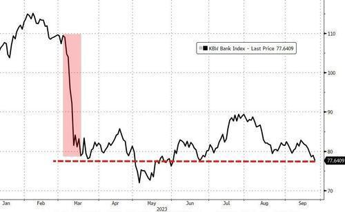
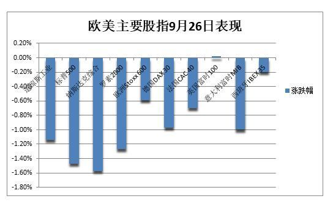
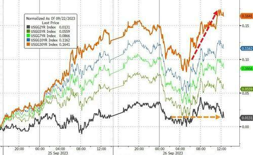
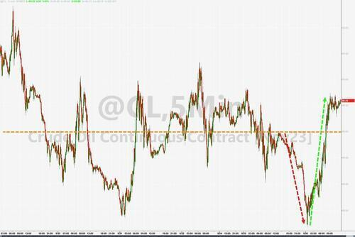
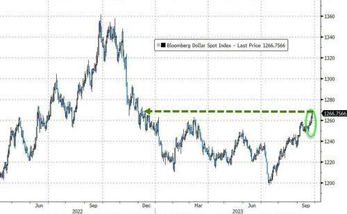
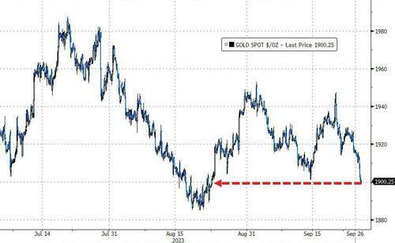

# 美股齐创约四个月低位，亚马逊大跌4%，美债收益率刷新十多年最高

市场继续关注美国国会能否在10月1日零点之前解决预算谈判分歧，避免联邦政府停摆。有报道称，美国政府关门近乎板上钉钉，国会温和派试图缩短停摆时间。

美联储最青睐的通胀指标——PCE个人消费支出物价指数将于周五公布，预计核心PCE环比增0.2%持平前值，同比增4%较前值4.2%继续降温，但仍较美联储通胀目标翻倍。

楼市方面，标普凯斯-
席勒指数显示，8月美国房价连续第六个月上涨，待售房源有限引发抢购。但8月新屋销售环比跌8.7%逊于预期，并创五个月新低，利率高企令买家却步。

同时，美国9月谘商会消费者信心指数超预期降至103的四个月最低，受经济和劳动力市场恶化影响，反映消费者对未来六个月展望的预期指标跌至73.7，低于80的与经济衰退一致水平。

今年FOMC票委、明尼阿波利斯联储主席卡什卡利称，美国软着陆的可能性为60%，支持今年底之前再加息25个基点。美国资产值最大的银行摩根大通CEO戴蒙也警告，美联储可能需要加息至更高才能遏制通胀，都令市场风险情绪明显受到抑制。

拜登亲临密歇根州为罢工工人打气，支持UAW加薪40%的诉求，巴克莱警告称美国汽车工人罢工将增加通胀的上行风险。

美股齐创约四个月低位，道指5月来首次收低于200日均线，亚马逊跌4%领跌科技股

9月26日周二，美债收益率仍徘徊十多年高位，叠加穆迪警告美国联邦政府关门将负面影响信用评级，美股低开低走，开盘半小时科技股居多、且对利率走扬反应敏感的纳指便跌超1%。

道指最深跌近440点或跌1.3%，跌穿200日均线关键技术位。标普500指数最深跌1.6%，自6月9日以来首次跌穿4300点整数位，11大板块全线下挫，电信、可选消费和科技股跌幅居前。纳指最深跌1.8%并一度下逼1.3万点关口，罗素小盘股也跌超1%。

**最终，美股主要指数齐跌超1%并集体收于日低附近，重返多日以来的跌势。**
道指创6月6日以来的近四个月最低和3月份以来最大单日跌幅，道指自5月以来首次收盘不足200日均线；标普大盘创6月7日来最低，纳指和罗素小盘股创5月31日来最低，小盘股昨日刚脱离六日连跌：

标普500指数收跌63.91点，跌幅1.47%，报4273.53点。道指收跌388点，跌幅1.14%，报33618.88点。纳指收跌207.71点，跌幅1.57%，报13063.61点。纳指100跌1.51%，罗素2000小盘股指数跌1.27%，“恐慌指数”VIX大涨12%并上逼19，至四个月最高。

 _美股齐创约四个月低位，道指5月来首次收低于200日均线_

标普11个板块全线溃败，公用事业板块跌3%，可选消费跌2%，信息技术/科技跌1.8%，电信服务跌1.3%，能源板块跌0.5%跌幅最小。

美国银行客户连续第八周净买入美国股票，但散户资金流入占主导地位，对冲基金和机构客户等“聪明钱”都在卖出。9月标普累跌超4%，即将连跌第二个月，纳指累跌超6%，均将创去年12月以来最差表现。蓝筹股居多的道指累跌2%，美联储鹰派利率前景令风险情绪持续承压。

**明星科技股齐跌**
。元宇宙”Meta跌0.6%，特斯拉跌超2%后跌1%，谷歌A跌约2%，均重返一个月低位；苹果跌2.3%，奈飞跌1.4%，微软跌1.7%，均创四个月最低；亚马跌4%至三个月新低。

**芯片股普跌，**
费城半导体指数跌1.8%至四个月最低。英特尔跌1.3%至一个月最低，AMD跌1.5%至四个半月最低，英伟达涨1.4%后转跌0.7%，止步两日连涨并重新下逼六周最低；Arm跌1.7%，重新逼近上周五所创的上市以来最低，昨日曾止步六日连跌。

 _最大型7只科技股从7月高位整体市值回落了1万亿美元_

**AI概念股继续回调** 。C3.ai跌3%连续多日创四个半月最低，Palantir
Technologies跌1.8%重返三个月低位，SoundHound.ai跌8.6%刷新六个月最低，BigBear.ai跌4.5%至近九个月最低。

消息面上，微软正在开发廉价款AI，以模仿OpenAI模型的质量。美国联邦贸易委员会（FTC）和17个州的总检察长起诉亚马逊，指控其涉嫌针对购物者降低质量、抬高价格并垄断竞争。有欧盟贸易官员称，特斯拉和其他从中国进口汽车的欧洲制造商都将面临不公平补贴的调查。
OpenAI寻求出售现有股份，估值最高900亿美元，是今年初估值的约三倍。

**热门中概追跌美股大盘且尾盘跌幅扩大。** ETF
KWEB跌1.4%，CQQQ跌约1%，纳斯达克金龙中国指数（HXC）跌0.9%，更加接近上周所创的两个半月低位。

纳斯达克100成份股中，京东跌2.5%，百度跌0.8%，拼多多跌近3%。其他个股中，阿里巴巴跌1.5%，B站跌超1%后收跌0.4%，腾讯ADR跌1.6%，蔚来汽车转涨近1%脱离近四个月低位，理想汽车跌1.6%刷新三个月最低，小鹏汽车跌2.6%。消息面上，阿里巴巴拟分拆菜鸟于香港联交所主板独立上市，阿里云在海外市场推出一站式大模型开发服务。

**银行股指在八日里第七日下跌。**
行业基准费城证交所KBW银行指数（BKX）跌1.6%重返三个月最低，5月4日曾创2020年10月以来最低。KBW纳斯达克地区银行指数（KRX）跌1.5%，无限逼近上周五所创的三个月最低，5月11日创2020年11月来最低；SPDR标普地区银行ETF（KRE）跌1.6%，5月4日创2020年10月来最低。“美国四大行”齐跌超1%，花旗和富国银行跌2%。

_美国银行指数跌超1%至三个月最低_

此外，线上杂货铺Instacart收跌1.65%，报29.89美元，9月19日美国IPO以来首次收盘破发，即跌穿30美元IPO发行价。

欧股除英国股指之外齐跌。泛欧Stoxx
600指数收跌0.59%，连跌四日至7月7日以来的近三个月最低，科技股跌2%领跌大盘，汽车股跌超1%。意大利和德国股指跌约1%表现最差，意大利银行股指数跌近2%，出口商较多的英国大盘股受到英镑触及六个月最低的提振，收盘微涨。

两年期美债收益率尾盘转跌，长债收益率再创十多年最高，欧债收益率徘徊高位

美债收益率在美股盘初小幅回落，午盘后重新转涨。对货币政策更敏感的两年期收益率最高升2.6个基点并上逼5.16%，更加接近上周所创的2006年来最高，美股尾盘小幅转跌至5.13%。

10年期基债收益率也转涨超2个基点至4.57%，刷新2007年10月18日以来最高。30年期长债收益率涨4个基点至4.70%，再创2011年2月来最高。

_10年期基债收益率刷新2007年10月来最高，30年期收益率创2011年2月来最高_

欧元区基准的10年期德债收益率尾盘涨1个基点上逼2.81%，盘中升至2.82%的2011年下旬以来十二年最高。两年期收益率尾盘转跌至3.23%，上周四曾触及3.36%创3月9日以来半年高位，30年期收益率升穿3%心理整数位，徘徊2011年10月来最高。

欧洲负债较深外围国家基准的10年期意债收益率升超4个几点上逼4.70%，再创去年10月来最高，衡量风险情绪的意/德基债息突破190个基点，创5月中旬以来的四个半月最阔。长端英债收益率微幅上涨，两年期收益率小幅转跌，继续逼近6月13日以来的逾三个月新低。

有分析称，在增长前景疲弱的背景下，意大利总理拟宣布最新预算方案，或将2024年预算赤字目标提高至GDP的4.1%至4.3%。同时，石油和欧洲天然气价格再次攀升，加剧人们对新一轮通胀压力的担忧。欧央行更加注重减少过剩流动性等因素，都将增加外围市场的债市压力。

油价转涨脱离两周新低，美油重上90美元，欧洲天然气结束五日连涨脱离一个月高位

国际油价在美股盘中止跌转涨，脱离两周低位。WTI
11月原油期货收涨0.71美元，涨幅0.79%，报90.39美元/桶。布伦特11月期货收涨0.67美元，涨幅0.72%，报93.96美元/桶。

美油WTI一度跌穿89美元并下逼88美元，最深跌1.48美元或跌1.7%，转涨后重上90美元心理整数位。交投更活跃的布伦特12月期货一度下逼90美元或最深跌1.6%，转涨后重上92美元，即将到期交割的11月期货转涨后升破94美元，此前曾接连跌穿93和92美元两道关口。

 _油价转涨脱离两周新低，美油重上90美元_

三季度美油累涨超26%，布油累涨约24%，都有望创下2022年第一季度以来的一年多最大涨幅，而且两种油价在第三季度的每个月份都将实现累涨，主要由于供应紧张的前景超过了对高利率时期经济与油需不确定性的担忧。但有分析担心，美国政府关门或令布油难以升至100美元。

受累于需求前景黯淡，欧洲天然气结束五日连涨，基准TTF荷兰天然气期货尾盘跌超7%，重新失守40欧元/兆瓦时整数位，脱离一个月最高。ICE英国天然气跌超11%至100便士/千卡关口。

美元刷新十个月最高，欧元英镑半年新低，日元再创11个月最低，离岸人民币升破7.31元

衡量兑六种主要货币的一篮子美元指数DXY在美股盘中转涨0.2%并站稳106关口上方，刷新去年11月底以来的十个月最高，此前已连涨十周。9月累涨2%，将创5月份以来单月表现；三季度目前累涨2.7%，迈向去年以来最大的季度涨幅。

_美元连涨五日刷新十个月最高_

欧元兑美元进一步失守1.06，刷新3月中旬以来的半年多最低。英镑自3月以来首次跌穿1.22，同创半年低位，9月累跌3.7%为一年中最差单月表现。有分析称，英国与欧洲央行将维持利率稳定、而美联储可能再次加息的前景，令欧洲货币承压。

日元兑美元失守149大关，刷新去年10月下旬以来的11个月最低，日本财务大臣一天内第二次发出警告，此前华尔街预测日元跌至150将引发央行救汇。离岸人民币盘中升破7.31元，但仍徘徊两周低位。

**主流加密货币普跌。** 市值最大的龙头比特币跌穿2.62万美元，第二大的以太坊失守1590美元，均徘徊两周低位，三季度分别累跌14%和18%。

现货黄金盘中自五周以来首次跌穿1900美元，伦铜刷新近四个月低位，镍一年多最低

美元和美债收益率走强连续两日打压金价，COMEX
12月黄金期货收跌0.87%，报1919.80美元/盎司。现货黄金最深跌近17美元或跌0.9%，盘中自8月23日以来首次跌穿1900美元心理整数位，创五周新低。

有分析称，黄金尚未被定位为避险资产，近期变动逻辑仍与加息紧密相关。若周五PCE通胀高于预期将带来进一步下行压力，只有市场担心美联储过度紧缩导致经济大幅恶化，才对金价利好。

_现货黄金盘中自五周以来首次跌穿1900美元_

**伦敦工业基本金属涨跌不一。**
昨日跌近1%的经济风向标“铜博士”再跌0.7%并失守8100美元，刷新6月初以来的近四个月最低，受限于库存增加和对全球利率长期走高抑制需求的担忧。

伦铝小幅转涨，重新逼近一个半月高位；昨日跌超1%的伦锌再跌0.8%至一周低位；伦铅微涨脱离三周最低；昨日跌1.5%的伦镍再跌1.3%，失守1.9万美元刷新去年7月来的一年多最低；昨日跌1.4%的伦锡转涨0.5%并升破2.6万美元，脱离一周低位。

