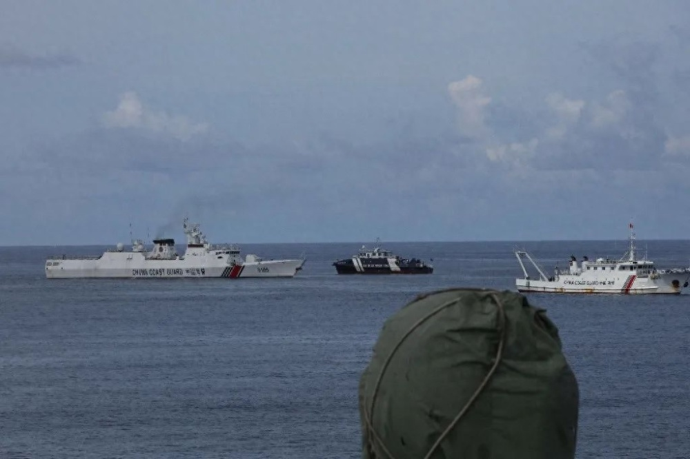
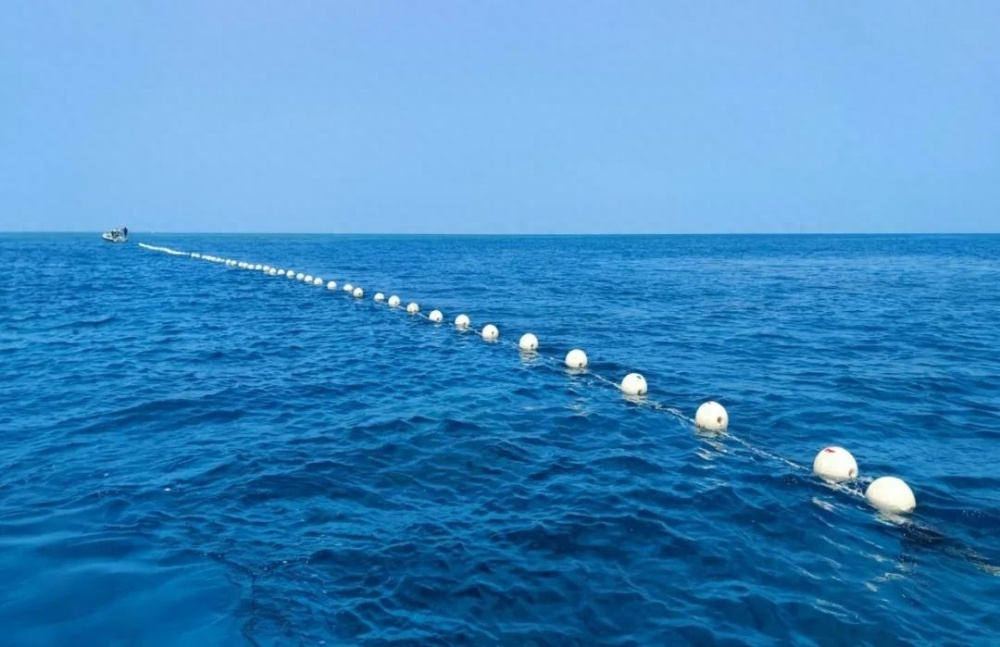
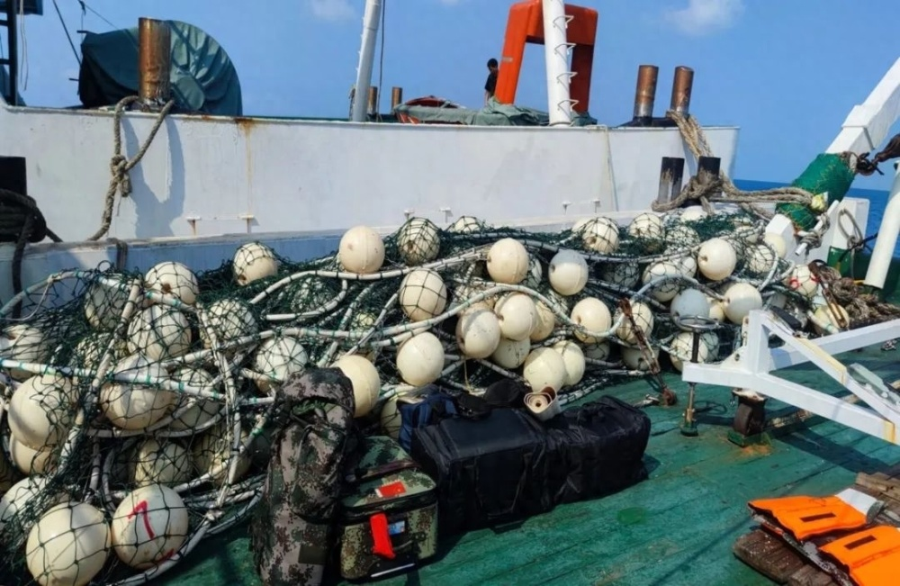

# 菲律宾公务船非法侵闯黄岩岛，中国海警回应

中国海警局新闻发言人甘羽表示，9月22日，菲律宾渔业和水产资源局公务船未经中国政府批准，非法进入中国黄岩岛附近海域滋事挑衅。中国海警依法采取喊话警告、航路管制等必要措施对其有效管控，针对菲船冲闯潟湖临时布放拦阻网具，事后于9月23日主动收回拦阻设施、恢复常态管控，现场操作专业规范、合法合理。菲方所谓拆除中方拦阻网具，完全是捏造事实、自导自演。中国对黄岩岛及其附近海域拥有无可争辩的主权，对相关海域拥有主权权利和管辖权。中国海警将依法在中国管辖海域持续开展维权执法活动，坚决维护国家主权和海洋权益。

 _△中国海警拦阻非法冲闯黄岩岛潟湖的菲公务船_

_△中国海警针对菲公务船冲闯黄岩岛潟湖临时布设网具_

_△中国海警执法行动结束后于9月23日主动收回拦阻网具_

来源：中国海警

