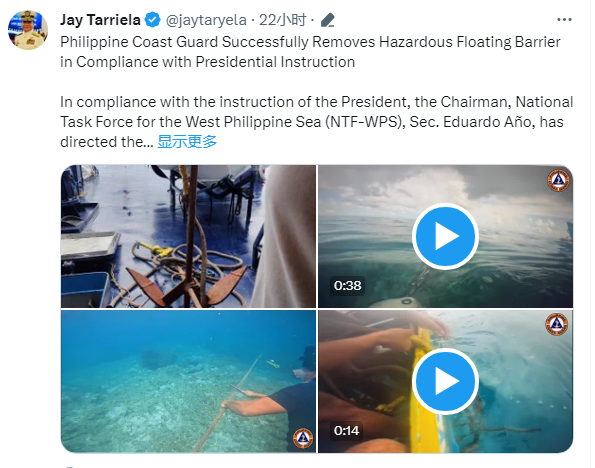
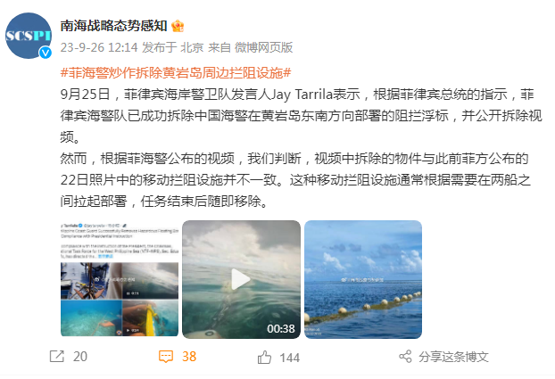

# 菲律宾在黄岩岛小偷小摸干什么？

菲律宾海岸警卫队声称已拆除中国在黄岩岛附近布设的“浮动屏障”，这一说法26日在菲国内引起阵阵欢腾，包括《纽约时报》在内的一些美国媒体也跟着鼓动。

但很快就有分析注意到，菲海警公布的视频中拆除的物件，与此前菲方公布的照片中的移动拦阻设施并不一致。

26日下午，中国外交部发言人说，菲方所谓声明完全是自说自话。

菲律宾一些人继续在黄岩岛挑衅，而且自称闹出了大动静。

26日，大部分菲律宾媒体都援引菲海岸警卫队发言人塔里埃拉的说法称，菲方已拆除了中国在黄岩岛东南方向设置的浮动障碍，据称该障碍是为了阻止菲律宾人进入传统渔场而部署的。

就是这个塔里埃拉，此前指控说，菲方22日在黄岩岛潟湖入口附近发现浮动障碍，长达300米，它们使菲国渔民无法进入当地从事渔业和营生活动。

当地媒体报道称，菲海岸警卫的最新声明是在菲律宾国家安全顾问爱德华多·阿诺发誓要采取“一切适当行动”拆除中国海警在黄岩岛设置的障碍几小时后发表的。

塔里埃拉在社交媒体X上还发布两张照片和两段视频，其中一段视频显示一名穿戴潜水镜、呼吸管和蛙鞋的男子，用刀切断连接着白色浮球的绳索。另一段视频和图片显示，一个锚从海中拖出，然后被放在一艘舷外浮杆木船上。

实际上，菲海警的声明说得比较含糊，连替它宣传的“某国之音”也不得不在报道中留有余地说，“菲律宾的声明并没有清楚地说明整个屏障是否已从水中拆除”。

但这并不妨碍一些菲媒及美国媒体欢呼胜利。《纽约时报》说：“面对中国决心对远离中国大陆的南海大片地区实施控制，菲律宾海岸警卫队表示，他们已经将事情掌握在自己手中，拆除了阻止菲律宾渔船进入黄岩岛的中国设置的浮动屏障”。

还有菲律宾政客甚至声称要进入潟湖内，控制黄岩岛。

那么，事实真的如此吗？菲媒报道的细节提供了一些暗示。

_菲律宾《马尼拉公报》的报道截图_

据《马尼拉公报》26日报道，在接受电视台电视采访时，塔里埃拉详细“介绍了”这次行动。

按照他的说法，菲总统马科斯打电话给国家安全顾问爱德华多·阿诺，要求“尽一切可能”让海警队拆除浮动屏障。接着，菲国家安全部门召集海警队指挥官阿尔特米奥·阿布海军上将，并发出了进行“特别行动”的具体指示。

塔里埃拉称，由于有4艘中国海警船只守卫着黄岩岛，所以这次行动“非常危险”，因为中国海警船只配备了高压水枪，如果他们发现菲方人员，任何事情都可能发生。

菲方的决定是，此次的“特别行动”这应该是一次不显眼的行动。具体操作是，菲海警队的一名工作人员伪装成一名普通渔民，登上一艘渔船，来到有浮动屏障的区域。该工作人员随后潜入水中，剪断浮动屏障的锚，使其漂浮并被海浪冲走。

哦，原来一场吹嘘的“高大上”的“特别行动”不过是一次小偷小摸。偷着割缆绳这样的小动作对一个普通渔民来说都不是太难的事儿，但它能帮菲律宾解决什么问题？

而且连这“小偷小摸”的真实性也是存疑的，很可能是掺水造假的。

“南海战略态势感知”26日在微博上说，菲方称已成功拆除中国海警在黄岩岛东南方向部署的阻拦浮标，并公开拆除视频。然而，根据菲海警公布的视频，我们判断，视频中拆除的物件与此前菲方公布的22日照片中的移动拦阻设施并不一致。这种移动拦阻设施通常根据需要在两船之间拉起部署，任务结束后随即移除。

“菲方所谓声明完全是自说自话”，中国外交部发言人汪文斌26日在记者会上说：“中方坚定维护黄岩岛的主权和海洋权益，我们奉劝菲方不要挑衅滋事。”

