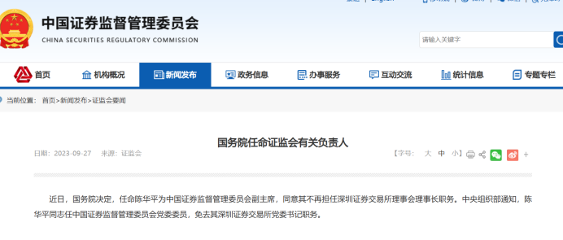

# 证监会迎新任副主席，原深交所理事长陈华平走马上任

**财联社9月27日讯（记者 林坚）**
位于北京西城区金融街19号的富凯大厦，今天又走进一位新证监会副主席。近日，国务院决定，任命陈华平为证监会副主席，同意其不再担任深交所理事会理事长职务。中央组织部通知，陈华平任证监会党委委员，免去其深交所党委书记职务。

_图为证监会官网_

虽是新任副主席，但陈华平却是一位有着丰富监管经验的证监会老将。履历显示，陈华平，1968年12月出生，法学学士，中共党员。

2014年先后担任证监会机构部副主任、打击非法证券活动办公室主任。

2016年6月2日陈华平任郑商所党委书记，提名为郑商所理事会理事长人选。郑商所第五届理事会第18次会议，选举陈华平为郑商所理事会理事长。

2019年10月23日，陈华平调任证监会办公厅主任。

2021年12月22日，陈华平当选深交所理事会理事长。

记者注意到，目前证监会领导班子中，副主席王建军也原是深交所党委书记、理事长，他于2021年10月调任至证监会，任证监会副主席。也正是王建军履新证监会后，同年12月，陈华平接棒成为深交所党委书记、理事长。

值得一提的是，陈华平的履新也是国家金融管理部门“一行一局一会”构成、证监会调整为国务院直属机构后，证监会层面的首次人事重大任命。陈华平长期从事期货市场、资本市场机构监管，在资本市场全面深化改革的关键时期，金融监管体系变革之际，陈华平再度回到证监会，业界期待他更多作为。尤其是针对从投资端、融资端、交易端等方面综合施策，来自证券交易所的他，或有更多想法。

**从一线监管到机构监管，再到为期货“鼓与呼”**

“有闯劲”是业界对陈华平的评价。可以看到，陈华平是证监系统成长起来的监管干部，在深交所任职前，他还担任过证监会办公厅主任，以及在郑州商品期货交易所、证监会机构部、打击非法证券活动办公室、天津证监局有过任职，可以说，他是从一线监管到机构监管，再到期货市场管理。

陈华平善于推进改革，这一点在郑商所工作期间格外明显。在他任职“一把手”期间，郑商所共上市2个期权品种，4个期货品种。如2017年4月19日，白糖期权上市；2017年8月18日，棉纱期货上市等。其中棉花期货的上市，标志着我国期货市场进入规范发展新阶段。

陈华平曾接受媒体采访时表示，要优化上市产品、创新服务方式，丰富服务手段、拓展服务范围，为保障国家粮食安全，培育新型农业经营主体、实现小农户与现代农业发展有机衔接，推动民族地区、边疆地区、贫困地区加快发展等，提供支持。

在担任郑商所主要负责人期间，他高度重视产品、业务、监管和科技创新，既全面考虑问题，又注重细节，具备高瞻远瞩的大局观念。他所制定的规则既切实可行，又能落地生根，充分体现了其深思熟虑和细致入微的作风。

**加强持续监管，优化分类监管，推进科技监管**

除了推进改革、懂得改革，作为一名谙熟监管的干部，陈华平曾在今年由深交所主办的2023全球投资者大会上围绕监管工作进行了相关发言，虽然是从交易所管理角度出发，但同样反映了他对监管工作的态度。

他称，深交所将以全面实行注册制为契机，坚持以信息披露为核心，深入推进阳光审核、阳光监管、阳光服务，加强持续监管，优化分类监管，推进科技监管，压实中介机构责任，严厉打击违法违规行为，努力塑造更加规范、透明的一线监管体系，持续提升监管效能和市场透明度。

记者也注意到，在早年的券商综合治理中，陈华平有很大贡献。陈华平曾是汉唐证券风险处置的主要负责人之一。

陈华平最近一次公开发言是一场围绕资本市场助力国资国企做大做强的会谈上，他表示，深交所以“建成以优质创新资本中心为特色的世界一流交易所”为愿景，坚持服务科技创新，聚焦先进制造、数字经济、绿色低碳等重点领域，促进科技、资本和实体经济高水平循环。

可以看到，“建成以优质创新资本中心为特色的世界一流交易所”是陈华平作为深交所理事长两年多来竭力推进的目标。

成立以来，深交所致力于服务亿万投资者，支持不同成长阶段的中国企业，先后实现了从实验到规范、从区域到全国、从单一产品到多层次资本市场体系的跨越式成长，为完善社会主义市场经济体制，为推进中国改革开放和现代化建设事业，不懈探索，锐意进取，走出了一条充满艰辛的希望之路。

据财联社记者观察，近年来，深交所积极推进基础制度改革，不断增强市场包容性。以创业板改革并试点注册制为主线，深交所深入推进发行、上市、交易、退市、再融资、并购重组等方面制度创新，优化了上市标准、拓宽了企业上市渠道、进一步市场化发行定价，为成长型创新创业企业提供了更好的支持。

2022年，面对国内外多重超预期因素冲击，我国经济保持较强韧性，发展质量稳步提升，创新驱动深入推进。深市上市公司生产经营稳中有进，研发投入大幅增长，社会责任有效履行，公司结构和总体面貌发生积极变化，有力地支持了国民经济顶住压力持续发展，为整体好转复苏向上打下了坚实基础。

数据显示，深市上市公司2022年实现营业总收入20万亿元，同比增长7.0%，近六成公司收入正增长，其中实体类公司（不含金融业和房地产业）实现净利润8782.2亿元，同比增长7.0%。

（财联社记者 林坚）

