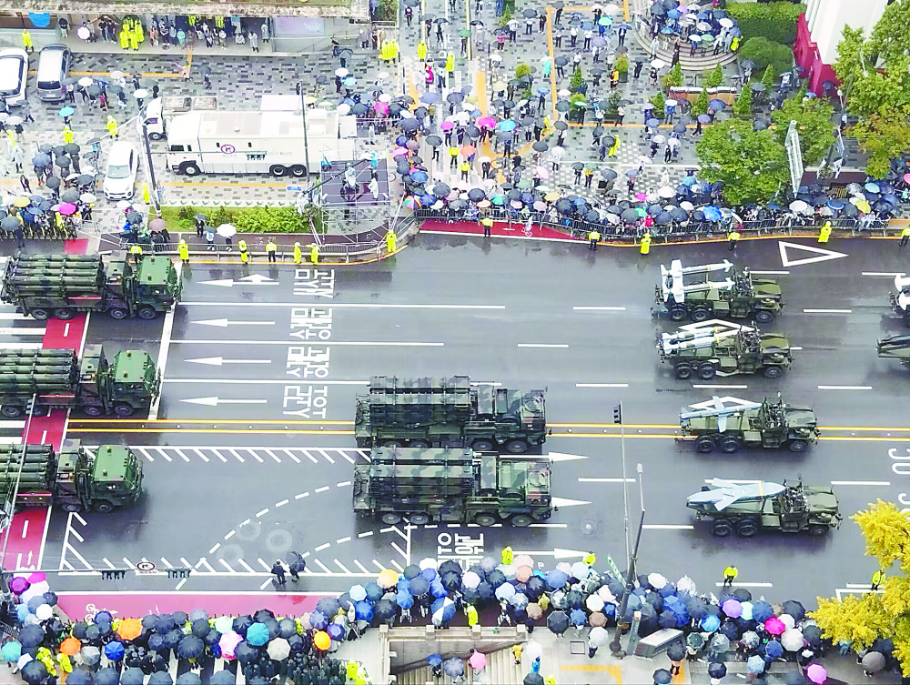

# 韩国高调阅兵展示“秘密武器”，外媒：为向朝鲜展示“更强硬立场”

【环球时报驻韩国特约记者 林森 柳玉鹏
陈康】韩国26日举行了十年来首次大规模阅兵，展示了包括“堪比战术核武器”的“玄武”导弹在内的多种武器。路透社报道称，韩国此次“罕见”阅兵是为了向朝鲜展示“更强硬的立场”。当天，韩国总统尹锡悦发表讲话，声称“如果朝鲜使用核武器，韩美联盟进行的压倒性反击将导致其政权被终结”。这令不少韩国民众感受到“战争的氛围”。

韩国《明日新闻》26日刊登韩国国立外交院前院长、韩东大学教授金俊亨撰写的评论，批评尹锡悦政府是“没有和平的政府”。文章称，一旦爆发军事冲突会让韩国所拥有的一切立刻化为乌有，单纯依靠军事威慑来保障安全就像单腿站立一样不稳定。

_26日，韩国首尔举行大规模阅兵。图为韩军军车在首尔街头行进。林森 摄_

**尹锡悦讲话对朝示强**

据路透社报道，韩国此次阅兵旨在庆祝韩国的“国军日”。报道称，通常情况下，与朝鲜经常举行阅兵展示包括洲际弹道导弹在内的战略武器相比，韩国纪念这一日子时都较低调。当天上午，阅兵首先在首尔郊区的空军基地举行。报道称，韩国这次阅兵的重头戏是在当天下午，全长达2公里的阅兵队伍穿过首尔的主要商业区，抵达位于首尔市中心韩国最大宫殿景福宫的光化门。

韩国总统尹锡悦26日上午在空军基地阅兵后发表了讲话，大谈朝鲜“核威胁”。尹锡悦一边声称朝鲜发展核武器是“对韩国人民的生存威胁，也是对世界和平的重大挑战”，一边警告，“如果朝鲜使用核武器，韩美同盟进行的压倒性反击将导致其政权终结”。

尹锡悦还称，韩国政府将进一步加强韩美同盟和韩美日安全合作。他称，韩美同盟已发展成为以核力量为基础的关系。美方战略武器可随时出动抵达朝鲜半岛。韩美同盟合作范围还扩至太空和网络领域。

韩联社称，尹锡悦今年的讲话向朝鲜发出的信息比去年更加强硬。去年尹锡悦在讲话中对朝施压还比较隐晦，仅表示“为了朝鲜半岛的真正和平和共同繁荣，希望朝鲜作出无核化的决定”，“如果朝鲜试图使用核武器，将面临韩美同盟的坚决反击。”报道分析称，今年4月尹锡悦访美，美国同意成立美韩“核磋商小组”，上月韩美日戴维营会谈强化了三方军事合作制度基础，这都给尹锡悦对朝强硬提供了“底气”。

路透社称，韩国此次阅兵的大背景是尹锡悦政府对朝鲜采取了鹰派立场，韩国是想通过这次阅兵把加强武器装备等军力作为反击朝鲜核和导弹计划战略的基石。他从去年执政以来还积极地增强同美日的军事同盟关系。

**驻韩美军首次参加**

“有史以来最大规模阅兵”，韩国《亚细亚经济》26日称，时隔10年，韩国政府再次举行庆祝“国军日”街头阅兵游行，就动员的武器装备而言，这是有史以来规模最大的一次。此次阅兵游行共出动了约6700名韩军官兵，展示了68种340件武器装备，包括韩国陆军的K21步兵战车、K2黑豹坦克、K9自行榴弹炮、海军陆战队的两栖攻击车及“爱国者”导弹、中程地空导弹、远程地空反导系统等。驻韩美军作战部队成员也参加了此次阅兵街头游行，驻扎在韩国的2.85万名美军士兵中有300人参加。这也是驻韩美军首次在“国军日”与韩军一起出现在街头。

报道称，以往韩国多届政府也曾举行阅兵及街头行进展示，自1998年以后，阅兵每五年举行一次。2003年卢武铉政府、2008年李明博政府和2013年朴槿惠政府都曾举行。但在2018年的文在寅政府，由于当时朝美领导人在新加坡举行会晤，为营造半岛和平氛围，阅兵及街头行进展示被取消。尹锡悦政府上台后，韩国重新举行阅兵活动。韩国国防部一名官员称：“我们重点向朝鲜传达一个信息，即我们可以震慑敌人，并以强有力的武力惩罚对方。”

为显示其对朝“强硬”，韩国这次阅兵大力宣扬其“秘密武器”——“玄武”导弹的威力。路透社称，当天展示的“玄武”导弹可能是韩国最新研发的“玄武-5”，号称“怪兽导弹”，据悉能携带8至9吨的弹头，还能炸毁朝鲜领导人在地下100米深的地堡。韩联社称，这次阅兵，韩国大威力“玄武”导弹首次亮相。“玄武”导弹是韩国自行研发的导弹。韩国国防部向国会提交的国政监察资料显示，该导弹总重量约为36吨。报道称，由于威力巨大，该导弹被韩军视为“三轴系统”中大规模对朝反击和报复系统的核心手段，有分析认为其破坏能力与“战术核武器”相当。

_9月26日，首尔机场举行的韩国建军75周年的“国军日”纪念仪式上，首次公开了“玄武”地对空导弹。（视觉中国）_

此外，此次阅兵中首次公开的远程地对空导弹（L-SAM）也引起了外界高度关注，该导弹可以拦截高度为50-60公里的来袭导弹。

**韩媒：很多韩国人心情压抑**

尹锡悦政府上台后，越来越依靠加强军力和韩美军事同盟来应对“朝鲜威胁”。日前，尹锡悦在联合国大会上发表讲话称，朝俄合作是“对地区和全世界和平的重大挑战”，并称“同盟和友邦将不会对此坐视不管”。

美国国务卿布林肯25日在华盛顿战略与国际问题研究中心（CSIS）年度韩美战略论坛上致辞时也指责俄朝合作“是一条日益危险的双行道，威胁全球和平与安全”。他称，为应对朝鲜威胁，美韩将扩大威慑政策，在核威慑方面进行更深入的合作。

25日，美韩还展开大规模海上联合军演。从当天起，美韩9艘舰艇开始为期3天的实弹射击和反潜演习。韩国海军称，此次演习是韩美海军有效威慑应对朝鲜不断升级的核武与导弹威胁的机会，可进一步巩固两国的联合防御态势。

对于美韩赤裸裸的威胁，朝鲜中央通讯社25日直接点名尹锡悦，怒斥这些威胁是“政治门外汉、外交白痴的歇斯底里妄言”。评论称，尹锡悦政府“唯恐天下不乱，迎合美国企图实现旨在孤立削弱域内大国的印太战略，与千年宿敌（日本）一唱一和，引进大洋彼岸的侵略兵力，制造地区紧张，是地区形势的搅局者、破坏者”。

韩国《京乡新闻》26日刊登社论称，时隔10年再次在首尔市中心举行了阅兵式，驻韩美军300人也首次参加。据悉，原本驻韩美军的战机也可能出现在首尔上空“助兴”，但因为下雨而被取消。对这场阅兵式，很多韩国人看后却感觉心情压抑。此外，尹锡悦当天在演讲时第一次提及“朝鲜政权的终结”，此番言论非常刺激。无独有偶，26日韩国宪法法院裁定文在寅政府时期通过的禁止越境散发反朝传单的法律违宪，有人担心这可能成为当前气氛下韩朝发生意外冲突的又一导火索。社论称，过去数周不停有飞机在首尔市中心低空盘旋进行阅兵演练，这导致很多市民因为战争氛围而不安，担忧今年的阅兵式可能成为尹锡悦政府强化“安保国家”的一个缩影。社论呼吁，在南北分裂的大格局下，除了加强军力外，希望尹锡悦政府也能与朝进行对话，以消除韩国国民对战争的担忧。

“没有和平的政府”，韩国《明日新闻》26日称，尹锡悦政府比韩国以往任何一届保守政府都强调强化军事力量和美韩军事同盟。但是我们真的变得更加安全和和平了吗？任何有常识的人都不会同意这一说法。文章称，今年是朝鲜半岛停战和韩美同盟成立70周年。但现政府只强调韩美军事同盟，对停战体制连提都不提。因为半岛停战体制已持续70年，这很不正常，这意味着政府应该肩负起走向建立正常半岛和平机制的重任。但与此相反，尹锡悦政府只强调战争产物的韩美军事同盟。这就是为什么朝鲜半岛成为世界上军事力量和战略武器最集中地区的重要原因。

文章还称，尽管韩国通过增强军事实力和与世界第一强国美国结盟似乎获得了一些威慑力，但军事威慑并不能带来和平。尹锡悦政府执政一年零六个月来，韩国经济陷入严重危机，外交也陷入可能引发危险的“新冷战”。与此同时，韩国普通民众的生活越来越糟糕，更让韩国国民害怕的是战争悲剧。尹锡悦政府有关“依靠军事实力实现和平”的说法有可能最终导致战争，这也是愚蠢的。

