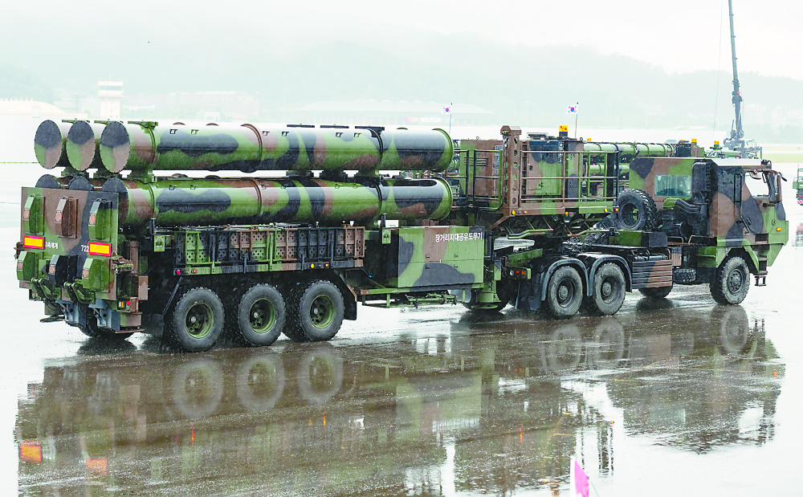

# 170件武器装备亮相韩国大阅兵，韩媒：数量众多，堪称世界顶级的较少

【环球时报驻韩国特约记者
林森】韩国于9月26日举行了号称“十年来最大规模”阅兵式，多达170件各类武器装备亮相引发外界普遍关注。从动用的武器装备数量来看，此次阅兵也堪称韩国有史以来规模最大的一次，包括远程防空导弹（L-SAM）、“爱国者”防空导弹、国产“天弓”中程防空导弹、“天橆”多管火箭炮、无人潜艇、K-9自行火炮、“玄武”地对地导弹、小型无人机等。不过韩国媒体也承认，这些武器虽然数量众多，但真正堪称世界顶级的较少，甚至发动机、制导雷达等关键设备和零部件，很多需要美德等西方国家的支援和许可。因此未来韩国想要大规模出口武器，还可能面临“卡脖子”问题。

_对朝打击武器接连亮相_

作为反制朝鲜导弹的关键，韩国近年一直在推动“韩国型三轴作战系统”，即可在30分钟内打击朝鲜核导等核心目标的杀伤链系统，此次阅兵亮相的“玄武-4”弹道导弹就是其中之一。“玄武”导弹由韩军自主研制，目前“玄武-1”系列已全部退役，“玄武-2”和“玄武-3”分别是近程弹道导弹和巡航导弹，而此次展示的“玄武-4”是由“玄武-2”导弹改进而成，“玄武-4-1”为地对地弹道导弹，“玄武-4-2”为舰对地弹道导弹，“玄武-4-4”为潜射弹道导弹。“玄武-4”导弹也被称为“怪物导弹”，弹头重量超过2吨，射程达800公里，号称能摧毁各种指挥掩体和核导基地。韩国军方官员称，“玄武-4”导弹的对地攻击能力是美国GBU-57巨型钻地炸弹的2-3倍，因此也被称为“地下堡垒破坏者”。

韩国“玄武-4-4”型潜射弹道导弹由“岛山安昌浩”级潜艇搭载，号称“可毫无预警接近朝鲜南浦港，对朝鲜发动突袭”。不过“玄武-4-4”导弹太大，而韩国潜艇吨位偏小，目前韩国所有实战部署的潜艇一共也只能搭载50枚左右。作为补充，韩国加大“玄武-4-2”舰对地弹道导弹的实战部署。据悉，计划于明年年底服役的“正祖大王”号驱逐舰可装备24枚“玄武-4-2”导弹，韩国下一代驱逐舰KDDX可装备16枚“玄武-4-2”导弹。

此外，韩军正在研制“玄武-5”导弹，最大射程为3000公里，弹头重量更是高达8-9吨，威力堪称“小型核武器”。韩军的设想是，凭借高当量弹头，“玄武-5”可以对地下100米的目标实施打击，从而威胁到位于地下100米左右的朝鲜核心指挥机构。韩军消息人士称，“玄武-5”将作为韩军的“秘密武器”秘而不宣，一旦朝鲜进行大规模军事动作，才对外披露以增加对朝威慑。

**韩国版“萨德”首次公开**

作为韩国型导弹防御系统的核心作战装备，韩军正在研发的L-
SAM也首次在这次阅兵式上对外公开。该导弹属于高空防御武器，负责在50-60公里高空拦截来袭弹道导弹，未来的改进型号将最大拦截高度提高到100公里，更接近美国“萨德”反导系统。L-SAM无法拦截的低空导弹将由“爱国者-2/3”防空反导系统和韩国产M-
SAM中程防空导弹改进而来的“天弓-II”反导系统接棒拦截。韩军认为，一旦韩国型导弹防御系统建成，将有较高概率对朝鲜发射的导弹进行多层拦截。

今年上半年，正在研发的L-
SAM进行了第四次试射并取得成功。在这四次试射中，共有3次成功击中目标导弹。据悉，在第四次试射中，L-SAM导弹采用的是精确引导战斗部和“碰撞杀伤”技术，在目标高度成功确定靶弹的发动机并精确撞击进行摧毁。这也是韩国首次完成相关技术试验。韩国媒体介绍说，“碰撞杀伤”技术起源于上世纪的海湾战争，当时采用破片杀伤战斗部的美军“爱国者”反导系统虽然成功拦截伊拉克的“飞毛腿”弹道导弹，但没有被完全摧毁的“飞毛腿”导弹落到地面，造成二次伤害。此后美军开始研发“碰撞杀伤”技术，以确保直接在空中摧毁目标导弹，并将技术应用于目前的“萨德”和“标准-3”等反导导弹上。韩国国防部计划2024年完成L-
SAM后续测试评估及全部研发，2025年开始量产，本世纪20年代末开始批量部署。

此外，26日阅兵式上展示的由新成立的无人机作战司令部负责的多型小型无人机也引起了外界关注。其中包括具有隐形功能的小型无人机、自杀式无人机、远程侦察用无人机，表明韩军已具备无人机体系化作战能力。此外，能监视100公里外目标的中空无人侦察机以及水面无人艇、水下无人航行器也公开亮相。

_韩国新武器“心脏病”遭诟病_

尽管韩国在这次阅兵式上创纪录地展出了多种武器，但韩国《东亚日报》27日明确点出，当前韩国武器系统还存在缺乏核心技术和零部件问题。报道称，随着韩国首架自主研发的战斗机KF-21即将进入量产，外界对该战机的关注度也与日俱增。但实际上KF-21的“心脏”——发动机是韩国根据从美国通用电气公司获得的F414发动机设计图在韩国许可生产。因此，说FK-21使用的是美国发动机并不为过。目前世界上只有6个国家（美国、英国、法国、俄罗斯、中国和乌克兰）拥有现代航空发动机技术。报道称，飞机发动机的研发难度与汽车发动机根本不在一个层级。航空发动机需要将重达数十吨的飞机送上天空，并实现超音速飞行。技术挑战不仅在于承受1500度以上高温的材料，同时还必须具备可运行数千至数万小时的可靠性。韩国现在研制的战斗机，无论是KF-21还是轻型攻击机FA-50，使用的都是美国发动机。因此，韩国想向其他国家出口这些战机，都需要预先获得美国批准。如果美国说“不”，韩国的出口订单就只能泡汤了。类似情况还出现在韩国地面主战装备上。例如2020年韩国与阿联酋签订K-9自行榴弹炮出口合同时，由于K-9自行榴弹炮使用的是德国发动机，最终因为德国政府禁止该发动机出口到中东多国，导致韩国此番军火出口被迫中止。

就在韩国展示新武器进行阅兵的当天，韩国新武器试验再次发生事故，并造成人员伤亡。据韩国《每日新闻》报道，韩国防卫事业厅26日晚间对外证实，在庆尚北道浦项市附近海岸边进行的新一代两栖攻击装甲车“KAAV-Ⅱ”原型车测试时发生浸水事故，车上相关公司两名员工不幸身亡，有关方面正在调查事故原因。据悉，“KAAV-Ⅱ”装甲车是未来准备部署给韩国海军陆战队的下一代两栖突击车，其目标是使用韩国国产发动机，将水中时速从13.2公里提高到20公里以上，同时搭载40毫米口径机关炮及可拆卸式装甲，以提高机动性和火力及防护性能。分析人士认为，韩国在国防工业领域的技术积累有限，尽管从外表上看，韩国武器在国际上相当显眼，但想要真正掌握核心技术，还需要克服诸多难关。

