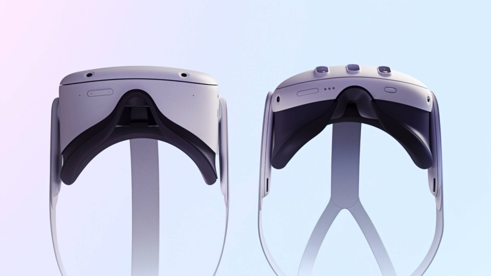
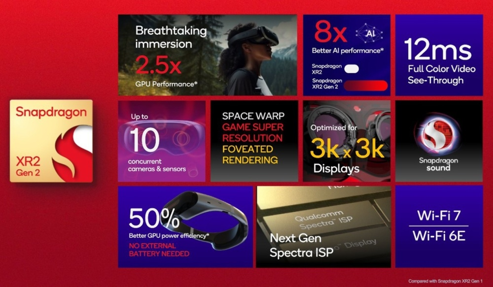
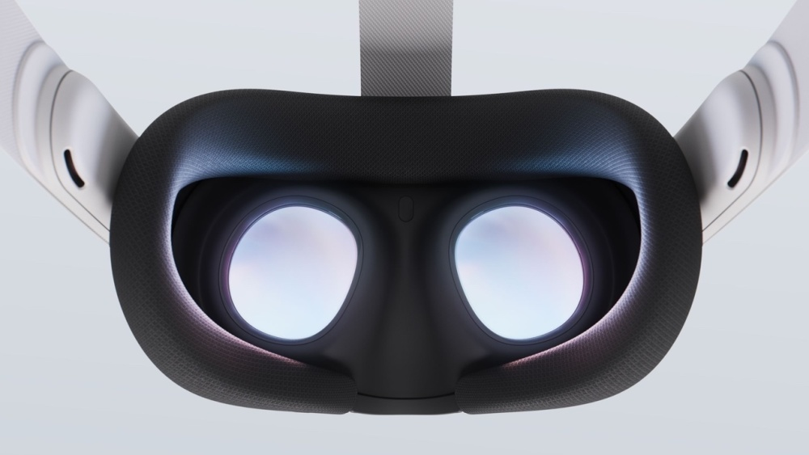
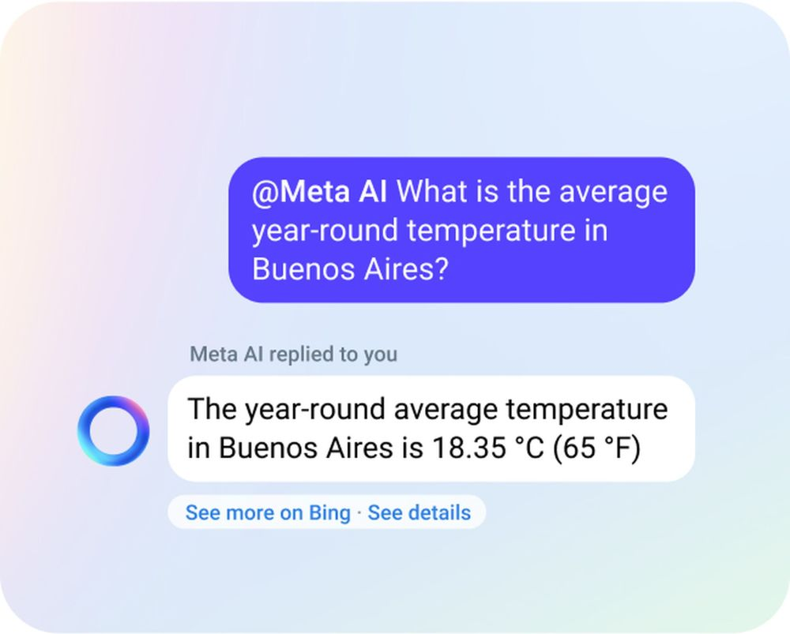
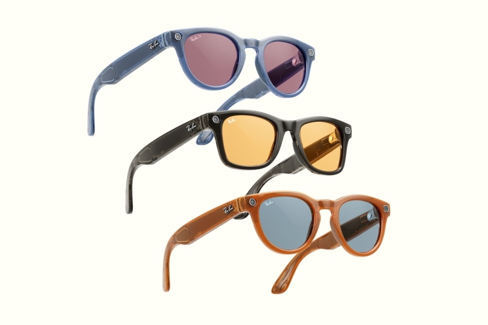
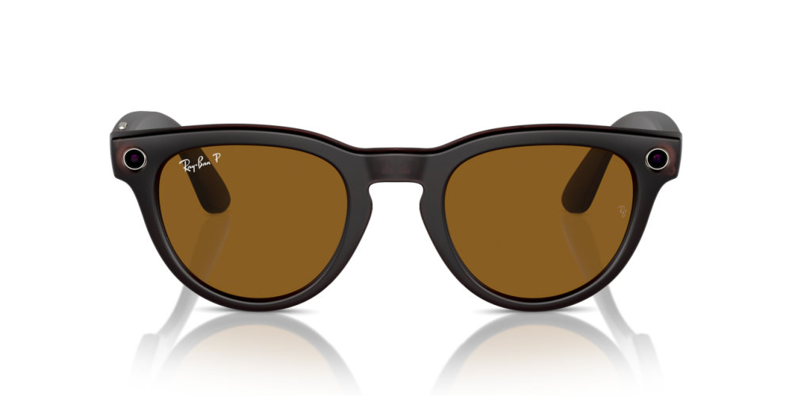

# Meta深夜放大招：Quest 3挑战Vision Pro，生成式AI面向消费者开放

腾讯科技 文/吴彬

扎克伯格终于填上了他挖了四个月的坑。

在今年6月初，扎克伯格为了让自家的头显设备不至于埋没在苹果Vision Pro的声浪中，提前几天公布了Quest
3的消息，而在等待了四个月之后，这款对于Meta来说意义重大的虚拟现实设备得以正式亮相。

在今天凌晨举行的Meta Conncet大会上，小扎带着Quest
3正式亮相，而一并到来的，还有Meta面向消费者推出的生成式AI机器人，它拥有一个简单粗暴的名字——Meta AI。

**Quest 3发布：硬件设计大改，加入彩色透视功能**

作为Conncet大会上最为重要的产品，Quest 3的亮相备受关注。扎克伯格在6月初公布这款头显设备的时候已经确认，Quest 3相比上一代的Quest
2在整体的机身重量上更薄。

这一代Quest 3在机身整体设计上进行了全面的改进，采用了新的Pancake镜片结构设计，使得Quest
3的机身厚度整体薄了接近40%。从顶部向下看，今年的Quest 3确实长得很像苹果的Vision Pro。

而且在使用了全新的镜片设计后，为了增加产品的稳定性，Quest
3拥有了一条新的头带，顶部的带子被分成两条，在用户头上可以更好地分散重量。但头显的整体重量并没有因为全新的设计得到改善，反而Quest
3相比上一代在重量上有所增加，达到了515g，上一代Quest 2只有503g。

核心硬件部分，Quest 3 搭载了高通公司全新的骁龙XR2 Gen 2芯片，这颗芯片整体的GPU性能相比上一代提升了2.5倍，AI性能提升高达8倍。

配合内置的8GB内存，Meta表示Quest 3实际的图形性能是Quest 2的两倍，甚至比运行XR2 Gen1芯片的Quest
Pro还要强。高通表示XR2 Gen 2的平均透视延迟仅为12毫秒，与苹果的Vision
Pro相当，但他们也强调这取决于其合作伙伴的设备传输的图像分辨率大小。

Quest 3依然采用了双目镜片的结构，每只眼镜前面都有分辨率为2064x2208的LCD显示屏，分辨率相比Quest
2的1832x1920（参数）进一步提升，这将使得用户在头显内阅读文本时更容易，屏幕支持90Hz / 120Hz刷新率。

Quest 3的水平视场角为110度，垂直视场角为96度，比Quest 2增加了约15%，比Quest
Pro也更大，用户可以使用头显外部的滚轮来调整镜片距离，以适应不同用户的瞳距。设备上的扬声器也有所改善，Quest
3在提供高质量音频体验的同时减少了声音的泄露。

除了整体结构上的变化外，这一代Quest
3相比上一代最大的改进来自于外部的镜头和传感器。这一代的头显设备前面拥有两个全新的彩色摄像头以及一个类似激光雷达一样的空间扫描传感器。

新的摄像头首次为Quest头显提供了彩色的外部环境视觉采集，全新加入的传感器可以帮助用户快速构建空间内物体和墙壁的位置，使得设备可以自动设置虚拟护栏，从而避免用户撞到障碍物上。

通过摄像头和传感器的配合，Quest
3提供了两种完全不同的工作模式，包括了沉浸的“VR模式”或所谓的“混合模式”，后者可以让用户既看到现实世界的环境，也可以看到你正在查看的任何游戏或内容。要想在两种模式之间切换，可以使用手柄或敲击两次头显切换。

手柄部分也进行了重新的设计，Meta取消了Quest 3 Touch
Plus手柄上大的定位环，转而采用红外传感器来定位，还提供了更好的触觉反馈。此次Quest
3还支持手部追踪，一定意义上，用户操作头显的时候可以完全放弃手柄来使用。

续航方面，Meta称Quest 3的续航大约为两小时十二分钟，跟Quest 2一致。Meta将为Quest 3提供可选的外接电池，可以延长Quest
3几个小时的电池续航时间，这也和之前的Quest 2一样。

最后是价格，128GB存储空间的Quest
3售价499.99美元（约3649元人民币），512GB的版本售价649.99美元（约4751元人民币）。Meta同时发布供Quest
3及其控制器充电的充电座，售价129.99 美元（约950元人民币），这是Meta首次为头显配备无线充电座。

**生成式AI面向消费者开放，Meta要跟ChatGPT掰手腕了**

除了Quest 3头显之外，生成式人工智能应用的落地，成为了今年Connect大会上又一核心看点。Meta继之前发布Llama
2开眼语言大模型后，此次宣布正式加入人工智能聊天机器人大战，推出了属于自己的Mate
AI，并宣布其能力全面接入WhatsApp、Instagram和Messenger等应用。

Meta AI基于Llama
2大型语言模型定制，Meta将其视为一个通用型的AI助手，可以处理从群聊消息的归纳整理到用户点对点提问等各种不同的应用场景的问题。并且Meta也同时宣布与微软Bing合作，在聊天中为用户提供实时网络搜索的结果，这使得Meta
AI与许多其他没有最新信息的免费AI生成式工具有着明显的区别。

同时类似的能力也接入到了Instagram上，Meta提供了一套全新的AI图像编辑工具，允许用户借助人工智能的能力，重新生成设计样式和图片背景。在演示中，Meta通过输入文本提示，例如水彩或杂志拼接实现整个图片风格的二次定义，再或者通过“用小狗包围我”这样的提示去更换照片主体之外的背景。Meta表示，对于这两种编辑功能，它将识别何时使用人工智能工具创建图像，以便观众可以辨别他们所看到的内容是合成的还是人类生成的。

除了Meta
AI之外，Meta还在其消息应用中推出了28个人工智能建立的虚拟人物，他们都是知名人物或者电影中的角色，包括了像德文·韦德、克里斯·保罗、肯德尔·詹纳等等，用户可以选择与这些人物进行对话，他们都是由Meta的AI生成的。

扎克伯格透露，Meta还在建立一个平台，开发人员和普通人都可以用它来创建自己的定制AI机器人，这些机器人将在Instagram和Facebook上拥有个人资料，最终以虚拟世界的化身出现。

很显然Meta AI的推出，其目标是在人工智能领域的疯狂竞争中，让Meta与
包括OpenAI、谷歌、微软和其他头部公司有相同的话语权。Meta希望通过人工智能更加深入的普及到旗下每一个产品中，增加用户的参与度，从而实现更多广告方面的收入提升。

**意外的产品：联手雷朋定制的第二代眼镜**

如果说Quest 3是意料之中，Meat AI是大势所趋，那在此次Connect大会上，最让人意想不到的新品，是Meta与雷朋推出的第二代眼镜产品。

在2021年，Meta就和雷朋合作发布过雷朋Stories智能眼镜，当时这个眼镜可以提供拍摄照片和视频，分享冒险经历，以及听音乐或打电话等功能。但在推出后，这款产品遭遇滑铁卢，不但销量不及预期，而在已经购买产品的用户中，用户留存率相当惨淡。

本以为Mate会放弃这个失败的产品，但没想到今年“它”卷土重来。

此次Meta和雷朋推出的第二代眼镜，直接被命名为“Ray-Ban
Meta”智能眼镜，现已开放预订，并将于10月17日发售，起价299美元（约2186元人民币）。

和我们目前见过的带有AR属性的智能眼镜不同，这副“Ray-Ban Meta”智能眼镜没有屏幕，因此在功能上相对会比较单一。

这副眼镜可以实现两个基础功能，首先是聆听。眼睛本身拥有一组开放式的扬声器，可以让用户在佩戴眼镜的时候，听到由眼镜腿扬声器放出的声音，另外这一代的眼镜对于声音的外泄做了重新的设计，保证佩戴者更大的隐私安全。

另外这个新眼镜中，Meta还对麦克风系统进行了大幅的升级，在眼睛上有五个麦克风，其中一个位于鼻梁处，帮助用户可以更好的进行通话和语音命令输入。

第二个基础功能是拍照。这款智能眼镜镜腿上配有小巧的摄像头，可以拍摄1200万像素的照片或者是1080p级别至多30秒的视频。眼镜本身提供了32GB的存储空间，这意味着使用者可以拍摄大约500张照片或者是100个30秒的短视频。

通过这个摄像头，用户现在还可以通过在眼镜腿上轻按几下来开始在Facebook或Instagram上进行直播。当用户录制视频时，镜头周围的白色灯光会持续闪烁，以提示外界佩戴者正在录制视频，以保证隐私的透明化。

全新的眼镜内部，使用了高通提供的全新Snapdragon AR1 Gen 1
处理器，高通声称该处理器可以在低于1W功耗的封装芯片中，提供“用于眼镜的人工智能”能力，用户可以通过语言交互和眼镜实现对话，通过语音指令控制眼镜。

续航方面，Meta表示雷朋智能眼镜内的电池可持续使用四到六个小时，附带的盒子还可以为智能眼镜再充电八次。

