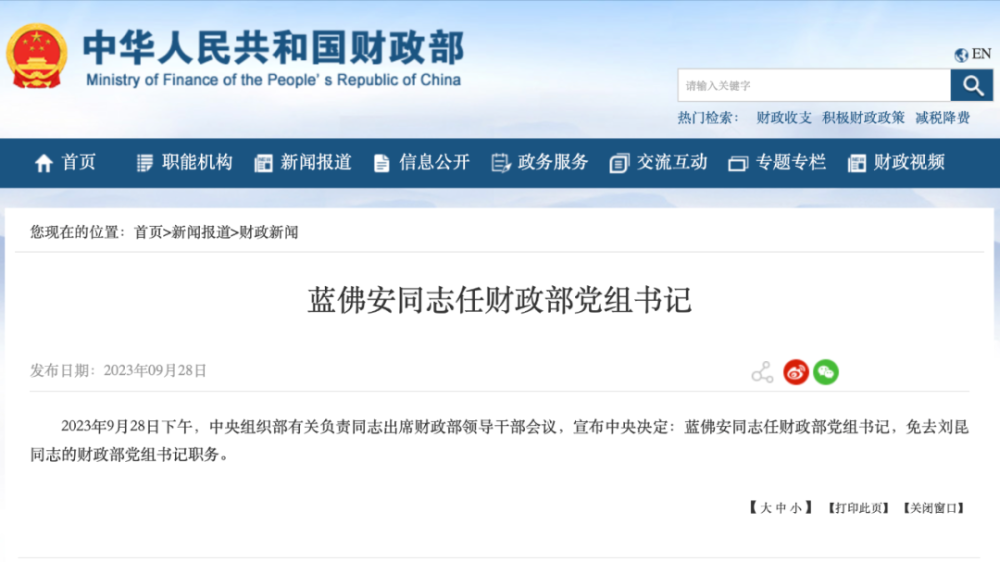
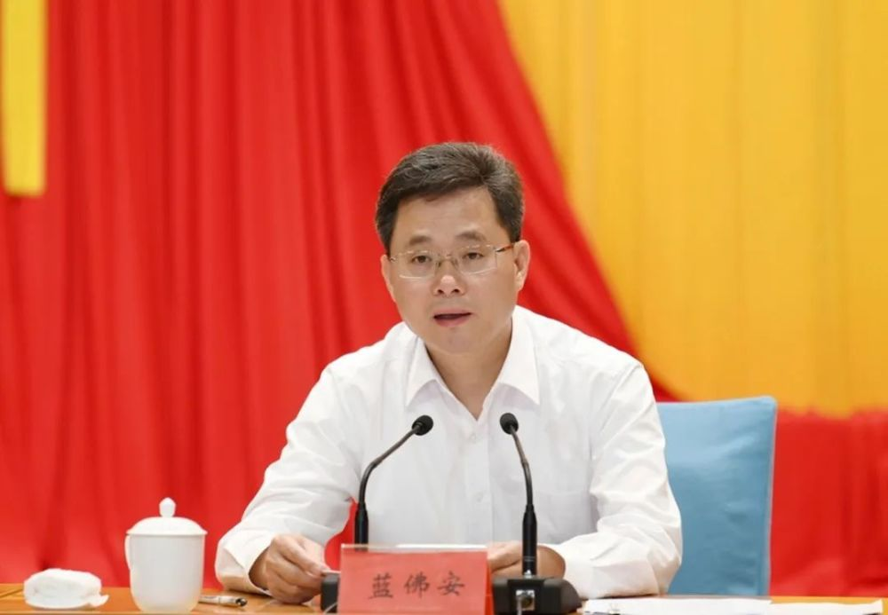
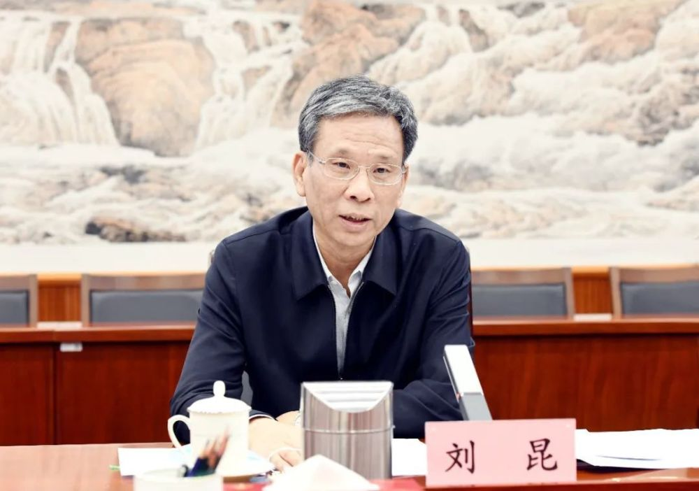

# 中央决定：蓝佛安任财政部党组书记

据财政部官网消息，‍‍‍9月28日下午，中央组织部有关负责同志出席财政部领导干部会议，宣布中央决定：蓝佛安同志任财政部党组书记，免去刘昆同志的财政部党组书记职务。

_截图来源：财政部官网_

此前，蓝佛安为山西省委书记，刘昆为财政部党组书记、部长。新华社28日上午发布消息：日前，中共中央决定：蓝佛安同志不再担任山西省委书记、常委、委员职务，另有任用。‍‍‍‍

 _蓝佛安 资料图_

公开资料显示，蓝佛安出生于1962年6月，广东惠东人，曾任广东省东莞市副市长，省财政厅副厅长，省审计厅党组书记、厅长，韶关市委书记等职，2016年1月任广东省副省长，2017年3月任海南省委常委、省纪委书记。

2021年4月，蓝佛安任山西省委副书记，同年6月当选山西省省长。他是第十九届中央纪委委员、第二十届中央委员。

 _刘昆 资料图_

刘昆出生于1956年12月，广东饶平人，曾任广东省政府办公厅副主任，省政府副秘书长（正厅级），省财政厅厅长、党组书记等职，2010年7月任广东省副省长，2013年5月任财政部党组成员、副部长，2016年12月任全国人大常委会机关党组成员、全国人大常委会预算工作委员会主任、第十二届全国人大财经委员会副主任委员。

2018年3月，刘昆任财政部党组书记、部长。他是第十九届中央纪委委员。

