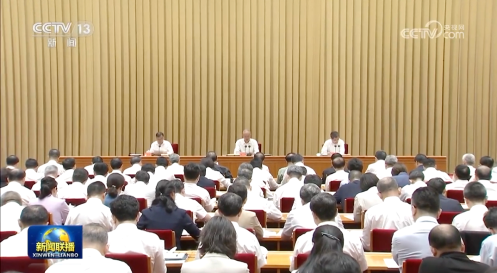

# 中央多次部署！聚焦“第五疆域”，国安部部长：这是“最重大的隐患”

**撰文 | 余晖**

据“国家安全部”微信公众号9月27日消息，近日，国家安全部党委书记、部长陈一新在《中国网信》杂志刊发了署名文章。

文章的标题是《加强数字时代的国家安全治理》。

陈一新指出，数字时代国家安全治理面临重大挑战，目前最重大的隐患是关键信息基础设施遭受攻击，最现实的危害是网络危安事件频发。

**没有网络安全，就没有国家安全**

“网络安全和信息化”备受中央关注。

2014年，中国互联网发展进入第20个年头。当年2月，中央网络安全和信息化领导小组第一次会议召开，习近平总书记担任组长。

2018年4月，党和国家历史上首次全国网络安全和信息化工作会议在北京召开。

在那次会议上，习近平强调， **没有网络安全就没有国家安全，就没有经济社会稳定运行，广大人民群众利益也难以得到保障。**

今年5月30日，二十届中央国家安全委员会第一次会议召开，这也是二十届中央国家安全委员会的首次亮相。

这次会议提到，国家安全工作要“ **提升网络数据人工智能安全治理水平** ”。

7月14日至15日，全国网络安全和信息化工作会议召开。

中共中央政治局常委、中央书记处书记蔡奇出席会议并讲话，中共中央政治局常委、国务院副总理丁薛祥出席会议并传达了习近平重要指示。

上述会议指出，要“ **实施网络安全重大战略和任务，构建大网络安全工作格局，筑牢国家网络安全屏障** ”。

出席那次会议的有中央统战部部长石泰峰、国务院副总理何立峰、中央军委副主席张又侠、中央政法委书记陈文清、公安部部长王小洪、国务院秘书长吴政隆等。

新闻画面显示，陈一新也参加了那次会议。

**“第五疆域”**

中央多次强调网络安全的背后，也有现实根据。当前，网络空间已日益成为维护国家安全的新战场。

2022年8月，《中国网信》杂志刊文称， **网络空间已经成为继陆、海、空、外太空之后的“第五疆域”** ，是国家捍卫主权、保障安全和发展利益的重点领域。

据国家安全部此前披露， **2022年以来，我国网络安全机构已披露多款美情报部门网络攻击武器**
，如“电幕行动（Bvp47）”“量子(Quantum)”“酸狐狸（FOXACID）”“蜂巢（Hive）”等。

近日，中国国家计算机病毒应急处理中心通报，在处置西北工业大学遭受网络攻击时，成功提取了名为“二次约会”的间谍软件样本。

该软件为美国国家安全局开发的网络“间谍”武器，在遍布全球多国的上千台网络设备中潜藏隐秘运行。

9月25日，外交部发言人汪文斌在回答记者提问时提到，美国政府一方面对中国进行无孔不入的网络窃密，给中国网络安全带来巨大风险，另一方面又不断制造和散布“中国黑客攻击论”的虚假信息，是典型、虚伪的政治操弄。

**最重大的隐患**

政知君注意到，陈一新的这篇文章共分为三部分，包括：

“牢牢把握数字时代国家安全治理的根本遵循”

“牢牢把握数字时代国家安全治理的重大挑战”

“牢牢把握数字时代国家安全治理的工作着力点”

陈一新写道，加强数字时代国家安全治理不仅面临重大机遇，也面临重大挑战。

最主要的较量是网络空间大国博弈日趋激烈。

最突出的短板是关键核心技术受制于人。

**最重大的隐患是关键信息基础设施遭受攻击。**

最现实的危害是网络危安事件频发。

最显著的变量是网络新技术加速迭代。

文章提到，关键领域核心技术受制于人的局面仍未改变，尤其在 **高端芯片、基础协议、高级人工智能、通信服务设备** 等方面，同国际先进水平相比还有很大差距。

**金融、能源、电力、通信、交通** 等领域运行网络已成为境外网络攻击的 **重点目标**
，这些设施一旦被入侵、控制、篡改或破坏，就可能导致交通中断、金融紊乱、电力瘫痪等严重后果。

近年来，针对我国 **党政机关、国防军工、科研院所** 等单位的网络攻击窃密活动日益呈现出组织化、规模化、持续化等特征，
**带来严重的失泄密隐患，甚至威胁核心人员安全和技术安全** 。

文章还提到：

互联网日益成为各类风险的策源地、传导器、放大器，
**一件小事情都可能成为舆论漩涡，一些谣言传闻经煽动炒作，极易使“茶杯里的风暴”聚变为现实社会的“龙卷风”。**

网络暴恐风险犹存，大量涉暴恐音视频信息在网络渠道的传播路径更加多样、手法更加隐蔽， **相关风险由境外向境内倒灌的危害依然复杂** 。

人工智能“深度伪造”、区块链技术等， **为政治谣言和有害信息的生成、传播提供了隐匿的方式和渠道。**

在应对措施方面，陈一新提到，要坚持党的领导，强化政治引领；坚持体系推进，健全体制机制；坚持规划引领，强化要素支撑；坚持法治保障，提高善治水平。

要完善网络空间国家管理体制，增强战略性、基础性数据资源管控，提升风险感知预警和防护能力，推动安全治理模式向事前预防转型，
**完善重点领域安全防护体系和重要治理议题协调指挥体系** ，打造专业化支柱力量。

要 **瞄准量子计算、人工智能** 等重大科技工程问题，健全关键核心技术攻关新型举国体制，保障关键领域应用安全。

贯彻落实新修订的《中华人民共和国反间谍法》，运用法治思维和法律武器作坚决斗争。

**资料 ｜ 新华社 人民网 中国网信杂志 国家安全部微信公众号等**

**【版权声明】本文著作权归政知新媒体独家所有，未经授权，不得转载。**

