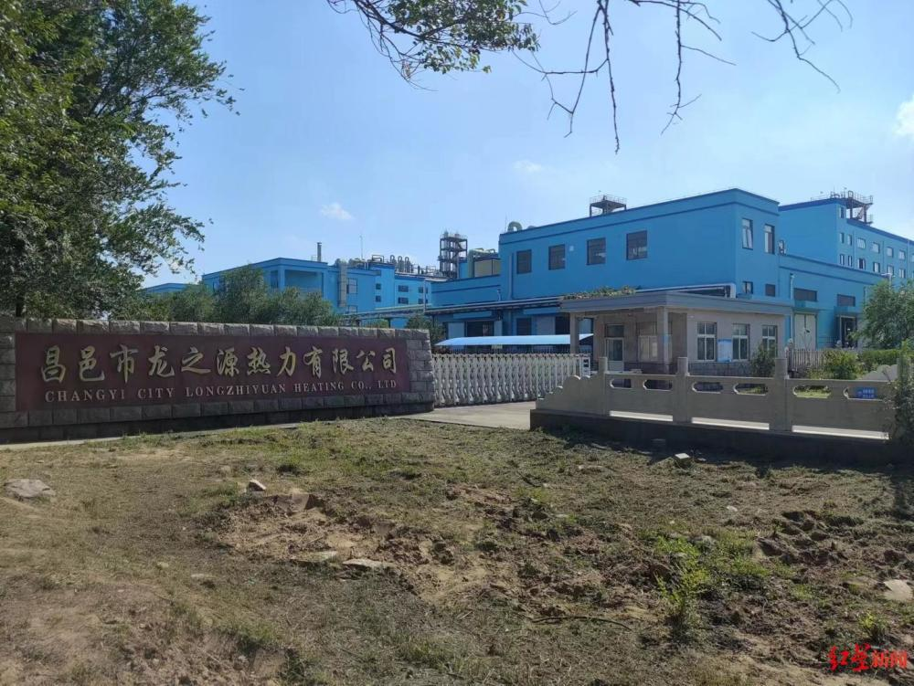
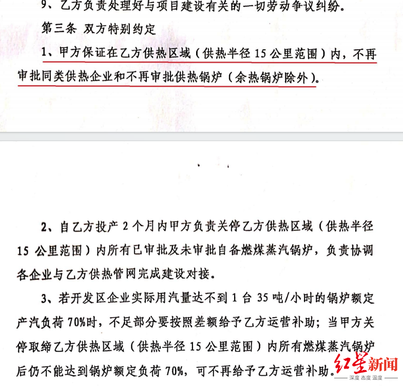
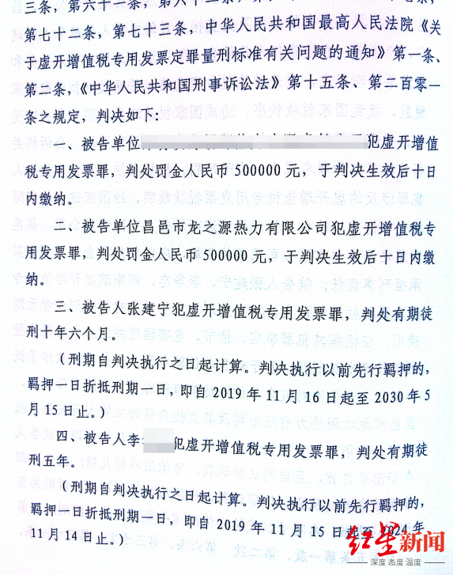
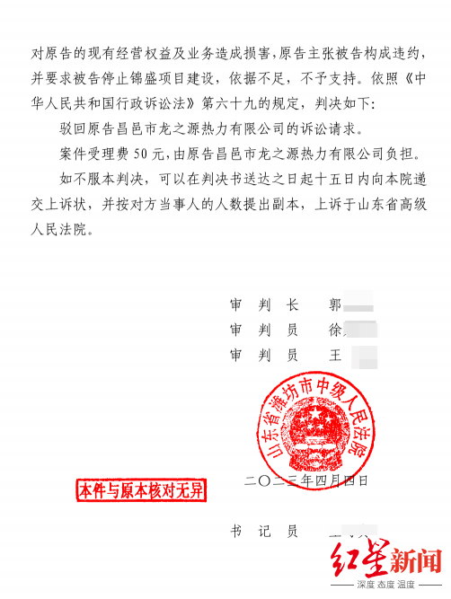

# 山东潍坊一企业家回乡创业多年后获刑，涉虚开增值税发票罪被判十年半

在北京攻读硕士毕业后的张建宁决定回乡创业，多年后，他因涉税犯罪身陷囹圄。

张建宁是山东省潍坊市昌邑市人，从2009年开始，以北京京龙源热能科技有限公司（下称京龙源公司）的名义分别与昌邑市沿海经济开发区管委会和滨海（下营）经济开发区管委会签订了两个投资协议，注册昌邑市新源热力有限公司（下称新源公司）和昌邑市龙之源热力有限公司（下称龙之源公司），为昌邑市的两个工业园区分别建设集中供热项目。协议中约定，保证项目为园区唯一的供热站，在项目供热区域（供热半径15公里范围）内，不再审批同类供热企业和不再审批供热锅炉（余热锅炉除外）。

 _▲龙之源公司_

在经历多年亏损、两家公司开始盈利后，政府批准当地一国有企业在龙之源公司隔壁建起了同类热力项目。龙之源公司认为昌邑市政府失信违约，遂提起行政诉讼，目前本案处于二审调解阶段。

针对此案，昌邑市司法局负责此次行政诉讼的工作人员接受红星新闻采访时表示，目前双方正在调解，都已提交了调解意见。

此外，张建宁等数名公司高管被当地公安机关以涉税犯罪为由抓捕，一审被潍坊市中级人民法院以虚开增值税专用发票罪判处有期徒刑十年六个月，目前案件处于二审阶段。

红星新闻记者致电采访山东省高级法院，该法院工作人员表示：“目前，两起案件都在审理过程当中。”

**研究生毕业后**

**他放弃留京机会回山东老家创业**

龙之源公司股东戴志杰说，张建宁是山东昌邑本地人，以高分考取了华北电力大学的研究生，专业是工商管理。在校期间，张建宁对锅炉节能减排产生兴趣，研发了一项锅炉节能减排技术。“技术研发出来之后，我们在昌邑承包了两家公司的锅炉做试点，试验效果非常好，由此开始创业之路。”

张建宁的父亲表示，因为受到自己的影响，儿子研究生毕业时，正好昌邑市政府招商引资，张建宁就决定放弃留京机会，回到家乡投资创业，回报家乡。

2009年，张建宁以京龙源公司的名义与昌邑市沿海经济开发区管委会签订了《项目投资协议》，成立新源公司，投资建设昌邑柳疃工业园集中供热项目。协议中承诺，“该项目自签订合同之日起，作为园区唯一的供热站。”

2011年，京龙源公司又与滨海（下营）经济开发区管委会签订《项目投资协议》，成立龙之源公司，投资建设下营化工产业园集中供热项目。协议中承诺，“保证乙方供热区域（供热半径15公里范围）内，不再审批同类供热企业和不再审批供热锅炉（余热锅炉除外）。”

_▲相关协议_

戴志杰回忆说：“项目运营前期，由于园区入驻企业少，一直是亏损经营，那段时间张建宁带着我到处借钱，把亲戚朋友借了个遍，压力特别大。”

2016年，随着园区入驻企业的不断增多，两家公司经营终于扭亏为盈。

**为公司设备升级改造焦灼**

**不久后又卷入涉税案件**

2019年，因环保新政策，山东省要求淘汰35吨每小时以下燃煤锅炉，龙之源公司向昌邑市政府相关部门申请集中供热锅炉升级改造，但一直未获最终批准。

“龙之源公司的申请虽然在2019年6月21日获准立项，但之后的环评审批一直办不下来。因园区用热需求不断增加，设备升级改造申请迟迟不能获批，导致锅炉燃煤指标和环保排放指标都不够用，若继续生产会发生超排违法。2019年11月5日，龙之源公司减产减排。后经谈判，政府方面承诺对因恢复生产而产生的排放超标不予处罚。公司于数日后恢复生产，但设备升级申请仍未获批。龙之源公司向上级部门进行投诉。”戴志杰说。

公司在为设备升级改造焦灼，张建宁不久后又卷入涉税案件。

潍坊市中院一审刑事判决书显示，2019年11月16日，张建宁涉嫌虚开增值税专用发票罪被刑事拘留，同年12月22日被逮捕。一同被逮捕的还有公司财务负责人和煤采部负责人。

**一审获刑10年半后上诉：**

**无骗税目的，客观上未造成国家增值税损失**

潍坊市检察院于2021年12月2日向潍坊市中院提起公诉，起诉书显示，2016年至案发，被告人张建宁指使被告人李某某通过虚开增值税专用发票的方式虚增经营成本，为被告单位新源公司、龙之源公司等公司偷逃税款。被告人李某某核算出需要虚开的增值税专用发票数额后，自已联系杨某某（另案处理），并指使被告人邹某某联系张某某、李某（另案处理）为上述公司大量虚开增值税专用发票，并抵扣税款。2016年1月1日至2019年10月31日，上述公司共计虚开增值税专用发票金额人民币近3亿元，税额人民币约4200万元，价税合计人民币约3.3亿元。基于上述事实、情节和社会危害程度，检察机关建议判处张建宁有期徒刑十至十二年，其他被告人也都进行了量刑建议。

2022年11月29日，在张建宁等人被羁押3年多时间后，潍坊市中院一审开庭审理了此案。

庭审期间，针对检方指控，被告人张建宁及其辩护律师辩称，张建宁不构成虚开增值税专用发票罪。本案增值税专用发票项下的煤炭存在真实的交易，没有骗取增值税的目的，即便认定开票企业和涉案单位没有实际交易，国家增值税款在此环节也没有实际损失。被告单位已经在案发后、开庭之前，将起诉书中认定的多抵扣的人民币进项税余额（留抵）全部移除，填补了公诉人指控的“多抵扣”的全部税款，应对被告单位不予追究本罪刑责。

潍坊市中院审理后认为，被告单位、张建宁等人违反中华人民共和国发票管理规定，虚开增值税专用发票，并通过抵扣骗取国家税款，扰乱国家税收秩序，造成国家税款流失，国家利益遭受重大损失，其行为均已构成虚开增值税专用发票罪。

2023年6月21日，潍坊市中院作出一审判决，判处张建宁有期徒刑十年六个月，其他被告人也分别获刑。

_▲张建宁一审被判十年六个月_

一审判决作出后，被告单位和张建宁等均提出上诉。张建宁在上诉状中表示，涉案企业是从上游公司买煤后，将超出生产需要的部分煤炭交由他人无票销售，但这应属于销售煤炭不开票的行为，而非虚开，企业没有骗取增值税的主观目的，客观上也没有造成国家增值税的损失。本案中所有涉案发票均足额申报纳税，所有开票单位也全部没有因涉案发票接受过税务部门或者司法部门的处罚，及开票单位的开票行为没有被有关部门确认为违法。法院却对被告单位接受发票的行为认定为虚开增值税专用发票犯罪，不符合基本的逻辑。

目前，本案处于二审阶段，尚未作出判决。

**涉事企业提起行政诉讼**

**市政府答辩称限定性条款应认定为无效条款**

在刑事案件发生的同时，龙之源公司以昌邑市政府失信违约为由，向潍坊市中院提起了行政诉讼。潍坊市中院2022年10月立案后，于2023年1月10日开庭审理了此案。

据该案一审判决书显示，原告龙之源公司诉称，原告经招商引资、根据其与被告委托的派出机构即昌邑滨海（下营）经济开发区管理委员会于2011年12月30日签订《项目投资协议》，注册成立昌邑市龙之源热力有限公司，并投资建设下营化工产业园集中供热项目。前述投资协议中被告承诺“保证乙方供热区域（供热半径15公里范围）内不再审批同类供热企业和不再审批供热锅炉”。近三年来，被告及其下属相关机构对于原告设备更新升级改造工作多有掣肘。此外，被告及其下属相关部门置前述协议中白纸黑字明确的“独家经营”承诺于不顾，且悖于《循环经济法》以及《政府投资条例》，通过其全资国有企业昌邑锦盛环保能源有限公司在原告一墙之隔建设与原告直接构成冲突的供热项目。被告及其相关机构与原告签订的投资协议真实合法有效。合同当信守，行政合同更应如此。故向法院提出诉讼请求：判令被告继续履行合同，责令其停止全资国有企业昌邑锦盛环保能源有限公司的（下营）热源项目建设。

对此，昌邑市政府答辩称，昌邑滨海（下营）经济开发区管委会不具有签订涉及供热特许经营内容协议的行政主体资格，不具有法定职权，其签订的涉及供热特许经营限定性条款应认定为无效条款；同时，政府批准新建热源是为公共利益，是为了替代原有的山东海天生物化工有限公司两台机组关停热源缺口，并未影响龙之源热力公司现额定蒸汽供应量，对其供热经营没有影响。

2023年4月4日，潍坊市中院作出一审判决。法院认为，《项目投资协议》中约定的供热特许经营限定性条款合法有效，但同时认为，锦盛项目是替代投资协议签订前就存在的其他热力公司被关停的机组，项目没有改变原被告之间投资协议签订的状态，也无证据证明会对龙之源现有的经营业务产生冲击，政府建设新项目是为了弥补供热缺口，是为了公共利益，不存在过错。法院判决，驳回龙之源热力公司的诉讼请求。

_▲一审判决驳回龙之源公司诉讼请求_

龙之源公司对此判决不服，提出上诉。

**行政诉讼案处于二审阶段**

**当地司法局称希望能调解成功**

目前，山东省高院已经受理上诉，该案件处于二审阶段。原被告双方正在法院主持下进行调解。

双方的书面调解意见显示：昌邑市政府主张为尽快促进争议妥善解决，希望能够收购龙之源公司和新源公司两个项目，收购方式采用资产收购方式；而龙之源公司表示，其愿意参照政府方提出的调解思路，由双方认可的省外第三方评估机构对在建的锦盛项目进行评估，然后由其进行收购。如果政府方确有收购其企业的意图，评估收购范围应该首先明确仅限于龙之源公司，不能包括与本案无关的新源公司；评估收购应既包括龙之源公司的现有资产又包括企业依约持续经营的可期待利益；收购工作必备的评估机构由双方共同在山东省以外的国内权威评估机构中选定。

针对此事件，昌邑市司法局负责此次行政诉讼的工作人员对红星新闻表示：“我们希望能够调解成功，双方达成一致意见。如果调解不成功，一切以法院判决为准。”

红星新闻记者 祁彪 张炎良

编辑 张莉 责编 任志江

