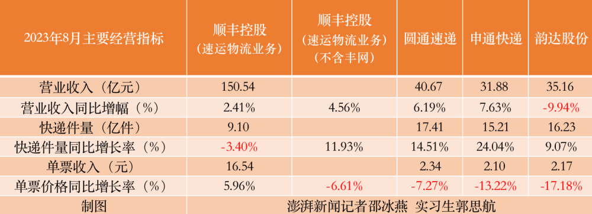
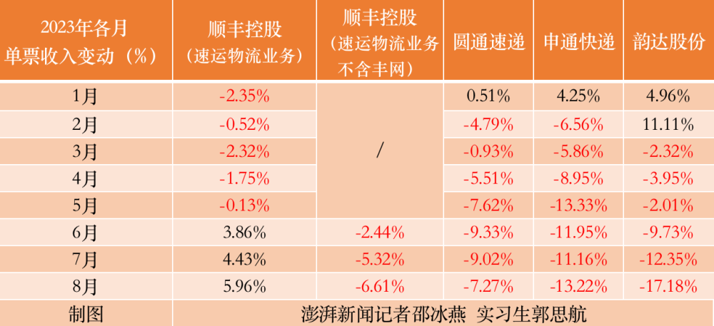

# 快递价格战今年没停过？淡季竞争激烈，网点没达指标一个月被罚十来万

**“今年快递战好像没有停过，同质竞争太激烈了。”**

**“价格战其实没停过，只是不同阶段力度不一样，业务压力很大。”**

近日，多家通达系快递公司的省区负责人向澎湃新闻记者如此描述价格战下面临的业务压力。快递行业恶性价格战追溯至2017年，随着后续监管部门的介入以及快递公司集中向高质量服务转型，价格战几乎于2021年下半年终结，但今年以来局部地区似乎再次“开战”，竞争态势进一步增强。

根据国家邮政局数据，今年上半年快递单票收入为9.31元，同比下滑4.3%。另据顺丰控股（002352）、圆通速递（600233）、申通快递（002468）、韵达股份（002120）四家A股快递公司近日发布的8月快递业务经营简报显示，含丰网业务的顺丰控股速运物流业务单票收入实现同比增长5.96%（其中经济快递板块中的丰网业务已于2023年6月完成转让交割），不含丰网的速运物流业务单票收入同比下滑6.61%。圆通、申通和韵达三家通达系A股单票收入都在2元以上，均同比下降，其中申通和韵达同比两位数下滑。

 _今年8月四家快递公司主要经营指标_

此外，8月四家通达系公司的业务量均实现同比增长，仅顺丰速运物流业务量同比下降，降幅为3.4%。而8月营收方面，顺丰、圆通、申通实现个位数小幅增长，韵达营收同比下滑近10%至35.16亿元。

截至9月27日收盘，顺丰控股报40.7元/股，涨0.74%；圆通速递报15.05元，涨2.1%；申通快递报10.25元，涨0.69%；韵达股份报9.73元，涨0.72%。

**局部地区快递价格战卷土重来**

澎湃新闻记者对比顺丰、圆通、申通、韵达四家快递公司2018年至2023年的8月单票收入数据发现，2021年及以前，各家快递公司的8月单票收入基本呈下降趋势。2022年8月单票收入普遍大幅上涨，但今年以来通达系单票收入再次回落。

_四家快递公司近五年8月单票收入情况_

另一方面，澎湃新闻记者还对比了今年前8个月的单票收入发现，通达系均在年初的1月同比有所上涨，自3月起单票收入同比逐月下滑。

具体来看，7月和8月，申通和韵达的单票收入同比降幅均超10%。与通达系相反，顺丰控股1月至5月的单票收入同比呈下降趋势，但6月至8月则明显上涨，且增幅逐步走高，分别达到3.86%、4.43%和5.96%。而以不含丰网业务的数据计算，6月至8月顺丰单票收入也是下滑，且降幅不断增大。

_四家快递公司今年前8月单票收入情况（同比）_

“今年以来单票价格持续下跌，不排除淡季带来的轻微掉价。”9月26日，澎湃新闻记者以投资者身份致电韵达股份证代，相关工作人员表示，从行业的价格趋势来看，2019年行业单票收入均为三元上下，2020年和2021年价格整体走低。2021年四季度，为保障快递小哥收入，各家均提价0.1元派费。2022年单票价格呈现平稳态势，但由于疫情影响，派费补贴走高，全年单价相对依然较高。今年，各家价格又出现一定的下滑。

此外，多位高管都在近期的业绩会上承认“当前低价竞争依然存在”，“竞争波动在预期内”等。并提醒业内“低价竞争得来的市场份额不可持续甚至会得不偿失”。

**卷土重来的价格战会带来哪些影响？**

有快递内部人士近日告诉澎湃新闻记者，快递价格战影响最直接的是派费下调的快递员和网点的业绩。对于小哥而言，如果收入不变，那需要送的件就更多了。

“价格战更多需要总部承担这部分的损益。”近日，某快递公司的省区负责人告诉澎湃新闻记者，快递员收入的保障是网络是否能稳定运营的关键，也直接影响公司总部的利润。

“价格战下，尽管有总部在兜着，但网点肯定受到影响。”一位通达系快递的网点负责人表示，要到处找客户，但哪家价格低，客户就往哪家去，“每个发件指标压力大，而指标这么高怎么完成，一个月都罚十来万。”

但也有上海地区的一位快递员告诉记者，其派费没有变化，近两年都维持在1元左右，“本来现在的派费就低，再低就没有人干活了。”

对于价格战“烽火不断”的原因，一位快递公司内部人员告诉澎湃新闻记者，近几年不少快递公司在大力投入基础建设扩大产能，如果公司实现较好利润但又存在产能过剩的问题，可能会在部分省份、地区放低价，通过掀起“价格战”抢量。

上述人士进一步表示，对于公司而言，快递件量多了各类成本就会降低，例如假设单票成本1.5元，件量多10%后，单票成本可能就会降至1.3元，“有的就会不挣钱，利用成本差靠1.3元抢同行的件量。”

“去年9月开始快递都涨价了，今年9月没涨，希望10月能涨起来，确实运力和人工成本都增加了，至少上海地区是这样。”一位快递公司的转运中心负责人表示。

澎湃新闻记者梳理半年报发现，多家快递在谈及单票收入下降时均提及产品结构变化、网点阶段政策规则的调整等影响因素。

“当下，全国性的价格战‘死灰复燃’不了，也没有这样的条件和基础了。”快递专家赵小敏告诉澎湃新闻记者，近几个月快递单票收入下降不能简单理解为“价格战”，过去是完全比拼低价，而目前下降则是受到包括企业经营、结构调整、产品差异、局部区域产品价格倒挂等存在综合性因素影响。

部分地区的监管部门也再次注意并介入到今年快递行业的低价竞争。7月26日，金华市邮政管理局等九部门联合发布了《金华市快递行业合规指引》。在有序竞争方面，《指引》指出，快递企业科学核算运营成本，特别是在为电子商务平台内经营者提供快递服务时，不得为了排挤竞争对手或者独占市场作出低于成本价格提供快递服务的行为。

**部分地区已有调价计划，为高峰时期常规举措**

多位通达系快递公司的省区负责人近日告诉澎湃新闻记者，每年9月后半月进入高峰期，公司都会有一些调价举措。中通快递的高管在近期的电话会上也透露，通常快递行业到9月、10月的体量会比7月、8月增长10%以内，而11月还会再增长，进入全年高峰期。

“快递服务跟其他的商品服务不太一样，季节性变化较明显。”韵达证代工作人员告诉澎湃新闻记者，每年四季度到下一年年初单票价格会达到高峰，四五月份价格则走低，行业内价格变动的趋势各家基本保持一致，但由于各家货品结构不同，呈现单价也会不同。每年四五月进入业务淡季后，因供给不足带来填补产能需求，各家可能会适当放低价格，但到九月至双十一、双十二，行业量提升后，各家会将提高的成本传递给市场。

“当前已听说调价的风声，据了解，部分快递公司也有计划于9月底起单票上调5分到1毛。”一位快递公司的内部人士表示，“但现在还没看到市场上真正大面积落地执行的，大家还都在观望，毕竟先涨价的量肯定会少。”

据安信证券9月24日发布的研报显示，短期看好第四季度行业价格竞争缓解，旺季板块有望量价齐升；中期预计电商快递格局加速分化，头部企业有望实现份额与利润双升。

“和以往的价格战不同，期望部分公司此次上调价格后，明年能避免所谓的淡季低价，未来快递价格和服务质量能实现双向共振向上的局面。”快递专家赵小敏告诉澎湃新闻记者，一般快递公司常规的调价措施都是由总部下达到各个省，再由各省根据各地方来调整。此次涨价与以往集中统一涨价不同，部分公司想率先试探性涨价，而有些则还在观望，这是由各家公司市场份额、自身发展现状和网络结构稳定性不一决定的。

“部分地区同行低价行为实在夸张，我们省区还是比较佛系，坚决抵制刷单，不盲目跟随，根据自身网络的消化能力保质保量，为了网络的稳定会适当加码。”一家快递公司的省区负责人告诉澎湃新闻记者，对于省区来说，这种时候更多是在修内功，包括提升客户端议价能力、提升盈利水平等，从而更好地反哺网点，网点反哺业务员，逐级下沉，让消费者体验有效提升。

“快递中的竞争并不仅仅比拼单票价格的高低。消费者对于快递产品的需求也是分级的。”谈及价格竞争，韵达股份证代工作人员表示，由于电商标准化市场已呈现饱和状态，从2021年单票集中上调一分派费后，各家快递公司共同坚持高质量发展，发力增值服务与产品，以获得额外收益。

上述证代工作人员进一步指出，行业内有从高到低的需求，对应不同水平服务，不论价格高低，都会有消费群体。各家快递服务商在不同阶段分别有自己的核心客户群。

