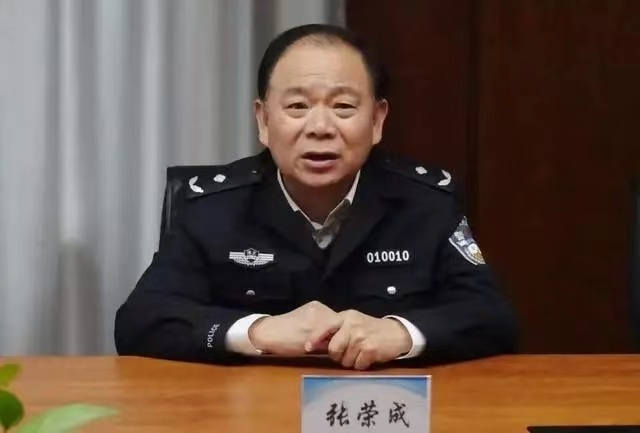
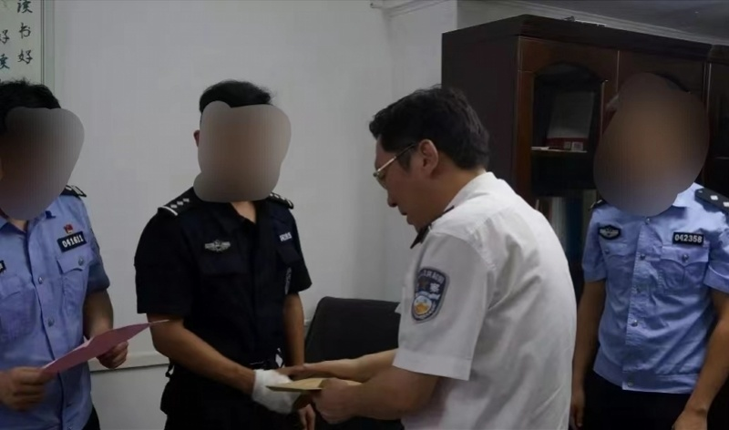

# 武汉公安系统官场震荡：市公安局副局长、分局局长等多人被查

湖北省武汉市公安系统发生官场震荡。9月28日，南都记者从湖北省黄冈市监察局获悉，包括武汉市公安局副局长张荣成在内，武汉公安系统多人因涉嫌严重违法，目前正接受调查。

_张荣成。_

湖北省武汉市公安局原党委委员、副局长张荣成涉嫌严重违法，经湖北省监委指定管辖，目前正接受黄冈市监委监察调查并被依法采取留置措施。

 _黄晓屏。_

湖北省武汉市公安局江汉区分局原党委书记、局长黄晓屏涉嫌严重违法，经湖北省监委指定管辖，目前正接受黄冈市麻城市监委监察调查；公安机关同步立案侦查。

湖北省武汉市公安局视频侦查支队副支队长、二级高级警长张涛涉嫌严重违法，经湖北省监委指定管辖，目前正接受黄冈市黄梅县监委监察调查并被依法采取留置措施。

湖北省武汉市公安局东湖新技术开发区分局原党委委员、副局长刘晓鹰涉嫌严重违法，经湖北省监委指定管辖，目前正接受黄冈市蕲春县监委监察调查并被依法采取留置措施。

湖北省武汉市公安局洪山区分局原二级高级警长田继辉涉嫌严重违法，经湖北省监委指定管辖，目前正接受黄冈市蕲春县监委监察调查并被依法采取留置措施。

采写：南都记者 郑璇真

