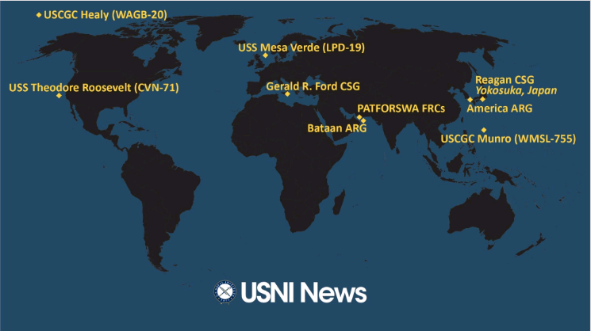

# 美唯一部署在西太平洋执行前沿威慑的航母怎么了？一周内5次取消出海

作为当前美国唯一部署在西太平洋地区执行前沿威慑的航母，“里根”号的动向自然备受关注。但美国《星条旗报》25日称，该航母在上周曾一连5次推迟出海时间，至今仍停留在横须贺基地内未能出动。这就不禁让人奇怪了——这艘核航母到底怎么了？

报道称，美国海军通常不会主动公布舰艇出海计划，但根据美日协议，当“里根”号等核动力舰艇抵达或离开横须贺基地时，驻日海军会提前通知日本政府。这艘航母于8月25日返回横须贺，这本是为期六个月的海上巡逻的中途短暂休息。问题是，日本方面最初得到的通知是，“里根”号将于9月18日离港，但该计划迅速被取消。此后美国方面接连向日本通报了多次该航母的离港时间表，但又都统统取消。据称，“里根”号在一周内至少取消了5次出海计划。最近一次美国海军通知的是“里根”号将于25日上午10时离港，但随后也被取消了。

第七舰队发言人在接受《星条旗报》采访时拒绝对该舰推迟出海发表评论，也拒绝透露可能的出发日期。日本横须贺市的发言人同样拒绝就美国海军出海推迟的原因发表评论，只是说“这是美国军方的问题”。

美媒承认，美国航母如此奇怪地频繁推迟出海计划并不多见。此前出现类似状况的是“尼米兹”号航母。去年9月，该航母因为饮用水系统被污染问题而中断训练返回港口，并花费了十多天时间才完成修理工作。因此“里根”号会不会也是因为出现重大故障、迟迟无法修复，才一再推迟出海时间？作为对比，去年“尼米兹”号饮用水系统发生故障时，美国海军很快就发表声明公开承认，而这次美国海军却对“里根”号到底发生了什么闭口不谈，这是否意味着该航母的问题更为严重？今年年初，社交媒体上一度还曾传闻它存在严重的核动力系统故障，这就更容易让人产生联想了。

但不管怎么样，“里根”号推迟出海显然严重影响了美国海军在西太平洋的威慑行动。美国海军学会网站25日发布的动态显示，当前美国海军虽然拥有多达11艘航母，但仅有3艘航母处于部署状态——地中海的“福特”号、东太平洋的“罗斯福”号和西太平洋的“里根”号。而“里根”号推迟出海后，目前在该海域活动的仅有“美国”号两栖攻击舰。正如老司机此前多次介绍的，“美国”号可以搭载F-35B隐形战斗机，虽然号称是“闪电航母”，但它无法搭载固定翼预警机，缺乏独立作战能力，只能算是半吊子航母，实际战力有限。由此可见，如果“里根”号后续仍无法出海，美国海军可能短期内无法从其他地方抽调舰艇来补充当前的“航母荒”。

当然，这种被动局面也是美国海军多年积累的恶果。美国媒体批评称，美国造船业陷入持续衰退，对于航母的维护能力也日益下降，例如原本驻日本的“华盛顿”号航母从2017年进坞维修升级和更换核燃料，原计划4年内完成，结果花费了6年时间，几乎与当初该航母建造时所花费的时间相当。目前美国还有多艘航母在等待进港维修，这就直接导致美国海军可用的航母数量不足。再加上其中部分航母服役时间长、使用强度大，本身就“百病缠身”，美国海军的这种困境，未来恐怕还要持续相当长时间。

