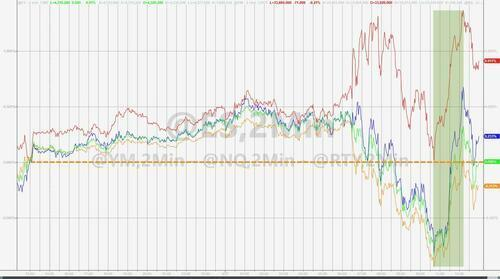
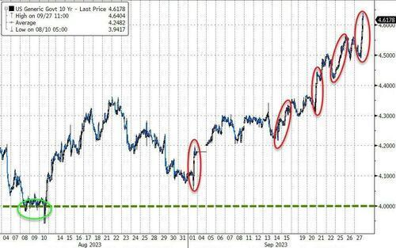
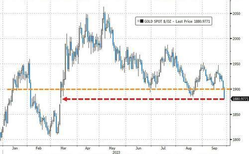

# 美股收盘：标普惊险收涨，道指四个月最低，美债收益率重返十多年高位

美国8月耐用品订单环比初值增长0.2%，好于预期的降幅0.5%和前值的下跌5.6%，主要归功于国防飞机和机械订单增长，也显示经济前景不确定时期的投资仍具有韧性。

今年FOMC票委、明尼阿波利斯联储主席卡什卡利称，对或需再加息超过一次的前景持开放态度，不确定利率是否已经足够高到遏制通胀，但也谈及可能“手下留情”的场景，即美国联邦政府停摆等风险冲击到经济，预测2024年基本上维持利率在高位不变。

美国参议院周二通过两党支持的短期措施，以期避免美国政府在10月1日因预算不到位而关门。但众议院议长麦卡锡称不会允许众议院表决上述临时开支立法草案。原标普主权信用评级委员会主席警告称，美国经济形势弱于2011年标普撤销美国3A主权信用评级时的状态。

日本央行7月会议纪要显示，政策制定者一致认为有必要维持超宽松货币环境，但对央行何时能够结束负利率存在分歧，有鹰派票委建议明年1月至3月评估是否能持续实现2%的通胀目标。

标普纳指尾盘转涨，道指近四个月最低，欧股六个月最低，AI股涨幅显著，Meta一度跌4%

9月27日周三，随着美债收益率止跌转涨、重返十多年高位，以及美国油价再创一年最高，盘初集体高开的美股在午盘时全线转跌。道指抹去逾110点的涨幅在开盘近一小时便率先转跌。

道指全天最深跌超310点或跌0.9%，标普500指数和纳指均最深跌0.8%，尽管能源板块伴随油价而涨超2%并领跑大盘，纳指一度失守1.3万点整数位。罗素2000小盘股几乎抹去1.4%的涨幅。

**尾盘时美股跌幅显著收窄，标普和纳指重新转涨，最终，道指仍在七个交易日里第六天下跌**
，创6月1日以来的近四个月最低，昨日曾跌近400点，创3月份以来最大跌幅和自5月以来首次收盘不足200日均线。标普大盘仍接近6月7日来最低，昨日曾自6月份以来首次跌穿4300点；纳指和罗素小盘股仍徘徊5月31日来低位：

标普500指数收涨0.98点，涨幅0.02%，报4274.51点。道指收跌68.61点，跌幅0.20%，报33550.27点。纳指收涨29.24点，涨幅0.22%，报13092.85点。纳指100涨0.2%，罗素2000小盘股指数涨约1%，“恐慌指数”VIX小幅回落并下逼18，昨日曾升破20。

_标普纳指尾盘转涨，道指近四个月最低_

有分析称，美股正在经历的“传统的9月份季节性疲软”，月内累跌超4%和跌超6%的标普和纳指均将创去年12月以来最差表现，美联储鹰派利率前景令风险情绪承压。若10月中旬开启的财报季好于预期，可能是结束本次市场回调的催化剂，标普已连续三个季度企业盈利同比下滑。

**明星科技股尾盘跌幅收窄**
。元宇宙”Meta跌4%后收跌0.4%，特斯拉跌1.5%，谷歌A涨1.5%，均徘徊一个月最低；苹果跌近1%，奈飞跌0.4%，均刷新四个多月最低；微软尾盘转涨0.2%，仍离四个多月最低不远；亚马抹去1.5%的跌幅至平盘，维持三个月新低。

**芯片股集体反弹，**
费城半导体指数转涨约1%脱离四个月最低。英特尔涨超2%脱离一个月低位，AMD涨超2%脱离四个半月最低，英伟达涨1.3%，进一步远离六周低位；Arm跌1%，但连跌两日并逼近上周五所创的上市以来最低，周一曾止步六日连跌。

**AI概念股涨幅显著** 。C3.ai涨超3%脱离四个半月最低，Palantir
Technologies涨超6%脱离三个月低位，SoundHound.ai涨超12%脱离六个月最低，BigBear.ai涨近15%脱离近九个月最低。

消息面上，Meta发布新款Quest 3
VR头显，起售价499美元，将由高通提供一款性能更强大的芯片。OpenAI称，ChatGPT现在可以浏览互联网，不再局限于2021年之前的数据。跨时代“AI硬件”酝酿中，报道称OpenAI创始人Altman与前苹果首席设计师重磅携手。桥水达利欧预言，一年内AI就会颠覆我们的生活。

**热门中概尾盘追随美股上涨。** ETF
KWEB转涨0.5%，CQQQ接近抹去0.4%的跌幅，纳斯达克金龙中国指数（HXC）转涨0.8%，远离上周所创的两个半月低位。

纳斯达克100成份股中，京东跌幅显著收窄至0.3%，百度转涨0.4%，拼多多转涨超1%。其他个股中，阿里巴巴转涨0.3%，B站转涨超1%，腾讯ADR转涨0.7%，蔚来汽车涨0.6%进一步脱离近四个月低位，宣布终止美股ATM（按市价发行）增发的理想汽车转涨0.4%脱离三个月最低，小鹏汽车涨近3%。法拉第未来跌超44%至上市后新低，将通过ATM增发最多9千万美元A类普通股。

**银行股指在九日里第八日下跌。**
行业基准费城证交所KBW银行指数（BKX）跌0.3%至四个月最低，5月4日曾创2020年10月以来最低。KBW纳斯达克地区银行指数（KRX）跌0.5%至近三个月最低，5月11日创2020年11月来最低；SPDR标普地区银行ETF（KRE）跌0.5%，5月4日创2020年10月来最低。瑞银欧股和美股均跌近3%，美国加大对其违反制裁行为的调查力度。

**其他变动较大的个股包括：**

芯片股美光科技二季度运营亏损超12亿美元，对三季度业绩指引逊于预期，盘后一度跌超2%。

加拿大第一瑜伽服品牌露露柠檬与互动健身平台Peloton构建合作伙伴关系，宣布为期五年的全球数字内容战略合作协议，Peloton在美股盘后一度飙涨超32%。

细胞编程领先平台Ginkgo Bioworks涨近20%后收涨不足3%，其与辉瑞制药达成协议，将重点围绕基于RNA的候选药探索进行合作。辉瑞转跌近1%。

好莱坞编剧工会结束近150天的罢工，媒体类股普涨，派拉蒙一度涨3.6%，华纳兄弟探索涨超3%，康卡斯特一度涨1%，但午盘后迪士尼小幅转跌。除了涨薪之外，协议还规定，人工智能将无法编写或重写文学材料，人工智能生成的材料将不被视为源材料。

大型仓储超市好市多（Costco）涨近2%，第四财季营收和盈利超预期，但全球平均交易额下滑4%，最大市场美国的同店可比销售额仅增长0.2%，警告较昂贵的非必需品销售趋势疲软。

西方石油公司涨近4%至一周新高，美国银行将其列为首选并认为股价再涨30%，巴菲特旗下的伯克希尔哈撒韦公司今年继续逢低买入西方石油，目前已持有四分之一的股份。

欧股齐跌。泛欧Stoxx
600指数收跌0.18%，连续五日下跌、期间累跌约3%，创3月28日以来的半年新低。德国股指连跌三日；在议会首轮投票未能批准费霍出任首相之际，西班牙股指跌0.4%。

美债收益率先跌后涨，10年期收益率再创十六年最高，30年期收益率刷新十二年半最高

美债收益率在美股盘中止跌转涨。对货币政策更敏感的两年期收益率全天保持涨势，最高上行8个基点并上逼5.16%，进一步接近上周突破5.20%所创的2006年以来最高。

10年期基债收益率从日低反弹超15个基点并上逼4.65%，是2007年10月17日以来首次涨穿4.60%关口，本周每日都刷新十六年最高。30年期长债收益率较上日收盘涨4个基点至4.74%，多日连创2011年2月以来最高。

 _美债收益率先跌后涨，10年期收益率再创十六年最高_

七年期美债收益率涨10个基点至4.70%，是1993年6月30日以来首次涨穿4.70%关口。20年期收益率涨8个基点至4.94%，再创2020年5月下旬有数据记录以来的新高。衡量实际利率的美国10年期通胀保值国债（TIPS）收益率最高涨8个基点上逼2.30%，接近2009年1月来最高。

欧元区基准的10年期德债收益率尾盘涨4个基点、上逼2.85%，也再度刷新2011年下旬以来的十二年最高。两年期收益率涨近2个基点至3.25%，接近上周四触及3.36%创下的3月9日以来半年高位。法国、意大利、西班牙、希腊基债收益率齐涨4至7个基点不等。

有分析称，石油和欧洲天然气价格再次攀升，加剧人们对新一轮通胀压力的担忧。欧央行更加注重减少过剩流动性等因素，都将增加外围市场的债市压力。

美油盘中涨4%，一度升破94美元创一年最高，布油涨近3%至一周高位

市场聚焦冬季供暖需求高峰来临之际的供应收紧，油价再涨2%。WTI
11月期货收涨3.29美元，涨幅3.64%，报93.68美元/桶。布伦特11月期货涨2.59美元，涨幅2.75%，报96.55美元/桶。

美油WTI最高涨3.77美元或涨4.2%，一度升破94美元，创去年8月末以来的13个月最高。交投更活跃的布伦特12月期货最高涨2.35美元或涨2.5%，尝试上逼95美元至一周最高。

上周美国EIA原油库存减少217万桶，大于市场预期的减少90万桶和前值减少214万桶，尽管汽油库存不降反升103万桶，但美油期货交割地库欣地区的库存再降逾90万桶，总量跌至不足2200万桶的去年7月来最低，并接近最低运营水平。

由于市场持续担心美国俄克拉荷马州库欣存储中心的美国原油库存跌破最低运营水平，即月WTI的期货溢价升至2美元、创去年7月来最高，反映出现货供应紧张的现状，参与推高油价。

欧洲基准的TTF荷兰天然气期货尾盘跌0.5%，昨日曾跌超7%并失守40欧元/兆瓦时整数位，脱离一个月最高。ICE英国天然气跌约2%，昨日曾跌超11%徘徊100便士/千卡关口。

美元多日连创十个月最高，欧元近九个月最低，日元近一年低位，离岸人民币失守7.32元

衡量兑六种主要货币的一篮子美元指数DXY涨0.6%并升破106.80，连涨五日，本周连续多日刷新去年11月底以来的十个月最高。

美元指数已连涨十周，9月累涨2.6%，将创5月份以来最佳单月表现；三季度累涨3.3%，迈向去年三季度以来最大季度涨幅。

_美元多日连创十个月最高_

欧元兑美元跌0.7%并失守1.05关口，连跌七日至去年12月初以来的近九个月最低。英镑跌0.3%并下逼1.21，连跌六日至3月中旬以来的六个半月最低。有分析称，英国和欧洲央行看起来已经完成加息，但美联储仍可能在年底前加息一次，政策前景分野导致货币汇率走势不同。

日元兑美元最深跌0.5%至149.73，连跌四日至去年10月中旬以来的近一年最低，华尔街预测日元跌至150将引发央行救汇。离岸人民币在美股盘中失守7.32元，较上日收盘最深跌165点，刷新9月11日以来的逾两周低位。美元/瑞郎半年来首次升破0.92关口。

**主流加密货币多数下跌。** 市值最大的龙头比特币交投2.62万美元，第二大的以太坊升破1590美元，但仍徘徊两周低位，三季度分别累跌14%和18%。

_比特币交投2.62万美元，与以太坊均徘徊两周低位_

黄金跌穿1880美元，连跌三日至半年多最低，伦铜徘徊四个月低位，镍触及14个月最低

美元和美债收益率携手走强连续三日打压金价，COMEX
12月黄金期货收跌1.50%，报1890.90美元/盎司，失守1900美元心理整数位，创3月中旬以来的半年多新低，期银跌2%。

现货黄金最深跌28美元或跌1.5%，自3月13日以来首次跌穿1880美元整数位，日低还下逼1870美元关口，同样连跌三日至半年多新低，昨日盘中曾在五周来首次跌穿1900美元。

有分析称，黄金尚未被定位为避险资产，近期变动逻辑仍与加息紧密相关。若周五PCE通胀高于预期将带来进一步下行压力，只有市场担心美联储过度紧缩导致经济大幅恶化，才对金价利好。

_黄金跌穿1880美元，连跌三日至半年多最低_

**伦敦工业基本金属多数下跌** ：

经济风向标“铜博士”小幅收涨并重返8100美元上方，仍徘徊6月初以来的近四个月最低，受限于库存增加和对全球利率长期走高抑制需求的担忧。

伦铝小幅下跌，仍离一个半月高位不远。伦锌跌1.4%失守2500美元，连跌三日至两周最低。伦铅跌1.6%至一个月低位。伦锡转跌1.4%失守2.6万美元，重返近一周新低。

伦镍涨0.7%至1.9万美元，但盘中触及去年7月以来的14个月最低，今年累跌38%是跌幅最大的LME金属。有分析称，去年遭遇史诗级逼空大战后，亚洲新建工厂供应上升，令镍价不断下降。

此外，内盘的焦炭期货夜盘收涨近6%，焦煤涨约4%，铁矿石涨超1%。

