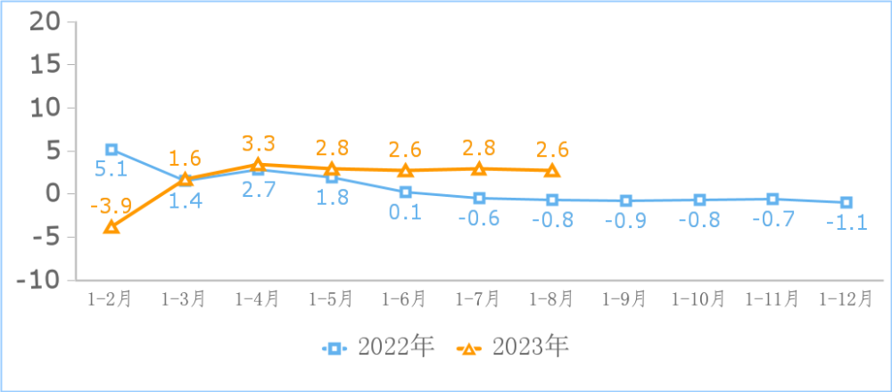
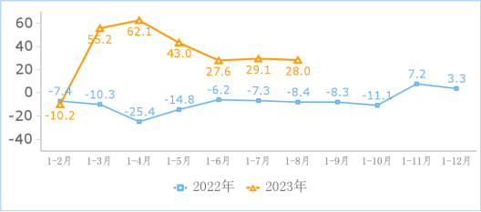
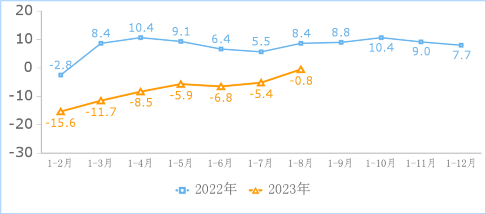
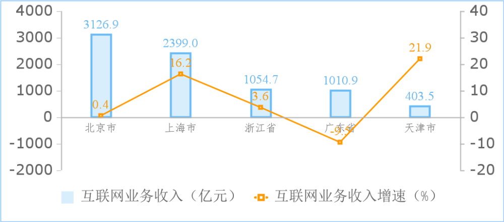

# 1-8月我国互联网业务收入、利润总额同比分别增长2.6%和28%

**2023年1—8月份互联网和相关服务业运行情况**

1—8月份，互联网业务收入保持平稳，利润总额快速增长，研发经费降幅持续收窄。

**一、总体运行情况**

**互联网业务收入保持平稳。** 1—8月份，我国规模以上互联网和相关服务企业¹（以下简称互联网企业）完成互联网业务收入9067亿元，同比增长2.6%。

图1 互联网业务收入累计增长情况（%）

**利润总额快速增长** **。** 1—8月份，我国规模以上互联网企业营业成本同比增长5.4%。实现利润总额913.8亿元，同比增长28%。

图2 互联网和相关服务业营业利润增长情况（%）

**研发经费降幅持续收窄。** 1—8月份，我国规模以上互联网企业共投入研发经费477亿元，同比下降0.8%。

图3 互联网和相关服务业研发费用增长情况（%）

**二、分领域运行情况**

**（一）信息服务领域企业收入小幅回落。** 1—8月份，以信息服务为主的企业（包括新闻资讯、搜索、社交、游戏、音乐视频等）互联网业务收入同比下降3.1%。

**（二）生活服务领域企业收入较快增长。**
1—8月份，以提供生活服务为主的平台企业（包括本地生活、租车约车、旅游出行、金融服务、汽车、房屋住宅等）互联网业务收入同比增长11.3%。

**（三）网络销售领域企业收入高速增长。**
1—8月份，主要提供网络销售服务的企业（包括大宗商品、农副产品、综合电商、医疗用品、快递等）互联网业务收入同比增长45.1%。

**三、分地区运行情况**

**东部地区互联网业务收入保持平稳增长。**
1—8月份，东部地区完成互联网业务收入8474亿元，同比增长3.7%，增速较1—7月份回落0.3个百分点，占全国互联网业务收入的比重为93.5%。中部地区完成互联网业务收入289.2亿元，同比下降9.7%，降幅较1—7月份扩大1.7个百分点。西部地区完成互联网业务收入281.4亿元，同比下降8.3%，降幅较1—7月份收窄1.6个百分点。东北地区完成互联网业务收入22.3亿元，同比下降38.5%，降幅较1—7月份收窄2.1个百分点。

图4 2023年1—8月份分地区互联网业务收入增长情况

**近半数地区互联网业务增速实现正增长。**
1—8月份，互联网业务累计收入居前5名的北京（增长0.4%）、上海（增长16.2%）、浙江（增长3.6%）、广东（下降9.5%）和天津（增长21.9%）共完成业务收入7995亿元，同比增长4.6%，占全国（扣除跨地区企业）比重达88.2%。全国互联网业务增速实现正增长的省（区、市）有14个。

图5 2023年1—8月份收入居前5名省市互联网业务收入增长情况

**四、我国移动应用程序（APP）发展情况**

根据全国APP技术检测平台统计，截至8月底，我国国内市场上监测到活跃的APP数量²为260万款（包括安卓和苹果商店）。移动应用开发者数量为83万，其中安卓开发者为25万，苹果开发者为58万。8月份，安卓应用商店在架应用累计下载量82亿次。

附注：

1.规模以上互联网和相关服务企业口径由上年互联网和相关服务收入500万元以上调整为2000万元及以上，文中所有同比增速均按可比口径计算。

2.活跃的移动应用程序数量是指报告期内我国市场上经过用户主动下载安装的第三方移动应用的总个数，其中安卓应用数的计算方法是根据智能手机记录的已安装移动应用去重后获得。

来源：工业和信息化部运行监测协调局

