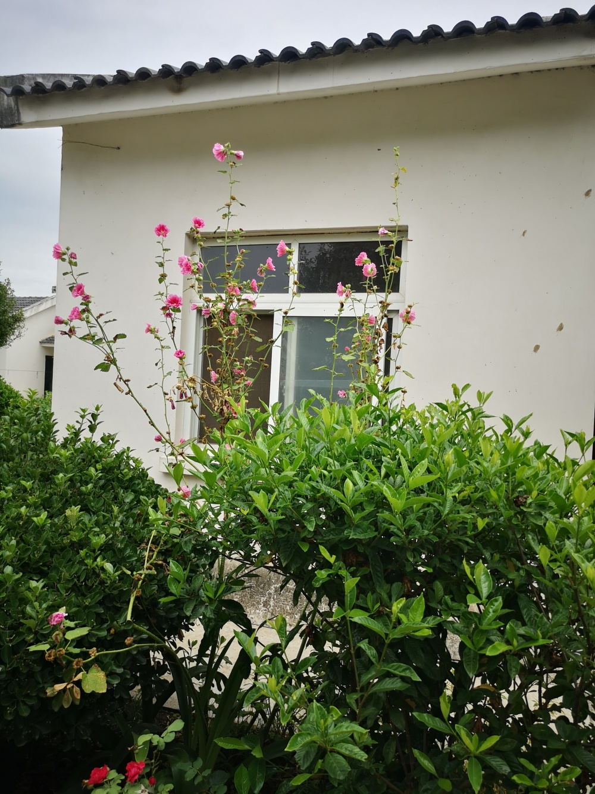
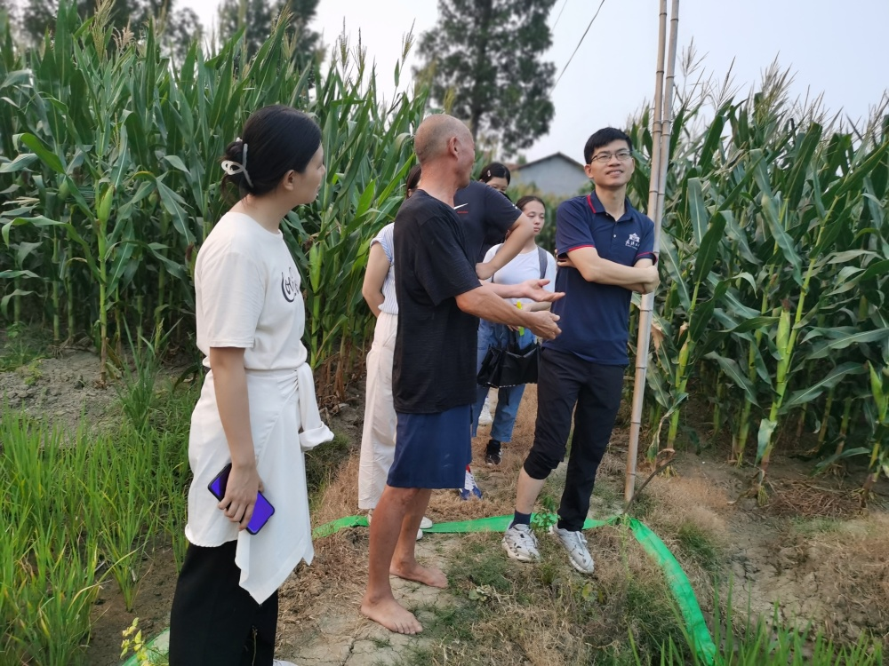

# “20多岁蹲监狱，50多岁释放后住福利院”，村干部“眼红”：我也想当五保户

 _五保户居住的新房_

最近我们着重调查了农村福利院的状况和五保政策执行问题。

围绕我国农村五保政策，很多网友热议。针对我们武汉大学中国乡村治理研究中心研究人员发出的反思性的文章，网友提供了很多佐证。

腾讯网的一个网友说： **我们辛辛苦苦交几十年社保，都没五保户这么多钱一个月。不想努力了，向着五保户进军吧，同志们！**

另一个网友说，
**我在村干部位置上干了三十二年，几十年勤勤恳恳工作，获奖无数，现在每月领一百多元的基本养老金，而我村一个三进功的刑满释放人员，一个月拿一千多，还问我你当了几十年书记还没有我过得好。我无语。**

还有一个网友说， **所以说都不用结婚生子了，潇洒的活，该吃吃该喝喝该玩玩，60岁以后有国家养着，钱要用到正的地方。**

这些网友的言论应该说，都很真实，共同反映了我们目前五保社会救助政策执行过程中的一些明显的偏差，造成了社会大众所感受的“不公平感”。简言之就是一个人就因为属于“五保户”，纳入社会救助，就享受了比普通人好的养老生活（至少在当地社会就是这样评价的）。

这种情况有很多地区是真实存在的，并不是个例。

五保制度是一种社会救助制度。现在称之为特困供养制度，农村地区俗称“五保”，五保指的是，“保吃、保穿、保医、保住、保葬”。特困供养人员即“五保户”，主要来源是孤寡老人。它体现社会主义的优越性。

在很长一段时间里，五保待遇很低。原来，这是村集体内部办的公益事业，村集体拿出集体部分积累用于满足五保户的基本生存需求。此外，这些五保户还享有来自亲属、来自家族的支持。

但随着国家财政能力提升，国家兜底了五保，不需要村集体出钱，在中西部地区薄弱地区，中央、省级财政负担了大部分，地方财政负担小部分。

如某省某普通农业县，2023年中央特困救助（主要是五保，还有其他少数，如孤儿）财政下达，1700万元，省配套500万元，县配套400万元。可见五保财政投入方面，中央占大头，中央发挥兜底作用。

从个人投入的角度，按照中部某城市的标准，集中供养的五保户，无论居住城市还是乡镇福利院，均按照城市标准计算投入，一人月财政投入是1500元左右，如果是分散供养，则月投入是1200元左右，其中生活补助是1.3倍的低保救助金（目前当地农村是610元/月的标准），大约是800元，还有400元左右交给监护人。按照省民政厅文件，一个五保户，必须有一个监护人，一般是其兄弟姐妹或侄子侄女，如果无，村干部也可以作监护人，承担监护责任，这极少。

目前基层干部和农民群众反映的主要问题是，普通农村老人和五保老人的生活差距过大，农民群众戏称，“五保老人是农村生活条件最好的老人”。普通群众为子女劳碌一辈子，并没有多少养老钱，还继续继续劳动，依靠自己劳动养老，年收入几千元是常态。而五保老人，就因为无儿无女就过上了比普通老人更好的生活，他们花不完的钱给他们的侄子、侄女。

有的地方是宗族性地区，无子女的五保户存在继子女现象——但他们一般并没有体现在户籍管理中，也就是从法律上，他们是无儿无女的，但是他们在生活中是有子女的，周边邻居都知道，对这样的五保户，他们的钱就更有理由给继子女，周边群众也有不少怨气。

_劳作的老农民_

在中部地区，村干部是兼业的，而非职业化，政府并没有为其缴纳养老保险，也大多参与城乡居民养老保险，60岁之后领取的月养老金也就100多元，但他们认为辛苦几十年，没有功劳也有苦劳，国家并没有照顾他们。但五保户，就因为无儿无女，他们享受了1000多元的社会救助金，十分不公平。

 _拜访空巢老人_

农民群众特别感到不满的是，劳改服刑人员回乡之后，他们依然可以合法地要求进入“五保”，而且还很强势。

某县民政的基层干部介绍，有一个无期徒刑的犯人，“从监狱到福利院，无缝衔接”。他20多岁犯下重罪，50多岁刑满释放回乡，有手有脚，能够劳动，本来到60岁还有5个月，他却闹着要享受五保待遇，要政府给他想办法，这种人影响社会稳定，政府就提前把他纳入五保供养序列。但是这种坐牢的人进福利院，并不好管理。院长去管理他，他很屌，会说，“我吃一辈子国家饭的”，一副耀武扬威的样子。

一般，乡镇福利院的院长是原村干部，他们干了一辈子村干部，有幸调到福利院领取固定工资，一年大约3万元，一个月2600元左右，他们服务老人，辛辛苦苦，管理起来担惊受怕，怕发生意外，怕被追责。但他们老后的福利还不如“五保户”，他们对待自己的父母还没有对五保户老人好呢。

院长们甚至说，“自己想当一个五保户了”。可以说，对当前五保福利过好，超过农村干部和普通群众的养老待遇，犯人进五保还不服从管理等现象，最不满意就是这些福利院管理者了，国家要求他们照料五保户好吃好喝，生活水平比他们自己、比他们的老父母还高，他们有怨气也是很正常的。

基层政府也意识到这个问题，但是从执行政策的角度，民政部门只认定是否符合条件，不追溯过往经历，也很难精准界定“是否有劳动能力”。因为按照一般的惯例，60岁就没有劳动能力。

按照民政部的政策，五保户的界定有三个方面，无劳动能力，无生活来源，无法定赡养人（或法定赡养人无赡养能力）。光棍没有法定赡养人，侄子侄女在过去有赡养义务，现在五保政策下，他们没有赡养义务，都是国家管了的，责任都是国家的。

无劳动能力。对于农村里光棍汉而言，无劳动力能力的界定，只有一个标准，满60岁。 即使他们能劳动，能挣钱，他们也会认为，自己老了，没有劳动能力。

无生活来源。界定五保户也计算收入，但是并不能精准计算。按照规定，五保户评定，需要“收入低于当地最低生活保障标准，且财产符合当地特困人员财政状况规定···”，但即使有劳动能力、有一定存款的光棍汉，也可以把这些收入转移到亲属哪里，这样就可以避免大数据比对核查。

从正面来看，我国未来千万光棍汉将得到很好的照料，国家财政兜底这部分光棍汉的生活，生活水平比农村有家庭、有子女的老人要高，即使犯罪了，也不影响享受这种福利。但也带来诸多负面影响。

1 财政负担日益加重。 我国还是一个发展中国家，未来光棍数量会不断增长，这样高的福利水平，一个五保户一年投入超过2万元，国家如何负担得起？

2
弥漫在乡村中的不公平感。辛苦劳动养老的农村老人就因为有子女，就只能过辛苦的生活，他们是为国为民做贡献的，到头来过的生活不如五保户，他们无论如何想不通，五保政策合法性丧失。

3
光棍汉失去劳动、储蓄和缴纳社会保障的动力。基层干部担心，这么好的五保户待遇，结果是中年光棍汉等着进入五保，即使他们能劳动就业、能储蓄、能参与正常的社会保障体系，他们也不会去考虑，从经济角度这是不划算的。

怎么办？简单来说有4点，

1、审视过时的识别机制。要把真正所需国家社会救助兜底的人给识别出来，而不是简单地用60岁年龄、无儿无女作为审核标准。在农村大多数60岁左右的人，有土地，有劳动能力，有收入，可以自食其力。没有必要给予救助，使其养老水平明显超出一般老人的生活水平。即使财政有钱也不能任性。

2、采用制度化的社会保障机制。
新时期，社会保障体系已经相当成熟，要采用制度化的机制鼓励这些光棍汉参与社会保障体系，鼓励依靠劳动就业获得收入，缴纳社会保障金，老后领取养老金生活。这时，就不存在五保的概念了。

3、对丧失劳动能力的五保老人给予社会救助，给予五保待遇，但待遇不宜明显过高。一是失去劳动能力，有自理能力，可以分散供养，供其基本的生活，吃穿住不愁，按照当地农村的标准，不要攀比救助标准；二是失去劳动能力、自理能力。可以兜底他们的生活照料，保持他们最后的尊严，既可以请他们的亲属照料，给予一定的补贴，也可以集中供养。

4、回乡服刑人员可不进入五保序列。服刑人员出狱后，他们可能成为了光棍，但五保是具有道德性的，要符合乡村社会正义的基本规则。五保政策要把这些有过服刑经历的光棍排斥出去。如何排斥，需要探索具体机制。如除非生活不能自理，不给予保障。

2023年9月29日

