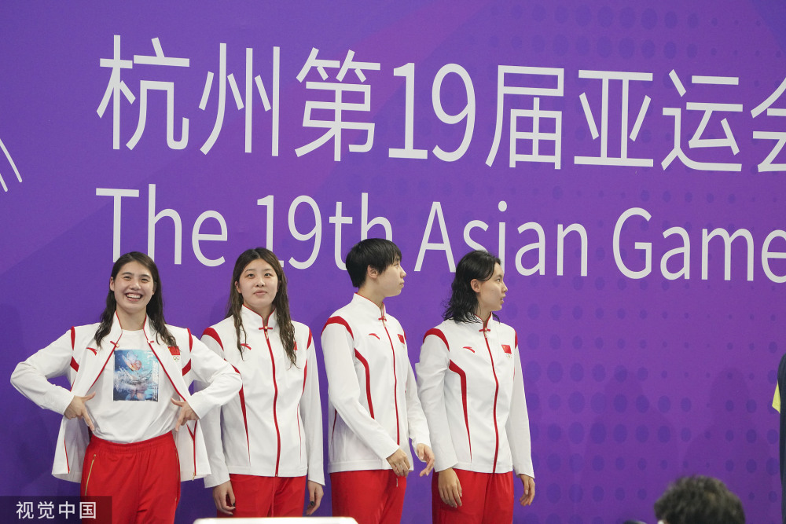
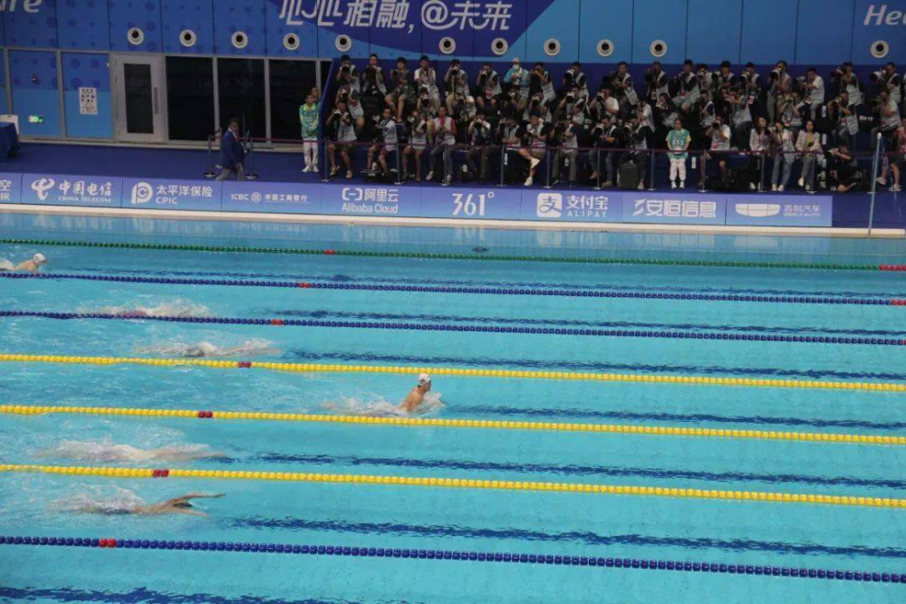
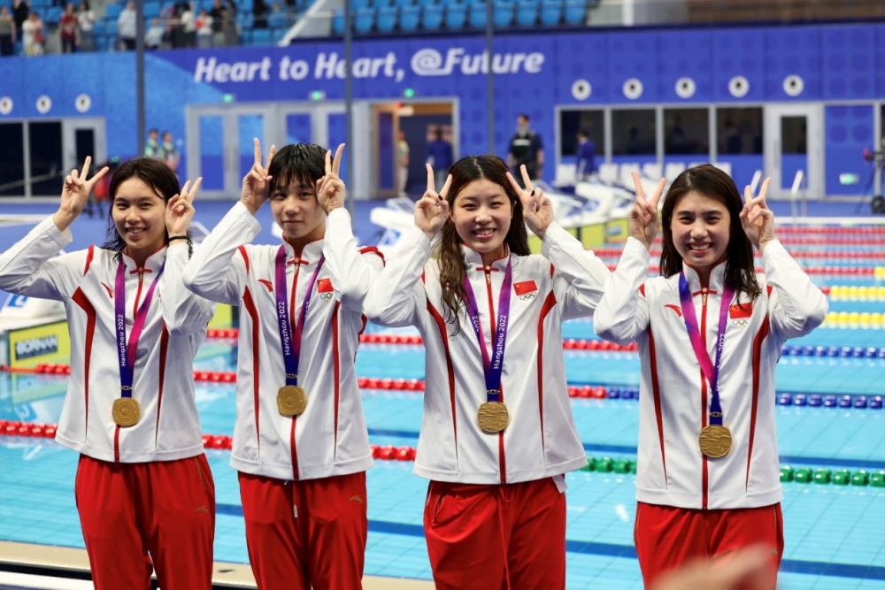
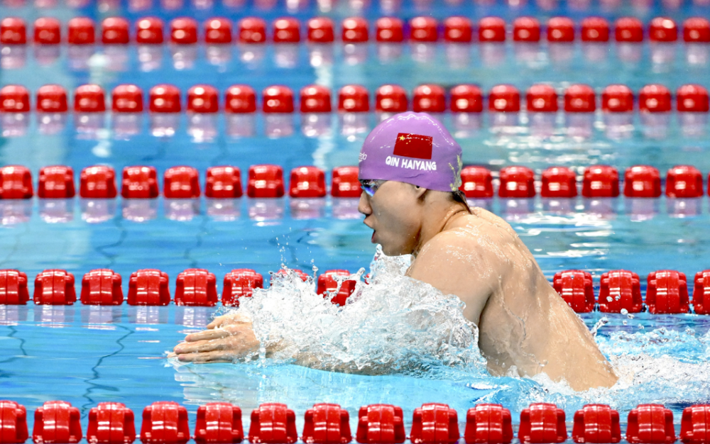
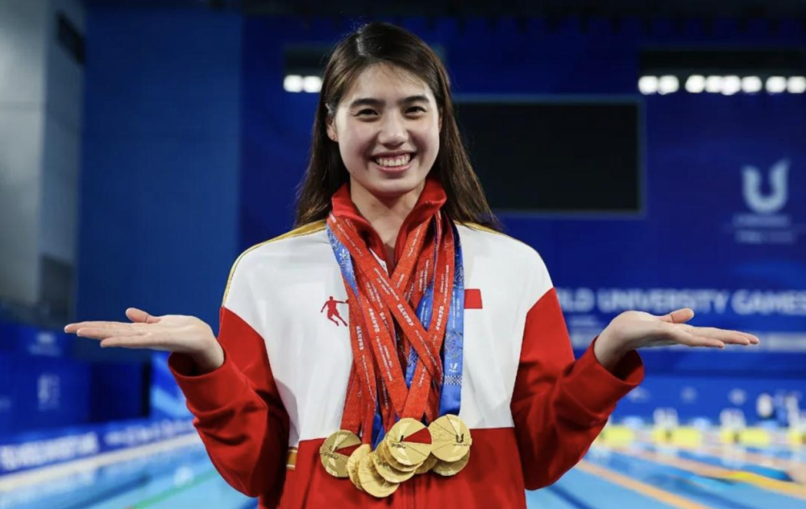
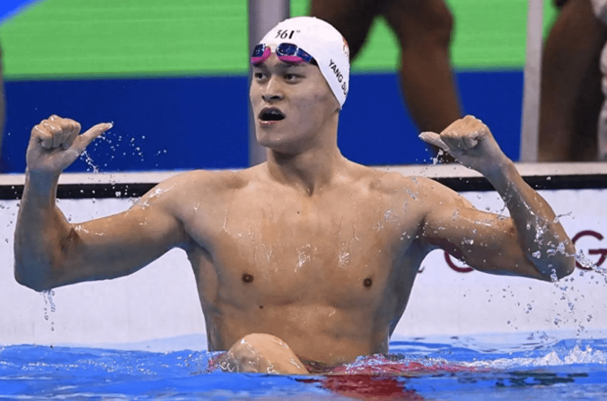
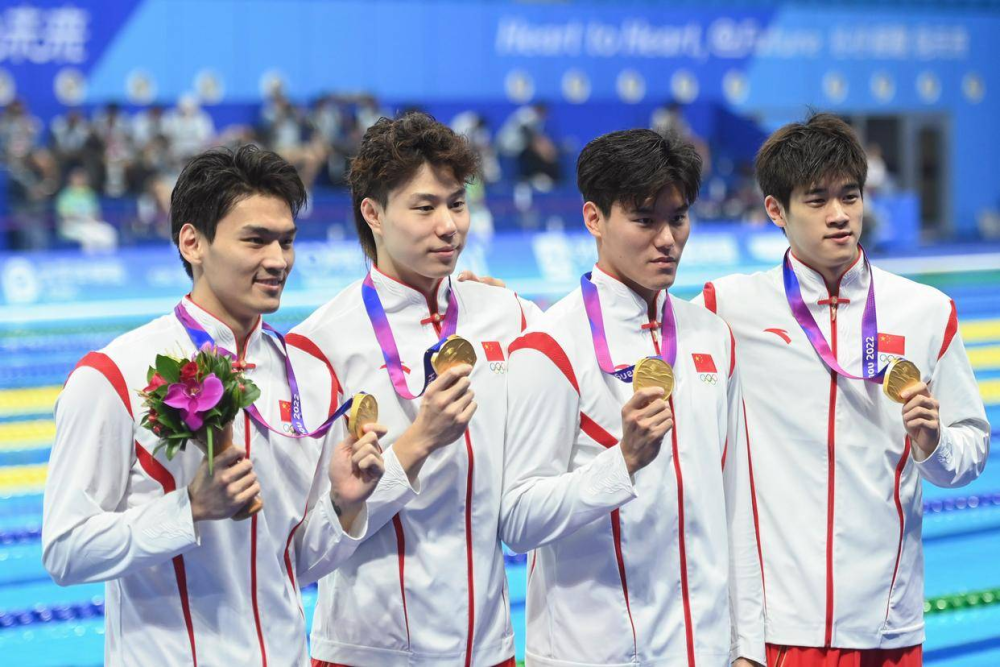

# 体谈 | 亚运会豪取28金碾压日韩！中国游泳迎来史上最强天团

**撰文 | 于睿寅**

**编辑丨冯小**

杭州亚运会女子4X100米自由泳接力赛的颁奖仪式上，在和队友等待上台领奖的时候，张雨霏发现摄影师正在为她们合影。于是，她面对镜头，露出标志性的爽朗笑容，并同时大方地向镜头展示起自己领奖服下藏着的体恤衫。

白色的体恤衫中央有一副方形的创业图画，一只斑斓的蝴蝶跃出水面。图片配文是：破茧成蝶。

_图说：张雨霏展示“破茧成蝶”。_

这一幕虽然短暂，但几天之后，当我们回顾中国体育代表团游泳队在本届大赛的表现时才恍然发现，它极具象征意味。因为在游泳大项的41个小项竞争中，中国的游泳军团豪取28金，创中国参加亚运会以来的最佳成绩，共计得到57块奖牌，将亚洲老对手日本（3金28奖牌）远远甩在身后。而更深入地挖掘游泳队本届亚运会的奖牌画像，还会有更大的惊喜：

队中获得奖牌的队员，不仅男女性别均衡，年龄层面老中青配比合理，而且他们来自中国五湖四海的游泳育才体系，不再如以往那样“仅限”某几个游泳大省。

_图说：几乎每个比赛日，一骑绝尘、遥遥领先的中国游泳都是我们快乐的源泉。_

过往，当我们谈起中国游泳队，总有“孤泳者”的慨叹，全项、全队的成败往往聚集在某个天才运动员身上，一人成败，而举队兴亡。这其中，最令人记忆犹新的“孤泳者”恐怕要数罗雪娟。2000年悉尼奥运会，初次登上奥运赛场的她发挥平平，在女子200米蛙泳的比赛中仅得第八名，而那一届奥运会，中国游泳队无一奖牌入账，而到2004年雅典奥运会，罗雪娟勇得女子100米蛙泳金牌，最终让中国游泳实现了突破。而同样的情况，也发生在男子游泳的项目上，吴鹏在游泳世锦赛上的起起伏伏，也和中国男子游泳的成绩同频共振。

可如今，中国游泳队竟然富裕到，在大多数多人接力项目中，可以使用两套阵容去参赛——年轻人为先锋参加预赛，积累大赛经验的同时为核心运动员节省体能；巅峰期运动员出战决赛，为国家攻城拔寨。

所以，我们该如何解释这种现象？或许，通过这届大赛我们可以说，中国游泳队已经破茧成蝶，他们将成为中国奥运军团的又一支梦之队，以及，中国游泳的黄金时代，马上就要来临了。

奖牌画像：由点到面，全线开花

过去这个奥运周期内，张雨霏率领的女子自由泳接力队，先是在东京奥运会4x200自由泳接力比赛中摘金，继而又在福冈世锦赛4x100自由泳接力比赛中以打破亚洲纪录的成绩摘铜。到了亚运会的赛场，这两项接力的优势更是碾压式的，即便张雨霏并没有比4x200的比赛。

这一回，中国队在女子4x100和4x200两项赛事中“兼项”的一共有4人：李冰洁、吴卿风、柳雅欣、程玉洁，从籍贯上来说，是由浙江、河北、江西3个省份贡献的人才。4x100阵容中的7人来自5个不同的省份，4x200阵容中的7人来自6个不同的省份。除了张雨霏和柳雅欣外，全部都是“00后”。预赛和决赛大家轮番上场，显示了中国队的强大人才储备。

 _图说：屡创辉煌的游泳接力女将，在籍贯分布上也呈现多元化。_

以往说起为中国游泳贡献人才最多的省份（包括自治区和直辖市），浙江、上海是我们不假思索就能报出的答案。在杭州亚运会赛场，摘得游泳金牌的浙江籍泳将的确有9人、22人次之多，在各省份运动员中雄踞榜首，倒是上海籍的金牌选手只有女子50米蛙泳的唐钱婷一人。不过包含浙江、上海，共有15个省份的泳将收获奖牌，13个省份的泳将收获金牌，其中13个省份收获至少2枚金牌。浙江之下，第二梯队省份的阵容变得愈发庞大：江苏籍6枚（张雨霏x6）、河北籍5枚（李冰洁x5）、湖南籍5枚（覃海洋x5）、山东籍4枚（杨浚瑄x2、葛楚彤、王一淳）、江西籍4枚（程玉洁x3，万乐天）……

虽然有不少省份的所有金牌都是出自同一名运动员之手，但这也恰巧说明，我们的头部冲金集团选手是遍布全国的苗子，由点到面，全线开花。

从金牌选手的年龄来归因，亦能呈现出人才梯队合理化的正态分布。

1990年代出生的“老将”，虽然整体趋势上让位给了更年轻的新一代，但男子和女子赛事中的两位“夺金王”——1994年的汪顺和1998年的张雨霏——证明了他们仍是中国游泳队的定海神针。2000年到2005年之间出生的“千禧一代”，以李冰洁、潘展乐等为代表在本届大赛中人数达到24人，占全队总人数的66.7%。他们累计收获57枚奖牌（人次）成为最具战斗力的生力军，而巴黎奥运会时正值他们18到23岁的黄金年龄。

除此之外，女子4x200米接力队中，2007年出生的杨佩琪成为中国游泳本届最年轻的金牌选手，冲击下一个奥运周期的新苗亦在杭州崭露头角。

这种可喜的人才厚度，亦体现在夺金、夺牌泳将的性别分布上，不再“阴盛阳衰”。虽然女选手的夺金人数、金牌总数都仍胜男选手一筹，但男女选手获得的奖牌总数以48-48基本形成均势。在夺得至少5块奖牌的6人头部阵营中，汪顺（4金1银1铜）、覃海洋（5金1银）和潘展乐（3金3银1铜），和张雨霏（6金）、李冰洁（5金1银）和程玉洁（3金2铜），3男3女，各占半壁江山。

_图说：覃海洋等年轻男选手表现抢眼，中国游泳不再“阴盛阳衰”。_

体现为年龄、性别、“生源地”等维度多元并发、合理分布的人才厚度，是保证中国游泳巩固亚洲头名、跻身世界前列的关键，而这恰好在本届亚运会的夺金、夺牌阵容中展现得淋漓尽致。

回忆起1个多月前，带出张雨霏、覃海洋的教练崔登荣在总结福冈世锦赛成绩时的那番话：“东京奥运会时我们没有可以替换的混合泳接力人选，在福冈我们却有两套人马来锻炼队伍，这说明中国游泳不断提高人才厚度、合作共赢、中西合璧的理念取得了一定效果，只有共同提高，中国游泳才会真正强大起来。”

1个多月后的杭州亚运会，证明“黄金时代”的人才储备，不是一朝一夕的偶然。

实力头牌：“黄金时代”的门面

张雨霏在50米自由泳决赛中游出了24秒26，夺金的同时再度刷新了亚运会赛会纪录。这是她本届亚运会的第五金，而很难想象的是，这个成绩是她在高烧39.4℃的情况下取得的。

一时间，“39.4℃的热爱”在网络上刷屏，同时，熟悉亚运会的朋友也开始畅享：她会不会成为本届亚运会的MVP？上届亚运会，日本游泳选手池江璃花子，以6枚金牌的成绩，夺得了亚运会MVP的头衔。

有可能，但并不容易。因为同一个大项的女运动员想要连续两届蝉联MVP，那后者要比前者展现更有说服力的统治感才行。如果仅以金牌数计算，那就意味着张雨霏最好在她报名所有7项中不能失手，才能比5年前的池江多拿1枚金牌。而随着中国队错失4X100米混合接力的夺冠机会后，张雨霏冲击MVP的前景因此也会受到一些影响。

但无可否认的是，今年夏天，张雨霏的确是所有项目最忙碌的中国运动员之一，“劳模”程度堪比女篮核心韩旭。在福冈世锦赛上拿到2金1银2铜，紧接着又回到国内转战成都大运会，结果对所有选手来了次“降维打击”，报名参赛的9个项目中没有让任何一块金牌旁落，8次打破赛会纪录。9枚沉甸甸的金牌挂上脖子，张雨霏刚感叹完“打工人哪有休息”，就立刻转战杭州，上演了她“39.4℃的热爱”。

 _图说：从成都大运会到杭州亚运会，张雨霏习惯了“大包大揽”。_

谈到亚运会MVP这个奖项，金牌拿到手麻的张雨霏显得格外淡定：“只要我游出自己的成绩，就没人赢得了我。我是在和自己赛跑。既然我有争取多枚金牌的能力，我就觉得可以去竞争一下MVP。”

最终，在所有7个项目中勇夺6金的张雨霏波澜不惊，却又霸气十足地完成了她的第三次亚运之旅。但游泳比赛结束得比较早，杭州亚运会的总赛程还未过半；尚未完结的其他项目中，是否会上演比她更具统治力的表现，仍是一个须静心等待的谜。

虽然中国代表团从1982年的新德里亚运会起，就再没让金牌榜第一的位置旁落，但亚运会MVP这个奖项自1998年设立以来，我国运动员却只有1次染指——那是2010年的广州亚运会，获奖者是林丹。除此之外，这个奖项似乎格外青睐来自日、韩的泳坛骁将，北岛康介、朴泰桓、萩野公介就让游泳项目长期“霸榜”。如果张雨霏此次能如愿，那她非但是该奖项历史上的第二位女泳将，也是第一位中国女运动员。

在跻身世界游泳强国的征途上，我们既乐见群星灿烂，又需要偶像引领。

_图说：场内场外，张雨霏“明星范儿”十足。_

在过去10年间，伦敦奥运周期内孙杨、宁泽涛、叶诗文的崛起，让我们憧憬起中国游泳在新世纪一次全面的复兴；可那份期待却没能保持多久，里约奥运会上仅由孙杨收获一金，中国游泳又仿佛重回起点再开始探索。孙杨遭遇禁赛，宁泽涛离开国家队，叶诗文开始专注学业；幸运的是，以张雨霏、汪顺为代表的中国游泳中生代成长了起来，在东京奥运会时扛起了大旗。

泳池内外，当中国游泳的又一次复兴需要新的时代偶像时，张雨霏是最合适的人选。

科技引领：又一支“梦之队”

说起世界大赛上百战百胜、独孤求败的“梦之队”，中国体育界起码有6支。较为公认的版本中，乒乓球、羽毛球、跳水、举重、体操、射击都在其中。

这些项目非但是历届奥运会、亚运会上为中国体育代表团贡献金牌的“大户”，对外展现中国体育人形象的“门面”，男女项目均衡，极少出现短板和断层。在人才培养、梯队建设、精神传承上，亦形成了持久而完善的传统和机制，经久不衰，生生不息。（女子三大球项目都曾经或正处于世界顶流，但因为男队“跛脚”厉害，所以不列作“梦之队”范畴。）

然而在游泳、田径这两个常被用于衡量一国竞技体育水平的基础项目中，虽然个别球队、个别项目有过不逊于“梦之队”的辉煌与突破，但总需要面对这样的尴尬——零星的光亮不足以照亮全局，而一颗星黯淡后等来的是漫漫长夜。如今，中国游泳比新中国体育史上任何一个时候，都更有希望跻身“梦之队”的行列。

_图说：孙杨曾带给中国游泳一段不算长的辉煌期，但我们需要持续的人才接力。_

人才辈出，成绩过硬，都是辉煌的表象，也是跻身“梦之队”阵营的必备条件。可在这背后，是几代中国游泳人遵循规律、依靠科学、团队攻关、合作共赢而把握住的时代机遇。

在先天身体机能比之欧美选手无明显优势的前提下，科学技术的介入就显得格外重要。上文提到的崔登荣教练就说过：“在这个日新月异的时代，只有不断创新训练手段和理念，才能顺应现代竞技体育的发展潮流，走在世界最前沿。”覃海洋更是说得直接：“如果训练计划一成不变，练到后期就达不到刺激强化效果了，科学训练帮助我提高和突破瓶颈。”

怎么练呢？举几个例子。

据上海体育局官方账号“上海体育”发文介绍，在上海市体育训练基地管理中心（绿舟片区），中国队在备战亚运会时特意在一条泳道下面安装了镜子，运动员在训练中可以看到自己的水中动作。此外，水槽训练、水中3D摄像和人工智能技术，360度的全息影像系统等各种先进设备都融入日常训练中，数据成为运动员和教练员的重要参考保障。

此外，中国游泳队还邀请前花样游泳世界冠军呙俐加盟，担任体能教练。自那之后，男女运动员在每堂水上课前都多了一门“必修课”——跳舞。这样做的理论依据是，跳舞能锻炼运动员的协调性、调动全身肌肉并帮助运动员迅速进入兴奋状态。除此之外，呙俐利用花样游泳的项目特点来训练游泳运动员的专项核心力量，并提高各自的“专属水感”。

先进的科技和理念被“请进来”，无形间也促成了更加团结、专注的团队。今年5月，澳大利亚名帅丹尼斯加盟国家队教练组，平时由丹尼斯指导“上大课”，李冰洁、潘展乐、余依婷、王浩宇等队员是最刻苦的好学生，而张雨霏、覃海洋、叶诗文、汪顺等名将时常过来“蹭课”。中国泳将的训练能力和连续作战能力也获得了肉眼可见的提高：今年福冈世锦赛上，张雨霏参加了12场比赛，覃海洋11场、徐嘉余10场、李冰洁7场……都游出了世界级的水准。

_图说：这样的中国游泳健儿，你怎能不爱？_

年轻队员求知若渴，老将们也不忘相互鼓劲、较劲，不当后进。叶诗文和汪顺就是这样的例子——作为本届亚运会中国游泳队中年级最大的几人之一，此前先后遭遇过大赛拉胯、奥运落选的打击，却又倔强地在杭州迎来了游泳生涯的“第N春”。在健康良性的团队氛围中，这些奇迹变得可能。

结语

从1992年巴塞罗那奥运会上尽显风采的“五朵金花”，到此后20年中为中国游泳不断取得奥运突破的乐靖宜、罗雪娟、刘子歌，再到2012年伦敦孙杨、叶诗文、焦刘洋豪取5金的最辉煌时刻……里约的折戟、东京的反弹之后，明年夏天的巴黎，毫无疑问是中国游泳复兴的周期里，一个为自己正名的舞台。

愿我们的游泳健儿不负“黄金时代”之名，除了在中国奥运史、体育史上留下属于自己的勋章，更能激励一代年轻人舒展身姿，踏进泳池，劈波斩浪，勇立潮头，挥洒属于这个时代的青春风采。

