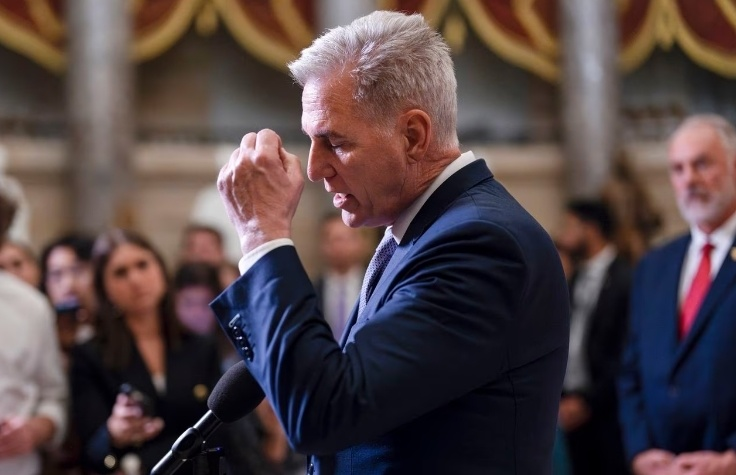

# 投资者紧急指南：美国政府若关门，重要经济指标都没了该怎么办

财联社9月28日讯（编辑
史正丞）截至北京时间周四晚间，美国国会就财政拨款问题依然没有展现出积极进展。根据最新报道，白宫管理和预算办公室已经在周三通知各联邦机构，准备好告知联邦公务员们政府又要关门了的情况。

_（众议院议长麦卡锡在本周二接受媒体采访，来源：社交媒体）_

总而言之，如果国会两院无法在当地时间周六结束前达成一份权宜预算法案，美国政府将在近50年里第22次关门。虽然政府关门并不影响华尔街交易，但过去一整年里对美股影响颇大的经济数据都将会停摆，例如：

10月3日的JOLTS岗位空缺数、10月5日的初请失业金数据、10月6日的非农报告、10月11日的PPI、10月12日的CPI，以及10月27日的PCE数据等。

考虑到强调“依赖数据”、预期“还要加息一次”的美联储将在10月31日至11月1日举行年内倒数第二次议息会议，假设这些数据都没了，未来一个月的美股交易等同于将在“黑灯瞎火”下摸索。

**其实这些数据都有“下位替代”**

随着美国劳工部、商务部的数据发布暂停，平日里不太引人关注的私营部门和州政府的经济数据，又得到走到舞台中央的机会。

在劳动就业方面， **招聘网站Indeed每周都会更新职位发布指数** ，同时各州政府也有 **工作者调整及再就业通知（WARN Notice）**
，这俩可以平替JOLTS岗位空缺数和初请事业人数。比较有争议的是 **ADP的国家就业报告（俗称“小非农”）**
，自疫情后与正牌非农报告的趋势出现比较明显的偏差，但在没有正牌非农报告的前提下，拿来用一个月也未尝不可。

补充一句，美国政府近年来关门时间最长的是35天（特朗普任内，2018.12-2019.1）。如果这次的情况突破这个纪录，那么少了几个经济数据可能就不是最主要的问题了。

在经济活动方面，对应CPI、PPI和PCE指标的也有美国供应管理协会（ISM）的一系列价格指数，拍卖公司Manheim也有针对二手车的价格指数。另外像美国银行、万事达卡等金融机构也会有消费数据。

虽然在以往的美国政府关门期间，甚至包括疫情初期，华尔街也是靠这些平替数据撑过那些时间，但不可否认的是，这些数据与劳工统计局、普查局和经济分析局这样的正牌机构相比，差距还是挺明显的。

富国银行经济学家Michael Pugliese表示，对于这些美国经济的“金标准”数据， **不论是从质量还是数量而言，都很难被取代。**

同时，对于美联储“摸黑决策”的状况，摩根士丹利首席美国经济学家Ellen
Zentner也担忧地表示，美国现在正处于货币政策的转折点，甚至也是潜在的经济转折点，任何使得观察经济前景的镜头“变模糊”的东西——无论是美联储还是私营部门的经济数据，都代表着一个复杂的因素。

事实上，美联储主席在上周已经提到过这个事情，仅表示“央行官员将不得不面对这个问题”。而明州联储主席卡什卡利甚至表示，美国政府关门、汽车工人罢工等因素都会拖慢经济，间接帮助美联储更加容易地实现2%通胀目标，
**这也意味着“美联储要做的事情变少了”** 。

（财联社 史正丞 ）

