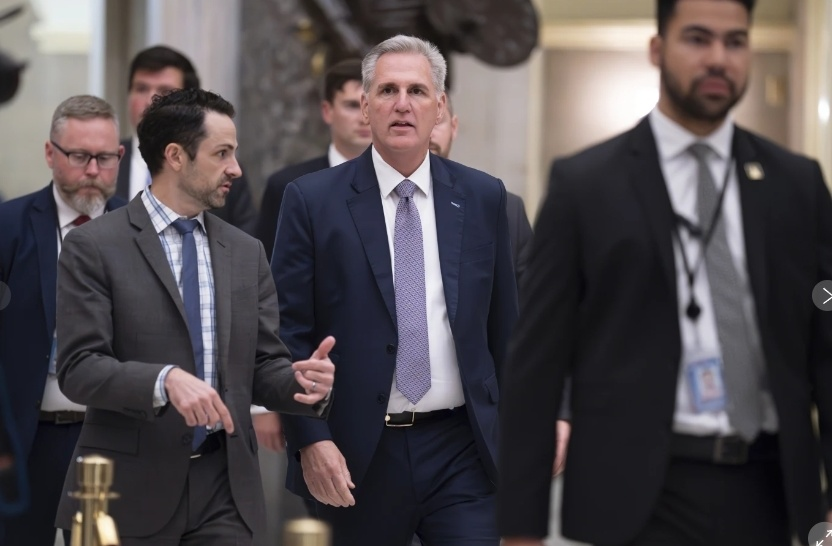
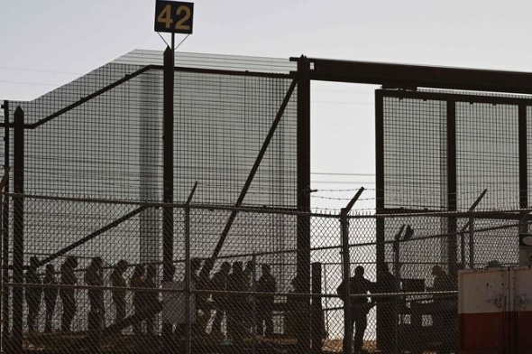
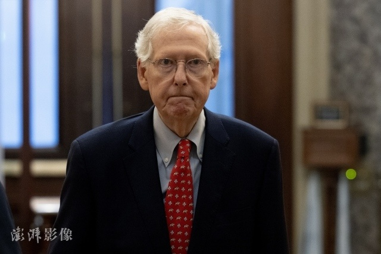

# 美国国会开支僵局难破，白宫通知员工做好“关门”准备

【文/观察者网 刘程辉】

美国两党党争近来火药味十足。这头在弹劾拜登的首场听证会上唇枪舌剑，那边随着新财年支出法案难产，参众两院各走各的路，美国政府“关门大吉”开始倒计时。

当地时间9月28日，距10月1日新财年开始仅剩不到三天，美国白宫和国土安全部已下发电子邮件通知，要求工作人员为“关门”做好准备，但白宫新闻秘书让-
皮埃尔、国家安全顾问沙利文等白宫委任官员，以及交通、执法等领域关键人员和美国军队将继续工作。

就在同一天，众议院议长麦卡锡坚称众议院共和党人不会接受参议院提出的预算方案，但他表示边境安全资金或许是打破两党僵局的可能途径。尽管众议院28日晚通过了对美国国务院、国土安全部和国防部的拨款法案，但这对避免政府“关门”于事无补。美媒称，即便法案能及时生效，最多也只能维持部分机构运作，联邦政府“关门”危机已不可避免。

 _9月26日，众议院议长麦卡锡前往国会大厦/美联社图_

**麦卡锡：边境问题或成最后突破口**

美国现行的支出法案将于当地时间9月30日到期。这意味着，如果美国国会不能在10月1日之前达成协议，美国政府就将“关门”。鉴于当前形势，共和党控制的众议院和民主党控制的参议院必须在10月1日之前通过临时拨款法案，并让美国总统拜登签署成为法律；或者国会通过一项短期支出法案，让两党议员们有更多时间进行辩论，以避免政府停摆。

据《华尔街日报》和美联社（AP）28日报道，虽然联邦政府资金到期时间已所剩无几，但参众两院正在寻求不同的办法来避免“关门”的后果。

由于每天都有成千上万的移民徒步穿越美国西南边境，移民控制仍然是确定美国政府10月1日开始的财政年度开支水平和政策的关键之一。麦卡锡28日上午对记者表示，边境安全可能会是打破两党僵局的议题，这将是避免联邦政府周末“关门”的最后一个关键努力。他认为，两党都对移民穿越美墨边境的速度感到担忧，这可能为他们制定一项短期协议以确保政府在9月30日之后继续运作提供足够的共识。

“他们想要边境问题上的一些东西，我们正在努力解决这个问题，”麦卡锡说，“所以我认为这里有机会。我们知道必须保持政府的资助，也知道双方都对边界感到担忧。”

“我还有一些时间可以做其他的事情，”麦卡锡当天晚间在国会大厦对记者说，“最终，我们会把一切都完成的。”

麦卡锡9月22日曾表示，他倾向于避免政府“关门”，但众议院共和党的强硬保守派实际上已经控制了局面。这些强硬保守派表示，不接受任何临时拨款法案，国会必须就全部12项拨款计划谈拢。但通常情况下，最早要到12月，国会才能就这些拨款计划达成一致。

_麦卡锡认为，两党活能在边境管理拨款方面打破僵局/法新社_

此前，麦卡锡提出的一项临时拨款案未能获得众议院保守派共和党人的支持，共和党“内讧”导致拨款案在众议院停滞，迫使参议院紧急采取行动，于26日出台了另一版本的临时拨款案，并将在28日将进行一场程序性投票。

这份法案旨在推进一项为期七周的拨款计划，将提供资金支持联邦政府运作至11月17日，包括为乌克兰提供60亿美元，为美国救灾提供60亿美元，这么做将让国会议员们有更多时间解决下一财年预算方案的分歧。

不过，麦卡锡表示将拒绝把这项临时拨款计划提交给众议院。

另一边，28日晚，共和党控制的众议院对四项支出法案（涉国防部、国土安全部、农业部、国务院）进行了程序性投票。其中，众议院以311票对117票的投票结果，通过了价值3亿美元的最新对乌克兰援助法案，所有反对票均来自共和党。此外，针对美国国务院、国土安全部、国防部的资金支出法案均获得通过，但对美国农业部和食品药品监督管理局的拨款法案未获通过。

然而，这些法案反映了右翼保守派的优先事项，被认为基本上不太可能最终成法。即使获得通过，这些措施也只能为政府提供一部分资金，无法避免政府“关门”的窘境。

**白宫通知员工：做好关门准备**

美联社（AP）获得的一份电子邮件显示，美国白宫和国土安全部28日已经通知工作人员为联邦政府“关门”做好准备，接到休假通知的员工10月2日将有四个小时的做好善后工作。

根据白宫的电子邮件，除工作人员外，白宫所有的委任官员都将继续在岗，其中包括幕僚长杰夫·齐恩茨（Jeff
Zients）、新闻秘书卡琳·让-皮埃尔、国家安全顾问杰克·沙利文等其他高级官员。与此同时，美国军队和联邦工作人员，包括执法人员、空中交通管制员和运输安全管理局官员也将保持在岗，因为他们对于保护国家生命和财产至关重要。

美国财政部此前表示，由于三分之二的税务局员工可能被迫休假，纳税人打给该机构的电话将无人接听，全国 363 个纳税人援助中心将关闭。

如果无法达成短期拨款协议，400多万美国军人和政府工作人员将无法领到工资，养老金领取者可能无法按时拿到政府每月支付的款项，无法支付账单和购买日用品，国家公园也可能关闭。

值得注意的是，如果政府“关门”持续到下一个预定发薪日（10月13日）之后，联邦政府人员将无法按时领取工资，不过一旦政府恢复全面运作结束，他们将收到欠薪。

 _美国国会参议院少数党领袖、共和党人米奇·麦康奈尔/澎湃影像_

参议院共和党领袖麦康奈尔警告称，即便部分政府机构“关门”也会带来深重的影响，尤其是在控制南部美墨边境移民潮方面的困难。

“政府关门不像按下暂停键。这不是一个我们能从停下的地方再次开始的间歇。这是一个十分有害的主张。它非但不会产生任何有意义的政策成果，反而会将我们在一些关键问题上取得的重要进展往后拖。”麦康奈尔说。

美国联邦政府因两党政治博弈而关门在历史上并不少见。自1981年以来，美国国会已经让政府“关门”多达14次。而如今美国参众两院的严重分歧表明，美国联邦政府在10月1日进入十年来第四次停摆的可能性越来越大，且这种党派僵局已经开始影响华尔街对美国政府信用的看法。

8月1日，国际评级机构惠誉将美国长期外币发行人违约评级由“AAA”下调至“AA+”，展望为稳定。惠誉认为，美国政府的债务负担不断加重，治理水平持续下滑，预计财政状况可能在未来三年恶化。

惠誉在声明中说，“尽管美国两党在6月达成协议，将债务上限暂停至2025年1月，但在财政和债务问题上，美国的治理标准在过去20年里持续恶化。一再出现的债务上限政治僵局和最后一刻达成的协议削弱了人们对美国财政管理的信心。”

9月25日，国际评级机构穆迪警告，美国政府如果在月底前无法通过支出法案而停摆，将对美国的信用评级产生负面影响。穆迪表示，政府停摆将凸显美国的机构和治理实力的薄弱。

**本文系观察者网独家稿件，未经授权，不得转载。**

