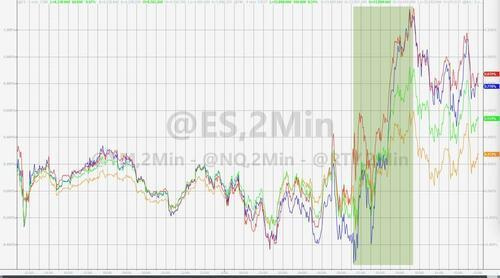
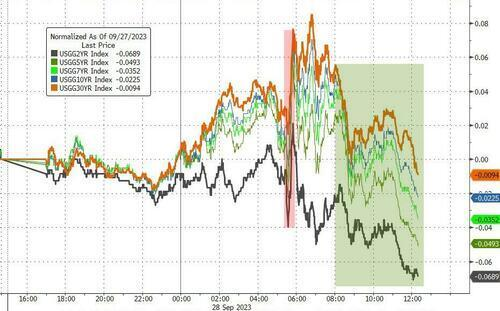
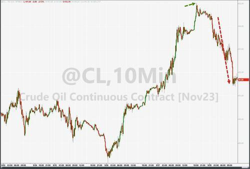
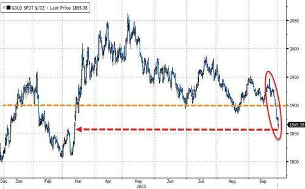

# 美股脱离四个月低位，美债收益率和油价降温，离岸人民币升穿7.30元

美国二季度实际GDP年化季环比终值增长2.1%，增幅不及预期的2.2%，2020至2022年每年第一季度增长率均被下修。但上周首次申请失业救济人数20.4万低于预期，显示劳动力市场仍有韧性。美国8月成屋签约销售指数环比骤降7%、同比跌近19%，高利率削弱楼市动能。

投资者继续关注美国联邦政府在10月1日停摆可能性、美国长债收益率连续多日创十几年最高的发展，以及周五发布的美联储最青睐通胀指标——PCE个人消费支出物价指数。对美联储今年再加息一次的市场预期徘徊于32%、且更可能发生在12月。

最新消息称，政府关门近在咫尺，白宫员工被告知做好休假准备。

美联储主席鲍威尔讲话，但为谈及FOMC货币政策，也没有置评美国经济，他称公众的理解是美联储对经济产生影响的关键，突显经济教育工作者的重要性。

德国央行行长内格尔再发鹰派言论称，如果数据表明有必要，欧洲央行可能进一步加息。欧元区最大经济体德国9月调和CPI同比初值4.3%，创2021年9月以来最小增幅，远逊于前值6.4%，但市场对欧央行年底前再加息25个基点的押注保持不变约为25%。

有分析称，基数效应逆转是德国通胀大幅降温的主要驱动力，由于德国和许多欧洲国家数据受到比平常更多的统计噪音影响，令欧央行很难软化政策立场。但四位知名经济学家敦促美联储和欧洲央行暂停加息，桥水达利欧预言美国将发生债务危机，经济料实质性放缓。

美股午盘涨幅扩大，最终齐涨脱离四个月低位，芯片股引领反弹，欧股脱离半年新低

9月28日周四，由于美债收益率在美股盘前刷新十多年最高，美股三大指数集体低开，其后随着近期触发通胀隐忧的油价回落，在开盘近一个半小时悉数转涨。

**午盘时美债收益率转跌，美股涨幅显著扩大，**
纳指、纳指100、标普500指数和罗素小盘股先后涨1%，道指涨近230点或涨0.7%，标普大盘一度重上4300整数位。标普通讯服务板块在Meta和票务公司Live
Nation涨约3%的带领下领涨大盘，AMD涨超6%领跑芯片股。

**截至收盘，**
道指在八个交易日里第二天上涨，暂离6月1日以来的近四个月最低，标普大盘从6月7日以来最低连涨两日，纳指和罗素小盘股从5月31日来低位连涨两日，小盘股创一周新高：

标普500指数收涨25.19点，涨幅0.59%，报4299.70点。道指收涨116.07点，涨幅0.35%，报33666.34点。纳指收涨108.43点，涨幅0.83%，报13201.28点。纳指100涨0.8%，罗素2000小盘股指数涨0.9%。

**周五是美股在本周、9月份和三季度的最后一个交易日，在此期间都将录得累跌。**

本周迄今，道指累跌近1%，月内跌3%，三季度跌超2%；标普500指数周内跌0.5%，月内跌4.8%，季度跌超3%；纳指周内微跌，月内跌近6%，季度跌超4%。能源是三季度表现最好的板块，累涨约13%，同期美油WTI累涨超30%，创六个季度最佳表现。

**明星科技股涨跌不一**
。元宇宙Meta涨2%，特斯拉涨2.4%，谷歌A涨1.4%，均脱离一个月最低；苹果跌1.6%后转涨0.2%，微软转涨0.3%，奈飞跌0.3%，均徘徊四个多月低位；亚马逊抹去2.3%的跌幅至平盘，仍维持三个月新低。

**芯片股涨幅显著，**
费城半导体指数涨2.9%后收涨1.8%，升破3400点至一周新高，进一步远离四个月最低。英特尔涨1.7%，AMD涨近5%至两周最高，进一步脱离四个半月最低，英伟达涨1.5%；Arm涨近5%，上周五曾创上市以来最低，但美光科技跌超6%后收跌4.4%至一个月最低。

**AI概念股继续反弹** 。C3.ai再涨3%进一步脱离四个半月最低，Palantir
Technologies涨超6%从三个月低位连涨两日至一个月最高，SoundHound.ai涨5%进一步脱离六个月最低，但昨日涨近15%的BigBear.ai跌超3%，重新下逼近九个月最低。

消息面上，英伟达显卡等部门被法国反垄断部门突击检查，股价一度回吐涨幅。微软技术主管赞扬AMD的AI表现。Meta继续受到周三发布新款头显设备、宣布AI技术进展的提振。美光科技二季度运营亏损超12亿美元但好于预期，对三季度业绩指引不佳。报道称，软银孙正义投资10亿美元，OpenAI和Ive联手做“AI时代的iPhone”。京东称开卖特斯拉汽车的传闻不实。

**热门中概尾盘跌幅显著收窄。** ETF
KWEB跌1.6%后收跌0.2%，CQQQ转涨0.5%，纳斯达克金龙中国指数（HXC）跌0.8%后转涨0.3%，连涨两日且进一步远离上周所创的两个半月低位。

纳斯达克100成份股中，京东跌1.4%，百度转涨0.7%，拼多多转涨0.6%。其他个股中，阿里巴巴跌幅显著收窄至0.8%，B站跌幅显著收窄至0.2%，腾讯ADR跌近1%，与梅赛德斯-
奔驰均否认“洽谈投资和技术共享”的蔚来汽车涨超5%至一周半最高，理想汽车跌超1%重返三个月最低，小鹏汽车涨超3%。昨日大跌44%的法拉第未来再跌超5%刷新上市后新低。

**银行股指齐涨1%，在十日里第二日上涨。**
行业基准费城证交所KBW银行指数（BKX）脱离四个月最低，5月4日曾创2020年10月以来最低。KBW纳斯达克地区银行指数（KRX）脱离三个月低位，5月11日创2020年11月来最低；SPDR标普地区银行ETF（KRE）5月4日曾创2020年10月来最低。“美国四大行”中摩根大通涨超1%提振道指成分股。

**其他变动较大的个股包括：**

正在罢工的全美汽车联合会（UAW）将涨薪幅度要求降低至30%，美国三大汽车股上扬，Stellantis涨2.5%脱离两周低位，通用汽车涨2.5%进一步远离四个月最低，福特汽车涨超1%。

互动健身平台Peloton高开12%创两个月最大涨幅，收涨超5%至两周新高，将为露露柠檬开发数字健身内容，后者成为Peloton的主要运动服装提供商，露露柠檬在涨跌之间震荡。

“散户抱团股”龙头游戏驿站高开5.5%后一度转跌4%，最终收跌近2%逼近一个月最低。公司董事会选举激进投资者Ryan
Cohen担任不领薪水的CEO、董事长兼总裁。

美国最大二手车销售商CarMax跌超13%至近五个月最低，市场急剧贬值影响销量，二季度盈利同比下滑，公司从消费者和经销商处购买的车辆比上一年减少15%。

欧股齐涨。泛欧Stoxx
600指数收涨0.36%，止步五日连跌并脱离半年新低，此前五日累跌约3%，基础资源板块涨超2%领跑大盘，银行板块涨1%。德国股指止步三日连跌也脱离半年低位。

美国长债收益率创十多年高位后转跌，短债收益率跌幅突出，欧债收益率两位数跳涨

美股盘初，5年至30年期美债收益率曾集体升至周期高点，对货币政策更敏感的两年期收益率维持小幅下跌。午盘时2至10年期美债收益率转跌下挫，同时，美国财政部拍卖370亿美元七年期国债，得标利率4.673%创历史新高，投标倍数2.47弱于前次的2.66。

两年期美债收益率一度上测5.16%，转跌后最深下行近8个基点至5.06%，接近一周低位，上周曾突破5.20%创下2006年以来最高。七年期收益率转跌前曾创1993年6月底以来最高。

10年期基债收益率一度上行6个基点上逼4.70%，刷新2007年10月15日以来最高，随后转跌超4个基点至4.59%。30年期长债收益率一度涨超7个基点并升破4.80%，创2010年以来最高，随后也短暂转跌至4.70%。

欧债收益率大幅走高。欧元区基准的10年期德债收益率最高涨14个基点至2.98%，刷新2011年7月8日以来最高、创近三个月最大涨幅、逼近3%整数位心理关口。两年期收益率尾盘涨超5个基点上逼3.30%，7月初曾触及2008年以来最高3.393%。30年期收益率再创2011年来最高。

欧洲负债较深外围国家基准的10年期意债收益率跃升18个基点至4.96%，创近十一年最高，也录得7月初以来的最大单日涨幅。衡量风险情绪的意/德国基债息差升至200个基点创半年最阔。10年期英债收益率则跃升20个基点，创今年2月份以来的最大单日涨幅。

有分析称，德国最新通胀数据降温，未能引发市场对欧洲央行可能软化政策立场的预期，意大利债务风险溢价触及六个月高位，是由于该国政府下调今明两年的经济增长预测并上调预算赤字目标。有分析称，油价持续上涨，加剧了人们对欧美央行抗击通胀斗争尚未结束的担忧。

美油自去年8月以来首次涨穿95美元后转跌超2%，布油也脱离去年11月来高位

WTI
11月原油期货收跌1.97美元，跌幅2.10%，报91.71美元/桶。布伦特11月期货跌1.17美元，跌幅1.21%，报95.38美元/桶。NYMEX
10月天然气期货涨6.6%至2.945美元/百万英热单位。

美油WTI在周四亚太早盘曾自去年8月以来首次涨穿95美元，随后从一年多高位回落，至美股盘中最深跌2.27美元或跌2.4%，较日高回落3.62美元并失守92美元整数位。但美油9月累涨12%，即将创下去年5月以来的首个连续四个月上涨周期。

即将到期交割的布伦特11月期货日高上破97美元后，在美股盘中下逼95美元或跌1.5%，交投更活跃的12月期货一度上破95美元，转跌后最深跌1.58美元或跌1.7%，较日高回落2.56美元并失守93美元关口，脱离去年11月以来的十个多月高位。

_美油自去年8月以来首次涨穿95美元后转跌超2%_

市场聚集美油期货交割地——库欣地区的库存上周再降逾90万桶，总量跌至不足2200万桶的去年7月来最低，并接近最低运营水平。还有报道称，俄罗斯短期内没有解除燃油出口禁令的计划。瑞银称年底之前油价将维持高位并面临上行风险，布油将在90至100美元区间波动。

欧洲天然气期货冲高回落，基准TTF荷兰天然气尾盘涨0.3%，继续失守40欧元/兆瓦时整数位，脱离一个月最高。ICE英国天然气尾盘涨1.4%，但站稳100便士/千卡的关口上方。

美元下逼106但将连涨11周，欧元日元英镑脱离数月最低，离岸人民币涨穿7.30元

美国GDP数据发布后，衡量兑六种主要货币的一篮子美元指数DXY最深跌0.6%并下逼106关口，止步五日连涨，从昨日触及106.84所创的去年11月底以来十个月最高回落，但势将连涨11周。

美元指数在9月累涨2.6%，将创5月份以来最佳单月表现；三季度累涨3.3%，迈向去年三季度以来最大季度涨幅。有分析称，美元受益于美债收益率上升、避险需求和美国经济相对优异。

_美元下逼106，脱离十个月最高，但将连涨11周_

欧元兑美元转涨0.8%并重上1.05关口，止步七日连跌，脱离昨日所创的去年12月初以来近九个月最低。英镑最高涨0.7%并一度上破1.22，止步六日连跌，脱离3月中旬以来的六个半月最低。

日元兑美元小幅上涨仍不足149关口，止步四日连跌，脱离去年10月中旬以来的近一年最低，华尔街预测日元跌至150将引发央行救汇。美银预计日元年底跌至153，明年一季度在155触底。

离岸人民币兑美元涨穿7.30元，较上日收盘最高升320点，较日低最高反弹360点，至一周高位。商品货币澳元兑美元涨超1%，脱离去年10月底以来的11个月最低。

**主流加密货币齐涨。**
市值最大的龙头比特币涨超3%并重上2.7万美元关口，至一周高位，第二大的以太坊涨近4%并升破1650美元整数位，至四周新高，但三季度均两位数累跌。

_比特币涨超3%并重上2.7万美元_

黄金四连跌至近七个月最低，伦锌大涨近6%，铝涨近2%铜涨超1%，镍重返14个月最低

关注美国通胀数据，金价连跌四日。COMEX
12月黄金期货收跌0.65%，报1878.60美元/盎司，失守1880美元整数位，刷新3月中旬以来的半年多新低。但期银小幅收涨。

现货黄金最深跌超17美元或跌0.9%，一度失守1860美元整数位，连跌四日至3月初以来的近七个月最低。有分析称，对美国利率长期走高的押注削弱了不提供固定收益率黄金的吸引力。

_黄金四连跌至近七个月最低，抹去硅谷银行倒闭以来涨幅_

**美元走低显著提振伦敦工业基本金属：**

经济风向标“铜博士”涨104美元或涨1.3%，重上8200美元，脱离6月初以来的近四个月最低。伦铝涨1.8%至两个月最高，伦锌涨144美元或涨5.8%，上破2600美元至近五个月最高。伦铅涨1.9%脱离一个月低位。

但伦镍跌0.6%失守1.9万美元，重返去年7月以来的14个月最低，今年累跌38%是跌幅最大的LME金属，主要由于亚洲新建工厂供应上升。伦锡跌1.3%至六周最低。

有分析称，锌等其他基本金属价格还受益于库存下降。LME注册仓库的认证锌库存降至5月底以来最低水平，显示需求回升迹象。上海期交所监测仓库的锌和铜库存均较上周五下降三成，但LME系统的铜库存仍处于去年5月以来最高。

