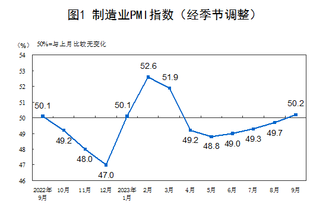
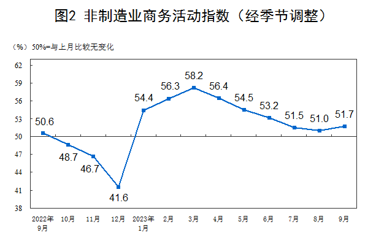

# 国家统计局：制造业PMI连续4个月回升 4月份以来首次升至扩张区间

国家统计局服务业调查中心

中国物流与采购联合会

**一、中国制造业采购经理指数运行情况**

9月份，制造业采购经理指数（PMI）为50.2%，比上月上升0.5个百分点，重返扩张区间。

从企业规模看，大型企业PMI为51.6%，比上月上升0.8个百分点，继续高于临界点；中型企业PMI为49.6%，与上月持平，低于临界点；小型企业PMI为48.0%，比上月上升0.3个百分点，低于临界点。

从分类指数看，在构成制造业PMI的5个分类指数中，生产指数、新订单指数和供应商配送时间指数高于临界点，原材料库存指数、从业人员指数低于临界点。

生产指数为52.7%，比上月上升0.8个百分点，表明制造业生产扩张步伐有所加快。

新订单指数为50.5%，比上月上升0.3个百分点，表明制造业市场需求继续改善。

原材料库存指数为48.5%，比上月上升0.1个百分点，表明制造业主要原材料库存量降幅持续收窄。

从业人员指数为48.1%，比上月上升0.1个百分点，表明制造业企业用工景气度略有回升。

供应商配送时间指数为50.8%，比上月下降0.8个百分点，仍高于临界点，表明制造业原材料供应商交货时间继续加快。

**二、中国非制造业采购经理指数运行情况**

9月份，非制造业商务活动指数为51.7%，比上月上升0.7个百分点，非制造业扩张力度有所增强。

分行业看，建筑业商务活动指数为56.2%，比上月上升2.4个百分点；服务业商务活动指数为50.9%，比上月上升0.4个百分点。从行业看，水上运输、邮政、电信广播电视及卫星传输服务、互联网软件及信息技术服务、货币金融服务等行业商务活动指数位于55.0%以上较高景气区间；铁路运输、航空运输、住宿、餐饮等行业商务活动指数低于临界点。

新订单指数为47.8%，比上月上升0.3个百分点，表明非制造业市场需求景气度有所改善。分行业看，建筑业新订单指数为50.0%，比上月上升1.5个百分点；服务业新订单指数为47.4%，与上月持平。

投入品价格指数为52.5%，比上月上升0.8个百分点，表明非制造业企业用于经营活动的投入品价格总体水平继续上涨。分行业看，建筑业投入品价格指数为54.7%，比上月上升6.3个百分点；服务业投入品价格指数为52.1%，比上月下降0.2个百分点。

销售价格指数为50.3%，比上月上升0.3个百分点，表明非制造业销售价格总体水平有所上涨。分行业看，建筑业销售价格指数为51.5%，比上月上升1.1个百分点；服务业销售价格指数为50.0%，比上月上升0.1个百分点。

从业人员指数为46.8%，与上月持平，表明非制造业企业用工景气度仍然较低。分行业看，建筑业从业人员指数为46.3%，比上月上升1.6个百分点；服务业从业人员指数为46.9%，比上月下降0.3个百分点。

业务活动预期指数为58.7%，比上月上升0.5个百分点，保持在较高景气区间，表明非制造业企业对近期市场恢复发展信心较强。分行业看，建筑业业务活动预期指数为61.8%，比上月上升1.5个百分点；服务业业务活动预期指数为58.1%，比上月上升0.3个百分点。

**三、中国综合PMI产出指数运行情况**

9月份，综合PMI产出指数为52.0%，比上月上升0.7个百分点，表明我国企业生产经营活动总体扩张加快。

**附注**

1、主要指标解释

采购经理指数（PMI），是通过对企业采购经理的月度调查结果统计汇总、编制而成的指数，它涵盖了企业采购、生产、流通等各个环节，包括制造业和非制造业领域，是国际上通用的监测宏观经济走势的先行性指数之一，具有较强的预测、预警作用。综合PMI产出指数是PMI指标体系中反映当期全行业（制造业和非制造业）产出变化情况的综合指数。PMI高于50%时，反映经济总体较上月扩张；低于50%，则反映经济总体较上月收缩。

2、调查范围

涉及《国民经济行业分类》（GB/T4754-2017）中制造业的31个行业大类，3200家调查样本；非制造业的43个行业大类，4300家调查样本。

3、调查方法

采购经理调查采用PPS（Probability Proportional to
Size）抽样方法，以制造业或非制造业行业大类为层，行业样本量按其增加值占全部制造业或非制造业增加值的比重分配，层内样本使用与企业主营业务收入成比例的概率抽取。

本调查由国家统计局直属调查队具体组织实施，利用国家统计联网直报系统对企业采购经理进行月度问卷调查。

4、计算方法

（1）分类指数的计算方法。制造业采购经理调查指标体系包括生产、新订单、新出口订单、在手订单、产成品库存、采购量、进口、主要原材料购进价格、出厂价格、原材料库存、从业人员、供应商配送时间、生产经营活动预期等13个分类指数。非制造业采购经理调查指标体系包括商务活动、新订单、新出口订单、在手订单、存货、投入品价格、销售价格、从业人员、供应商配送时间、业务活动预期等10个分类指数。分类指数采用扩散指数计算方法，即正向回答的企业个数百分比加上回答不变的百分比的一半。由于非制造业没有合成指数，国际上通常用商务活动指数反映非制造业经济发展的总体变化情况。

（2）制造业PMI指数的计算方法。制造业PMI是由5个扩散指数（分类指数）加权计算而成。5个分类指数及其权数是依据其对经济的先行影响程度确定的。具体包括：新订单指数，权数为30%；生产指数，权数为25%；从业人员指数，权数为20%；供应商配送时间指数，权数为15%；原材料库存指数，权数为10%。其中，供应商配送时间指数为逆指数，在合成制造业PMI指数时进行反向运算。

（3）综合PMI产出指数的计算方法。综合PMI产出指数由制造业生产指数与非制造业商务活动指数加权求和而成，权数分别为制造业和非制造业占GDP的比重。

5、季节调整

采购经理调查是一项月度调查，受季节因素影响，数据波动较大。现发布的指数均为季节调整后的数据。

相关阅读

[国家统计局：9月份制造业采购经理指数重返扩张区间](https://new.qq.com/rain/a/20230930A01P2S00)

