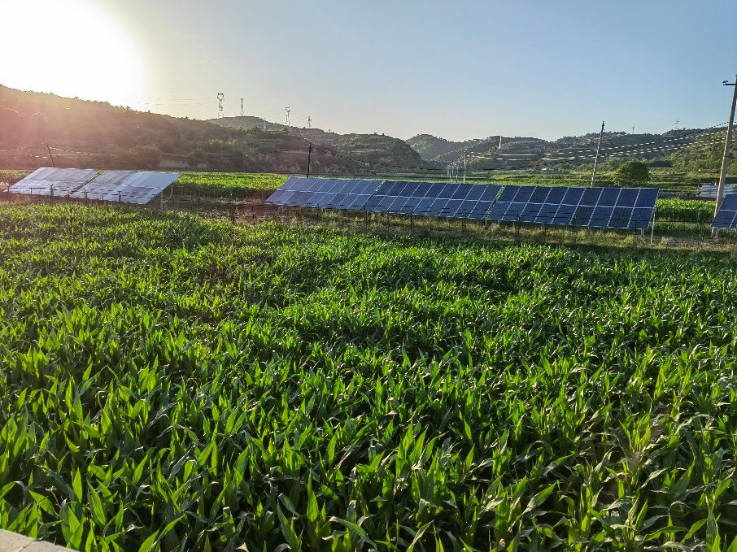
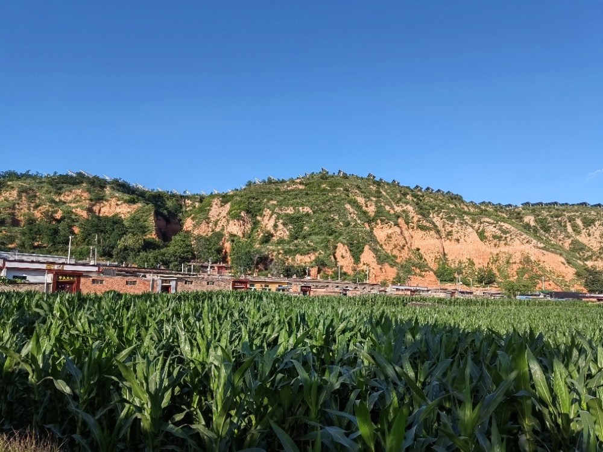
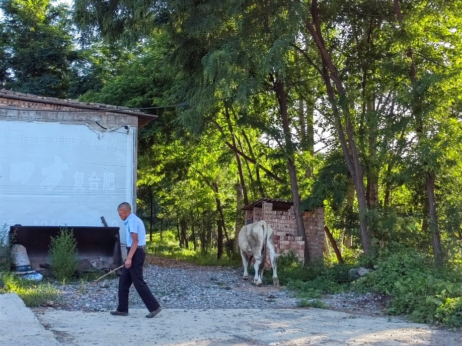

# 在农村搞产业为什么“十赌九输”？有的人就是冲着政府补贴去的

**蒲洋 | 武汉大学社会学院**

村集体经济是我国农村经济的重要组成部分，不仅关系到千家万户的切身利益，更是关乎到脱贫成果巩固与乡村振兴战略的有效实施。习近平总书记指出：“要把好乡村振兴战略的政治方向，坚持农村土地集体所有制性质，发展新型集体经济，走共同富裕道路”。对此，我国政府采取了一系列政策措施，推动村集体经济的发展。近年来，政策成效日益显著，村集体经济稳步发展，从2012年到2020年，村集体经济组织的净资产从1.3万亿元增长到了3.7万亿元，村均净资产也从222万元增长到了686万元，同时本年实现收益从1109.2亿元增长到了2137.8亿元，村均从18.8万元增长到了39.6万元。

然而，现实情况中村集体经济的发展情况具体如何，是否真的像上述数据展现的一样繁荣？

一、村集体经济的类型

2023年中央一号文件提出，“巩固提升农村集体产权制度改革成果，构建产权关系明晰、治理架构科学、经营方式稳健、收益分配合理的运行机制，探索资源发包、物业出租、居间服务、资产参股等多样化途径发展新型农村集体经济”，从中可以发现新型农村集体经济至少包括资源发包、物业出租、居间服务、资产参股等发展模式。而在各地的村集体经济实践中，又会根据各地的实际情况，探索出类型多样、各具特色的发展模式。

笔者调研的F县为山区农业县，2020年刚脱贫摘帽，2021年被确定为全省乡村振兴重点帮扶县。自2017年以来，F县探索出村集体经济发展的“三型”模式，即综合服务型、折股入社型、两资入市型，实现全县120个村集体经济收入全部达到1万元以上，其中29个村达到5万元以上。根据《F县抓党建促乡村治理能力提升实施方案（2022年3月）》中发展壮大村级集体经济任务要求：到2022年，集体经济年收入30万元以上的村达到35％以上，50％以上的村经营性收入实现突破；2023年，年收入30万元以上的村达到45％以上，70％以上的村经营性收入稳步提高；2024年，年收入30万元以上的村达到60％以上，90％以上的村经营性收入显著提高，同时根据Q镇的干部反馈，2023年村集体经济的最低要求为10万元。

（备注：综合服务型，即村集体成立产业发展服务公司，利用各类产业发展扶持资金，支持农民合作社、家庭农场、种养大户发展，通过提供各项服务获得收益；折股入社型，即村集体将集体资金和财政资金转化为股权，量化到贫困户和村集体，注入合作社，并将每年盈余按照财政资金所占股权份额进行分配，贫困户分配比例不低于70%，20%用于合作社发展，10%留村集体；两资入市型，即村集体将资产、资源直接引入市场，采取承包、租赁、拍卖、出让或通过土地开发、综合治理、上市交易等方式实现和壮大村集体经济收入。）

无论是何种村集体经济类型，基本上都是从参与市场的几大要素出发，组合而来。看似花样繁多的发展模式概括和近乎完美的稳步增长数据依然只停留在表面，并不能反映出村集体经济真实的发展全貌与实践样态，一切都要回到村集体经济本身，回到其发展目标和运作效果。由此，这里涉及到两个最为关键的问题：
**一是产业经营是否成功** ，如果产业经营失败，产业整体上没有营收，不论哪种发展模式或经济类型，集体经济都不能从中获得任何收益；
**二是集体经济是否盈利，尤其是农民是否增收**
，如果产业发展起来，但集体并没有增收，实际上也并非乡村振兴的本意。在实践中，经常能够发现与这两个问题相悖的现象，要么产业根本就发展不起来，要么虽然发展起来了却跟集体关系不大或者没有什么关系，农民也没有获利。

2023年7月笔者在F县的Q镇调研，收集了一些集体经济发展的案例，以从这些案例的分析中窥见集体经济发展的现状、影响因素及可能趋向。在本文中，笔者将村集体经济发展案例分成两类
**，一类是失败的产业** ，指目前已无法维持经营，且没有收益，经营者已撤资或停止经营的产业， **一类是暂时成功的产业**
，指目前依然能维持经营，且能产生收益和资金流动，经营者继续经营的产业。

二、失败的产业

**案例一：T村核桃经济林**

林业局最早开始倡导种植核桃，并在全县推广，村集体以全体村民土地入股的形式种植核桃经济林两千余亩，统一提供种子和技术指导。后来由于核桃品种不行，多年不产果，看不到收益，老百姓管理也不好，核桃价格也一般，最后都没挣什么钱，老百姓也没弄了，全部荒废在那里。

**案例二：T村双孢菇产业**

2016、2017年，利用产业扶贫的切块资金投入18万元左右，建设高标准双孢菇种植大棚4座，发展香菇产业，村集体分红每年1.4万元，但是这个产业只分红了2年就倒闭了。

按照村集体和乡镇干部的说法，双孢菇产业失败的原因在于技术和销售，由于技术没有跟上，双孢菇的产量很小，品质也很差，再就是销售，香菇的采摘时间是非常短的，种出来的香菇过两天就放坏了，第一天不采可能没事，第二天再不采可能就坏了，但是F县本地人并不爱吃香菇，本地市场比较小，就得销往外地市场，可是由于种植规模并不大，也不出名，外地的收购商都不愿意来，一大卡车拖不了多少都不满，来一趟不划算，销售问题非常大，卖不出去就全砸手里。

**案例三：L村兔子养殖产业**

2009年，L村作为整村推进扶贫项目的试点，规划发展兔子养殖产业，计划投资290万，政府投资129万，实际上建成后总投资140多万，政府投入63万。刚开始，一斤9-10元，一只兔子10斤多，繁殖快，产量大（一只兔子每年可以生8窝，一窝6只），一只兔子可以挣10元。200只种兔发展后，市场相对稳定，计划扩大规模，2011年成立养兔合作社，整村养殖，扩大完善养殖基地，每月出栏800-1000只，卖到襄汾的屠宰场，巅峰时，价格达到14-16元/斤。2012年1月开始降价，到10元/斤，再到6元/斤，持续近5年。2013年以后，卖一斤兔子还得赔2块钱，当年赔了近40万。2014年后半年开始缩小规模，存栏从5000多到1000多只，逐渐关闭。

该产业的失败主要是因为市场波动，兔子的皮毛市场变差，皮毛出口少，销量少，价格下跌，而肉兔的养殖成本没有市场竞争力，纯靠卖肉兔赚不到钱，逐渐倒闭。

**案例四：Q镇的养牛场**

镇上的集体经济，国家投入了300万建养牛场，投入了之后收分红，类似于合作社一样。刚开始养殖时，牛价还在16.5块/斤，但是养了一年之后，牛出栏只有10.5元/斤，根本不挣钱，白养一年。

养牛场失败的原因也跟兔子养殖类似，都是因为市场波动，价格下跌，售价还比不上成本价，越养越亏，直接关停。

三、暂时成功的产业

**案例五：T村光伏发电**

国家扶贫项目，政府投资建设的200千瓦光伏发电站，每年有20万元左右的收益分红，村级光伏扶贫电站收益瞄准脱贫户和监测户，根据受益的80%给脱贫巩固户和边缘户予以分配，其余受益用于村级小型公益事业，目前该项集体经济收入稳定。

据悉，F县已实现86个行政村村级光伏发电“全覆盖”，仅此一项可为村集体年增收20万元。

_县已实现86个行政村村级光伏发电“全覆盖”，仅此一项可为村集体年增收20万元。_

**案例六：T村生猪养殖**

生猪养殖为T村的一村一品发展项目。2016年该村决定在实施生猪养殖项目，具体由该县某农牧专业合作社联合社组织实施，并与某大型企业合作，由企业提供养猪技术、饲料、猪苗、设备等，并直接定价收购，是目前产业发展中较为常见的“公司+合作社+（产业示范园）+基地+农户”的模式。项目预估总投资为1340万元，分两期实施，包括生猪饲养区、办公生活区、饲料加工区、有机肥生产区。一期工程为项目场地的平整，通水、通电、通路、育肥猪大棚7座、生活办公区的建设，预计投入745万元，其余工程为二期建设项目。

一期资金来源为政府扶贫资金80万元，农户以土地入股，共94.9亩（折合人民币57万元），合作社自筹资金543万元，申请省级财政资金60万元、县级财政资金5万元。上级申请资金，农户土地折合资金归为村集体股份。参股比例为村集体股份16.5%,（农户以土地入股比例为7.7%，村集体股份比例8.8%)，贫困户股份为10.7%，合作社股份为72.8%。

项目计划利润照股份分配，按7棚，每棚500头计算，共计3500头，每年每棚两批次，共出栏7000头，预估收入91万元，村集体8.8%分红8万元（其中经营者占20%分红为1.6万元，村集体占80%分红为6.4万元）。然而，实际经营下来，村集体的分红每年只有5万多元，其中还有2万元是土地承包的租金。

目前，该产业也是勉强维持，T村书记表示“从2018年到现在没有剩余，也没怎么赚钱”。在实际的养殖过程中面临着诸多困难和不确定性，一是成本，给企业代养，村集体承担水电和设备维护的成本，同时还雇佣了两个工人，一个工资是4500元/月，另外，出栏一批猪之后，又要购入一批猪苗继续养殖，挣的钱都投入再生产了，结余不多；二是价格，猪肉价格有波动，今年的收购价只有9.4元，市场存在不确定性；三是管理，养猪要避免猪瘟猪病和猪打架，如果猪打架的时候没有提前发现，整只猪都要扔掉。

**案例七：H村黄牛养殖**

2017年一村一品项目，政府拨付资金15万，村里刚好有合作社，就直接将这笔资金入股合作社，每年以6%的比例给村集体分红，大概是几千块钱。经过一番考察后，合作社决定养殖黄牛，当时黄牛的价格好，而且还有改良的新品种，就是成本比较高，一头牛一万多，一头繁殖用的大母牛就得两万多。去年（2022年）一共有31头牛，今年又下了7、8头崽，一共40头左右，但是分红不太稳定，去年的分红就还没有给，因为去年的牛行情不好，合作社不忍心把牛贱卖还亏本，想等着价格上涨了再卖，目前养殖还能勉强维持。

**案例八：H村酒业投资**

2021年下半年县委组织部实施的帮扶资金，即壮大村集体经济的50万元，村委考虑到村民自己生产或村集体发展产业的市场风险较高，政府对村集体经济收益还有相应的提升要求，因此为满足政府考核的要求，提高村集体经济收入，同时保障资金的安全和稳定。村委将这一笔资金投入到本地的北京坊酒业公司，每年享受6%的分红，可以分到3万块钱。目前来说，这笔分红是非常稳定的。

**案例九：H村农机合作社**

农机合作社自2015年开始发展，2016年正式成立，现今自有机械24台，加上合作社成员（其他村民）的小型机械一共有95台。村集体分别在2017年投入切块资金11万，2021年投入村集体发展壮大资金50万，合作社以6%的比例分红，每年可以分红5万元。目前，该农机合作社还在扩大规模，村集体获得的分红稳定。

目前，Q镇打算利用国家扶贫项目以及县里产业扶贫和配套资金，投资1000万左右，发展香菇产业。多次到河北某县及某龙头企业考察，计划以“龙头企业+村集体+农户”的模式，龙头企业提供菌棒和技术指导，农户承包经营（5元/平方米的价格），龙头企业保底回收（菌棒成本3.5元/个，运费0.5元/个，保底收入6元/个，利润2元/个）。该项目已在进行中，初步选址以1000元/亩的租金承包100亩土地，并进行土地平整，预计按照龙头企业的标准建立70个香菇大棚，预选5个乡村能人承包经营，并倡导有相应技术的村民返乡经营。

四、十赌九输的村集体经济

从上述案例中可以发现，近年来Q镇发展的产业中，村集体经济收入能够相对稳定的寥寥无几，即使是暂时成功的产业也是岌岌可危，艰难维持，只有极少数达成了初定目标，维持着相对连续的集体收入，尤其是案例五、案例八和案例九，可以称得上是完全的成功产业，目前的风险很小。但是，这三个案例都相当特殊。

案例五的光伏产业是一类典型的资本密集和技术密集的产业，只要国家投入了足够的资金建成光伏发电设备，光照稳定，国家电网购买，并负责技术指导和设备维修，成本就是可控的，基本上不存在任何风险，也不会受到市场干扰。虽然光伏产业能够带来相对稳定的集体经济收入，但是光伏项目的选址、建设、运行、维护等环节可以说完全由政府决定，其资金也来源于国家扶贫项目的投入，并且项目收益的分配也有一定的要求，一般都是按照比例分红给特困人群，因此政府成为实际上的经营主体，村集体并无太多干涉和支配的自主权，同时给村民创造的就业岗位也极其有限。

案例八和案例九都属于投资分红型的模式，村集体将财政资金投入到酒业公司和农机合作社，然后每年可获得该资金6%的固定分红。无论是酒业公司还是农机合作社，其市场相对来说是比较稳定的，村集体并不涉及实际经营，由公司和合作社自担风险、自负盈亏，村集体只是投入部分资金以获得相应的财产性收入，相对稳健，风险较小。

除了上述三个比较特殊的案例，Q镇的其他产业基本上为种植或养殖的生产经营型的农业产业，而且大多数经营失败或是艰难维持，探究其原因，可以发现，农业产业的发展实际上存在门槛，从生产到销售的过程中，每一环节都是惊险的一跃。

**第一，土地及生态门槛。**
无论是种植业还是养殖业都需要连片成块的平整土地，以便于机械作业或建设厂房、安置设备，而Q镇位于黄土高原边缘，属于山地丘陵地形，平整土地较为稀缺，且存在各项土地指标的限制，稍好一点的土地租金达到1000元/亩，而差一点的土地虽然租金稍低，却要承担土地整治的费用，因此，大规模连片的平整土地十分难得，成本不低。与此同时，种植和养殖还应考虑当地的生态环境，选择适应性较强的品种，光照、湿度、土壤、水源等条件缺一不可，不然只有投入，没有产出，白干一场。另外，任何气象灾害或地质灾害（大风、洪涝、滑坡、泥石流等）都可能让努力白费。

 _大规模连片的平整土地十分难得，成本不低。_

**第二，资本门槛。**
农业产业具有前期投入大，投资回报时间长且存在周期性，利润率不高的特点。种植业需要承担土地成本、原料成本和劳动力成本等，养殖业另外还要承担厂房的建筑成本和设备成本等，都需要前期投入大量的资金，如果产量不佳或市场价格较低，这些投入很难收回来，基本上打了水漂。

**第三，技术门槛。**
农业生产讲究技术和经验，什么时候应该播种，什么时候可以收割，如何施肥，怎样可以增产，出现了病虫害如何防治……都需要相应的技术。Q镇的双孢菇和黄粉虫产业就是因为技术没有达标，没有产量，品质不好，发展失败。而同样在生猪养殖时，T村的生猪养殖只能在猪打架之后发现，这样的猪只能全部扔掉，而在另一个县的生猪养殖场却能提前发现或事中补救，从而降低损失。

**第四，管理门槛。**
农业产业发展也需要良好的管理，一是农机和劳动力的管理，涉及到如何分配农机使用和雇工，如何管理雇工，提高生产效率；二是与村庄社会的关系也需要好好经营，涉及到土地时，如何与村干部和村民打交道，生产过程中是否会影响到村庄的生态环境或社会关系，尤其是外地资本进入后，如何实现本地化的问题；三是园区设计、产业发展规划、发展方向调整等也必须结合市场竞争审时度势。

**第五，销售门槛。** 销售是农业产业发展的老大难问题，就像T村的村书记说的
**“我们老百姓啥都能养、啥都能种，就是没有销路，卖不上价，挣不到钱，落后就落后在市场上”。**
上述的许多案例也都涉及到市场环境的变化以及销售问题带来的困境。销售问题具体可以分为市场容量（市场规模、需求量、销售价格）、销售渠道（销售途径、销售地、渠道稳定性）和成本（运输成本、人力成本等），另外，销售也受到生产规模和生产质量的影响。从生产到销售才是农业产业最为关键的一环，这意味着投入的回报和变现，如果生产出来却没有较好的销售渠道和销售价格，经营者就没有收益，也就没有持续经营的动力，产业就没有发展的前景。因此，解决销售问题才是首要，如果产品卖不出去，那么无论是怎样的经营模式或集体经济类型都是空谈。

五、政府角色的多变性

政府如此大的力度扶持乡村产业在于推动乡村振兴，缩小城乡差距，实现共同富裕，然而在实践中，政府扮演着不同的角色，笔者将其归纳为经营者、协助者、限制者和利益者，或有重叠或不完善之处，仅供参考。

**经营者** 是指政府作为经营主体直接经营产业，这是最为特殊的一种类型，类似于上述案例中的光伏产业，国家直接投入资金建设，并对收益分配作出要求。

**协助者**
是指政府不作为直接的经营主体，而作为协助者支持产业发展，尤其是作为中介平台链接技术、资本、人才等各类产业要素。具体而言，协助者也表现为多种形式。一是引进，政府协助引进外地企业和外地资本、外地人才、外地优良品种、外地经营模式等到本地，弥补本地的不足，推动产业升级。相对应的是推广，即将本地的产品、本地的企业或是本地的发展模式向外宣传，加强交流，拓宽销售渠道，比如展销会。三是政策扶持，政府以补贴或奖补的形式提供资金、人才、技术等支持，例如F县为扶持养牛产业，补贴母牛500元/只，小牛犊1000元/只，目前已补贴资金40多万元。四是规划，通过多方考察，学习各地经验，政府对本地的产业发展提前谋划，布置前景，指导方向。

**限制者**
是指政府受某些因素的影响反对或抑制、限制某些产业的发展和扩大。最常见的就是各项土地指标和土地规划的限制，使得农业很难扩大生产规模。另外，在生态保护的政策下，部分产业也不能发展，比如T村的村民认为“我们这边的产业最好是跟玉米有关，比如玉米的深加工什么的，可以弄个企业，大家都种玉米，我们这边的玉米芯很好，淀粉含量高，比河南的还好，原料又好又便宜，那边就有那种化工、甲醛生产的，我觉得那种化工的方面，在我们这里弄肯定很挣钱，但是不好审批”，但是化工产业受到诸多限制，发展不起来。

**利益者**
是指政府角色中所具备的多重利益性，既包括集体的，也包括个体的，既有地方政府的利益，也有各层级政府的利益，还有政府内部的个体利益，不同利益的存在和各种搭配组合都可能使产业发展呈现出不同走势。

在科层制系统中，指标考核的压力层层下压，每一层级都要展现出政绩。养牛业是F县的重点产业，最开始是Q镇发展起来，进而推广的，因此作为领头羊的Q镇多次受到表扬，“我们在这个会上一直是受表扬的，因为书记县长也在强调这个养牛产业的重要性，每次在例会上通报，我们镇肯定是走在最前面的，一个是增幅快，不仅仅指出生的小牛犊多，而且是新增加的养牛户多。今年全县增加了80多家养牛业，我们镇上就增加了30多家。
**小牛犊多是在考验牛的能力，养牛多是在考验领导的能力**
，我们镇还是非常好的”。而作为先行者的Q镇在养牛产业上也绝不能落后，必须不断创造超额政绩来维持“形象”，“今年的养牛任务是新增900头，我给各村支书下的任务一共是1000头”。

而每一个产业是否上马或发展的好坏，展现的则是领导的个人能力，也就出现了“今年种桃子，明年种梨子，换一个领导就换一个品种，一村一品换了又换，这个还没产量，没收益，马上又要换一个品种”类似的为了个体政绩的做法，上述T村的双孢菇产业也是由当时的某位镇长提出的，项目考察较为粗糙，乡镇内部也有不同的声音，最后该项目还是上马了。

从政绩出发，农业产业的发展要求可视化、标椎化和规模化，产业的发展要看得见、摸得着，最好是有基地，有厂房，这样才能最直观地展现出政绩，能够让领导“看见”。同时，产业发展规划是政府的集体决策，虽然领导个体在其中起到很大的作用，但其流程依然是群体决议的过程，这意味着责任的模糊性，存在责任分散效应，即使产业发展失败，也无法归咎到某一个人的责任。并且，产业发展受到很强的市场力量干扰，再不济也是“市场不行，经营不行，这不行，那不行……”根本找不到特定的责任主体。另外，这其中也存在一定的权力寻租空间，发展什么产业，跟哪家企业合作，补贴政策给谁……都有可能出现灰色利益。

身具多重角色的政府在实践中也具有多变性，不同的角色与不同的产业、不同的村庄基础及发展诉求、不同的经营主体之间表现出不同的适配度。

六、失去信心的农民

**“我们这里的产业基本上90%都失败了，政府投入了那么多钱，最后什么都没搞成”。**

**“十赌九输”**
是对目前乡村产业发展极为形象的说法，回到文章的开头，笔者提到的两个关键问题，一是产业经营是否成功，有没有收益；二是村集体经济有没有收入，农民是否增收。目前看来，“把蛋糕做大”仍是首要任务，无论哪种村集体经济模式，产业都发展不起来，没有收益，又何谈增收？？

那么，在仅有的成功案例中，村集体和农民是否增收了？答案是肯定的，但是又出现了另一个问题，即精英俘获，或者说是资本俘获，相比于政府投入的大量财政资金而言，村集体和农民的经济收入只占其中极小比例。政府并不适合市场经营，也没有精力和时间，近年来兴起了很多“公司+”的经营模式，例如上述Q镇即将启动的香菇产业，由某大型企业负责香菇的原料、技术和回收，等同于是帮公司“代种”，这种模式的好处就在于销路可以保障，比较省事。虽然经过计算，乡镇预估利润在2元/个，但实际上是否能达到这个利润还是未知数，乡镇也意识到这个问题，但认为“即使利润达不到这么多，甚至是没有利润，只要能够维持经营不倒，至少还能增加一些务工机会，村民能去务工赚一点钱也是增收了”。而在笔者的调研经验中，香菇产业的劳动力需求是非常集中的，可能只在某一段时间需要用人，其余时间需求很小，提供的就业岗位也是非常有限。而随着技术的升级，大多数工作岗位也不再需要人力。农村最大的劳动力优势在技术的更新换代下荡然无存，每一次产业的进步即意味着将更多农民甩出在外。

在这种“公司+”的模式中，菌棒原料由企业生产，回收价格由企业定，回收后再进行深加工，产业链的绝大部分利润都被企业占有，乡村只是处于生产初级农产品的产业链低端，附加值极低，村集体获得少量的土地流转费用和分红，农民获得少量务工收入，而政府的大量资金则投入到基础设施建设和再生产中或被企业攫取。

从《F县2023年度调整涉农资金统筹整合项目安排表》中可以发现用于产业发展的项目概算总投资25940.95万元，安排统筹整合资金11729.82万元，作为扶贫县，“国家给的钱是你必须要花掉，而且必须用于产业扶持”。如此庞大的资金量必然诱发市场资本的逐利性，不少产业都是资本主动联系，比如上述案例八的酒业投资，是该公司提前了解到相关政策，然后主动找到村集体合作。从另一个角度来看，具有多重角色的政府“必须把这笔钱花掉”，怎样花得“有效”成为一个难题，既要能带动农村发展，实现农民增收，又要能体现政绩，还得拉动产业，收益率要达到标准，最好是稳定风险小。然而政府自身并不能也不是一个合格的市场经营者，通过与企业/资本合谋，让市场主体来解决市场问题，也能转嫁风险，达成目的。

近年来，类似的香菇产业格外繁荣，少数地方确实成功了，然而依托的却是大量财政资金的政策补贴， **“有的人做事就是冲着政府补贴去的，这种人还占多数”**
，由此，迅速堆起来一个颇具规模的产业，该村某种粮大户说道“现在别人吕梁、河北这些地方扶持力度很大，人家做一个菌棒成本3块多，县里面却能补贴4块，然后每年降一点，但是也很多啊，他们那个规模很大，市场也很大，每天都有南方的半挂车去运。还有的种木耳，成本2块，补贴1块，我们这里穷，没有那些补贴什么的，规模也小，不像那些地方，政府钱多，补贴一两块，老百姓市场价格再怎么变化，老百姓也不会亏”。实际上，依靠政策补贴给产业兜底长时间肯定会难以为继，当补贴的红利停止，产业是否依然繁荣还是未知数。

与极少数成功相对的是大多数的失败，正是因为这极少数成功的可能性引发了大多数的跟风、模仿，当地人常说 **“哪个起来全国搞，全国搞了全国倒”**
，这句话用来解释市场规律是再合适不过了。同样的，对于F县大力发展的肉牛养殖，村民的评价是 **“养殖越干，饥荒越多”**
，“政府一号召，大家都养牛，牛的价格就跌了，高入贱卖，养的多就亏得多”。相对比下， **“牛羊悄悄富”**
是他们多年实践出来的道理，小农户自己养牛，草料是路边的，劳动是自己的，“没有什么成本，养个几头牛，价格好就赚了，价格不好也亏不了多少，看行情卖不卖，不行就多养养”。

_小农户自己养牛，草料是路边的，劳动是自己的_

乡村产业究竟应如何发展？笔者结合调研经历谈谈几点看法。

第一，因地制宜。乡村产业的发展应该结合当地的生态条件和市场环境，不能看到别人发展什么挣钱，就跟风发展什么，同样的产业，可能在其他地方能挣钱，而在本地却因为价格、成本、产品质量等因素而挣不到钱，甚至还可能亏钱。与其模仿别人，不如发展自己，利用自身地域的优势条件发展特色产业，逐步扩大规模并延长产业链。

第二，适度规模。实践已然证明类似“撒胡椒面”一般的一村一品是行不通的，很难形成产业规模，也不具备市场优势，该镇工作人员表示“传统产业干了这么多年，要用几万、十几万块钱去改变，肯定改变不了，还不如把钱一起投到一个产业，实际上一县一品都够用了。
**现在的资金就这样投到海里面，而且一眼都能看到底的，肯定没用。**
”T村支书也认为“我们这个地方还是穷，一个村里国家投一百万，肯定看不出来啥，根本弄不起来什么。我就觉得县里或者镇上资金几千万统一投入说不定还能盘活一个产业，分摊到每个村，就几十上百万，听不到响声”。因此，适度规模化或许是可以尝试的方向。

第三，严控项目。适度规模意味着单个产业的资金量更大更集中，虽然便于统一经营，提高市场竞争力，但也意味着风险更高，一旦经营失败，亏损更多。因此，对于产业项目的严格把控就显得尤为重要，要加强项目前、中、后的评估，特别是项目启动前，多方考察，学习经验，参考意见，小心求证，避免乱发展的折腾。

第四，把握重心。产业发展本着“授人以鱼不如授人以渔”的意图带动乡村振兴，然而大多数中国农村正处于城镇化进行中，社会结构不稳定，基础设施不完善，其发展重心应该瞄准大多数村庄、大多数农民的需求，循序渐进，逐步发展，不应操之过急。
**（首发腾讯新闻，文中图片由作者提供）**

